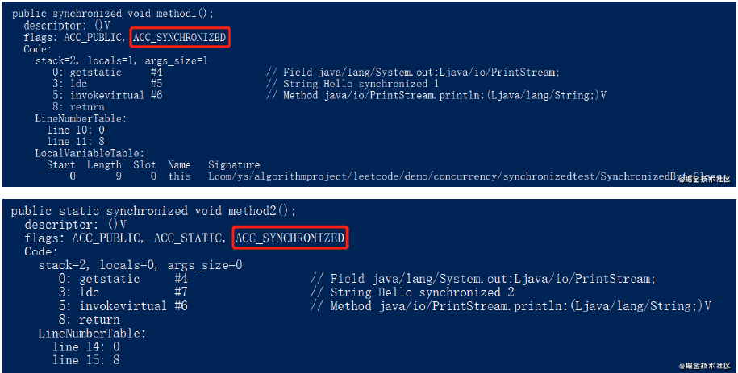
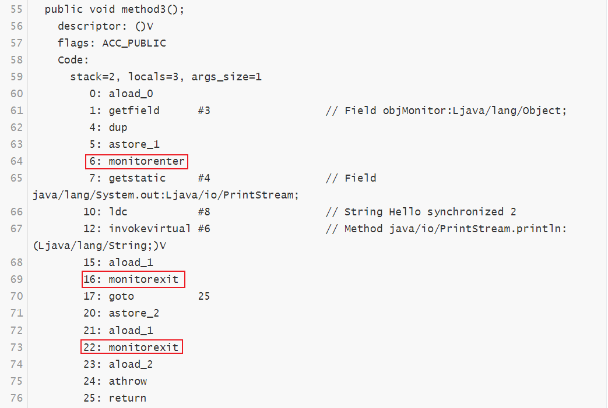

# 1.Java中锁的性质

1. 锁的实现方式
    1. AbstractQueuedSynchronizer(AQS)
    2. 监视器Monitor模式
2. 锁的灵活性
3. 锁的释放
4. 锁类型
5. 条件队列
6. 可重入性

# 2.ReentrantLock跟常用的Synchronized的差异

|          | ReentrantLock                  | Synchronized      |
| -------- | ------------------------------ | ----------------- |
| 锁实现   | 依赖AQS                        | 监视器Monitor模式 |
| 灵活性   | 支持响应中断、超时、尝试获取锁 | 不灵活            |
| 释放形式 | 必须显示的调用unlock()释放锁   | 自动释放监视器    |
| 锁类型   | 公平锁&非公平锁                | 非公平锁          |
| 条件队列 | 可关联多个队列                 | 关联一个条件队列  |
| 可重入性 | 可重入                         | 可重入            |

# 3.synchronized的实现原理

```
public class SynchronizedByteClass {
    Object objMonitor = new Object();

    public synchronized void method1() {
        System.out.println("Hello synchronized 1 no static");
    }

    public synchronized static void method2() {
        System.out.println("Hello synchronized 2 static");
    }

    public void method3() {
        synchronized (objMonitor) {
            System.out.println("Hello synchronized 2");
        }
    }
    public static void main(String[] args) {
    }
}
```

对上述类的class文件执行汇编命令: javap -v SynchronizedByteClass.class可以得到下面的汇编代码

```
{
  java.lang.Object objMonitor;
    descriptor: Ljava/lang/Object;
    flags:

  public com.threads.server.threadlock.SynchronizedByteClass();
    descriptor: ()V
    flags: ACC_PUBLIC
    Code:
      stack=3, locals=1, args_size=1
         0: aload_0
         1: invokespecial #1                  // Method java/lang/Object."<init>":()V
         4: aload_0
         5: new           #2                  // class java/lang/Object
         8: dup
         9: invokespecial #1                  // Method java/lang/Object."<init>":()V
        12: putfield      #3                  // Field objMonitor:Ljava/lang/Object;
        15: return
      LineNumberTable:
        line 8: 0
        line 9: 4
      LocalVariableTable:
        Start  Length  Slot  Name   Signature
            0      16     0  this   Lcom/threads/server/threadlock/SynchronizedByteClass;

  public synchronized void method1();
    descriptor: ()V
    flags: ACC_PUBLIC, ACC_SYNCHRONIZED
    Code:
      stack=2, locals=1, args_size=1
         0: getstatic     #4                  // Field java/lang/System.out:Ljava/io/PrintStream;
         3: ldc           #5                  // String Hello synchronized 1 no static
         5: invokevirtual #6                  // Method java/io/PrintStream.println:(Ljava/lang/String;)V
         8: return
      LineNumberTable:
        line 12: 0
        line 13: 8
      LocalVariableTable:
        Start  Length  Slot  Name   Signature
            0       9     0  this   Lcom/threads/server/threadlock/SynchronizedByteClass;

  public static synchronized void method2();
    descriptor: ()V
    flags: ACC_PUBLIC, ACC_STATIC, ACC_SYNCHRONIZED
    Code:
      stack=2, locals=0, args_size=0
         0: getstatic     #4                  // Field java/lang/System.out:Ljava/io/PrintStream;
         3: ldc           #7                  // String Hello synchronized 2 static
         5: invokevirtual #6                  // Method java/io/PrintStream.println:(Ljava/lang/String;)V
         8: return
      LineNumberTable:
        line 16: 0
        line 17: 8

  public void method3();
    descriptor: ()V
    flags: ACC_PUBLIC
    Code:
      stack=2, locals=3, args_size=1
         0: aload_0
         1: getfield      #3                  // Field objMonitor:Ljava/lang/Object;
         4: dup
         5: astore_1
         6: monitorenter
         7: getstatic     #4                  // Field java/lang/System.out:Ljava/io/PrintStream;
        10: ldc           #8                  // String Hello synchronized 2
        12: invokevirtual #6                  // Method java/io/PrintStream.println:(Ljava/lang/String;)V
        15: aload_1
        16: monitorexit
        17: goto          25
        20: astore_2
        21: aload_1
        22: monitorexit
        23: aload_2
        24: athrow
        25: return
      Exception table:
         from    to  target type
             7    17    20   any
            20    23    20   any
      LineNumberTable:
        line 20: 0
        line 21: 7
        line 22: 15
        line 23: 25
      LocalVariableTable:
        Start  Length  Slot  Name   Signature
            0      26     0  this   Lcom/threads/server/threadlock/SynchronizedByteClass;
      StackMapTable: number_of_entries = 2
        frame_type = 255 /* full_frame */
          offset_delta = 20
          locals = [ class com/threads/server/threadlock/SynchronizedByteClass, class java/lang/Object ]
          stack = [ class java/lang/Throwable ]
        frame_type = 250 /* chop */
          offset_delta = 4

  public static void main(java.lang.String[]);
    descriptor: ([Ljava/lang/String;)V
    flags: ACC_PUBLIC, ACC_STATIC
    Code:
      stack=0, locals=1, args_size=1
         0: return
      LineNumberTable:
        line 25: 0
      LocalVariableTable:
        Start  Length  Slot  Name   Signature
            0       1     0  args   [Ljava/lang/String;
}

```

可以看到在Method3中出现了**monitorenter**和**monitorexit**指令我们查看 JVM虚拟机规范：https://docs.oracle.com/javase/specs/jvms/se8/html/jvms-6.html，可以看到对这两个指令的介绍。

## 下⾯我们说明⼀下这两个指令：

## ⼀、monitorenter

　　每个对象与⼀个监视器锁（monitor）关联。当monitor被占⽤时就会处于锁定状态，线程执⾏monitorenter指令时尝试获取monitor的所有权，过程如下：
　　1、如果 monitor的进⼊数为0，则该线程进⼊monitor，然后将进⼊数设置为1，该线程即为
monitor的所有者。
　　2、如果线程已经占有该monitor，只是重新进⼊，则进⼊monitor的进⼊数加1.
　　3.如果其他线程已经占⽤了monitor，则该线程进⼊阻塞状态，直到monitor的进⼊数为0，再重新尝试获取monitor的所有权。

## ⼆、monitorexit

　　执⾏monitorexit的线程必须是object ref所对应的monitor的所有者。
　　指令执⾏时，monitor的进⼊数减1，如果减1后进⼊数为0，那线程退出monitor，不再是这个monitor的所有者。其他被这个monitor阻塞的线程可以尝试去获取这个 monitor 的所有权。
　　通过上⾯介绍，我们可以知道 synchronized 底层就是通过这两个命令来执⾏的同步机制，由此我们也可以看出synchronized 具有可重⼊性。

## 三、修饰普通⽅法和静态⽅法汇编代码

 

　可以看到都是通过指令 ACC_SYNCHRONIZED 来控制的，虽然没有看到⽅法的同步并没有通过指令monitorenter和monitorexit来完成，但其本质也是通过这两条指令来实现。
　　当⽅法调⽤时，调⽤指令将会检查⽅法的 ACC_SYNCHRONIZED 访问标志是否被设置，如果设置了，执⾏线程将先获取monitor，获取成功之后才能执⾏⽅法体，⽅法执⾏完后再释放monitor。在⽅法执⾏期间，其他任何线程都⽆法再获得同⼀个monitor对象。 其实和修饰代码块本质上没有区别，只是⽅法的同步是⼀种隐式的⽅式来实现。

## 四、异常⾃动unlock

可能会有细⼼的朋友发现，我在介绍 synchronized 修饰代码块时，给出的汇编代码，⽤红框圈住了两个monitorexit，根据我们前⾯介绍，获取monitor加1，退出monitor减1，等于0时，就没有锁了。那为啥会有两个 monitorexit，⽽只有⼀个 monitorenter 呢？

 

​		第 6 ⾏执⾏ monitorenter，然后第16⾏执⾏monitorexit，然后执⾏第17⾏指令 goto 25，表示跳
到第25⾏代码，第25⾏是 return，也就是直接结束了。
　　那第20-24⾏代码中是什么意思呢？其中第 24 ⾏指令 athrow 表示Java虚拟机隐式处理⽅法完成异
常结束时的监视器退出，也就是执⾏发⽣异常了，然后去执⾏ monitorexit。
　　进⽽可以得到结论：
**synchronized 修饰的⽅法或代码块，在执⾏过程中抛出异常了，也能释放锁（unlock）**
　　我们可以看如下⽅法，⼿动抛出异常：

```
public void method4() {
    synchronized (objMonitor) {
        System.out.println("Hello synchronized 2");
        throw new RuntimeException();
    }
}
```

然后获取其汇编代码，就只有⼀个 monitorexit 指令了。

```
 public void method4();
    descriptor: ()V
    flags: ACC_PUBLIC
    Code:
      stack=2, locals=3, args_size=1
         0: aload_0
         1: getfield      #3                  // Field objMonitor:Ljava/lang/Object;
         4: dup
         5: astore_1
         6: monitorenter
         7: getstatic     #4                  // Field java/lang/System.out:Ljava/io/PrintStream;
        10: ldc           #5                  // String Hello synchronized 2
        12: invokevirtual #6                  // Method java/io/PrintStream.println:(Ljava/lang/String;)V
        15: new           #8                  // class java/lang/RuntimeException
        18: dup
        19: invokespecial #9                  // Method java/lang/RuntimeException."<init>":()V
        22: athrow
        23: astore_2
        24: aload_1
        25: monitorexit
        26: aload_2
        27: athrow

```