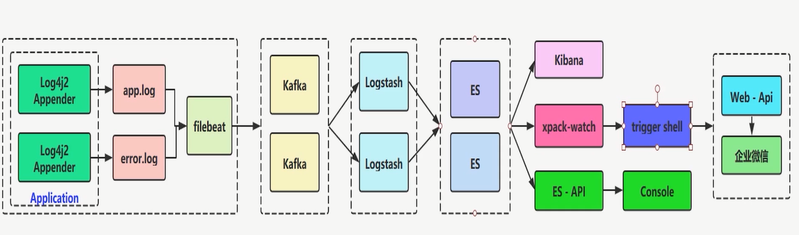

# Kafka

**Kafka应用实战**

**Kafka高吞吐量日志收集实战**

**架构思考：分布式日志，跟踪，告警，分析平台**

## Kafka安装

zk安装：
https://blog.csdn.net/li1669852599/article/details/113346565
kafka可视化工具
https://docs.kafka-eagle.org/2.env-and-install/2.installing
https://www.cnblogs.com/keatsCoder/p/13291615.html
心德：其实这个可视化工具在本地启动Tomcat来使用比较爽

kafka配置文件单价配置：

```
# broker的编号，如果集群中有多个broker，则每个broker的编号需要设置的不同
broker.id=0
# broker对外提供的服务入口地址
listeners=PLAINTEXT://:9092
advertised.listeners=PLAINTEXT://114.115.20.100:9092
# 存放消息日志文件的地址
log.dirs=/tmp/kafka-logs
# Kafka所需的ZooKeeper集群地址，为了方便演示，我们假设Kafka和ZooKeeper都安装在本机
zookeeper.connect=localhost:2181
```


## kafka介绍


## kafka特点


## Kafka高性能的原因是什么？

假如自己设计mq，在存储的时候要考虑mq数据的删除？因为删除会对文件中的数据进行漂移。

**顺序写：**
**page cache：**
**空中接力：**
**高效读写**
 

### page cache

概念：把磁盘的文件加载到内存中来访问，把对磁盘的读取该问内存的读取。
 

### zeroCopy

 

## Kafka的集群模式


## kafka高吞吐量核心实战

**1.日志收集设计**
**2.日志输出（日志组件输出log4j2)**
**3.日志收集（FileBeat)**
**4.日志过滤（logstash)**
**5.日志持久化（elasticsearch）**
**6.日志可视化（kibana)**

**资源准备：**
elasticsearch-6.4.3
filebeat-6.4.3-linux-x86_64.tar.gz 

logstash-6.4.3.tar.gz      

redis-5.0.5.tar.gz

elasticsearch-analysis-ik-6.4.3.zip 

jdk-8u201-linux-x64.tar.gz     

mysql-connector-java-5.1.41.jar 

zookeeper-3.4.14.tar.gz

elasticsearch-head          

kafka_2.12-2.0.0          

node-v6.10.2-linux-x64.tar
Mysql-linux安装包（无版本限制)

### **elasticsearch的安装**

https://blog.csdn.net/qq_37493556/article/details/103172861

ik的安装： https://blog.csdn.net/qq_41463655/article/details/103665901 
head插件的安装： https://www.cnblogs.com/xiaojianfeng/p/9435507.html

#### **创建工程，引入依赖**

<dependency> <groupId>org.springframework.boot</groupId> <artifactId>spring-boot-starter-data-elasticsearch</artifactId> <!--<version>2.1.5.RELEASE</version>--> <version>2.2.2.RELEASE</version> </dependency>

<dependency> <groupId>org.springframework.boot</groupId> <artifactId>spring-boot-starter-test</artifactId> <scope>test</scope> </dependency>

#### **配置yml**

spring: data: elasticsearch: cluster-name: es6 cluster-nodes: 192.168.1.122:9300

版本协调 目前springboot-data-elasticsearch中的es版本贴合为es-6.4.3，如此一来版本需要统一，把es进行降级。等springboot升级es版本后可以

#### **Netty issue fix**

· 

@Configuration public class ESConfig { /**

· 

o 

解决netty引起的issue */ @PostConstruct void init() { System.setProperty("es.set.netty.runtime.available.processors", "false"); } }

o 

#### **附 elasticsearch6.4.3配置文件**

elasticsearch.yml

cluster.name: es6 node.name: node0 path.data: /usr/local/elasticsearch-6.4.3/data path.logs: /usr/local/elasticsearch-6.4.3/logs network.host: 0.0.0.0 transport.host: 0.0.0.0 #对外开放端口 http.port: 9200 #是否支持跨域 http.cors.enabled: true

“*”表示支持所有域名

http.cors.allow-origin: "*"

启动的时候会有错误：包括启动的用户错误，文件数不足的错误，端口号错误等。需自行百度解决

#### **Logstash:数据库数据和es数据同步**

1.数据采集
2.以id或update_time作为同步边界来进行增量同步 
3.logstash-input-jdbc插件 4.预先创建索引

### **logstash安装**

下载好logstash和mysql的连接驱动

把这两个都移动到/usr/local/目录下

进入logstash创建sync目录并且添加logstash-db-sync.con文件和mysql的驱动(logstash-db-sync.conf mysql-connector-java-5.1.41.jar)

#### **logstash-db-sync.conf：**

input {

jdbc {

\# 设置 MySql/MariaDB 数据库url以及数据库名称

jdbc_connection_string => "jdbc:mysql://192.168.1.4:3306/foodie-shop-dev?useUnicode=true&characterEncoding=UTF-8&autoReconnect=true"

\# 用户名和密码

jdbc_user => "root"

jdbc_password => "root"

\# 数据库驱动所在位置，可以是绝对路径或者相对路径

jdbc_driver_library => "/usr/local/logstash-6.4.3/sync/mysql-connector-java-5.1.41.jar"

\# 驱动类名

jdbc_driver_class => "com.mysql.jdbc.Driver"

\# 开启分页

jdbc_paging_enabled => "true"

\# 分页每页数量，可以自定义

jdbc_page_size => "1000"

\# 执行的sql文件路径

statement_filepath => "/usr/local/logstash-6.4.3/sync/foodie-items.sql"

\# 设置定时任务间隔 含义：分、时、天、月、年，全部为*默认含义为每分钟跑一次任务

schedule => "* * * * *"

\# 索引类型

type => "_doc"

\# 是否开启记录上次追踪的结果，也就是上次更新的时间，这个会记录到 last_run_metadata_path 的文件

use_column_value => true

\# 记录上一次追踪的结果值

last_run_metadata_path => "/usr/local/logstash-6.4.3/sync/track_time"

\# 如果 use_column_value 为true， 配置本参数，追踪的 column 名，可以是自增id或者时间

tracking_column => "updated_time"

\# tracking_column 对应字段的类型

tracking_column_type => "timestamp"

\# 是否清除 last_run_metadata_path 的记录，true则每次都从头开始查询所有的数据库记录

clean_run => false

\# 数据库字段名称大写转小写

lowercase_column_names => false

}

}

output {

elasticsearch {

\# es地址

hosts => ["192.168.1.122:9200"]

\# 同步的索引名

index => "foodie-items"

\# 设置_docID和数据相同

document_id => "%{id}"

\# document_id => "%{itemId}"

}

\# 日志输出

stdout {

codec => json_lines

}

}

### 海量日志收集架构设计一


### 海量日志收集架构设计二


### 海量日志收集架构设计三



### **日志输入**
 

###  日志收集

#### FileBeat

 

### 日志过滤

 

### 日志持久化，可视化

es+kibana+ik+xpack
