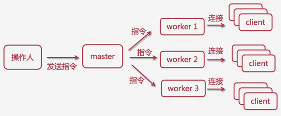
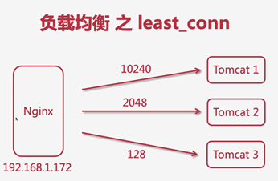
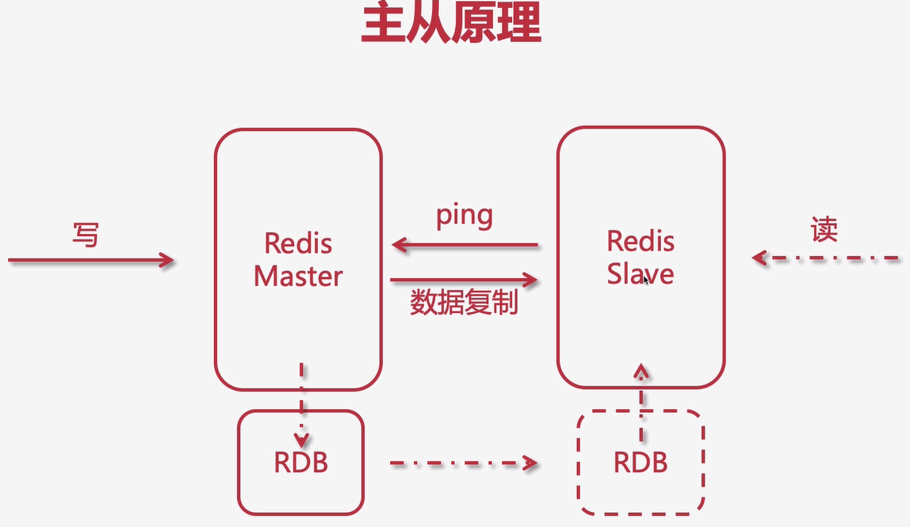

# 1．单体部署

                   

## 1.1单体项目的优点

 

## 1.2 单体架构面临的挑战

 

 

## 1.3 集群

 

 

 

 

  

 

 


# 2. Nginx

## 2.1什么是Nginx  

 ##  [手动安装nginx和keepalive 命令](./手动安装nginx和keepalive 命令.txt)   


## 2.2正向代理

 

## 2.3反向代理

 

## 2.4 反向代理之路由

 

## 2.5Nginx的进程模型
 

 

 

## 2.6Nginx处理web请求解析过程

### 2.6.1 worker的抢占机制

Client发起请求的时候。Worker需要获取client请求对应的mutex（互斥锁）才能处理请求

 

 

 

 

## 2.7Nginx.conf的配置结构

 

### 2.7.1Nginx常用的命令

 

## 2.8Nginx日志切割

## 2.9Nginx的模块化设计

 

 

## 2.10 负载均衡

 

 

 

 

### 2.10.1 ip_hash

 

 

### 2.10.2 nginx的hash算法是ip的前三个号段。

 

### 2.10.3 hash算法带来的问题

 

 

当server的数量增加或者减少的时候会重新计算请求ip对应的hash.这样可能导致用户的请求到另外的一个server导致请求的会话丢失

### 2.10.4 一致性hash算法

​     用户在某一个区间。按照顺时针就近原则访问server。这样就算有服务器宕机或者新增了。只会影响某一个区间的用户。其他的用户不影响。

 

#### 2.10.5 url_hash

​     通过请求的url来路由到不同的server中

 

#### 2.10.6 least_conn(最小的连接数)

 

​     如图tomcat3连接最少。当下个请求来的时候会优先请求到tomcat3

## 2.11  upstream参数

 

 

## 2.12  upstream中的keepalived参数 

能有效的提高单台server的吞吐量

 

## 2.13  nginx控制浏览器缓存

     

###    2.13.1 expires指令

 

### 2.13.2 反向代理server中的资源缓存

\#proxy_cache_path 设置nginx对server中的静态资源的缓存目录
 \#keys_zone 设置共享空间以及占用空间的大小
 \#max_size 设置缓存的最大值
 \#inactive 超过此事件，则清理缓存
 \#use_temp_path 关闭临时目录
 proxy_cache_path /etc/nginx/upstream_cache keys_zone=mycache:10m max_size=1g inactive=1h use_temp_path=off;

## 2.14动静分离

 

### 2.14.1动静分离的问题

 

## 2.15nginx部署

 

 

# 3.keepalive组件

### 3.1 基本概念

 

#### 3.1.1 虚拟路由成语协议VRRP

 

#### 3.1.2 双机主备原理

 

### 3.2 keepalive的安装

 

### 3.3 keepalived 注册系统应用

搞起来有问题。以后需要用到就百度搞

### 3.4 keepalived 配置nginx自动重启，实现24小时不间断

### 3.5 keepaived双主热备原理

 

 

 

 

 

#### 3.5.1 DNS轮询

#### 3.5.2 添加一个新虚拟ip作为的主备配置

# 4.LVS负载均衡

### 4.1 LVS介绍

 

 

#### 4.1.1为什么要使用lvs+nginx

 

#### 4.1.2 通过网络拓扑图感受nginx和LVS的区别

 

 

 

### 4.2 LVS的工作模式

 

 

 

### 4.3 LVS的DR模式的安装

 

 

 

#### 4.3.1 服务器与ip约定

设置LVS服务器的虚拟ip，以及安装ipvsadm软件。直接yum install ipvsadm就好
 分别为两台nginx配置虚拟ip 虚拟ip和LVS服务器的保持一致

 

 

#### 4.3.2 为两台RS配置arp

 

 

#### 配置ARP

\1. 打开sysctl.conf:

vim /etc/sysctl.conf

\2. 配置所有网卡、默认网卡以及虚拟网卡的arp响应级别和通告行为，分别对应： all ， default ， lo ：

\# configration for lvs

net.ipv4.conf.all.arp_ignore = 1

net.ipv4.conf.default.arp_ignore = 1

net.ipv4.conf.lo.arp_ignore = 1

net.ipv4.conf.all.arp_announce = 2

net.ipv4.conf.default.arp_announce = 2

net.ipv4.conf.lo.arp_announce = 2

#### 配置响应的路由以及开机自动添加路由

提示没有route命令

yum –y install net-tools

route add -host 192.168.1.150 dev lo:1

开机自动添加路由

echo route add -host 192.168.1.150 dev lo:1 >> /etc/rc.local

#### 4.4 keepalived+nginx+lvs高可用集群

 

192.168.1.151安装keepalived

# 5分布式架构

### 1.阶段规划

 

 

 

### 2.什么是分布式架构

 

 

### 3. 分布式的优缺点

#### 1.  优点

 

#### 2.缺点

 

 

#### 3.设计原则

 

 

#### 4．现有架构的缺点

 

# 6. Redis

## 1.什么是NoSql

 

 

## 2．NoSql的分类

 

## 3．什么是分布式缓存

 

 

## 4. 什么是redis

 

 

 

## 5. 缓存方案对比

### 1.ehcache

 

 

### 2.Memcache

 

 

### 3.redis

 

 

## 6. redis的数据类型。以及操作命令

String hash list set zset 
 https://www.runoob.com/redis/redis-sorted-sets.html

 

## 7. redis的原理

### 7.1: 阻塞与非阻塞   

 

### 7.2: IO多路复用

 

### 7.3:redis的线程模型

 

 

## 8.redis的发布与订阅

 


## 9.Redis的持久化机制

**Redis持久化机制和线上环境容灾备份与恢复**

https://blog.csdn.net/zh15732621679/article/details/80307827

### 9.1 RDB持久化

RDB: Redis DataBase
AOF: Append Only File

1. 什么是RDB
    RDB：每隔一段时间，把内存中的数据写入磁盘的临时文件，作为快照，恢复的时候把快照文件读进内存。如果宕机重启，那么内存里的数据肯定会没有的，那
    dis后，则会恢复。
2. 备份与恢复
    内存备份 --> 磁盘临时文件
    临时文件 --> 恢复到内存
3. RDB优劣势
    优势
4. 每隔一段时间备份，全量备份
5. 灾备简单，可以远程传输
6. 子进程备份的时候，主进程不会有任何io操作（不会有写入修改或删除），保证备份数据的的完整性
7. 相对AOF来说，当有更大文件的时候可以快速重启恢复
    劣势
8. 发生故障是，有可能会丢失最后一次的备份数据
9. 子进程所占用的内存比会和父进程一模一样，如会造成CPU负担
10. 由于定时全量备份是重量级操作，所以对于实时备份，就无法处理了。
11. RDB的配置
12. 保存位置，可以在redis.conf自定义：
      /user/local/redis/working/dump.rdb
13. 保存机制：
      save 900 1	#	after 900 sec (15 min) if at least 1 key changed
      save 300 10	#   after 300 sec (5 min) if at least 10 keys changed
      save 60 10000 #   after 60 sec if at least 10000 keys changed
      save 10 3
* 如果1个缓存更新，则15分钟后备份
* 如果10个缓存更新，则5分钟后备份
* 如果10000个缓存更新，则1分钟后备份
* 演示：更新3个缓存，10秒后备份
* 演示：备份dump.rdb，删除重启
1. stop-writes-on-bgsave-error
yes：如果save过程出错，则停止写操作
no：可能造成数据不一致
2. rdbcompression
yes：开启rdb压缩模式
no：关闭，会节约cpu损耗，但是文件会大，道理同nginx
3. rdbchecksum

### 9.2 AOF持久化

​		RDB会丢失最后一次备份的rdb文件，但是其实也无所谓，其实也可以忽略不计，毕竟是缓存，丢了就丢了，但是如果追求数据的完整性，那就的考虑使用AOF了

**AOF特点**

1. 以日志的形式来记录用户请求的写操作。读操作不会记录，因为写操作才会存存储。

2. 文件以追加的形式而不是修改的形式。

3. redis的aof恢复其实就是把追加的文件从开始到结尾读取执行写操作。
    优势

4. AOF更加耐用，可以以秒级别为单位备份，如果发生问题，也只会丢失最后一秒的数据，大大增加了可靠性和数据完整性。所以AOF可
    一次，使用fsync操作。

5. 以log日志形式追加，如果磁盘满了，会执行 redis-check-aof 工具

6. 当数据太大的时候，redis可以在后台自动重写aof。当redis继续把日志追加到老的文件中去时，重写也是非常安全的，不会影响客户端
    作。

7. AOF 日志包含的所有写操作，会更加便于redis的解析恢复。
    劣势

8. 相同的数据，同一份数据，AOF比RDB大

9. 针对不同的同步机制，AOF会比RDB慢，因为AOF每秒都会备份做写操作，这样相对与RDB来说就略低。 每秒备份fsync没毛病，但是
    的每次写入就做一次备份fsync的话，那么redis的性能就会下降。

3. AOF发生过bug，就是数据恢复的时候数据不完整，这样显得AOF会比较脆弱，容易出现bug，因为AOF没有RDB那么简单，但是呢为
的产生，AOF就不会根据旧的指令去重构，而是根据当时缓存中存在的数据指令去做重构，这样就更加健壮和可靠了。

11. **AOF的配置**

   **AOF 默认关闭，yes可以开启**

   appendonly no

   **AOF 的文件名**

   appendfilename "appendonly.aof"

   no：不同步

   everysec：每秒备份，推荐使用

   always：每次操作都会备份，安全并且数据完整，但是慢性能差

   appendfsync everysec

   **重写的时候是否要同步，no可以保证数据安全**

   no-appendfsync-on-rewrite no

   **重写机制**：

   ​		避免文件越来越大，自动优化压缩指令，会fork一个新的进程去完成重写动作，新进程里的内存数据会被重写，此时

   当前AOF文件的大小是上次AOF大小的100% 并且文件体积达到64m，满足两者则触发重写

   auto-aof-rewrite-percentage 100
   auto-aof-rewrite-min-size 64mb

   #### 到底采用RDB还是AOF呢？

12. 到底采用RDB还是AOF呢？

13. 如果你能接受一段时间的缓存丢失，那么可以使用RDB

如果你对实时性的数据比较care，那么就用AOF

## 10:redis集群部署

### 10.1 主从模式
 

 
 


### 10.2 无磁盘化复制

master直接把数据写入到和slave的sockt中


#### 配置：

```
repl-diskless-sync yes
等待所有slave都连接上的等待时间配置
repl-diskless-sync-delay 5

```

### 10.3 redis的缓存过期时间和内存淘汰管理机制
 

#### 定期删除：

```
周期性轮询redis库中的时效性数据，采用随机抽取的策略，利用过期数据占比的方式控制删除频度
特点1：CPU性能占用设置有峰值，检测频度可自定义设置
特点2：内存压力不是很大，长期占用内存的冷数据会被持续清理
总结：周期性抽查存储空间 （随机抽查，重点抽查）
```

#### 定时删除：

```
创建一个定时器，当key设置有过期时间，且过期时间到达时，由定时器任务立即执行对键的删除操作
优点：节约内存，到时就删除，快速释放掉不必要的内存占用
缺点：CPU压力很大，无论CPU此时负载量多高，均占用CPU，会影响redis服务器响应时间和指令吞吐量
总结：用处理器性能换取存储空间 （拿时间换空间）
```

​	配置项：hz 10

#### 惰性删除：

```
数据到达过期时间，不做处理。等下次访问该数据时，如果未过期，返回数据 ；发现已过期，删除，返回不存在。
优点：节约CPU性能，发现必须删除的时候才删除
缺点：内存压力很大，出现长期占用内存的数据
总结：用存储空间换取处理器性能（拿空间换时间）
```


 

#### memory management：内存管理机制

3-11 附：Redis 缓存过期处理与内存淘汰机制
引子
计算机内存有限，越大越贵，Redis的高并发高性能都是基于内存的，用硬盘的话GG。
已过期的key如何处理？
设置了expire的key缓存过期了，但是服务器的内存还是会被占用，这是因为redis所基于的两种删除策略
redis有两种策略：

1. （主动）定时删除
    定时随机的检查过期的key，如果过期则清理删除。（每秒检查次数在redis.conf中的hz配置）

2. （被动）惰性删除
    当客户端请求一个已经过期的key的时候，那么redis会检查这个key是否过期，如果过期了，则删除，然后返回一个nil。这种策略
    友好，不会有太多的损耗，但是内存占用会比较高。
    所以，虽然key过期了，但是只要没有被redis清理，那么其实内存还是会被占用着的。
    那么如果内存被Redis缓存占用慢了咋办？
    内存占满了，可以使用硬盘，来保存，但是没意义，因为硬盘没有内存快，会影响redis性能。
    所以，当内存占用满了以后，
    redis提供了一套缓存淘汰机制：MEMORY MANAGEMENT

  maxmemory ：当内存已使用率到达，则开始清理缓存
* noeviction：旧缓存永不过期，新缓存设置不了，返回错误
* allkeys-lru：清除最少用的旧缓存，然后保存新的缓存（推荐使用）
* allkeys-random：在所有的缓存中随机删除（不推荐）
* volatile-lru：在那些设置了expire过期时间的缓存中，清除最少用的旧缓存，然后保存新的缓存
* volatile-random：在那些设置了expire过期时间的缓存中，随机删除缓存
* volatile-ttl：在那些设置了expire过期时间的缓存中，删除即将过期的

#### 默认的内存管理配置项： 

maxmemory-policy noeviction

其他的一些策略：常用的是allkeys-lfu

### 10.4 Redis 的哨兵模式

#### 引子

Master挂了，如何保证可用性，实现继续读写

#### 什么是哨兵

Sentinel(哨兵)是用于监控Redis集群中Master状态的工具，是 Redis 高可用解决方案，哨兵可以监视一个或者多个redis master服务，以及这些master服务的所有
某个master服务宕机后，会把这个master下的某个从服务升级为master来替代已宕机的master继续工作。
示例图


配置哨兵监控master

创建并且配置sentinel.conf：

#### 普通配置

port 26379
pidfile "/usr/local/redis/sentinel/redis-sentinel.pid"
dir "/usr/local/redis/sentinel"
daemonize yes
protected-mode no
logfile "/usr/local/redis/sentinel/redis-sentinel.log"

#### 核心配置

配置哨兵

sentinel monitor mymaster 127.0.0.1 6379 2

密码

sentinel auth-pass <master-name> <password>

master被sentinel认定为失效的间隔时间

sentinel down-after-milliseconds mymaster 30000

剩余的slaves重新和新的master做同步的并行个数

sentinel parallel-syncs mymaster 1

主备切换的超时时间，哨兵要去做故障转移，这个时候哨兵也是一个进程，如果他没有去执行，超过这个时间后，会由其他

sentinel failover-timeout mymaster 180000

master挂掉 哨兵重新选举master后，老的master重新启动会再次成为master吗？答案：不会，可以从日志中看出新增了一个slave节点

#### 4-6 附：哨兵信息检查

查看相关信息

查看imooc-master下的master节点信息

sentinel master imooc-master

查看imooc-master下的slaves节点信息

sentinel slaves imooc-master

查看imooc-master下的哨兵节点信息

#### 4-4 解决原Master恢复后不同步问题

在本节课中，相信细心的同学会发现原来的Master（191）恢复成Slave后，他的同步状态不OK，状态为master_link_status:down ，这是为什么呢？
这是因为我们只设置了192和193的masterauth ，这是用于同步master的数据，但是191一开始是master是不受影响的，当master转变为slave后，由于他没有
auth ，所以他不能从新的master同步数据，随之导致info replication 的时候，同步状态为down ，所以只需要修改redis.conf 中的masterauth 为 root

一般master数据无法同步给slave的方案检查为如下：

1. 网络通信问题，要保证互相ping通，内网互通。
2. 关闭防火墙，对应的端口开发（虚拟机中建议永久关闭防火墙，云服务器的话需要保证内网互通）。
3. 统一所有的密码，不要漏了某个节点没有设置。

### 10.5 redis-cluster集群


#### 5-4 附：构建Redis集群

redis.conf 配置
启动6个redis实例 或者是三个主master
1. 启动6台
2. 如果启动过程出错，把rdb等文件删除清空
创建集群
#####

注意1：如果你使用的是redis3.x版本，需要使用redis-trib.rb来构建集群，最新版使用C语言来构建了，这个要注意

注意2：以下为新版的redis构建方式

#####

创建集群，主节点和从节点比例为1，1-3为主，4-6为从，1和4，2和5，3和6分别对应为主从关系，这也是最经典用的最多的集

redis-cli --cluster create ip1:port1 ip2:port2 ip3:port3 ip4:port4 ip5:port5 ip6:port6 --cluster-replicas 1
slots：槽，用于装数据，主节点有，从节点没有
检查集群信息
redis-cli --cluster check 192.168.25.64:6380

## 11.缓存穿透，缓存雪崩，缓存击穿

### 1.缓存穿透

一般的缓存系统，都是按照key去缓存查询，如果不存在对应的value，就应该去后端系统查找（比如DB）。一些恶意的请求会故意查询不存在的key,请求量很大，就会对后端系统造成很大的压力。这就叫做缓存穿透。

如何避免？

1：对查询结果为空的情况也进行缓存，缓存时间设置短一点，或者该key对应的数据insert了之后清理缓存。

2：对一定不存在的key进行过滤。可以把所有的可能存在的key放到一个大的Bitmap中，查询时通过该bitmap过滤。

### 2.缓存雪崩

当缓存服务器重启或者大量缓存集中在某一个时间段失效，这样在失效的时候，会给后端系统带来很大压力。导致系统崩溃。

如何避免？

1：在缓存失效后，通过加锁或者队列来控制读数据库写缓存的线程数量。比如对某个key只允许一个线程查询数据和写缓存，其他线程等待。

2：做二级缓存，A1为原始缓存，A2为拷贝缓存，A1失效时，可以访问A2，A1缓存失效时间设置为短期，A2设置为长期

3：不同的key，设置不同的过期时间，让缓存失效的时间点尽量均匀。

### 3.缓存击穿

缓存击穿是指缓存中没有但数据库中有的数据（一般是缓存时间到期）\*，这时由于并发用户特别多，同时读缓存没读到数据，又同时去数据库去取数据，引起数据库压力瞬间增大，造成过大压力。

如何避免？

#### 	1、设置热点数据永远不过期。

#### 	2、接口限流与熔断，降级。

重要的接口一定要做好限流策略，防止用户恶意刷接口，同时要降级准备，当接口中的某些 服务 不可用时候，进行熔断，失败快速返回机制。

#### 	3、布隆过滤器。

bloomfilter就类似于一个hash set，用于快速判某个元素是否存在于集合中，其典型的应用场景就是快速判断一个key是否存在于某容器，不存在就直接返回。布隆过滤器的关键就在于hash算法和容器大小，

### 4.redis的批量查询优化

1.mget命令
2.pipeline使用redis的管道功能


## 12、redis的总结与回顾
 

​	1.本阶段开篇讲述了分布式相关，其实分布式和集群的概念在前期就介绍过了，不同的节点做着不同的事，就是分布式，不同的节点做着
是集群。那么Redis是NoSql，不仅仅是sql，功能更强劲，可以作为缓存写入内存，提供高速访问，为数据库做了一道屏障，保护数据
数据放入缓存，从而提升项目的并发量与吞吐量。
 2. 介绍完Redis后我们又一起搭建了单机单实例版的Redis，需要注意，Redis虽然可以在win或mac上搭建，但是企业里都是linux，所以我
    用linux来搭建和配置。
    3. Redis提供命令行客户端工具，也就是redis-cli，进入命令行后可以进行相应的操作，我们讲述了五大数据类型，分别为：string，list，
        与zset。每个数据类型包含了一些操作指令，这些没有必要去死记硬背，遇到了，就去查一下api，百度一下即可。

    4. Redis是单线程的，但是他的性能却很高，在这里我们讲述了Redis的单线程模型，这一点往往在面试过程中会被问到。

    5. 当单机的Redis安装配置完毕以后，我们整合到了项目中，结合了SpringBoot，优化了首页的轮播图与分类，因为这些完全可以放入缓存
        要去查询数据库。当然，对于前期单体阶段的购物车，我们结合了redis实现了分布式购物车，如此，不论用户在任何电脑访问，都能看
        购物车数据，并且我们也实现了登录后的同步购物车功能。

    6. Redis可以实现类似于MQ的发布与订阅，是属于生产者与消费者模式，但是正所谓专人做专事，发布订阅机制没有必要用Redis来实现
        是使用的MQ。

    7. Redis的持久化机制，RDB与AOF，这两种模式大家一定要知道他们之间的区别，一个是全量备份，一个是增量定时，各有各的好，也
        试过程中会被问到。

      

## 13、redis常问面试题

1.什么是 Redis?
2.Redis 的数据类型？
3.使用 Redis 有哪些好处？
4.Redis 相比 Memcached 有哪些优势？
5.Memcached 与 Redis 的区别都有哪些？
6.Redis 是单进程单线程的吗？为何它那么快那么高效？
7.一个字符串类型的值能存储最大容量是多少？
8.Redis 的持久化机制是什么？各自的优缺点？
9.Redis 常见性能问题和解决方案有哪些?
10.Redis 过期键的删除策略？
11.Redis 的回收策略（淘汰策略）?
12.为什么Redis 需要把所有数据放到内存中？
13.Redis 的同步机制了解么？
14.Pipeline 有什么好处，为什么要用 Pipeline？
15.是否使用过 Redis 集群，集群的原理是什么？
16.Redis 集群方案什么情况下会导致整个集群不可用？
17.Redis 支持的 Java 客户端都有哪些？官方推荐用哪个？
18.Jedis 与 Redisson 对比有什么优缺点？
19.Redis 如何设置密码及验证密码？
20.说说 Redis 哈希槽的概念？
21.Redis 集群的主从复制模型是怎样的？
22.Redis 集群会有写操作丢失吗？为什么？
23.Redis 集群之间是如何复制的？
24.Redis 集群最大节点个数是多少？
25.Redis 集群如何选择数据库？
26.怎么测试 Redis 的连通性？
27.怎么理解 Redis 事务？
28.Redis 事务相关的命令有哪几个？
29.Redis key 的过期时间和永久有效分别怎么设置？
30.Redis 如何做内存优化？
31.Redis 回收进程如何工作的？
32.都有哪些办法可以降低 Redis 的内存使用情况呢？
33.Redis 的内存用完了会发生什么？
34.一个 Redis 实例最多能存放多少的 keys？List、Set、Sorted Set他们最多能存放多少元素？
35.MySQL 里有 2000w 数据，Redis 中只存 20w 的数据，如何保证Redis 中的数据都是热点数据？
36.Redis 最适合的场景是什么？
37.假如 Redis 里面有 1 亿个 key，其中有 10w 个 key 是以某个固定的已知的前缀开头的，如果将它们全部找出来？
38.如果有大量的 key 需要设置同一时间过期，一般需要注意什么？
39.使用过 Redis 做异步队列么，你是怎么用的？
40.使用过 Redis 分布式锁么，它是什么回事？
