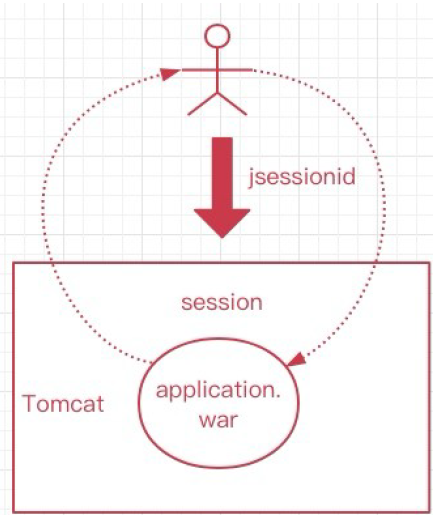
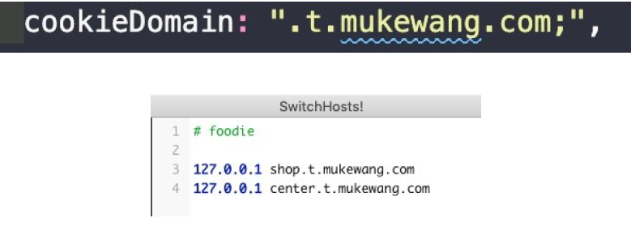
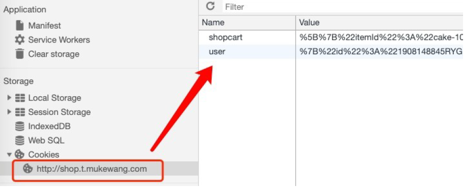
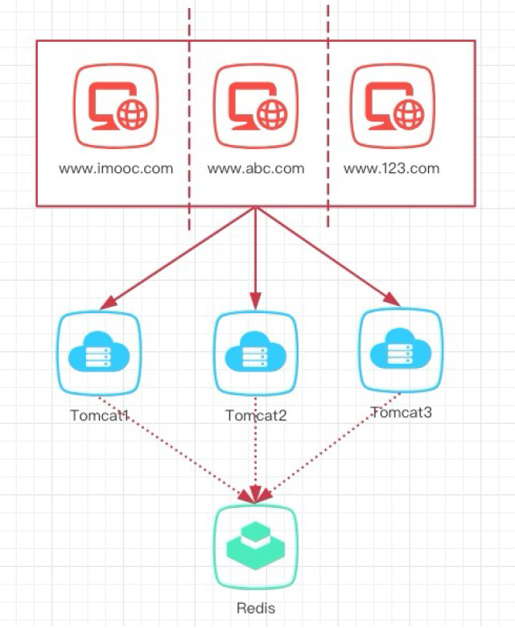
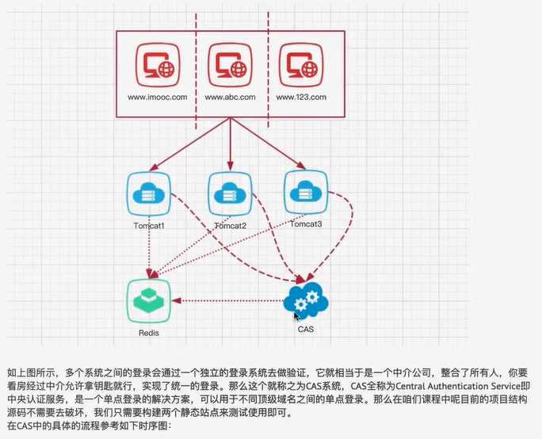
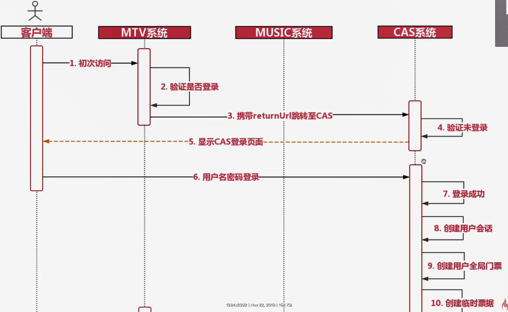
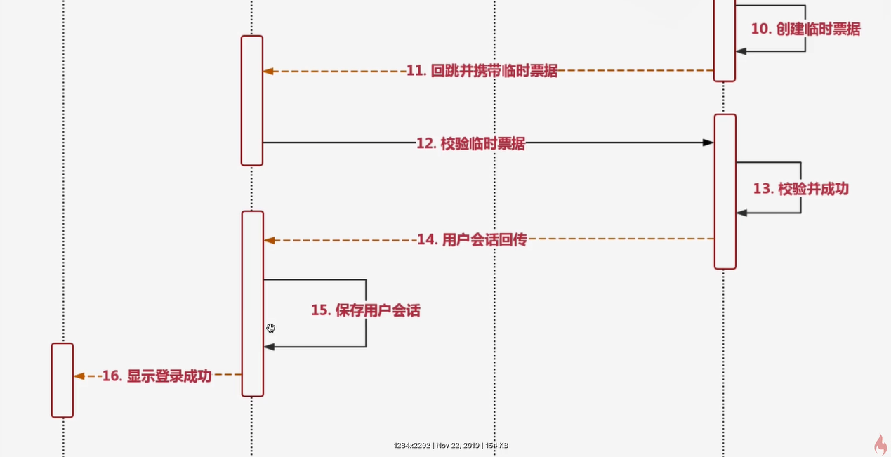
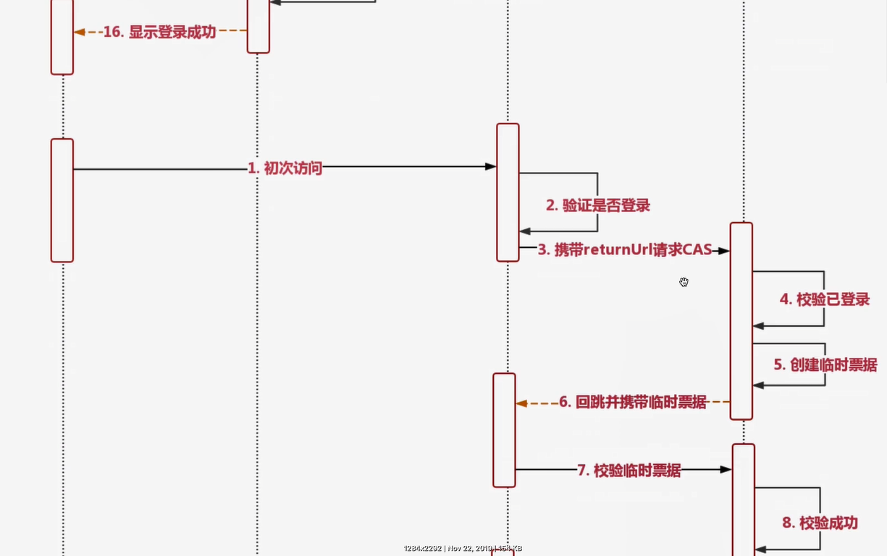
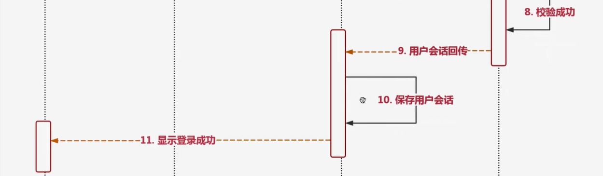

# 1.分布式会话

## 一、什么是会话

会话Session代表的是客户端与服务器的一次交互过程，这个过程可以是连续也可以是时断时续的。曾经的Servlet时代（jsp），一旦用户与服务端交互，服务器
用户创建一个session，同时前端会有一个jsessionid，每次交互都会携带。如此一来，服务器只要在接到用户请求时候，就可以拿到jsessionid，并根据这个ID在
对应的会话session，当拿到session会话后，那么我们就可以操作会话了。会话存活期间，我们就能认为用户一直处于正在使用着网站的状态，一旦session超期
就可以认为用户已经离开网站，停止交互了。用户的身份信息，我们也是通过session来判断的，在session中可以保存不同用户的信息。
session的使用之前在单体部分演示过，代码如下：
@GetMapping("/setSession")
public Object setSession(HttpServletRequest request) {
HttpSession session = request.getSession();
session.setAttribute("userInfo", "new user");
session.setMaxInactiveInterval(3600);
session.getAttribute("userInfo");
// session.removeAttribute("userInfo");
return "ok";
}

## 二、无状态会话

HTTP请求是无状态的，用户向服务端发起多个请求，服务端并不会知道这多次请求都是来自同一用户，这个就是无状态的。cookie的出现就是为了有状态的记录
常见的，ios与服务端交互，安卓与服务端交互，前后端分离，小程序与服务端交互，他们都是通过发起http来调用接口数据的，每次交互服务端都不会拿到客户
是我们可以通过手段去处理，比如每次用户发起请求的时候携带一个userid或者user-token，如此一来，就能让服务端根据用户id或token来获得相应的数据。每个
次请求都能被服务端识别来自同一个用户。

## 三、有状态会话

Tomcat中的会话，就是有状态的，一旦用户和服务端交互，就有会话，会话保存了用户的信息，这样用户就“有状态”了，服务端会和每个客户端都保持着这样的
个由容器来管理（也就是tomcat），这个session会话是保存到内存空间里的，如此一来，当不同的用户访问服务端，那么就能通过会话知道谁是谁了。tomcat会
是为了让http请求变的有状态。如果用户不再和服务端交互，那么会话超时则消失，结束了他的生命周期。如此一来，每个用户其实都会有一个会话被维护，这就
话。
场景：在传统项目或者jsp项目中是使用的最多的session都是有状态的，session的存在就是为了弥补http的无状态。
注：tomcat会话可以通过手段实现多系统之间的状态同步，但是会损耗一定的时间，一旦发生同步那么用户请求就会等待，这种做法不

## 五、单Tomcat会话（图）

先来看一下单个tomcat会话，这个就是有状态的，用户首次访问服务端，这个时候会话产生，并且会设置jsessionid放入cookie中，后续每次请求都会携带jsessi
户状态。

## 六、动静分离会话

# 2.SpringSession 整合

## 引入 Spring Session 依赖

<dependency>
<groupId>org.springframework.session</groupId>
<artifactId>spring-session-data-redis</artifactId>
</dependency>
<dependency>
<groupId>org.springframework.boot</groupId>
<artifactId>spring-boot-starter-security</artifactId>
</dependency>

## 配置存储类型

spring:
session:
store-type: redis

## 开启redis作为spring session

@EnableRedisHttpSession // 开启使用redis作为spring session

## 去除安全自动装配

@SpringBootApplication(exclude = {SecurityAutoConfiguration.class})

# 3.相同顶级域名的单点登录 SSO

## 引子

​		在面试过程中有时候会被问到单点登录，那么单点登录又称之为Single Sign On，简称SSO，单点登录可以通过基于用户会话的共享，他分文两种，先来看第一的原理是分布式会话来实现。
比如说现在有个一级域名为 www.imooc.com ，是教育类网站，但是慕课网有其他的产品线，可以通过构建二级域名提供服务给用户访问，比如： music.imoo
op.imooc.com ， blog.imooc.com 等等，分别为慕课音乐，慕课电商以及慕课博客等，用户只需要在其中一个站点登录，那么其他站点也会随之而登录。
也就是说，用户自始至终只在某一个网站下登录后，那么他所产生的会话，就共享给了其他的网站，实现了单点网站登录后，同时间接登录了其他的网站，那么
单点登录，他们的会话是共享的，都是同一个用户会话。

## Cookie + Redis 实现 SSO

​		那么之前我们所实现的分布式会话后端是基于redis的，如此会话可以流窜在后端的任意系统，都能获取到缓存中的用户数据信息，前端通过使用cookie，可以保一级二级下获取，那么这样一来，cookie中的信息userid和token是可以在发送请求的时候携带上的，这样从前端请求后端后是可以获取拿到的，这样一来，其实登录注册以后，其实cookie和redis中都会带有用户信息，只要用户不退出，那么就能在任意一个站点实现登录了。
​		那么这个原理主要也是cookie和网站的依赖关系，顶级域名 www.imooc.com 和*.imooc.com 的cookie值是可以共享的，可以被携带
比如设置为 .imooc.com ， .t.mukewang.com ，如此是OK的。
​		二级域名自己的独立cookie是不能共享的，不能被其他二级域名获取，比如： music.imooc.com 的cookie是不能被mtv.imooc.com 共
互不影响，要共享必须设置为.imooc.com 。

## Cookie共享测试

找到前端项目app.js，开启如下代码，设置你的对应域名，需要和SwitchHosts相互对应：

如下图，可以看到，不论是在 shop 或是 center中，两个站点都能够在用户登录后共享用户信息。

如此一来，cookie中的信息被携带至后端，而后端又实现了分布式会话，那么如此一来，单点登录就实现了，用户无需再跨站点登录了。上述过程我们通过下图
的展示，只要前端网页都在同一个顶级域名下，就能实现cookie与session的共享。

# 4.不同顶级域名的单点登录

## 顶级域名不同怎么办?

上一节单点登录是基于相同顶级域名做的，那么如果顶级域名都不一样，咋办？比如 www.imooc.com 要和www.mukewang.com 的会话实现共享，这个时候又
下图，这个时候的cookie由于顶级域名不同，就不能实现cookie跨域了，每个站点各自请求到服务端，cookie无法同步。比如，www.imooc.com下的用户发起请
ie，但是他又访问了www.abc.com，由于cookie无法携带，所以会要你二次登录。

 

 

 

 

 
