## 1.数据库调优的维度

 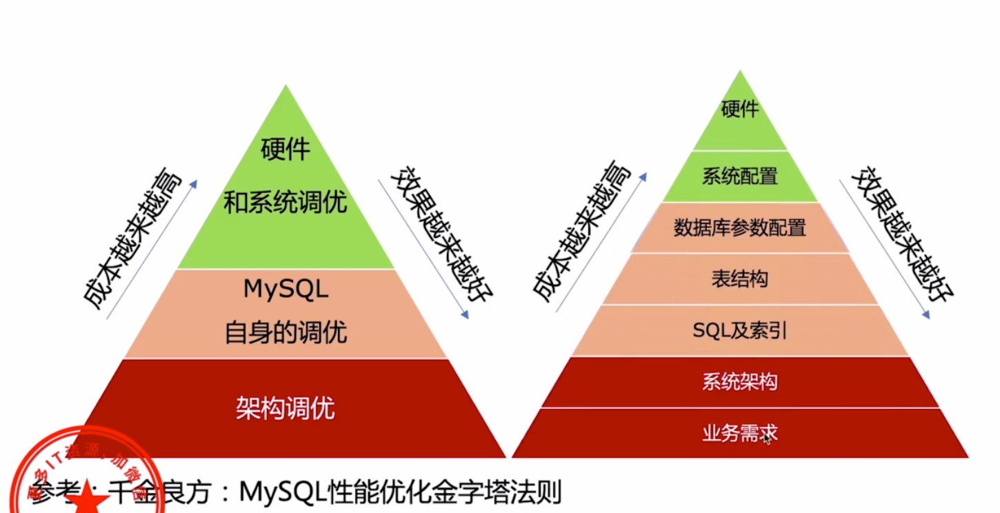

1.业务需求：不合理的需求会带来很多的问题

2.系统架构： 做架构设计的时候，应充分考虑业务的实际情况，考虑好数据库的各种选择。

​		读写分离？高可用？实例个数？分库分表？用什么类型的数据库？

3.sql及索引：根据需求编写良好的sql,并且创建足够搞笑的索引

4.表结构：设计良好的表结构

5.数据库参数配置：设置合理的数据库性能参数

​		举例：join buffer,sort buffer 等等

6.系统配置：操作系统提供了各种资源使用策略，设置合理的配置，以便数据库充分利用资源

​		举例：swap->swappiness

7.硬件：选用什么配置的机器？

Ps:教学用的数据来源：https://github.com/datacharmer/test_db

## 2.数据库调优

### 1.慢查询日志

1. #### 原理

   慢查询日志是MySQL提供的一种日志记录，用来记录响应时间超过阀值的SQL语句。
    如果某条SQL语句运行时间超过**long_query_time**设定的值，就会被记录到慢查询日志中。

SQL语句 说明

| 命令                                   | 详细解释                          |
| -------------------------------------- | --------------------------------- |
| SHOW VARIABLES LIKE ‘%slow_query_log%’ | 查看慢查询日志是否开启（默认OFF） |
| set global slow_query_log=1            | 开启慢查询日志                    |
| set global slow_query_log=0            | 关闭慢查询日志                    |
| SHOW VARIABLES LIKE ‘long_query_time%’ | 查看慢查询设定阈值（默认10秒）    |
| set long_query_time=5                  | 设定慢查询阈值为5秒 （单位：秒 ） |

#### 2.发现慢sql工具

Skywalking，visualvm，Javamelody

 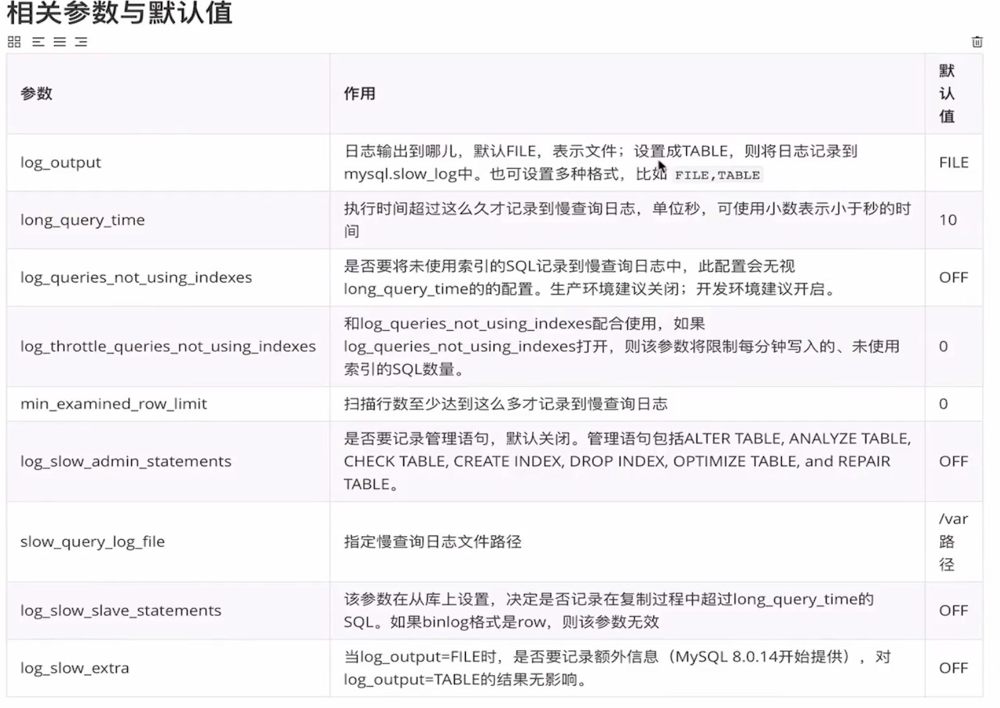

#### 3.使用方式

 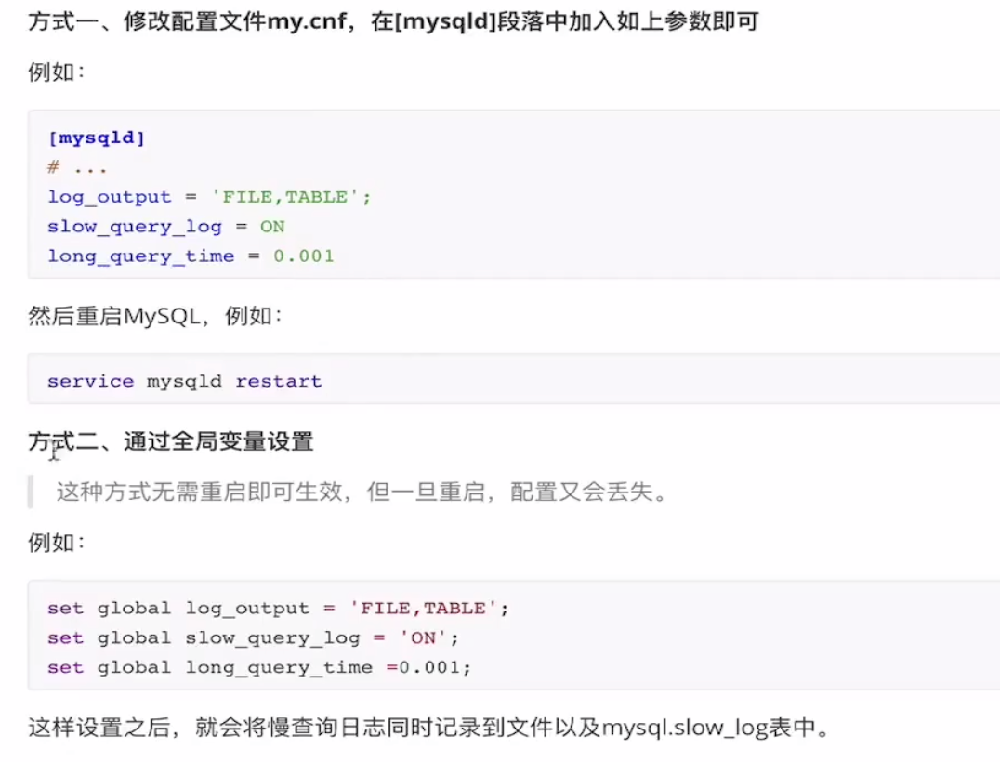

#### 4.慢查询日志分析

##### 4.1分析蛮查询表

```
select * from mysql.slow_log;
```

##### 4.2分析慢查询日志文件

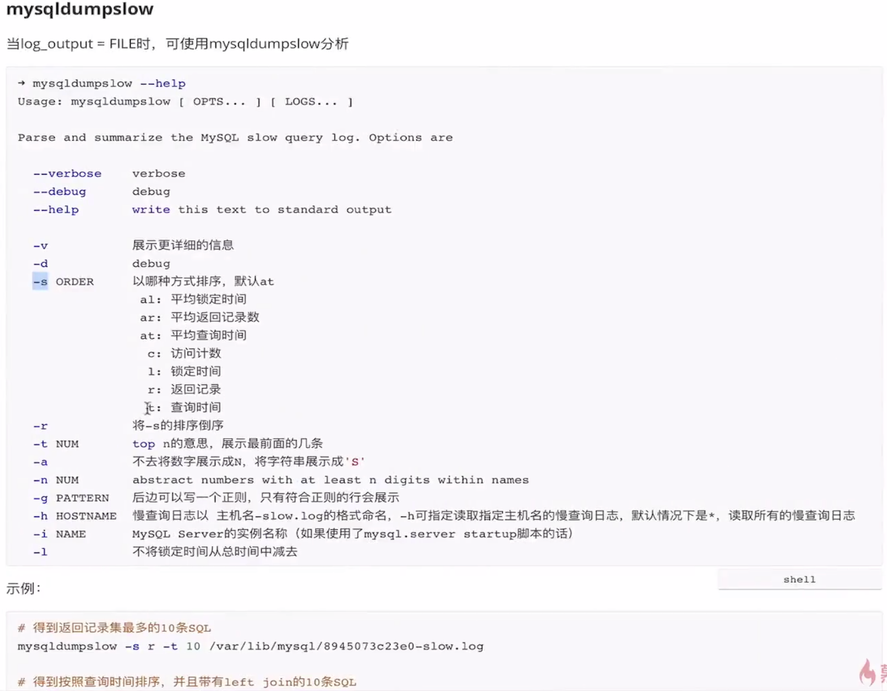

##### pt-query-digest

这个工具也可以用来分析mysql的慢sql日志文件。这里不做探讨了

### 2.explain分析sql

#### 1.explain展示的字段信息

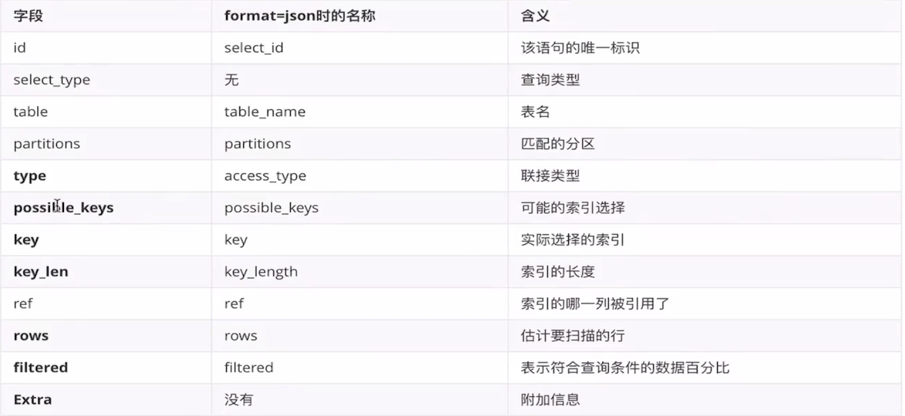

Type：这个字段的值最好是>=ref

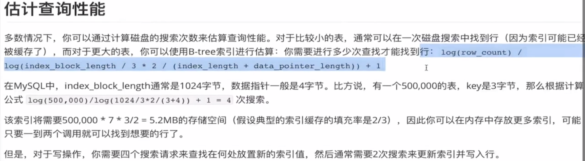

### 3.更细致的sql性能分析

 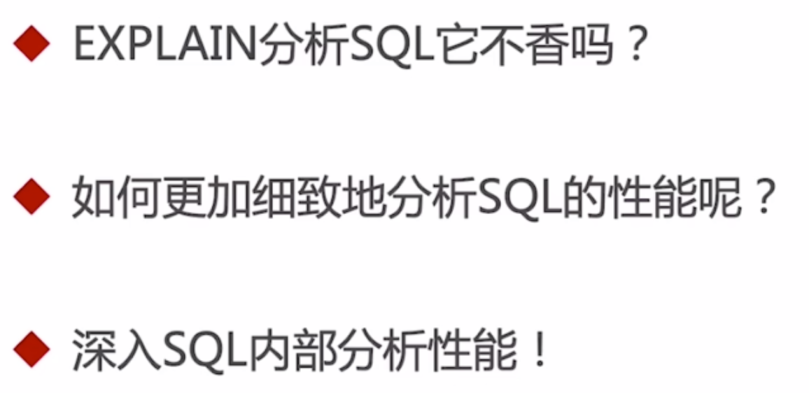


####  1.show profile

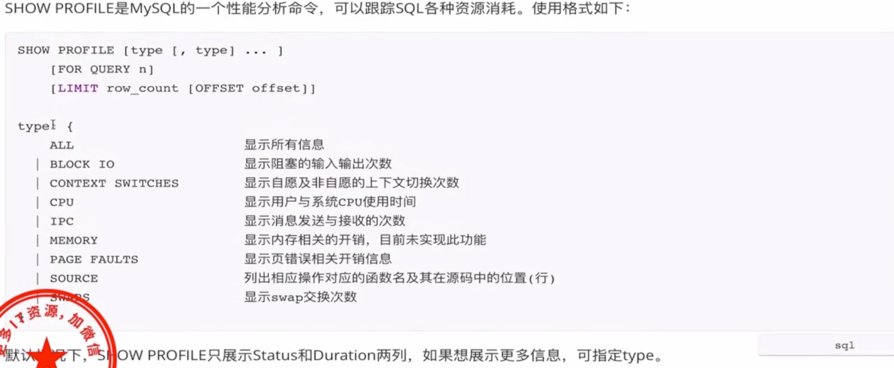

 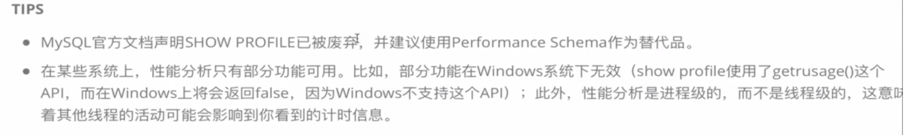

#### 2.information_schema.profiling

 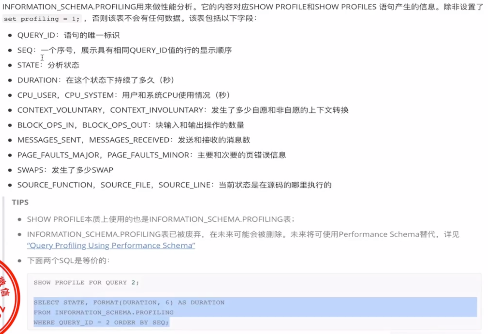

#### 3.performance_schema

注意：有时候在idea中或者navicat中执行sql并没有event记录，但是在mysql的client中执行有event的记录可能和下面的setup_actors有关系

 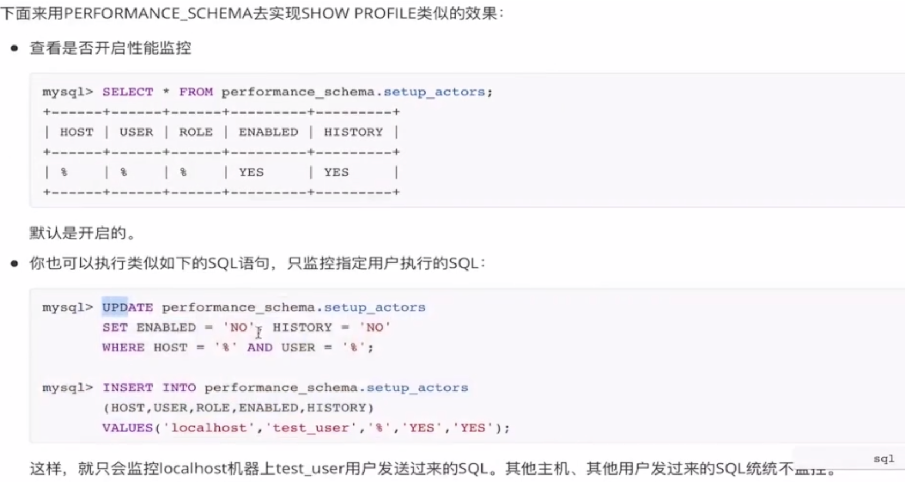

##### 1.开启监控项

```
-- 监控项开启
update performance_schema.setup_instruments set ENABLED='YES',TIMED='YES' where NAME like '%statement/%';
update performance_schema.setup_instruments set ENABLED='YES',TIMED='YES' where NAME like '%stage/%';
update performance_schema.setup_consumers set ENABLED='YES' where NAME like '%events_statements_%';
update performance_schema.setup_consumers set ENABLED='YES' where NAME like '%events_stages_%';
-- 获得语句的event_id
select EVENT_ID,truncate(TIMER_WAIT/1000000000000,6) as duration,SQL_TEXT from performance_schema.events_statements_history_long where SQL_TEXT like '%salaries%';
-- 查看执行时间
select EVENT_NAME as stage ,truncate(TIMER_WAIT/1000000000000,6) as duration from performance_schema.events_stages_history_long where NESTING_EVENT_ID =1248;
```

##### 2.三种方式对比：

 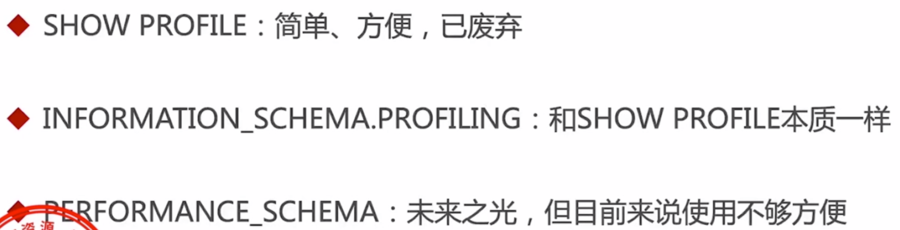

##### 3.如何选择

现在可以继续使用show profile的方式，但是还是要知道怎么使用performance_schema