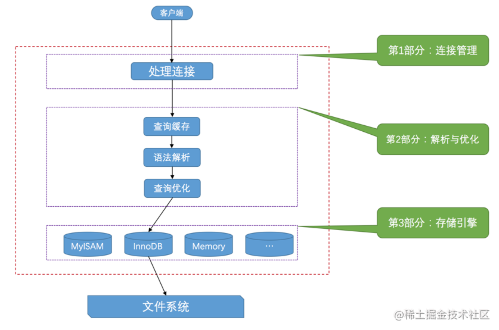

# Mysql服务器处理客户端的请求流程

 

# 字符集

Buffer Pool

```
## buffer pool的大小
innodb_buffer_pool_size = 268435456 
## 默认为56；线性预读某个区的页假如大于56的话，就会触发一次异步读取下一个区中全部的页面到Buffer Pool的请求
innodb_read_ahead_threshold = 56
## 默认关闭；随机预读：如果Buffer Pool中已经缓存了某个区的13个连续的页面，不论这些页面是不是顺序读取的，都会触发一次异步读取本区中所有其的页面到Buffer Pool的请求
## 其实还要求这13个页面是非常热的页面，所谓的非常热，指的是这些页面在整个young区域的头1/4处。 
innodb_random_read_ahead = OFF
## 默认为37；old区域在LRU链表中所占的比例
innodb_old_blocks_pct = 37
## 默认值是1000ms;对于从磁盘上被加载到LRU链表的old区域的某个页来说，如果第一次和最后一次访问该页面的时间间隔小于1s，那么该页是不会被加入到young区域的
## innodb_old_blocks_time的值设置为0，那么每次我们访问一个页面时就会把该页面放到young区域的头部
innodb_old_blocks_time=1000

```

### 刷新脏页到磁盘

从`LRU链表`的冷数据中刷新一部分页面到磁盘。

- 后台线程会定时从`LRU链表`尾部开始扫描一些页面，扫描的页面数量可以通过系统变量`innodb_lru_scan_depth`来指定，如果从里边儿发现脏页，会把它们刷新到磁盘。这种刷新页面的方式被称之为`BUF_FLUSH_LRU`。

- 从`flush链表`中刷新一部分页面到磁盘。

  后台线程也会定时从`flush链表`中刷新一部分页面到磁盘，刷新的速率取决于当时系统是不是很繁忙。这种刷新页面的方式被称之为`BUF_FLUSH_LIST`。

# 事务

事务的几个特性：原子性，一致性，隔离性，持久性

使用方式：begain commit; start transaction；rollback； savepoint；

事务的提交；显示提交；隐式提交