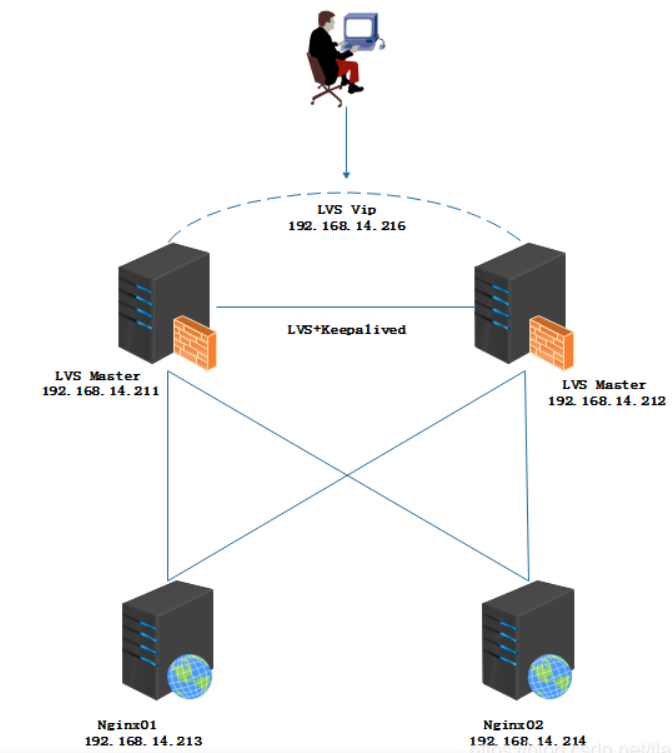

# lvs+keepalived（2.2.4）+nginx（1.21.1）的集群

LVS-master: 192.168.1.151

LVS-backup: 192.168.1.152

keepalived监听的vip（这个是一个虚拟ip): 192.168.1.150

nginx-master: 192.168.1.121

nginx-backup: 192.168.1.122

大致流程如下图：

 

# redis（5.0.5）集群

主节点：192.168.1.122

slave： 192.168.1.118, 192.168.1.119

# rabbitmq（3.7.15 && erlang 22.0)

单机master:192.168.1.122:15672

# elasticsearch（6.4.3）

**注意**：ElasticSearch启动时，会占用两个端口9200和9300。
他们具体的作用如下：

    9200 是ES节点与外部通讯使用的端口。它是http协议的RESTful接口（各种CRUD操作都是走的该端口,如查询：http://localhost:9200/user/_search）。
    9300是ES节点之间通讯使用的端口。它是tcp通讯端口，集群间和TCPclient都走的它。（java程序中使用ES时，在配置文件中要配置该端口）

单机master：192.168.1.122:9300
使用了：elasticsearch-analysis-ik-6.4.3，logstash-6.4.3，head插件

# 分库分表读写分离-mysql

192.168.1.118（主库）,192.168.1.119（从库） 

192.168.1.7（本地数据库，独立的）

