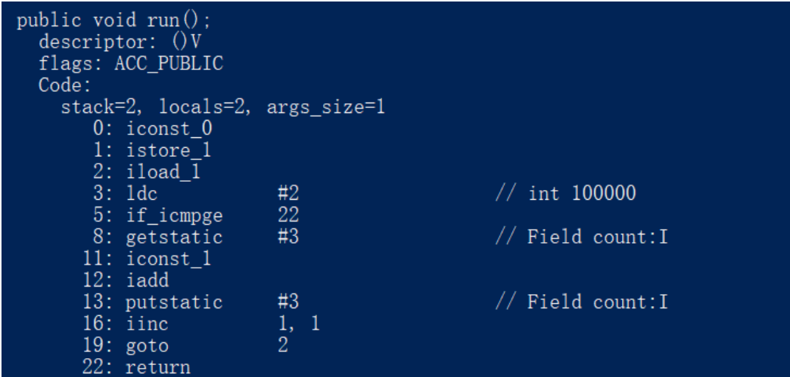

# volatile

我们介绍了 synchronized 关键字,synchronized 是jdk1.5提供的线程同步机制，可以⽤来修饰代码块，修饰普通⽅法，修饰static声明的静态⽅法，能够保证**原⼦性、可⻅性、有序性**，在jdk1.5,synchronized 是⼀个重量级的同步机制，线程挂起和阻塞都要从⽤户态转⼊内核态，⽐较耗性能，但是在jdk1.6时，进⾏了⼀系列的优化，⽐如**⾃旋锁，锁粗化，锁消除**等，使得其性能有了很⼤的提升，关于锁的这些优化，我在锁详解 这篇⽂章也有详细的介绍。
　　通常，对于新⼈来讲，不管三七⼆⼗⼀，对于需要同步的处理，直接上 synchronized 准没错，但是JVM还为我们提供了另外⼀个轻量级的线程同步机制——volatile。可能很多⼈没有在代码中实际使⽤过这个关键字，但其实，如果你研究过jdk并发包，这个关键字还是使⽤挺多的，下⾯我们就来详细介绍这个关键字。

# 1、可⻅性

　　通过 volatile 关键字修饰的变量，能够保证变量的可⻅性。
　　也就是说，当⼀个线程修改了被volatile修饰的变量，修改后的值对于其他线程来说是⽴即可以知道
的。
　　注意：这⾥有个误区，可⻅性并不是原⼦性。
　　对于如下代码：

```
public class VolatileTest implements Runnable {
    public static volatile int count = 0;

    public static void main(String[] args) throws Exception {
        VolatileTest vt = new VolatileTest();
        Thread t1 = new Thread(vt);
        Thread t2 = new Thread(vt);
        t1.start();
        t2.start();
        t1.join();
        t2.join();
        System.out.println(count);
    }

    @Override
    public void run() {
        for (int i = 0; i < 100000; i++) {
            count++;
        }
    }
}
```

　　代码逻辑很简单，启动两个线程，分别运⾏run⽅法，run⽅法⾥⾯循环100000次count++，通过join()⽅法等待这两个线程执⾏完毕后，打印 count 的最终值。
　　注意这个 count 是⽤ volatile修饰的。
　　我们说volatile 能够保证可⻅性，⼀旦 volatile 被修改了，别的线程也能⻢上知道，所有很明显这段代码运⾏结果是 200000。
　　没错，这个答案是错的，是不是很意外，结果应该⼩于等于200000。问题就出现在 count++ 这个操作不是原⼦性。
　　我们可以通过 javap 命令查看这个run⽅法的汇编指令：

 

　虽然 count++ 在我们程序员看来，就⼀条代码，但实际上在字节码层⾯发⽣了4条指令。⾸先getstatic 指令，表示从寄存器中取出 count 的值并压到栈顶，iconst_1 指令表示把int类型1压到操作栈顶；iadd 表示执⾏加法操作；最后putstatic指令表示将修改后的count写回到寄存器（由于被volatile修饰，这时候直接写回内存）。

　　这就存在⼀个问题，线程1执⾏第⼀条指令把 count 值取到操作栈顶时，虽然 volatile 指令能够保证此时的 count 是正确的，但是在执⾏ iconst_1和iadd指令时，有可能线程2已经执⾏了count++所有指令，这时候线程1取到的count值就变成过期的数据了，这就会造成问题。

# 2、禁⽌指令重排序

　　禁⽌指令重排序是 volatile 关键词的第⼆个作⽤。

　　为了使得处理器内部的运算单元尽量被充分利⽤，提⾼运算效率，处理器可能会对输⼊的代码进⾏排序。⽐如 A,B,C三条按顺序运⾏的代码，经过指令重排后，可能是 B,A,C的顺序来执⾏。

　　通过 volatile 修饰的变量，在进⾏指令优化时， 要求不能将在对 volatile 变量访问的语句放在其后⾯执⾏，也不能把 volatile 变量后⾯的语句放到其前⾯执⾏。

# 3、总结

　　这⾥我们对⽐⼀下volatile 关键字和 synchronized 关键字。

1. 关键字volatile是线程同步的轻量级实现，synchronized 是重量级实现，但是我们并不能说volatile ⼀定⽐ synchronized 性能好，因为Java虚拟机对锁进⾏了偏向锁，⾃旋锁，锁消除，锁粗化等⼀系列优化措施。所以我们很难说 volatile性能肯定⽐synchronized要好；
2. volatile只能修饰变量，⽽synchronized可以修饰⽅法、代码块等。
3. 多线程访问volatile不会发⽣阻塞，⽽synchronized会出现阻塞。
4. volatile能保证数据的可⻅性，但不能保证数据的原⼦性；⽽synchronized可以保证原⼦性，也可以保证可⻅性（通过JMM）。关键字volatile解决的是变量在多个线程之间的可⻅性；⽽synchronized关键字解决的是多个线程之间访问资源的同步性。