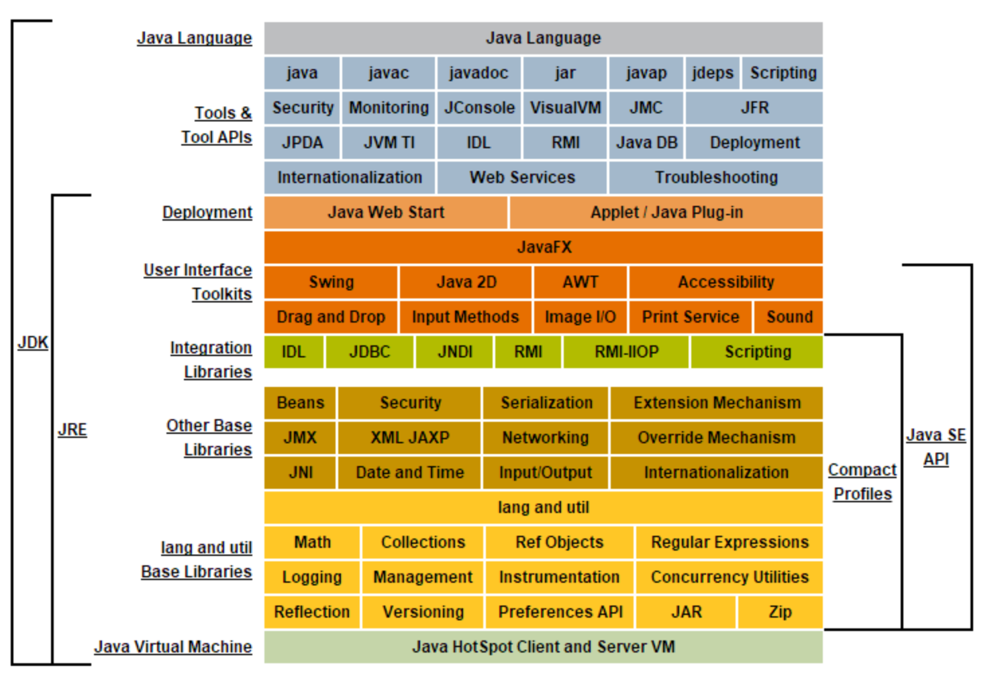
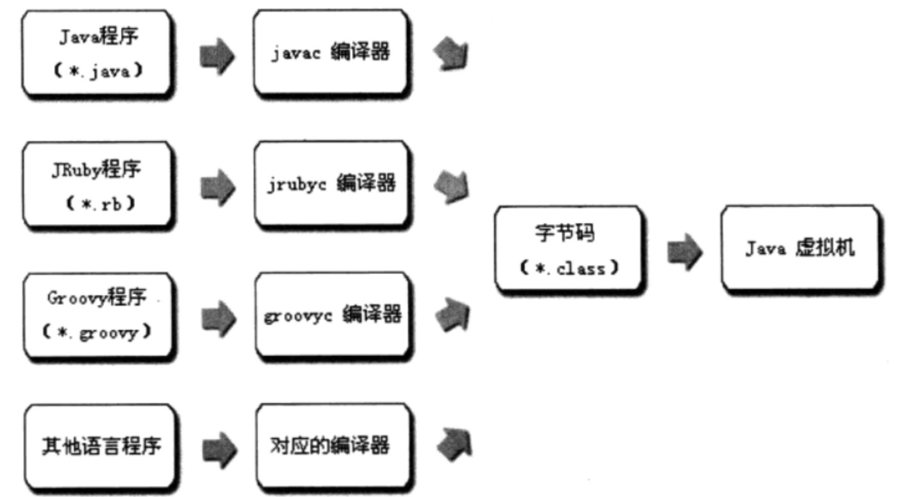
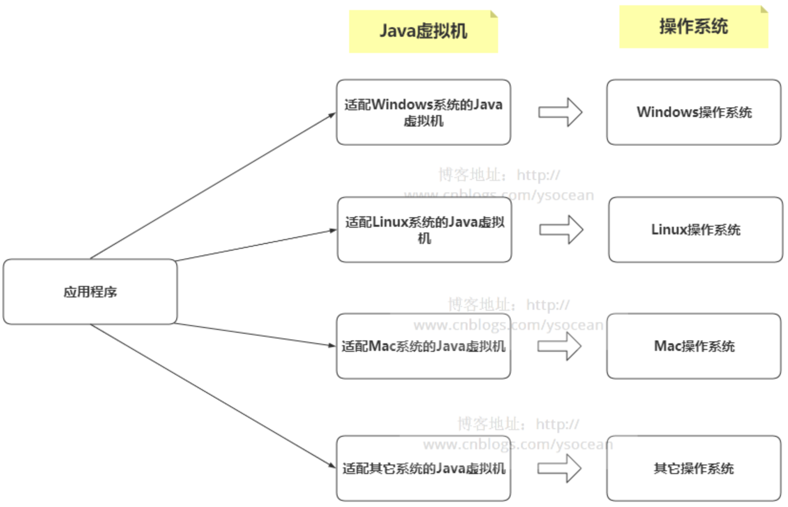

> 以下参考的相关文档：
>
> 　　①、JDK1.7虚拟机规范：https://docs.oracle.com/javase/specs/jvms/se7/html/index.html
>
> 　　　　JDK1.8虚拟机规范：https://docs.oracle.com/javase/specs/jvms/se8/html/index.html
>
> 　　②、Oracle Java SE 8 产品组件：https://docs.oracle.com/javase/8/docs/index.html
>
> 　　③、周志明老师：《深入理解Java虚拟机：JVM高级特性与最佳实践》
>
> 　　④、陈涛老师：《HotSpot实战》

------

# Oracle Java SDK产品组件

通常来说 Java平台标准版（Java SE）包括 Java SE开发工具包（JDK）和Java SE运行时环境（JRE）。

　　JRE提供了*运行*以Java编程语言编写的applet和应用程序所必需的库，**Java虚拟机**和其他组件；JDK包括JRE以及编译器和调试器等命令行开发工具，可以用来开发Java应用程序 。

　　PS：JDK包含JRE，我们通常安装JDK的同时也会安装JRE。



# 虚拟机

上图的最下一行Java虚拟机是被 JRE 所包含，我们在介绍Java虚拟机时，先了解虚拟机的概念。

　　所谓虚拟机，其实就是一台虚拟的机器，可以用来执行一系列虚拟的命令。大体上虚拟机可以分为两种：系统虚拟机和程序虚拟机。

　　①、系统虚拟机：是完全对物理计算机的仿真，可以说和一台真实的PC操作系统没什么区别。比如常用的 Vmare 以及 Visual Box 软件，通过这些软件能够模拟出具有完整硬件系统功能的、运行在一个完全隔离环境中的完整计算机系统。

　　②、程序虚拟机：专门为执行单个计算程序而产生，最典型的就是Java虚拟机，在Java虚拟机中执行字节码文件命令。

# Java虚拟机

了解了什么是虚拟机，我们再看什么是 Java虚拟机。

　　Java虚拟机可以看做是一台抽象的计算机，如同真实的计算机那样，它有自己的指令集以及各种运行时内存区域，它与Java语言没有必然的联系，只与特定的二进制文件——class  文件格式关联（字节码文件），可以通过Java语言或者其他语言编写的程序编译成class文件，然后在Java虚拟机上运行。Java虚拟机有以下二个特点：

　　**①、语言无关**

　　Java虚拟机只和class文件关联，所以只要你编写程序的语言能够编译成class文件，那么都能够在Java虚拟机上运行。



**②、平台无关**

　　Java从诞生之初就宣传的一个口号：一次编写，到处运行。

　　也就是说Java是一个跨平台的语言，那么Java是如何实现跨平台的呢？

　　其实Java之所以跨平台是因为Java虚拟机的适配，不同的系统实现不同的Java虚拟机。Java虚拟机就相当于操作系统和应用程序之间的中介，每种平台安装适应该平台的Java虚拟机，那么我们编写的程序当然能够在任意平台运行。



# Java虚拟机种类

- **商用虚拟机：**

 　**①、Sun HotSpot**

　　该虚拟机性能优越，是 sun JDK1.3 及以后所有 sun JDK 版本默认的虚拟机，使用最为广泛，本系列博客就是以这个虚拟机为平台进行介绍。

```
java -version 
java version "1.8.0_271"
Java(TM) SE Runtime Environment (build 1.8.0_271-b09)
Java HotSpot(TM) 64-Bit Server VM (build 25.271-b09, mixed mode)
```

**②、BEA JRockit**

　　JRockit 虚拟机是 BEA 公司于 2002 年从 Appeal Virtual Machines  收购获得的虚拟机。它是一款面向服务器硬件和服务端使用场景高度优化过得虚拟机，曾经号称是“世界上速度最快的虚拟机”。由于专注于服务端应用，它的内部不包含解析器的实现，全部代码都靠即时编译器编译后执行。

**③、IBM J9**

　　J9 虚拟机是 IBM 公司单独开发的高性能虚拟机，它并不独立出售，而是作为 IBM 公司各种产品的执行平台，IBM 把它定义为一个可以适应从嵌入式设备到大型企业级应用的、高可移植性的Java运行平台。

**④、Sun Classic** 

　　这个虚拟机很原始，是 JDK1.0 时代使用的Java虚拟机，是各种虚拟机的鼻祖，它的内部不存在即时编译器，只能使用纯解释的方式运行。

- **嵌入式虚拟机**

　　**①、Dalvik**

　　Dalvik 虚拟机是 Google 等厂商合作开发的 Android 移动设备平台的核心组成部分之一，它执行 dex(Dalvik  Executable) 文件而不是 class  文件，使用寄存器架构而不是栈架构，但是它的开发体系与Java有着千丝万缕的关系，可以直接使用大部分的 Java API、dex  文件可以直接从class文件转化而来。并且在 Android 2.2 中提供了即时编译器的实现，性能大大的提高。

　　**②、KVM**

　　在 Android、IOS 等智能手机操作系统出现之前，曾广泛应用于手机平台的一种虚拟机。

　　**③、CDC/CLDC HotSpot**

　　CDC和 CLDC HotSpot 分别是 Sun 针对高端嵌入式设备和中低端嵌入式设备的虚拟机，用来代替 KVM。