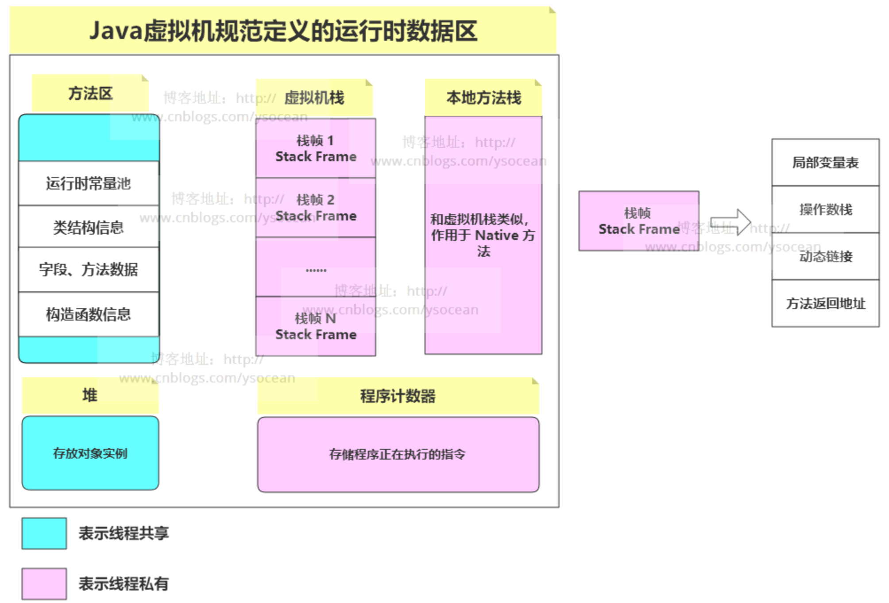
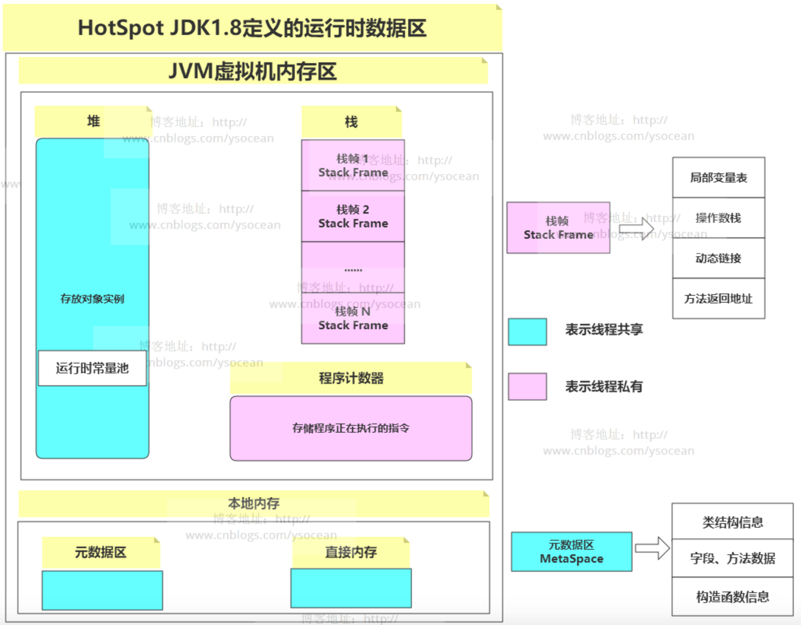
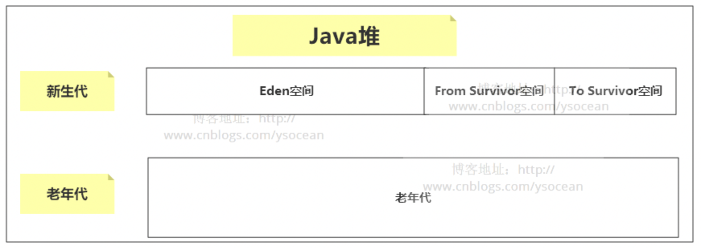
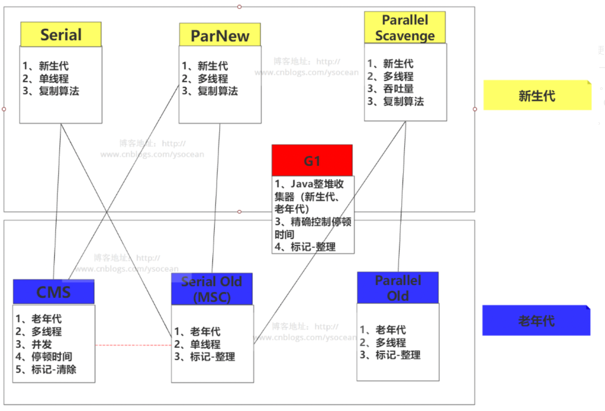
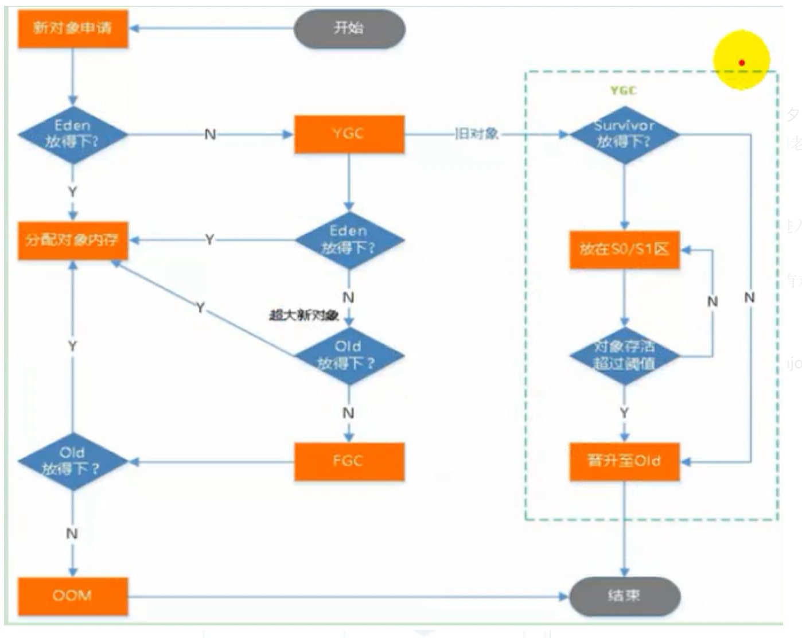
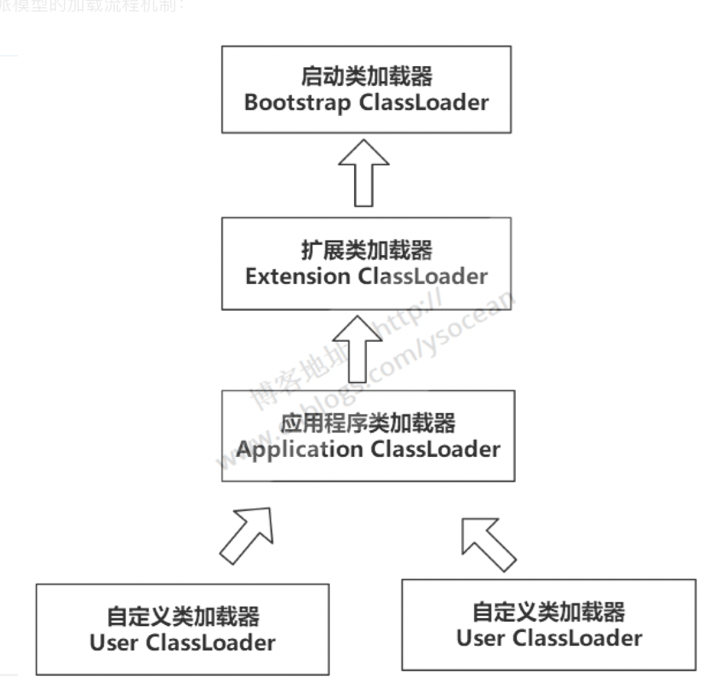

# **jvm介绍**

- 虚拟机：系统虚拟机：VMware;程序虚拟机：Java虚拟机
- Java虚拟机特点：语言无关，平台无关
- 商用虚拟机：jdk1.3之后的都是使用Sun HotSpoot

# **jvm运行时内存结构**

- Java虚拟机规范定义的运行时数据区

 

- **HotSpot JDK1.8定义的运行时数据区**

 

- **HotSpot****中的直接内存**

  直接内存（Direct Memory）并不是虚拟机运行时数据区的一部分，它也不是Java虚拟机规范定义的内存区域。我们可以看到在 HotSpot 中，就将方法区移除了，用元数据区来代替，并且将元数据区从虚拟机运行时数据区移除了，转到了本地内存中，也就是说这块区域是受本机物理内存的限制，当申请的内存超过了本机物理内存，才会抛出 OutOfMemoryError 异常。

  直接内存也是受本机物理内存的限制，在JDK1.4中新加入的 NIO（new input/output）类，引入了一种基于通道（Channel）与缓冲区（Buffer）的 I/O 方式，它可以使用 Native 函数库直接分配堆外内存，然后通过一个存储在Java堆里面的 DirectByteBuffer 对象作为这块内存的引用操作，这样避免了在Java堆和Native堆中来回复制数据，显著提高性能。

# **jvm垃圾收集**

## **垃圾收集的区域：堆内存**

## **什么样的垃圾可以被回收：**

- **引用计数算法**：

这种算法是这样的：给每一个创建的对象增加一个引用计数器，每当有一个地方引用它时，这个计数器就加1；而当引用失效时，这个计数器就减1。当这个引用计数器值为0时，也就是说这个对象没有任何地方在使用它了，那么这就是一个无效的对象，便可以进行垃圾回收了。

　　这种算法实现简单，而且效率也很高。但是**Java没有采用该算法来进行垃圾回收**，因为这种算法无法解决对象之间的循环引用问题。

- **根搜索算法**

　　我们这里直接给出结论：**在主流的商用程序中（Java，C#），都是使用根搜索算法（GC Roots Tracing）来判定对象是否存活。** 

　　该算法思路：通过一系列名为“GC Roots” 的对象作为终点，当一个对象到GC Roots 之间无法通过引用到达时，那么该对象便可以进行回收了。

```
Java中能被定义为GC Roots的对象
1、栈变量：虚拟机栈（栈帧中的本地变量表）中引用的对象
2、静态变量：方法区中的静态变量属性引用的对象
3、常量池：方法区中常量引用的对象
4、JNI:本地方法栈中（JNI）（即一般说的Native方法）的引用的对象
```

## **如何进行垃圾回收**

- **标记-清除算法**

　　**算法实现**：分为标记-清除两个阶段，首先根据上面的根搜索算法标记出所有需要回收的对象，在标记完成后，然后在统一回收掉所有被标记的对象。

　　**缺点**：

　　1、效率低：标记和清除这两个过程的效率都不高。

　　2、容易产生内存碎片：因为内存的申请通常不是连续的，那么清除一些对象后，那么就会产生大量不连续的内存碎片，而碎片太多时，当有个大对象需要分配内存时，便会造成没有足够的连续内存分配而提前触发垃圾回收，甚至直接抛出OutOfMemoryExecption。

- **复制算法**

　　为了解决标记-清除算法的两个缺点，复制算法诞生了。

　　**算法实现**：将可用内存按容量划分为大小相等的两块区域，每次只使用其中一块，当这一块的内存用完了，就将还活着的对象复制到另一块区域上，然后再把已使用过的内存空间一次性清理掉。

　　**优点**：每次都是只对其中一块内存进行回收，不用考虑内存碎片的问题，而且分配内存时，只需要移动堆顶指针，按顺序进行分配即可，简单高效。

　　**缺点**：将内存分为两块，但是每次只能使用一块，也就是说，机器的一半内存是闲置的，这资源浪费有点严重。并且如果对象存活率较高，每次都需要复制大量的对象，效率也会变得很低。

- **标记-整理算法**

　　上面我们说过复制算法会浪费一半的内存，并且对象存活率较高时，会有过多的复制操作，效率低下。

　　如果对象存活率很高，基本上不会进行垃圾回收时，标记-整理算法诞生了。

　　**算法实现**：首先标记出所有存活的对象，然后让所有存活对象向一端进行移动，最后直接清理到端边界以外的内存。

　　**局限性**：只有对象存活率很高的情况下，使用该算法才会效率较高。

- **分代收集算法**

 　当前商业虚拟机都是采用此算法，但是其实这不是什么新的算法，而是上面几种算法的合集。

　　算法实现：根据对象的存活周期不同将内存分为几块，然后不同的区域采用不同的回收算法。

　　　　1、对于存活周期较短，每次都有大批对象死亡，只有少量存活的区域，采用复制算法，因为只需要付出少量存活对象的复制成本即可完成收集；

　　　　2、对于存活周期较长，没有额外空间进行分配担保的区域，采用标记-整理算法，或者标记-清除算法。

　　比如，对于 HotSpot 虚拟机，它将堆空间分为如下两块区域：

 

## **何时进行垃圾回收**

1. System.gc()方法，手动回收
2. 虚拟机会自行根据当前内存大小，判断何时进行垃圾回收，比如前面所说的，新生代满了，新产生的对象无法分配内存时，便会触发垃圾回收机制。

　　这里需要说明的是宣告一个对象死亡，至少要经历两次标记，前面我们说过，如果对象与GC Roots 不可达，那么此对象会被第一次标记并进行一次筛选，筛选的条件是此对象是否有必要执行 finalize() 方法，当对象没有覆盖 finalize()方法，或者该方法已经执行了一次，那么虚拟机都将视为没有必要执行finalize()方法。

　　如果这个对象有必要执行 finalize() 方法，那么该对象将会被放置在一个有虚拟机自动建立、低优先级，名为 F-Queue 队列中，GC会对F-Queue进行第二次标记，如果对象在finalize() 方法中成功拯救了自己（比如重新与GC Roots建立连接），那么第二次标记时，就会将该对象移除即将回收的集合，否则就会被回收。

# **jvm垃圾收集器**

 

- 由上图我们可以总结出几个结论：

　　①、新生代垃圾收集器：Serial、ParNew、Parallel Scavenge；

　　　　老年代垃圾收集器：Serial Old（MSC）、Parallel Old、CMS；

　　　　整堆垃圾收集器：G1

　　②、垃圾收集器之间的连线表示可以搭配使用，有如下几种组合：

　　　　Serial/Serial Old、Serial/CMS、ParNew/Serial Old、ParNew/CMS、Parallel Scavenge/Serial Old、Parallel Scavenge/Parallel Old、G1；

　　③、串行收集器Serial：Serial、Serial Old

　　　　并行收集器 Parallel：Parallel Scavenge、Parallel Old

　　　　并发收集器：CMS、G1

## **如何选择垃圾收集器**　

　　详细文档可以查看官方介绍，如下

　　https://docs.oracle.com/javase/8/docs/technotes/guides/vm/gctuning/collectors.html

　　这里我们翻译一下结论：

　　除非应用程序有相当严格的暂停时间要求，否则就让JVM自己选择垃圾收集器。并且可以适当优先调整堆的大小来提高性能。如果还不满足要求，则以下面四点作为指导：

　　1. 如果应用程序内存小于100M，那么使用选项选择串行收集器-XX:+UseSerialGC。

　　2. 如果应用程序将在单核处理器上运行，并且没有停顿时间的要求，选择串行-XX:+UseSerialGC或者 JVM 自己选

　　3. 如果允许停顿时间超过1秒，选择并行或 JVM 自己选

　　4. 如果响应时间比总吞吐量更重要，并且垃圾收集暂停必须保持短于大约1秒，则使用-XX:+UseConcMarkSweepGC或选择并发收集器-XX:+UseG1GC。

# **jvm常用参数**

- 标准参数：标准参数，顾名思义，标准参数中包括功能以及输出的结果都是很稳定的，基本上**不会随着JVM版本的变化而变化**。

  　　我们可以通过 java -help 命令来检索出所有标准参数。

- x参数：对应前面讲的标准化参数，这是非标准化参数。表示在将来的JVM版本中可能会发生改变，但是这类以 -X开始的参数变化的比较小。我们可以通过 Java -X 命令来检索所有-X 参数。

- xx参数：

  这是我们日常开发中接触到最多的参数类型。这也是非标准化参数，相对来说不稳定，随着JVM版本的变化可能会发生变化，主要用于**JVM调优**和debug。

  　　**注意**：这种参数是我们后续介绍JVM调优讲解最多的参数。

  　　该参数的书写形式又分为两大类：

  - Boolean类型

  　　格式：-XX:[+-]<name> 表示启用或者禁用name属性。

  　　例子：-XX:+UseG1GC（表示启用G1垃圾收集器）

  - Key-Value类型

  　　格式：-XX:<name>=<value> 表示name的属性值为value。

  　　例子：-XX:MaxGCPauseMillis=500（表示设置GC的最大停顿时间是500ms）

- 本节我们会持续更新罗列一些JVM参数。

**1、打印已经被用户或者当前虚拟机设置过的参数**

```
-XX:+PrintCommandLineFlags
```

　　比如：　　

**2、最大堆和最小堆内存设置**

　　**-Xms512M：设置堆内存初始值为512M**

　　**-Xmx1024M：设置堆内存最大值为1024M**

　　这里的ms是memory start的简称，mx是memory max的简称，分别代表最小堆容量和最大堆容量。但是别看这里是-X参数，其实这是-XX参数，等价于：

　　**-XX:InitialHeapSize**

　　**-XX:MaxHeapSize**

　　在通常情况下，服务器项目在运行过程中，堆空间会不断的收缩与扩张，势必会造成不必要的系统压力。所以在生产环境中，**JVM的Xms和Xmx要设置成一样的**，能够避免GC在调整堆大小带来的不必要的压力。　　

**3、Dump异常快照以及以文件形式导出**

　　**-XX:+HeapDumpOnOutOfMemoryError**

　　**-XX:HeapDumpPath**

　　堆内存出现OOM的概率是所有内存耗尽异常中最高的，出错时的堆内信息对解决问题非常有帮助，所以给JVM设置这个参数(**-XX:+HeapDumpOnOutOfMemoryError**)，让JVM遇到OOM异常时能输出堆内信息，并通过（**-XX:+HeapDumpPath**）参数设置堆内存溢出快照输出的文件地址，这对于特别是对相隔数月才出现的OOM异常尤为重要。

　　这两个参数通常配套使用：

```
-XX:+HeapDumpOnOutOfMemoryError -XX:HeapDumpPath=./
```

**4、发送OOM后，执行一个脚本**

　　***\*-XX:OnOutOfMemoryError\****

　　**比如这样设置：**

```
-XX:OnOutOfMemoryError="C:\Program Files\Java\jdk1.8.0_152\bin\jconsole.exe"
```

　　表示发生OOM后，运行jconsole.exe程序。这里可以不用加“”，因为jconsole.exe路径Program Files含有空格。

　　利用这个参数，我们可以在系统OOM后，自定义一个脚本，可以用来发送邮件告警信息，可以用来重启系统等等。

**5、打印gc信息**

　　**①、打印GC简单信息**

　　　　**-verbose:gc**

　　　　**-XX:+PrintGC**

　　一个是标准参数，一个是-XX参数，都是打印详细的gc信息。通常会打印如下信息：

　　

　　比如第一行，表示GC回收之前有12195K的内存，回收之后剩余1088K，总共内存为125951K

　　**②、打印详细GC信息**

　　**-XX:+PrintGCDetails**

　　**-XX:+PrintGCTimeStamps**　　****

**6、指定GC日志以文件输出**

　　**-Xloggc:./gc.log**

　　这个在参数用于将gc日志以文件的形式输出，更方便我们去查看日志，定位问题。

**7、设置永久代大小**

　　**-XX:MaxPermSize=1280m**

　　在JDK1.7以及以前的版本中，只有Hotspot 才有Perm区，称为永久代，它在启动时固定大小，很难进行调优。

　　在某些情况下，如果动态加载类过多，容易产生Perm区的 OOM。比如某个实际 Web 工程中，因为功能点较多，在运行过程中，要不断动态加载很多类，就会出现类似错误：

　　"Exception in thread 'dubbo client x.x.connect' java.lang.OutOfMemoryError:PermGenspace"

　　为了解决这个问题，就需要在项目启动时，设定运行参数-XX:MaxPermSize。

　　**注意：在JDK1.8以后面的版本，使用元空间来代替永久代。在 JDK1.8以及后面的版本中，如果设定参数-XX:MaxPermSize，启动JVM不会报错，但是会提示：**

　　**Java Hotspot 64Bit Server VM warning：ignoring option MaxPermSize=1280m:support was removed in 8.0**

 

**8、垃圾收集器常用参数**


　　

# **jvm内存分配**

## **Minor GC 、Major GC 和 Full GC**

　　下面会出现这几个概念，所以这里首先介绍一下。

　　**①、Minor GC**

　　也叫Young GC，指的是新生代 GC，发生在新生代（Eden区和Survivor区）的垃圾回收。因为Java对象大多是朝生夕死的，所以 Minor GC 通常很频繁，一般回收速度也很快。

注意：新生代对象每熬过一次 Minor GC，年龄就增加1，当它的年龄增加到一定阈值时（默认是15岁），就会被晋升到老年代中。

　　这个年龄阈值可以通过如下参数来设置（N表示晋升到老年代的阈值）：

```
-XX:MaxTenuringThreshold=N
```

Java虚拟机并不会死板的根据上面说的，设置-XX:MaxTenuringThreshold 的阈值，只有对象经历该阈值次GC后，才会进入到老年代。而是会根据新生代对象的年龄来动态的决定哪些对象可以进入到老年代。

　　也就是说，新生代经历一次 Minor GC 后，Survivor 区域存活对象的所有相同年龄之和大于整个 Survivor 区域的所有对象之和，那么该区域大于等于这个年龄的对象就会进入老年代，而无需等到 -XX:MaxTenuringThreshold 设置的阈值。

　　**②、Major GC**

　　也叫Old GC，指的是老年代的 GC，发生在老年代的垃圾回收，该区域的对象存活时间比较长，通常来讲，发生 Major GC时，会伴随着一次 Minor GC，而 Major GC 的速度一般会比 Minor GC 慢10倍。

　　③**、Full GC**

　　指的是全区域（整个堆）的垃圾回收，通常来说和 Major GC 是等价的。　　

## **新对像分配过程**

 

## **空间分配担保原则**

　   现在Java虚拟机采用的是分代回收算法，新生代采用复制收集算法，而老年代采用标记整理，或者标记清除算法。

　　新生代内存分为一块 Eden区，和两块 Survivor 区域，当发生一次 Minor GC时，虚拟机会将Eden和一块Survivor区域的所有存活对象复制到另一块Survivor区域，通常情况下，Java对象朝生夕死，一块 Survivor 区域是能够存放GC后剩余的对象的，但是极端情况下，GC后仍然有大量存活的对象，那么一块 Survivor 区域就会存放不下这么多的对象，那么这时候就需要老年代进行分配担保，让无法放入 Survivor 区域的对象直接进入到老年代，当然前提是老年代还有空间能够存放这些对象。但是实际情况是在完成GC之前，是不知道还有多少对象能够存活下来的，所以老年代也无法确认是否能够存放GC后新生代转移过来的对象，那么这该怎么办呢?

　　前面我们介绍的都是Minor GC,那么何时会发生 Full GC？

　　在发生 Minor GC 时，虚拟机会检测之前每次晋升到老年代的平均大小是否大于老年代的剩余空间，如果大于，则改为 Full GC。如果小于，则查看 HandlePromotionFailure 设置是否允许担保失败，如果允许，那只会进行一次 Minor GC，如果不允许，则也要进行一次 Full GC。

```
-XX:-HandlePromotionFailure
```

　　回到第一个问题，老年代也无法确认是否能够存放GC后新生代转移过来的对象，那么这该怎么办呢?

　　也就是取之前每一次回收晋升到老年代对象容量的平均大小作为经验值，然后与老年代剩余空间进行比较，来决定是否进行 Full GC，从而让老年代腾出更多的空间。

　　通常情况下，我们会将 HandlePromotionFaile 设置为允许担保失败，这样能够避免频繁的发生 Full GC。

# **jvm监控命令以及可视化监控工具**

- 1、jps：显示虚拟机进程
- 2、jstat：统计监视虚拟机信息工具
- 3、jinfo:实时的查看和调整虚拟机各项参数
- 4、jmap:内存映像工具
- 5、jstack：Java堆栈跟踪工具 
- 可视化监控工具：JConsole和JVisualVM（比较推荐，插件丰富：　https://visualvm.github.io/documentation.html）

# **jvm类加载过程和双亲委派过程**

## **类的加载**

- 类从被加载到虚拟机内存开始，到卸载出内存为止。经历：**加载**-》**验证**-》**准备**-》解析-》**初始化**-》使用-》**卸载**，标粗的5个部分（加载、验证、准备、初始化、卸载）顺序是确定的，也就是说，类的加载过程必须按照这种顺序按部就班的开始。这里的“开始”不是按部就班的“进行”或者“完成”，因为这些阶段通常是互相交叉混合的进行的，通常会在一个阶段执行过程中调用另一个阶段。

### **加载**

　　“加载”阶段是“类加载”生命周期的第一个阶段。在加载阶段，虚拟机要完成下面三件事：

　　①、通过一个类的全限定名来获取定义此类的二进制字节流。

　　②、将这个字节流所代表的静态存储结构转化为方法区的运行时数据结构。

　　③、在Java堆中生成一个代表这个类的java.lang.Class对象，作为方法区这些数据的访问入口。

### **验证**

　　验证是连接阶段的第一步，作用是为了**确保 Class 文件的字节流中包含的信息符合当前虚拟机的要求，并且不会危害虚拟机自身的安全。**

- **文件格式验证**

　　校验字节流是否符合Class文件格式的规范，并且能够被当前版本的虚拟机处理。

- **元数据验证**

　　第二个阶段主要是对字节码描述的信息进行语义分析，以保证其描述的信息符合Java语言规范要求。

- **字节码验证**

　　第三个阶段字节码验证是整个验证阶段中最复杂的，主要是进行数据流和控制流分析。该阶段将对类的方法进行分析，保证被校验的方法在运行时不会做出危害虚拟机安全的行为。

- **符号引用验证**

　　符号引用验证主要是对类自身以外（常量池中的各种符号引用）的信息进行匹配性的校验，通常需要校验如下内容：

1. 符号引用中通过字符串描述的全限定名是否能够找到相应的类。
2. 在指定类中是否存在符合方法的字段描述符及简单名称所描述的方法和字段。
3. 符号引用中的类、字段和方法的访问性（private、protected、public、default）是否可以被当前类访问。

### **准备**

　　准备阶段是正式为**类变量**分配内存并设置**类变量**初始值的阶段，这些内存是在方法区中进行分配。

　　注意：

　　一、上面说的是类变量，也就是被 static 修饰的变量，不包括实例变量。实例变量会在对象实例化时随着对象一起分配在堆中。

　　二、初始值，指的是一些数据类型的默认值。基本的数据类型初始值如下（引用类型的初始值为null）：

### **初始化**

 　初始化阶段是类加载阶段的最后一步，前面过程中，除第一个加载阶段可以通过用户自定义类加载器参与之外，其余过程都是完全由虚拟机主导和控制。而到了初始化阶段，则开始真正执行类中定义的Java程序代码（或者说是字节码）。

　　在前面介绍的准备阶段中，类变量已经被赋值过初始值了，而初始化阶段，则根据程序员的编码去初始化变量和资源。

　　换句话来说，**初始化阶段是执行类构造器<clinit>() 方法的过程**。

**双亲委派模型**

问题：如果有不法分子在你项目中构造了一个java.lang.String类，并在该类中植入了一些不良代码，但你自己浑然不知，以为使用的String类还是 rt.jar 包下的，那可能会给你系统造成不良的影响。

　　聪明的Java虚拟机实现者也想到了这个问题，于是，他们引入了 双亲委派模型来解决这个问题。

　　下面是双亲委派模型的加载流程机制：

 

总结来说：**双亲委派机制就是如果一个类加载器收到了类加载请求，它首先不会自己尝试去加载这个类，而是把这个请求委派给父类加载器去完成，每一个层次的类加载器都是如此，因此所有的加载请求最终都应该传送到顶层的启动类加载器中，只有父类加载器反馈到无法完成这个加载请求（它的搜索范围没有找到这个类），子加载器才会尝试自己去加载。**

回到上面提出的问题，如果你自定义了一个 java.lang.String类，你会发现这个自定义的String.java**可以正常编译，但是永远无法被加载运行**。因为加载这个类的加载器，会一层一层的往上推，最终由启动类加载器来加载，而启动类加载的是jdk的lib目录下的rt.jar包中的java.lang.String，不是你自定义的String类。