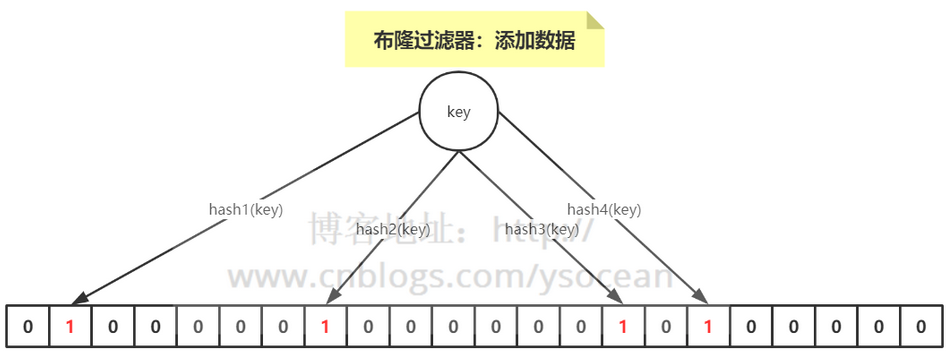
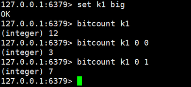

# Redis布隆过滤器

## 1、布隆过滤器使用场景

比如有如下几个需求：

　　①、原本有10亿个号码，现在又来了10万个号码，要快速准确判断这10万个号码是否在10亿个号码库中？

　　解决办法一：将10亿个号码存入数据库中，进行数据库查询，准确性有了，但是速度会比较慢。

　　解决办法二：将10亿号码放入内存中，比如Redis缓存中，这里我们算一下占用内存大小：10亿*8字节=8GB，通过内存查询，准确性和速度都有了，但是大约8gb的内存空间，挺浪费内存空间的。

　　②、接触过爬虫的，应该有这么一个需求，需要爬虫的网站千千万万，对于一个新的网站url，我们如何判断这个url我们是否已经爬过了？

　　解决办法还是上面的两种，很显然，都不太好。

　　③、同理还有垃圾邮箱的过滤。

　　那么对于类似这种，大数据量集合，如何准确快速的判断某个数据是否在大数据量集合中，并且不占用内存，**布隆过滤器**应运而生了。

## 2、布隆过滤器简介

带着上面的几个疑问，我们来看看到底什么是布隆过滤器。

　　布隆过滤器：一种数据结构，是由一串很长的二进制向量组成，可以将其看成一个二进制数组。既然是二进制，那么里面存放的不是0，就是1，但是初始默认值都是0。

　　如下所示：

 

### **①、添加数据**

　　介绍概念的时候，我们说可以将布隆过滤器看成一个容器，那么如何向布隆过滤器中添加一个数据呢？

　　如下图所示：当要向布隆过滤器中添加一个元素key时，我们通过多个hash函数，算出一个值，然后将这个值所在的方格置为1。

　　比如，下图hash1(key)=1，那么在第2个格子将0变为1（数组是从0开始计数的），hash2(key)=7，那么将第8个格子置位1，依次类推。

 

### **②、判断数据是否存在？**

　　知道了如何向布隆过滤器中添加一个数据，那么新来一个数据，我们如何判断其是否存在于这个布隆过滤器中呢？

　　很简单，我们只需要将这个新的数据通过上面自定义的几个哈希函数，分别算出各个值，然后看其对应的地方是否都是1，如果存在一个不是1的情况，那么我们可以说，该新数据一定不存在于这个布隆过滤器中。

　　反过来说，如果通过哈希函数算出来的值，对应的地方都是1，那么我们能够肯定的得出：这个数据一定存在于这个布隆过滤器中吗？

　　答案是否定的，因为多个不同的数据通过hash函数算出来的结果是会有重复的，所以会存在某个位置是别的数据通过hash函数置为的1。

　　我们可以得到一个结论：**布隆过滤器可以判断某个数据一定不存在，但是无法判断一定存在**。

### **③、布隆过滤器优缺点**

　　优点：优点很明显，二进制组成的数组，占用内存极少，并且插入和查询速度都足够快。

　　缺点：随着数据的增加，误判率会增加；还有无法判断数据一定存在；另外还有一个重要缺点，无法删除数据。

## 3、Redis实现布隆过滤器

### ①、bitmaps

　　我们知道计算机是以二进制位作为底层存储的基础单位，一个字节等于8位。

　　比如“big”字符串是由三个字符组成的，这三个字符对应的ASCII码分为是98、105、103，对应的二进制存储如下：

 

　　在Redis中，Bitmaps 提供了一套命令用来操作类似上面字符串中的每一个位。

**一、设置值**

```
setbit key offset value
```

 

 　我们知道"b"的二进制表示为0110 0010，我们将第7位（从0开始）设置为1，那0110 0011 表示的就是字符“c”，所以最后的字符 “big”变成了“cig”。

**二、获取值**

```
getbit key offset
```

 

**三、获取位图指定范围值为1的个数**

```
bitcount key [start end]
```

如果不指定，那就是获取全部值为1的个数。

注意：start和end指定的是**字节的个数**，而不是位数组下标。

 

### ②、Redisson

　　Redis 实现布隆过滤器的底层就是通过 bitmap 这种数据结构，至于如何实现，这里就不重复造轮子了，介绍业界比较好用的一个客户端工具——Redisson。

　　Redisson 是用于在 Java 程序中操作 Redis 的库，利用Redisson 我们可以在程序中轻松地使用 Redis。

　　下面我们就通过 Redisson 来构造布隆过滤器。

```
package com.ys.rediscluster.bloomfilter.redisson;

import org.redisson.Redisson;
import org.redisson.api.RBloomFilter;
import org.redisson.api.RedissonClient;
import org.redisson.config.Config;

public class RedissonBloomFilter {

    public static void main(String[] args) {
        Config config = new Config();
        config.useSingleServer().setAddress("redis://192.168.14.104:6379");
        config.useSingleServer().setPassword("123");
        //构造Redisson
        RedissonClient redisson = Redisson.create(config);

        RBloomFilter<String> bloomFilter = redisson.getBloomFilter("phoneList");
        //初始化布隆过滤器：预计元素为100000000L,误差率为3%
        bloomFilter.tryInit(100000000L,0.03);
        //将号码10086插入到布隆过滤器中
        bloomFilter.add("10086");

        //判断下面号码是否在布隆过滤器中
        System.out.println(bloomFilter.contains("123456"));//false
        System.out.println(bloomFilter.contains("10086"));//true
    }
}
```

　　这是单节点的Redis实现方式，如果数据量比较大，期望的误差率又很低，那单节点所提供的内存是无法满足的，这时候可以使用分布式布隆过滤器，同样也可以用 Redisson 来实现，这里我就不做代码演示了，大家有兴趣可以试试。

## 4、guava 工具

​		最后提一下不用Redis如何来实现布隆过滤器。

　　guava 工具包相信大家都用过，这是谷歌公司提供的，里面也提供了布隆过滤器的实现。

```
package com.ys.rediscluster.bloomfilter;

import com.google.common.base.Charsets;
import com.google.common.hash.BloomFilter;
import com.google.common.hash.Funnel;
import com.google.common.hash.Funnels;

public class GuavaBloomFilter {
    public static void main(String[] args) {
        BloomFilter<String> bloomFilter = BloomFilter.create(Funnels.stringFunnel(Charsets.UTF_8),100000,0.01);

        bloomFilter.put("10086");

        System.out.println(bloomFilter.mightContain("123456"));
        System.out.println(bloomFilter.mightContain("10086"));
    }
}
```

