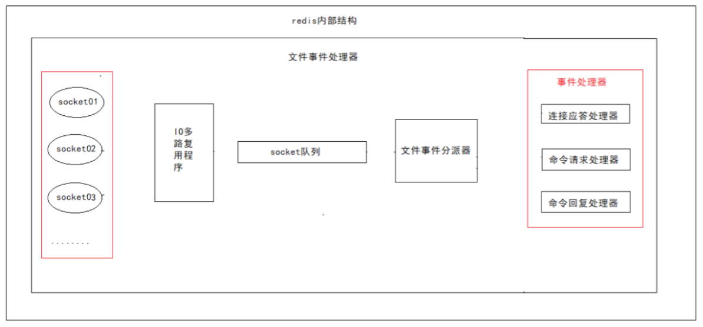
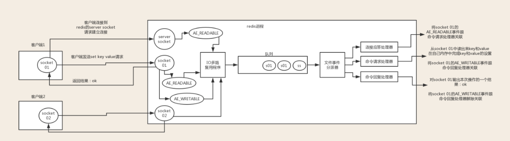

# Redis的网络线程模型     

> redis 内部使用文件事件处理器 file event handler，这个文件事件处理器是单线程的，所以 redis 才叫做单线程的模型。
>  它采用 IO 多路复用机制同时监听多个 socket，根据 socket 上的事件来选择对应的事件处理器进行处理。

**Redis基于Reactor模式开发了自己的网络事件处理器。被称为文件事件处理器**，由于这个处理器是单线程的所以决定了redis是单线程的。

文件事件处理器的结构**包含 4 个部分**：

- **多个 socket**

- **IO 多路复用程序**

- **文件事件分派器**

- **事件处理器（包括：连接应答处理器、命令请求处理器、命令回复处理器）**

   	**多个 socket 可能会并发产生不同的操作，每个操作对应不同的文件事件，但是 IO 多路复用程序会监听多个 socket，会将 socket 产生的事件放入队列中排队，事件分派器每次从队列中取出一个事件，把该事件交给对应的事件处理器进行处理。**

  

## Redis线程模型的流程及原理

如下图客户端和redis的一次通信：

 

 　　　1、**客户端socket01请求redis的server scoket建立连接，此时server socket生成AE_READABLE事件，IO多路复用程序监听到server socket产生的事件，并将该事件压入队列。**

　　**文件事件分派器从队列中拉取事件交给连接应答处理器，处理器同时生成一个与客户端通信的socket01,并将该scoket01的AE_READABLE事件与命令请求处理器关联**

　　　　2、**此时客户端scoket01发送一个set key value的请求，redis的scoket01接收到AE_READABLE事件，**IO多路复用程序监听到事件，将事件压入队列，文件分派器取到事件，**由于scoket01已经和命令请求处理器关联，所以命令请求处理器开始set key value**,完毕后会将redis的scoket01的AE_WAITABLE事件关联到命令回复处理器

　　　　3、如**果此时客户端准备好接收返回结果了，向redis中的socket01发起询问请求，那么 redis 中的 socket01 会产生一个 `AE_WRITABLE` 事件**，同样压入队列中，事件分派器找到相关联的命令回复处理器，由**命令回复处理器对 socket01 输入本次操作的一个结果，比如 `ok`，之后解除 socket01 的 `AE_WRITABLE` 事件与命令回复处理器的关联。**

　　　　**这样便完成了redis的一次通信。**

　　通过上述线程模型讲述，进一步了解redis中的事务，之前说事务和命令都是一组最小的执行单元，事务应该是该客户端将一组命令发送给redis,redis将一组命令压入队列，命令请求处理器一起处理，不会中断。

　　在redis实现分布式锁时说过，会发生并发问题，当客户端A执行1,2操作，客户端B执行3,4操作，并发执行时，在redis中的队列状况可能是 1,3,4,2 / 3,4,1,2 等多种情况，所以会引起并发问题。