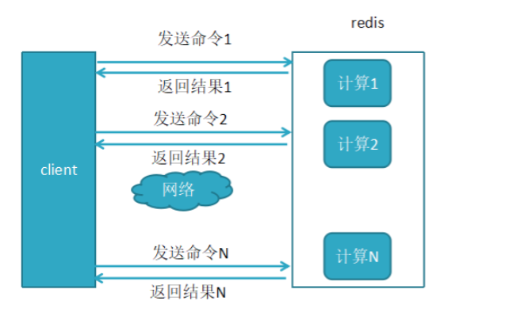
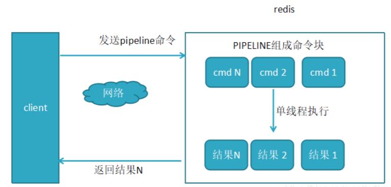
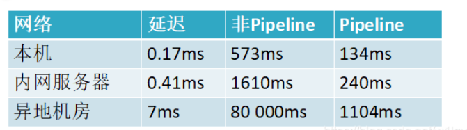

原文：[Pipeline详解以及事务](https://www.cnblogs.com/shoshana-kong/p/14087358.html)

[分布式缓存Redis之Pipeline（管道）](https://www.cnblogs.com/shoshana-kong/p/14087380.html)

## 写在前面

  **Redis 的 pipeline(管道)功能在命令行中没有，但 redis 是支持 pipeline 的，而且在各个语言版的 client 中都有相应的实现。 由于网络开销延迟，就算 redis server 端有很强的处理能力，也会由于收到的 client 消息少，而造成吞吐量小。**

**当 client 使用 pipelining 发送命令时，redis server 必须将部分请求放到队列中（使用内存），执行完毕后一次性发送结果；如果发送的命令很多的话，建议对返回的结果加标签，当然这也会增加使用的内存；**

  **Pipeline 在某些场景下非常有用，比如有多个 command 需要被“及时的”提交，而且他们对相应结果没有互相依赖，对结果响应也无需立即获得，那么 pipeline 就可以充当这种“批处理”的工具；而且在一定程度上，可以较大的提升性能，性能提升的原因主要是 TCP 连接中减少了“交互往返”的时间。**

  **不过在编码时请注意，pipeline 期间将“独占”链接，此期间将不能进行非“管道”类型的其他操作，直到 pipeline 关闭；如果你的 pipeline 的指令集很庞大，为了不干扰链接中的其他操作，你可以为 pipeline 操作新建 Client 链接，让 pipeline 和其他正常操作分离在2个 client 中。不过 pipeline 事实上所能容忍的操作个数，和 socket-output 缓冲区大小/返回结果的数据尺寸都有很大的关系；同时也意味着每个 redis-server 同时所能支撑的 pipeline 链接的个数，也是有限的，这将受限于 server 的物理内存或网络接口的缓冲能力。**

## 一、pipeline出现的背景：

redis客户端执行一条命令分4个过程：

```undefined
  发送命令－〉命令排队－〉命令执行－〉返回结果
```

这个过程称为**Round trip time(简称RTT, 往返时间)**，mget mset有效节约了RTT，但大部分命令（如hgetall，并没有mhgetall）不支持批量操作，需要消耗N次RTT ，这个时候需要pipeline来解决这个问题

## 二、pipeline的性能

### 1、未使用pipeline执行N条命令

 

### 2、使用了pipeline执行N条命令

 

### 3、两者性能对比

 

小结：这是一组统计数据出来的数据，**使用Pipeline执行速度比逐条执行要快，特别是客户端与服务端的网络延迟越大，性能体能越明显。**