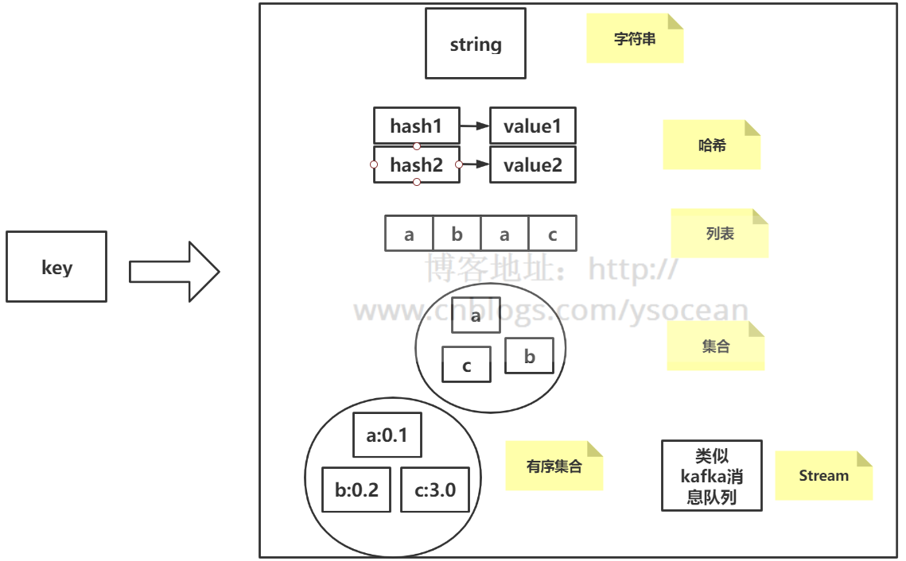
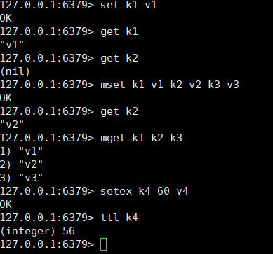
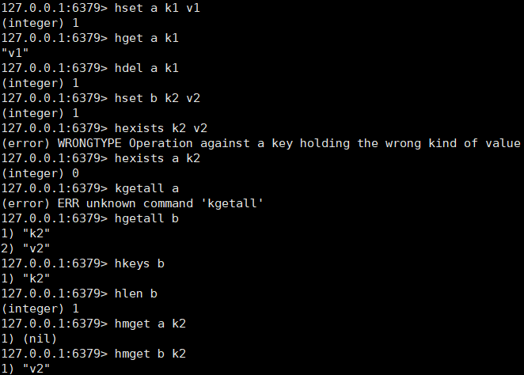
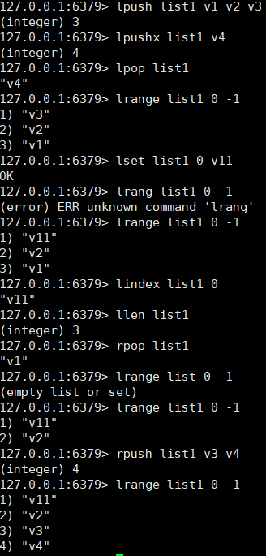
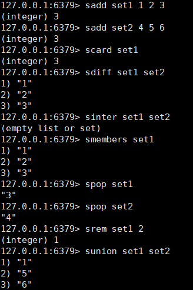
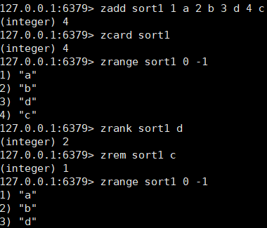

# 0、写在前面

我们说 Redis 相对于 Memcache 等其他的缓存产品，有一个比较明显的优势就是 Redis  不仅仅支持简单的key-value类型的数据，同时还提供list，set，zset，hash等数据结构的存储。本篇博客我们就将介绍这些数据类型的详细使用以及顺带介绍Redis系统的相关命令用法。

**注意：Redis的命令不区分大小写，但是key 严格区分大小写！！！**

下面介绍的Redis命令有很多，如果你想通过死记硬背来记住这些命令几乎不可能，但是如果理解了Redis的一些机制，这些命令其实是由很强的通用性的，通过理解来记忆是最好的。 另外，每种数据类型都有其适合的使用场景，我也会在文中给与说明，如果滥用，反而会适得其反。

   

# 1、string 数据类型

　　string 是Redis的最基本的数据类型，可以理解为与 Memcached 一模一样的类型，一个key 对应一个  value。string 类型是二进制安全的，意思是 Redis 的 string 可以包含任何数据，比如图片或者序列化的对象，一个 redis 中字符串 value 最多可以是 512M。

## **相关命令介绍**

　　string 数据类型在 Redis 中的相关命令：

　　**表格图片引用：http://www.cnblogs.com/xrq730/p/8944539.html（下同）**

下面用表格来看一下String操作的相关命令：

| **命令** | **描述**                                                     | **用法**                                              |
| -------- | ------------------------------------------------------------ | ----------------------------------------------------- |
| SET      | （1）将字符串值Value关联到Key （2）Key已关联则覆盖，无视类型 （3）原本Key带有生存时间TTL，那么TTL被清除 | SET key value [EX seconds] [PX milliseconds] [NX\|XX] |
| GET      | （1）返回key关联的字符串值 （2）Key不存在返回nil （3）Key存储的不是字符串，返回错误，因为GET只用于处理字符串 | GET key                                               |
| MSET     | （1）同时设置一个或多个Key-Value键值对 （2）某个给定Key已经存在，那么MSET新值会覆盖旧值 （3）如果上面的覆盖不是希望的，那么使用MSETNX命令，所有Key都不存在才会进行覆盖 （4）**MSET是一个原子性操作**，所有Key都会在同一时间被设置，不会存在有些更新有些没更新的情况 | MSET key value [key value ...]                        |
| MGET     | （1）返回一个或多个给定Key对应的Value （2）某个Key不存在那么这个Key返回nil | MGET key [key ...]                                    |
| SETEX    | （1）将Value关联到Key （2）设置Key生存时间为seconds，单位为秒 （3）如果Key对应的Value已经存在，则覆盖旧值 （4）SET也可以设置失效时间，但是不同在于SETNX是一个原子操作，即关联值与设置生存时间同一时间完成 | SETEX key seconds value                               |
| SETNX    | （1）将Key的值设置为Value，当且仅当Key不存在 （2）若给定的Key已经存在，SEXNX不做任何动作 | SETNX key value                                       |

 

​		①、上面的 ttl 命令是返回 key 的剩余过期时间，单位为秒。

　　②、mset和mget这种批量处理命令，能够极大的提高操作效率。因为一次命令执行所需要的时间=1次网络传输时间+1次命令执行时间，n个命令耗时=n次网络传输时间+n次命令执行时间，而批量处理命令会将n次网络时间缩减为1次网络时间，也就是1次网络传输时间+n次命令处理时间。

　　但是需要注意的是，Redis是单线程的，如果一次批量处理命令过多，会造成Redis阻塞或网络拥塞（传输数据量大）。

　　③、setnx可以用于实现分布式锁，具体实现方式后面会介绍。

## **特殊的String操作：INCR/DECR**

前面介绍的是基本的Key-Value操作，下面介绍一种特殊的Key-Value操作即INCR/DECR，可以利用Redis自动帮助我们对一个Key对应的Value进行加减，这在实际工作中还是特别有用的（分布式环境中统计系统的在线人数，利用Redis的高性能读写，在Redis中完成秒杀，而不是直接操作数据库。）。用表格看一下相关命令：

| **命令** | **描述**                                                     | **用法**             |
| -------- | ------------------------------------------------------------ | -------------------- |
| INCR     | （1）Key中存储的数字值+1，返回增加之后的值 （2）Key不存在，那么Key的值被初始化为0再执行INCR （3）如果值包含错误类型或者字符串不能被表示为数字，那么返回错误 （4）值限制在64位有符号数字表示之内，即-9223372036854775808~9223372036854775807 | INCR key             |
| DECR     | （1）Key中存储的数字值-1 （2）其余同INCR                     | DECR key             |
| INCRBY   | （1）将key所存储的值加上增量返回增加之后的值 （2）其余同INCR | INCRBY key increment |
| DECRBY   | （1）将key所存储的值减去减量decrement （2）其余同INCR        | DECRBY key decrement |

**典型使用场景**

　　一、计数

　　由于Redis单线程的特点，我们不用考虑并发造成计数不准的问题，通过 incrby 命令，我们可以正确的得到我们想要的结果。

　　二、限制次数

　　比如登录次数校验，错误超过三次5分钟内就不让登录了，每次登录设置key自增一次，并设置该key的过期时间为5分钟后，每次登录检查一下该key的值来进行限制登录。

# **2、hash 数据类型**

　　hash 是一个键值对集合，是一个 string 类型的 key和 value 的映射表，key  还是key，但是value是一个键值对（key-value）。类比于 Java里面的  Map<String,Map<String,Object>> 集合。

**①、相关命令介绍**

| **命令** | **描述**                                                     | **用法**                                |
| -------- | ------------------------------------------------------------ | --------------------------------------- |
| HSET     | （1）将哈希表Key中的域field的值设为value （2）key不存在，一个新的Hash表被创建 （3）field已经存在，旧的值被覆盖 | HSET key field value                    |
| HGET     | （1）返回哈希表key中给定域field的值                          | HGET key field                          |
| HDEL     | （1）删除哈希表key中的一个或多个指定域 （2）不存在的域将被忽略 | HDEL key filed [field ...]              |
| HEXISTS  | （1）查看哈希表key中，给定域field是否存在，存在返回1，不存在返回0 | HEXISTS key field                       |
| HGETALL  | （1）返回哈希表key中，所有的域和值                           | HGETALL key                             |
| HINCRBY  | （1）为哈希表key中的域field加上增量increment （2）其余同INCR命令 | HINCRYBY key filed increment            |
| HKEYS    | （1）返回哈希表key中的所有域                                 | HKEYS key                               |
| HLEN     | （1）返回哈希表key中域的数量                                 | HLEN key                                |
| HMGET    | （1）返回哈希表key中，一个或多个给定域的值 （2）如果给定的域不存在于哈希表，那么返回一个nil值 | HMGET key field [field ...]             |
| HMSET    | （1）同时将多个field-value对设置到哈希表key中 （2）会覆盖哈希表中已存在的域 （3）key不存在，那么一个空哈希表会被创建并执行HMSET操作 | HMSET key field value [field value ...] |
| HVALS    | （1）返回哈希表key中所有的域和值                             | HVALS key                               |

 

**②、典型使用场景**

　　查询的时间复杂度是O(1)，用于缓存一些信息。

# **3、list 数据类型**

list 列表，它是简单的字符串列表，按照插入顺序排序，你可以添加一个元素到列表的头部（左边）或者尾部（右边），它的底层实际上是个链表。

　　列表有两个特点：

　　**一、有序**

　　**二、可以重复**

　　这两个特点要注意和后面介绍的集合和有序集合相对比。

| **命令**  | **描述**                                                     | **用法**                              |
| --------- | ------------------------------------------------------------ | ------------------------------------- |
| LPUSH     | （1）将一个或多个值value插入到列表key的表头 （2）如果有多个value值，那么各个value值按从左到右的顺序依次插入表头 （3）key不存在，一个空列表会被创建并执行LPUSH操作 （4）key存在但不是列表类型，返回错误 | LPUSH key value [value ...]           |
| LPUSHX    | （1）将值value插入到列表key的表头，当且晋档key存在且为一个列表 （2）key不存在时，LPUSHX命令什么都不做 | LPUSHX key value                      |
| LPOP      | （1）移除并返回列表key的头元素                               | LPOP key                              |
| LRANGE    | （1）返回列表key中指定区间内的元素，区间以偏移量start和stop指定 （2）start和stop都以0位底 （3）可使用负数下标，-1表示列表最后一个元素，-2表示列表倒数第二个元素，以此类推 （4）start大于列表最大下标，返回空列表 （5）stop大于列表最大下标，stop=列表最大下标 | LRANGE key start stop                 |
| LREM      | （1）根据count的值，移除列表中与value相等的元素 （2）count>0表示从头到尾搜索，移除与value相等的元素，数量为count （3）count<0表示从从尾到头搜索，移除与value相等的元素，数量为count （4）count=0表示移除表中所有与value相等的元素 | LREM key count value                  |
| LSET      | （1）将列表key下标为index的元素值设为value （2）index参数超出范围，或对一个空列表进行LSET时，返回错误 | LSET key index value                  |
| LINDEX    | （1）返回列表key中，下标为index的元素                        | LINDEX key index                      |
| LINSERT   | （1）将值value插入列表key中，位于pivot前面或者后面 （2）pivot不存在于列表key时，不执行任何操作 （3）key不存在，不执行任何操作 | LINSERT key BEFORE\|AFTER pivot value |
| LLEN      | （1）返回列表key的长度 （2）key不存在，返回0                 | LLEN key                              |
| LTRIM     | （1）对一个列表进行修剪，让列表只返回指定区间内的元素，不存在指定区间内的都将被移除 | LTRIM key start stop                  |
| RPOP      | （1）移除并返回列表key的尾元素                               | RPOP key                              |
| RPOPLPUSH | 在一个原子时间内，执行两个动作： （1）将列表source中最后一个元素弹出并返回给客户端 （2）将source弹出的元素插入到列表desination，作为destination列表的头元素 | RPOPLPUSH source destination          |
| RPUSH     | （1）将一个或多个值value插入到列表key的表尾                  | RPUSH key value [value ...]           |
| RPUSHX    | （1）将value插入到列表key的表尾，当且仅当key存在并且是一个列表 （2）key不存在，RPUSHX什么都不做 | RPUSHX key value                      |

 

**②、典型使用场景**

 　	一、栈

　　通过命令 lpush+lpop

　　二、队列

　　命令 lpush+rpop

　　三、有限集合

　　命令 lpush+ltrim

　　四、消息队列

　　命令 lpush+brpop

# **4、set 数据类型**

Redis 的 set 是 string 类型的无序集合。

　　相对于列表，集合也有两个特点：

　　一、无序

　　二、不可重复

**①、相关命令介绍**

| **命令**    | **描述**                                                     | **用法**                              |
| ----------- | ------------------------------------------------------------ | ------------------------------------- |
| SADD        | （1）将一个或多个member元素加入到key中，已存在在集合的member将被忽略 （2）假如key不存在，则只创建一个只包含member元素做成员的集合 （3）当key不是集合类型时，将返回一个错误 | SADD key number [member ...]          |
| SCARD       | （1）返回key对应的集合中的元素数量                           | SCARD key                             |
| SDIFF       | （1）返回一个集合的全部成员，该集合是第一个Key对应的集合和后面key对应的集合的差集 | SDIFF key [key ...]                   |
| SDIFFSTORE  | （1）和SDIFF类似，但结果保存到destination集合而不是简单返回结果集 （2） destination如果已存在，则覆盖 | SDIFFSTORE destionation key [key ...] |
| SINTER      | （1）返回一个集合的全部成员，该集合是所有给定集合的交集 （2）不存在的key被视为空集 | SINTER key [key ...]                  |
| SINTERSTORE | （1）和SINTER类似，但结果保存早destination集合而不是简单返回结果集 （2）如果destination已存在，则覆盖 （3）destination可以是key本身 | SINTERSTORE destination key [key ...] |
| SISMEMBER   | （1）判断member元素是否key的成员，0表示不是，1表示是         | SISMEMBER key member                  |
| SMEMBERS    | （1）返回集合key中的所有成员 （2）不存在的key被视为空集      | SMEMBERS key                          |
| SMOVE       | （1）原子性地将member元素从source集合移动到destination集合 （2）source集合中不包含member元素，SMOVE命令不执行任何操作，仅返回0 （3）destination中已包含member元素，SMOVE命令只是简单做source集合的member元素移除 | SMOVE source desination member        |
| SPOP        | （1）移除并返回集合中的一个随机元素，如果count不指定那么随机返回一个随机元素 （2）count为正数且小于集合元素数量，那么返回一个count个元素的数组且数组中的**元素各不相同** （3）count为正数且大于等于集合元素数量，那么返回整个集合 （4）count为负数那么命令返回一个数组，数组中的**元素可能重复多次**，数量为count的绝对值 | SPOP key [count]                      |
| SRANDMEMBER | （1）如果count不指定，那么返回集合中的一个随机元素 （2）count同上 | SRANDMEMBER key [count]               |
| SREM        | （1）移除集合key中的一个或多个member元素，不存在的member将被忽略 | SREM key member [member ...]          |
| SUNION      | （1）返回一个集合的全部成员，该集合是所有给定集合的并集 （2）不存在的key被视为空集 | SUNION key [key ...]                  |
| SUNIONSTORE | （1）类似SUNION，但结果保存到destination集合而不是简单返回结果集 （2）destination已存在，覆盖旧值 （3）destination可以是key本身 | SUNION destination key [key ...]      |

 

**②、典型使用场景**

　　利用集合的交并集特性，比如在社交领域，我们可以很方便的求出多个用户的共同好友，共同感兴趣的领域等。

# **5、zset 数据类型**

数据结构最后说一下SortedSet相关操作，最近有一个场景需要实现Redis分页+高效移除数据，一下子没找到好的数据结构，后来想起了SortedSet才解决了问题，看来积累与储备还是非常有用的，zset（sorted set 有序集合），和上面的set 数据类型一样，也是 string 类型元素的集合，但是它是有序的。

**①、相关命令介绍**

| **命令**         | **描述**                                                     | **用法**                                                  |
| ---------------- | ------------------------------------------------------------ | --------------------------------------------------------- |
| ZADD             | （1）将一个或多个member元素及其score值加入有序集key中 （2）如果member已经是有序集的成员，那么更新member对应的score并重新插入member保证member在正确的位置上 （3）score可以是整数值或双精度浮点数 | ZADD key score member [[score member] [score member] ...] |
| ZCARD            | （1）返回有序集key的元素个数                                 | ZCARD key                                                 |
| ZCOUNT           | （1） 返回有序集key中，score值>=min且<=max的成员的数量       | ZCOUNT key min max                                        |
| ZRANGE           | （1）返回有序集key中指定区间内的成员，成员位置按score从小到大排序 （2）具有相同score值的成员按字典序排列 （3）需要成员按score从大到小排列，使用ZREVRANGE命令 （4）下标参数start和stop都以0为底，也可以用负数，-1表示最后一个成员，-2表示倒数第二个成员 （5）可通过WITHSCORES选项让成员和它的score值一并返回 | ZRANGE key start stop [WITHSCORES]                        |
| ZRANK            | （1）返回有序集key中成员member的排名，有序集成员按score值从小到大排列 （2）排名以0为底，即score最小的成员排名为0 （3）ZREVRANK命令可将成员按score值从大到小排名 | ZRANK key number                                          |
| ZREM             | （1）移除有序集key中的一个或多个成员，不存在的成员将被忽略 （2）当key存在但不是有序集时，返回错误 | ZREM key member [member ...]                              |
| ZREMRANGEBYRANK  | （1）移除有序集key中指定排名区间内的所有成员                 | ZREMRANGEBYRANK key start stop                            |
| ZREMRANGEBYSCORE | （1）移除有序集key中，所有score值>=min且<=max之间的成员      | ZREMRANGEBYSCORE key min max                              |

 

**②、典型使用场景**

　　和set数据结构一样，zset也可以用于社交领域的相关业务，并且还可以利用zset 的有序特性，还可以做类似排行榜的业务。

# 6、Redis5.0新数据结构-stream

Redis的作者在Redis5.0中，放出一个新的数据结构，Stream。Redis Stream  的内部，其实也是一个队列，每一个不同的key，对应的是不同的队列，每个队列的元素，也就是消息，都有一个msgid，并且需要保证msgid是严格递增的。在Stream当中，消息是默认持久化的，即便是Redis重启，也能够读取到消息。那么，stream是如何做到多播的呢？其实非常的简单，与其他队列系统相似，Redis对不同的消费者，也有消费者Group这样的概念，不同的消费组，可以消费同一个消息，对于不同的消费组，都维护一个Idx下标，表示这一个消费群组消费到了哪里，每次进行消费，都会更新一下这个下标，往后面一位进行偏移。

# **7、Redis的Key相关操作**

写完了Redis的数据结构，接着我们看下Redis的Key相关操作：

| **命令**  | **描述**                                                     | **用法**                                                     |
| --------- | ------------------------------------------------------------ | ------------------------------------------------------------ |
| DEL       | （1）删除给定的一个或多个key （2）不存在的Key将被忽略        | DEL key [key ...]                                            |
| EXISTS    | （1）检查给定key是否存在                                     | EXISTS key                                                   |
| EXPIRE    | （1）为给定key设置生存时间，key过期时它会被自动删除 （2）对一个已经指定生存时间的Key设置执行EXPIRE，新的值会代替旧的值 | EXPIRE key seconds                                           |
| EXPIREAT  | （1）同EXPIRE，但此命令指定的是UNIX时间戳，单位为秒          | EXPIRE key timestamp                                         |
| KEYS      | （1）查找所有符合给定模式pattern的key，下面举一下例子 （2）KEYS *匹配所有key （3）KEYS h?llo匹配hello、hallo、hxllo等 （4）KEYS h*llo匹配hllo、heeeeello等 （5）KEYS h[ae]llo匹配hello和hallo （6）特殊符号想当做查找内容经的使用\ | KEYS pattern                                                 |
| MIGRATE   | （1）原子性地将key从当前实例传送到目标实例指定的数据库上 （2）原数据库Key删除，新数据库Key增加 （3）阻塞进行迁移的两个实例，直到迁移成功、迁移失败、等待超时三个之一发生 | MIGRATE host port key destination-db timeout [COPY] [REPLACE] |
| MOVE      | （1）将当前数据库的key移动到给定数据库的db中 （2）执行成功的条件为当前数据库有key，给定数据库没有key | MOVE key db                                                  |
| PERSIST   | （1）移除给定key的生存时间，将key变为持久的                  | PERSIST key                                                  |
| RANDOMKEY | （1）从当前数据库随机返回且不删除一个key，                   | RANDOMKEY                                                    |
| RENAME    | （1）将key改名为newkey （2）当key和newkey相同或key不存在，报错 （3）newkey已存在，RENAME将覆盖旧值 | RENAME key newkey                                            |
| TTL       | （1）以秒为单位，返回给定的key剩余生存时间                   | TTL key                                                      |
| PTTL      | （1）以毫秒为单位，返回给定的key剩余生存时间                 | PTTL key                                                     |
| TYPE      | （1）返回key锁存储的值的类型                                 | TYPE key                                                     |

# 8、系统相关命令

| **命令**         | **描述**                                                     | **用法**                   |
| ---------------- | ------------------------------------------------------------ | -------------------------- |
| BGREWRITEAOF     | （1）手动触发AOF重写操作，用于减小AOF文件体积                | BGREWRITEAOF               |
| BGSAVE           | （1）后台异步保存当前数据库的数据到磁盘                      | BGSAVE                     |
| CLIENT KILL      | （1）关闭地址为ip:port的客户端 （2）由于Redis为单线程设计，因此当当前命令执行完之后才会关闭客户端 | CLIENT KILL ip:port        |
| CLIENT LIST      | （1）以可读的格式，返回所有连接到服务器的客户端信息和统计数据 | CLIENT LIST                |
| CONFIG GET       | （1）取得运行中的Redis服务器配置参数 （2）支持*              | CONFIG GET parameter       |
| CONFIG RESETSTAT | （1）重置INFO命令中的某些统计数据，例如Keyspace hits、Keyspace misses等 | CONFIG RESETSTAT           |
| CONFIG REWRITE   | （1）对**启动Redis时指定的redis.conf文件进行改写**           | CONFIG REWRITE             |
| CONFIG SET       | （1）动态调整Redis服务器的配置而无需重启 （2）修改后的配置**立即生效** | CONFIG SET parameter value |
| SELECT           | （1）切换到指定数据库，数据库索引index用数字指定，以0作为起始索引值 （2）默认使用0号数据库 | SELECT index               |
| DBSIZE           | （1）返回当前数据库的Key的数量                               | DBSIZE                     |
| DEBUG OBJECT     | （1）这是一个调试命令，不应当被客户端使用 （2）key存在时返回有关信息，key不存在时返回错误 | DEBUG OBJECT key           |
| FLUSHALL         | （1）清空整个Redis服务器的数据                               | FLUSHALL                   |
| FLUSHDB          | （1）清空当前数据库中的所有数据                              | FLUSHDB                    |
| INFO             | （1）以一种易于解释且易于阅读的格式，返回Redis服务器的各种信息和统计数值 （2）通过给定可选参数section，可以让命令只返回某一部分信息 | INFO [section]             |
| LASTSAVE         | （1）返回最近一次Redis成功将数据保存到磁盘上的时间，以UNIX时间戳格式表示 | LASTSAVE                   |
| MONITOR          | （1）实时打印出Redis服务器接收到的命令，调试用               | MONITOR                    |
| SHUTDOWN         | （1）停止所有客户端 （2）如果至少有一个保存点在等待，执行SAVE命令 （3）如果AOF选项被打开，更新AOF文件 （4）关闭Redis服务器 | SHUTDOWN [SAVE\|NOSAVE]    |

# **9、Redis的事务命令**

最后，本文简单说一下Redis的事务机制，首先Redis的事务是由DISCARD、EXEC、MULTI、UNWATCH、WATCH五个命令来保证的：

| 命令    | 描述                                                         | 用法                |
| ------- | ------------------------------------------------------------ | ------------------- |
| DISCARD | （1）取消事务 （2）如果正在使用WATCH命令监视某个/某些key，那么取消所有监视，等同于执行UNWATCH | DISCARD             |
| EXEC    | （1）执行所有事务块内的命令 （2）如果某个/某些key正处于WATCH命令监视之下且事务块中有和这个/这些key相关的命令，那么**EXEC命令只在这个/这些key没有被其他命令改动的情况下才会执行并生效**，否则该事务被打断 | EXEC                |
| MULTI   | （1）标记一个事务块的开始 （2）事务块内的多条命令会按照先后顺序被放入一个队列中，最后**由EXEC命令原子性地执行** | MULTI               |
| UNWATCH | （1）取消WATCH命令对所有key的监视 （2）如果WATCH之后，EXEC/DISCARD命令先被执行了，UNWATCH命令就没必要执行了 | UNWATCH             |
| WATCH   | （1）监视一个/多个key，如果在事务执行之前这个/这些key被其他命令改动，那么事务将被打断 | WATCH key [key ...] |

首先我们看一下事务没有被打断的情况：

 

看到开启事务之后，所有的命令返回的都是QUEUED，即放入队列，而不是直接执行。

接着模拟一下事务被打断的情况，WATCH一下Number这个Key，我另外起了一个Redis客户端INCR了一下Number，结果为：

 

看到，并没有命令被执行，返回**nil**即事务被打断。

接着简单说一下事务，和数据库类似的，事务保证的是两点：

- **隔离**，所有命令序列化、按顺序执行，事务执行过程中不会被其他客户端发来的命令打断
- **原子性**，事务中的命令要么全部执行，要么全部不执行

另外，Redis的事务并不支持回滚，这个其实网上已经说法挺多了，大致上是两个原因：

- Redis命令只会因为语法而失败（且这些问题不能再入队时被发现），或是命令用在了错误类型的键上面，也就是说，从实用性角度来说，失败的命令是由于编程错误造成的，而这些错误应该在开发的过程中被发现而不应该出现在生产环境中
- Redis内部可以保持简单且快速，因为不需要对回滚进行支持

总而言之，对Redis来说，回滚无法解决编程错误带来的问题，因此还不如更简单、更快速地无回滚处理事务。