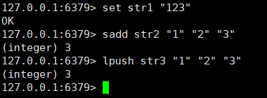
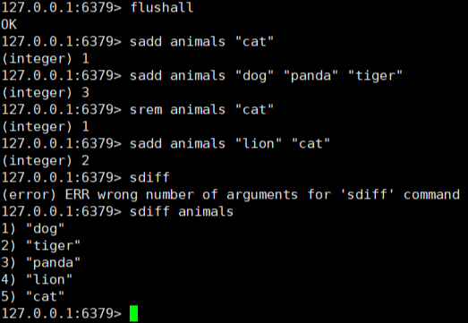

[TOC]

# 前言

前面我们说过，Redis 相对于 Memcache 等其他的缓存产品，有一个比较明显的优势就是 Redis  不仅仅支持简单的key-value类型的数据，同时还提供list，set，zset，hash等数据结构的存储。这几种丰富的数据类型我们花了两篇文章进行了详细的介绍，接下来我们要介绍 Redis 的另外一大优势——持久化。

　　由于 Redis  是一个内存数据库，所谓内存数据库，就是将数据库中的内容保存在内存中，这与传统的MySQL，Oracle等关系型数据库直接将内容保存到硬盘中相比，内存数据库的读写效率比传统数据库要快的多（内存的读写效率远远大于硬盘的读写效率）。但是保存在内存中也随之带来了一个缺点，一旦断电或者宕机，那么内存数据库中的数据将会全部丢失。

　　为了解决这个缺点，Redis提供了将内存数据持久化到硬盘，以及用持久化文件来恢复数据库数据的功能。Redis 支持两种形式的持久化，一种是RDB快照（snapshotting），另外一种是AOF（append-only-file）。

# RDB持久化

## 1、RDB 简介

​		RDB是Redis用来进行持久化的一种方式，是把当前内存中的数据集快照写入磁盘，也就是 Snapshot 快照（数据库中所有键值对数据）。恢复时是将快照文件直接读到内存里。

## 2、触发方式

 　　RDB 有两种触发方式，分别是自动触发和手动触发。

### 自动触发

　　在 redis.conf 配置文件中的 SNAPSHOTTING 下，做好自动触发的配置。

​		**①、save：**这里是用来配置触发 Redis的 RDB 持久化条件，也就是什么时候将内存中的数据保存到硬盘。比如“save m n”。表示m秒内数据集存在n次修改时，自动触发bgsave（这个命令下面会介绍，手动触发RDB持久化的命令）

　　默认如下配置：

```
save 900 1：表示900 秒内如果至少有 1 个 key 的值变化，则保存
save 300 10：表示300 秒内如果至少有 10 个 key 的值变化，则保存
save 60 10000：表示60 秒内如果至少有 10000 个 key 的值变化，则保存
```

　　　　当然如果你只是用Redis的缓存功能，不需要持久化，那么你可以注释掉所有的 save 行来停用保存功能。可以直接一个空字符串来实现停用：save ""

　　**②、stop-writes-on-bgsave-error ：**默认值为yes。当**==启用了RDB且最后一次后台保存数据失败，Redis是否停止接收数据==**。这会让用户意识到数据没有正确持久化到磁盘上，否则没有人会注意到灾难（disaster）发生了。如果Redis重启了，那么又可以重新开始接收数据了

　　**③、rdbcompression：**默认值是yes。对于==**存储到磁盘中的快照，可以设置是否进行压缩存储**==。如果是的话，redis会采用LZF算法进行压缩。如果你不想消耗CPU来进行压缩的话，可以设置为关闭此功能，但是存储在磁盘上的快照会比较大。

　　**④、rdbchecksum ：**默认值是yes。==**在存储快照后，我们还可以让redis使用CRC64算法来进行数据校验**==，但是这样做会增加大约10%的性能消耗，如果希望获取到最大的性能提升，可以关闭此功能。

　　**⑤、dbfilename ：**设置快照的文件名，默认是 dump.rdb

　　**⑥、dir：**设置快照文件的存放路径，这个配置项一定是个目录，而不能是文件名。默认是和当前配置文件保存在同一目录。

　　也就是说通过在配置文件中配置的 save 方式，当实际操作满足该配置形式时就会进行 RDB 持久化，将当前的内存快照保存在 dir 配置的目录中，文件名由配置的 dbfilename 决定。

### 手动触发

　　手动触发Redis进行RDB持久化的命令有两种：

- save

　　该命令会阻塞当前Redis服务器，执行save命令期间，Redis不能处理其他命令，直到RDB过程完成为止。

　　显然该命令对于内存比较大的实例会造成长时间阻塞，这是致命的缺陷，为了解决此问题，Redis提供了第二种方式。

- bgsave

　　执行该命令时，Redis会在后台异步进行快照操作，快照同时还可以响应客户端请求。具体操作是Redis进程执行fork操作创建子进程，RDB持久化过程由子进程负责，完成后自动结束。阻塞只发生在fork阶段，一般时间很短。

[Redis持久化之父子进程与写时复制]: http://t.zoukankan.com/Courage129-p-14343136.html

　　**基本上 Redis 内部所有的RDB操作都是采用 bgsave 命令。**

　　**ps:执行执行 flushall 命令，也会产生dump.rdb文件，但里面是空的.**

## 3、恢复数据

​		将备份文件 (dump.rdb) 移动到 redis 安装目录并启动服务即可，redis就会自动加载文件数据至内存了。Redis 服务器在载入 RDB 文件期间，会一直处于阻塞状态，直到载入工作完成为止。

　　获取 redis 的安装目录可以使用 config get dir 命令

## 4、停止 RDB 持久化

有些情况下，我们只想利用Redis的缓存功能，并不像使用 Redis 的持久化功能，那么这时候我们最好停掉 RDB  持久化。可以通过上面讲的在配置文件 redis.conf 中，可以注释掉所有的 save  行来停用保存功能或者直接一个空字符串来实现停用：save ""

　　也可以通过命令：

```
redis-cli config set save " "
```

## 5、RDB 的优势和劣势

### ①、优势

　　1.RDB是一个非常紧凑(compact)的文件，它保存了redis 在某个时间点上的数据集。这种文件非常适合用于进行备份和灾难恢复。

　　2.生成RDB文件的时候，redis主进程会fork()一个子进程来处理所有保存工作，主进程不需要进行任何磁盘IO操作。

　　3.RDB 在恢复大数据集时的速度比 AOF 的恢复速度要快。

### ②、劣势

　　1、RDB方式数据没办法做到实时持久化/秒级持久化。因为bgsave每次运行都要执行fork操作创建子进程，属于重量级操作，如果不采用压缩算法(内存中的数据被克隆了一份，大致2倍的膨胀性需要考虑，这里评论区指出，确实有不妥，主进程 fork 出子进程，其实是共享一份真实的内存空间，但是为了能在记录快照的时候，也能让主线程处理写操作，采用的是  Copy-On-Write（写时复制）技术，只有需要修改的内存才会复制一份出来，所以内存膨胀到底有多大，看修改的比例有多大)，频繁执行成本过高(影响性能)

　　2、RDB文件使用特定二进制格式保存，Redis版本演进过程中有多个格式的RDB版本，存在老版本Redis服务无法兼容新版RDB格式的问题(版本不兼容)

　　3、在一定间隔时间做一次备份，所以如果redis意外down掉的话，就会丢失最后一次快照后的所有修改(数据有丢失)

## 6、RDB 自动保存的原理

Redis有个服务器状态结构：

```
struct redisService{
     //1、记录保存save条件的数组
     struct saveparam *saveparams;
     //2、修改计数器
     long long dirty;
     //3、上一次执行保存的时间
     time_t lastsave;
}
```

### ①、首先看记录保存save条件的数组 saveparam，里面每个元素都是一个 saveparams 结构：

```
struct saveparam{
     //秒数
     time_t seconds;
     //修改数
     int changes;
};
```

```
前面我们在 redis.conf 配置文件中进行了关于save 的配置：
save 900 1：表示900 秒内如果至少有 1 个 key 的值变化，则保存
save 300 10：表示300 秒内如果至少有 10 个 key 的值变化，则保存
save 60 10000：表示60 秒内如果至少有 10000 个 key 的值变化，则保存
```

　　那么服务器状态中的saveparam 数组将会是如下的样子：

 

### ②、dirty 计数器和lastsave 属性

　　dirty 计数器记录距离上一次成功执行 save 命令或者 bgsave 命令之后，Redis服务器进行了多少次修改（包括写入、删除、更新等操作）。

　　lastsave 属性是一个时间戳，记录上一次成功执行 save 命令或者 bgsave 命令的时间。

　　通过这两个命令，当服务器成功执行一次修改操作，那么dirty 计数器就会加 1，而lastsave  属性记录上一次执行save或bgsave的时间，Redis 服务器还有一个周期性操作函数 severCron ,默认每隔 100  毫秒就会执行一次，该函数会遍历并检查 saveparams 数组中的所有保存条件，只要有一个条件被满足，那么就会执行 bgsave 命令。

　　执行完成之后，dirty 计数器更新为 0 ，lastsave 也更新为执行命令的完成时间。

# AOF持久化

## 1、AOF简介

　　Redis的持久化方式之一RDB是通过保存数据库中的键值对来记录数据库的状态。而另一种持久化方式 AOF 则是通过保存Redis服务器所执行的写命令来记录数据库状态。

 

　　RDB 持久化方式就是将 str1,str2,str3 这三个键值对保存到 RDB文件中，而 AOF 持久化则是将执行的 set,sadd,lpush 三个命令保存到 AOF 文件中。

## 2、AOF 配置

　　在 redis.conf 配置文件的 APPEND ONLY MODE 下：

​		①、**appendonly**：默认值为no，也就是说redis 默认使用的是rdb方式持久化，如果想要开启 AOF 持久化方式，需要将 appendonly 修改为 yes。

　　②、**appendfilename** ：aof文件名，默认是"appendonly.aof"

　　③、**appendfsync：**aof持久化策略的配置；

　　　　　　no表示不执行fsync，由操作系统保证数据同步到磁盘，速度最快，但是不太安全；

　　　　　　always表示每次写入都执行fsync，以保证数据同步到磁盘，效率很低；

　　　　　　everysec表示每秒执行一次fsync，可能会导致丢失这1s数据。通常选择 everysec ，兼顾安全性和效率。

　　**④、no-appendfsync-on-rewrite：**在aof重写或者写入rdb文件的时候，会执行大量IO，此时对于everysec和always的aof模式来说，执行fsync会造成阻塞过长时间，no-appendfsync-on-rewrite字段设置为默认设置为no。如果对延迟要求很高的应用，这个字段可以设置为yes，否则还是设置为no，这样对持久化特性来说这是更安全的选择。   ==设置为yes表示rewrite期间对新写操作不fsync,暂时存在内存中,等rewrite完成后再写入，默认为no，建议yes==。Linux的默认fsync策略是30秒。可能丢失30秒数据。默认值为no。

　　**⑤、auto-aof-rewrite-percentage：**默认值为100。aof自动重写配置，==当目前aof文件大小超过上一次重写的aof文件大小的百分之多少进行重写==，即当aof文件增长到一定大小的时候，Redis能够调用bgrewriteaof对日志文件进行重写。当前AOF文件大小是上次日志重写得到AOF文件大小的二倍（设置为100）时，自动启动新的日志重写过程。

　　**⑥、auto-aof-rewrite-min-size：**64mb。设置允许重写的最小aof文件大小，避免了达到约定百分比但尺寸仍然很小的情况还要重写。

　　**⑦、aof-load-truncated：**==aof文件可能在尾部是不完整的==，当redis启动的时候，aof文件的数据被载入内存。重启可能发生在redis所在的主机操作系统宕机后，尤其在ext4文件系统没有加上data=ordered选项，出现这种现象   redis宕机或者异常终止不会造成尾部不完整现象，可以选择让redis退出，或者导入尽可能多的数据。==如果选择的是yes，当截断的aof文件被导入的时候，会自动发布一个log给客户端然后load。如果是no，用户必须手动redis-check-aof修复AOF文件才可以。默认值为 yes。==

## 3、开启 AOF

将 redis.conf 的 appendonly 配置改为 yes 即可。

　　AOF 保存文件的位置和 RDB 保存文件的位置一样，都是通过 redis.conf 配置文件的 dir 配置：

　　可以通过 config get dir 命令获取保存的路径。

## 4、AOF 文件恢复

重启 Redis 之后就会进行 AOF 文件的载入。

　　异常修复命令：redis-check-aof --fix 进行修复

## 5、 AOF 重写

由于AOF持久化是Redis不断将写命令记录到 AOF 文件中，随着Redis不断的进行，AOF  的文件会越来越大，文件越大，占用服务器内存越大以及 AOF  恢复要求时间越长。为了解决这个问题，Redis新增了重写机制，当AOF文件的大小超过所设定的阈值时，Redis就会启动AOF文件的内容压缩，只保留可以恢复数据的最小指令集。可以使用命令 bgrewriteaof 来重新。

　　比如对于如下命令：

 

如果不进行 AOF 文件重写，那么 AOF 文件将保存四条 SADD 命令，如果使用AOF 重写，那么AOF 文件中将只会保留下面一条命令：

```
sadd animals "dog" "tiger" "panda" "lion" "cat"
```

**也就是说 AOF 文件重写并不是对原文件进行重新整理，而是直接读取服务器现有的键值对，然后用一条命令去代替之前记录这个键值对的多条命令，生成一个新的文件后去替换原来的 AOF 文件。**

 　AOF 文件重写触发机制：通过 redis.conf 配置文件中的  auto-aof-rewrite-percentage：默认值为100，以及auto-aof-rewrite-min-size：64mb  配置，也就是说默认Redis会记录上次重写时的AOF大小，**默认配置是当AOF文件大小是上次rewrite后大小的一倍且文件大于64M时触发。**

　　这里再提一下，我们知道 Redis 是单线程工作，如果 重写 AOF 需要比较长的时间，那么在重写  AOF 期间，Redis将长时间无法处理其他的命令，这显然是不能忍受的。Redis为了克服这个问题，解决办法是将 AOF  重写程序放到子程序中进行，这样有两个好处：

　　①、子进程进行 AOF 重写期间，服务器进程（父进程）可以继续处理其他命令。

　　②、子进程带有父进程的数据副本，使用子进程而不是线程，可以在避免使用锁的情况下，保证数据的安全性。

　　使用子进程解决了上面的问题，但是新问题也产生了：因为子进程在进行 AOF 重写期间，服务器进程依然在处理其它命令，这新的命令有可能也对数据库进行了修改操作，使得当前数据库状态和重写后的 AOF 文件状态不一致。

　　为了解决这个数据状态不一致的问题，Redis 服务器设置了一个 AOF  重写缓冲区，这个缓冲区是在创建子进程后开始使用，当Redis服务器执行一个写命令之后，就会将这个写命令也发送到 AOF 重写缓冲区。当子进程完成 AOF 重写之后，就会给父进程发送一个信号，父进程接收此信号后，就会调用函数将 AOF 重写缓冲区的内容都写到新的 AOF 文件中。

　　这样将 AOF 重写对服务器造成的影响降到了最低。

## 6、AOF的优缺点

​		优点：

　　①、AOF 持久化的方法提供了多种的同步频率，即使使用默认的同步频率每秒同步一次，Redis 最多也就丢失 1 秒的数据而已。

　　②、AOF 文件使用 Redis 命令追加的形式来构造，因此，即使 Redis 只能向 AOF 文件写入命令的片断，使用 redis-check-aof 工具也很容易修正 AOF 文件。

　　③、AOF 文件的格式可读性较强，这也为使用者提供了更灵活的处理方式。例如，如果我们不小心错用了 FLUSHALL 命令，在重写还没进行时，我们可以手工将最后的 FLUSHALL 命令去掉，然后再使用 AOF 来恢复数据。

　	缺点：

　　①、对于具有相同数据的的 Redis，AOF 文件通常会比 RDB文件体积更大。

　　②、虽然 AOF 提供了多种同步的频率，默认情况下，每秒同步一次的频率也具有较高的性能。但在 Redis 的负载较高时，RDB 比 AOF 具好更好的性能保证。

　　③、RDB 使用快照的形式来持久化整个 Redis 数据，而 AOF 只是将每次执行的命令追加到 AOF 文件中，因此从理论上说，RDB 比 AOF 方式更健壮。官方文档也指出，AOF 的确也存在一些 BUG，这些 BUG 在 RDB 没有存在。

 　那么对于 AOF 和 RDB 两种持久化方式，我们应该如何选择呢？

　　如果可以忍受一小段时间内数据的丢失，毫无疑问使用 RDB 是最好的，定时生成 RDB 快照（snapshot）非常便于进行数据库备份， 并且 RDB 恢复数据集的速度也要比 AOF 恢复的速度要快，而且使用 RDB 还可以避免 AOF 一些隐藏的 bug；

否则就使用 AOF  重写。但是一般情况下建议不要单独使用某一种持久化机制，而是应该两种一起用，在这种情况下,==当redis重启的时候会优先载入AOF文件来恢复原始的数据，因为在通常情况下AOF文件保存的数据集要比RDB文件保存的数据集要完整==。Redis后期官方可能都有将两种持久化方式整合为一种持久化模型。

## 7、RDB-AOF混合持久化

这里补充一个知识点，在Redis4.0之后，既上一篇文章介绍的RDB和这篇文章介绍的AOF两种持久化方式，又新增了RDB-AOF混合持久化方式。

　　这种方式结合了RDB和AOF的优点，既能快速加载又能避免丢失过多的数据。

　　具体配置为：

```
aof-use-rdb-preamble
```

　　设置为yes表示开启，设置为no表示禁用。

　　当开启混合持久化时，主进程先fork出子进程将现有内存副本全量以RDB方式写入aof文件中，然后将缓冲区中的增量命令以AOF方式写入aof文件中，写入完成后通知主进程更新相关信息，并将新的含有 RDB和AOF两种格式的aof文件替换旧的aof文件。

　　简单来说：混合持久化方式产生的文件一部分是RDB格式，一部分是AOF格式。

　　这种方式优点我们很好理解，缺点就是不能兼容Redis4.0之前版本的备份文件了。