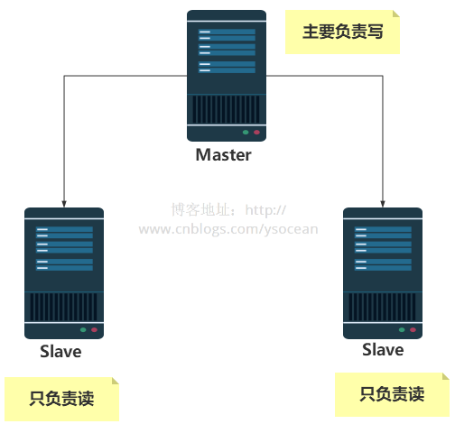

[TOC]


# 集群模式-主从复制

​		前面介绍Redis，我们都在一台服务器上进行操作的，也就是说读和写以及备份操作都是在一台Redis服务器上进行的，那么随着项目访问量的增加，对Redis服务器的操作也越加频繁，虽然Redis读写速度都很快，但是一定程度上也会造成一定的延时，那么为了解决访问量大的问题，通常会采取的一种方式是主从架构Master/Slave，Master 以写为主，Slave 以读为主，Master 主节点更新后根据配置，自动同步到从机Slave 节点。

　　接下来我们就来介绍如何进行主从架构的搭建。

　　ps:这里我是在一台机器上模拟多个Redis服务器，与实际生产环境中相比，基本配置都是一样，仅仅是IP地址和端口号变化。

 

## 1、修改配置文件

 

## 2、设置主从关系

　　①、通过 info replication 命令查看节点角色

 

　　②、选择6380端口和6381端口，执行命令：SLAVEOF 127.0.0.1 6379

 

这里通过命令来设置主从关系，一旦服务重启，那么角色关系将不复存在。想要永久的保存这种关系，可以通过配置redis.conf 文件来配置。

```
slaveof 127.0.0.1 6379
```

## 3、测试主从关系

​		**①、增量复制**

　　主节点执行 set k1 v1 命令，从节点 get k1 能获取吗？

 

　　**②、全量复制**

　　通过执行 SLAVEOF 127.0.0.1 6379，如果主节点 6379 以前还存在一些 key，那么执行命令之后，从节点会将以前的信息也都复制过来吗？

　　答案也是肯定的，这里我就不贴测试结果了。

　　**③、主从读写分离**

　　主节点能够执行写命令，从节点能够执行写命令吗？

 

**④、主节点宕机**

　　主节点 Maste 挂掉，两个从节点角色会发生变化吗？

 

　上图可知主节点 Master 挂掉之后，从节点角色还是不会改变的。

　　**⑤、主节点宕机后恢复**

　　主节点Master挂掉之后，马上启动主机Maste，主节点扮演的角色还是 Master 吗？

 

　　也就是说主节点挂掉之后重启，又恢复了主节点的角色。

## 4、哨兵模式

通过前面的配置，主节点Master 只有一个，一旦主节点挂掉之后，从节点没法担起主节点的任务，那么整个系统也无法运行。如果主节点挂掉之后，从节点能够自动变成主节点，那么问题就解决了，于是哨兵模式诞生了。

　　哨兵模式就是不时地监控redis是否按照预期良好地运行（至少是保证主节点是存在的），若一台主机出现问题时，哨兵会自动将该主机下的某一个从机设置为新的主机，并让其他从机和新主机建立主从关系。

 

哨兵模式搭建步骤：

　　①、在配置文件目录下新建 sentinel.conf 文件，名字绝不能错，然后配置相应内容

 

　　②、启动哨兵

```
redis-sentinel /etc/redis/sentinel.conf
```

 

 

　　==PS：哨兵模式也存在单点故障问题，如果哨兵机器挂了，那么就无法进行监控了，解决办法是哨兵也建立集群，Redis哨兵模式是支持集群的。==

## 5、主从复制原理

Redis的复制功能分为同步（sync）和命令传播（command propagate）两个操作。

　　**①、旧版同步**

　　当从节点发出 SLAVEOF 命令，要求从服务器复制主服务器时，从服务器通过向主服务器发送 SYNC 命令来完成。该命令执行步骤：

　　1、从服务器向主服务器发送 SYNC 命令

　　2、收到 SYNC 命令的主服务器执行 BGSAVE 命令，在后台生成一个 RDB 文件，并使用一个缓冲区记录从开始执行的所有写命令

　　3、当主服务器的 BGSAVE 命令执行完毕时，主服务器会将 BGSAVE 命令生成的 RDB 文件发送给从服务器，从服务器接收此 RDB 文件，并将服务器状态更新为RDB文件记录的状态。

　　4、主服务器将缓冲区的所有写命令也发送给从服务器，从服务器执行相应命令。

　　**②、命令传播**

　　当同步操作完成之后，主服务器会进行相应的修改命令，这时候从服务器和主服务器状态就会不一致。

　　为了让主服务器和从服务器保持状态一致，主服务器需要对从服务器执行命令传播操作，主服务器会将自己的写命令发送给从服务器执行。从服务器执行相应的命令之后，主从服务器状态继续保持一致。

　　总结：==通过同步操作以及命令传播功能，能够很好的保证了主从一致的特性。==

　　但是我们考虑一个问题，如果从服务器在同步主服务器期间，突然断开了连接，而这时候主服务器进行了一些写操作，这时候从服务器恢复连接，如果我们在进行同步，那么就必须将主服务器从新生成一个RDB文件，然后给从服务器加载，这样虽然能够保证一致性，但是其实断开连接之前主从服务器状态是保持一致的，不一致的是从服务器断开连接，而主服务器执行了一些写命令，那么从服务器恢复连接后能不能只要断开连接的哪些写命令，而不是整个RDB快照呢？

　　同步操作其实是一个非常耗时的操作，主服务器需要先通过 BGSAVE 命令来生成一个 RDB 文件，然后需要将该文件发送给从服务器，从服务器接收该文件之后，接着加载该文件，并且加载期间，从服务器是无法处理其他命令的。

　　为了解决这个问题，Redis从2.8版本之后，使用了新的同步命令 **PSYNC** 来代替 SYNC 命令。该命令的部分重同步功能用于处理断线后重复制的效率问题。也就是说当从服务器在断线后重新连接主服务器时，主服务器只将断开连接后执行的写命令发送给从服务器，从服务器只需要接收并执行这些写命令即可保持主从一致。

## 6、主从复制的缺点

　　主从复制虽然解决了主节点的单点故障问题，但是由于所有的写操作都是在 Master 节点上操作，然后同步到 Slave 节点，那么同步就会有一定的延时，当系统很繁忙的时候，延时问题就会更加严重，而且会随着从节点slave的增多而愈加严重。