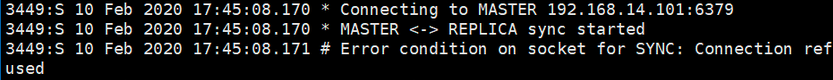

[TOC]


# 哨兵模式

## 1、架构图

 

## 2、服务器列表

 

## 3、搭建主从模式

**①、主要配置项**

　　主服务器(上图的Node1)配置文件 redis.config 主要配置项:

```
#配置端口
port 6379
#以守护进程模式启动
daemonize yes
#pid的存放文件
pidfile /var/run/redis_6379.pid
#日志文件名
logfile "redis_6379.log"
#存放备份文件以及日志等文件的目录
dir "/opt/redis/data"
```

从服务器配置文件主要配置项基本和主服务器保持一致,需要修改端口 port ;另外存放位置和日志文件名也可以根据需要修改.

　　为了表示主从关系,还需要在从服务器配置文件中添加一行**重要配置**:

```
#配置主服务器IP,端口
slaveof 192.168.14.101 6379
```

　　**②、验证主从关系**

　　配置完成后,我们通过 redis-server redis.conf 命令启动Redis.然后通过 redis-cli -p 端口 分别进入到各台服务器的控制行页面:

　　输入如下命令:

```
info replication
```

　　三台服务器打印结果如下:

 

由上图可以看到,Node1 服务器作为主服务器,节点角色是 master,另外的两台从服务器,节点角色都是 slave.

　　另外还可以进行如下测试:可以在主服务器上添加一条数据,然后看看从服务器上是否能够查到该数据.

　　**③、问题**

　　如果对于上面的测试,主服务器上添加的数据,从服务器上无法查询到,可以查看前面配置的目录/opt/redis/data 日志文件,有一种错误如下:

 

这是由于主服务器设置了登录密码,从服务器在向主服务器进行数据同步复制时,由于不知道主服务器密码,导致连接不上,从而无法进行同步.

　　解决这个问题,需要明确两个配置:

　　**一.requreipass**

　　设置redis的登录密码.

　　**二.masterauth**

　　针对master对应的slave节点设置的，在slave节点数据同步的时候用到。

　　建议,如果启用Redis密码校验,最好将各个节点的masterauth和requirepass设置为相同的密码;如果不设置为相同的,要注意slave节点masterauth和master节点requirepass的对应关系.

## 4、搭建哨兵模式

**①、主要配置项** 

　　配置文件名称为：sentinel.conf

```
#配置端口
port 26379
#以守护进程模式启动
daemonize yes
#日志文件名
logfile "sentinel_26379.log"
#存放备份文件以及日志等文件的目录
dir "/opt/redis/data"
#监控的IP 端口号 名称 sentinel通过投票后认为mater宕机的数量，此处为至少2个
sentinel monitor mymaster 192.168.14.101 6379 2
#30秒ping不通主节点的信息，主观认为master宕机
sentinel down-after-milliseconds mymaster 30000
#故障转移后重新主从复制，1表示串行，>1并行
sentinel parallel-syncs mymaster 1
#故障转移开始，三分钟内没有完成，则认为转移失败
sentinel failover-timeout mymaster 180000
```

　　注意三台服务器的端口配置.如果redis服务器配置了密码连接,则要增加如下配置:

```
sentinel auth-pass mymaster 123
```

　　后面的123表示密码.注意这行配置要配置到 sentinel monitor mymaster ip port 后面,因为名称 mymaster要先定义.

　　②**、启动哨兵**

```
redis-sentinel sentinel.conf
```

　　③**、验证主从自动切换**

　　首先kill掉Redis 主节点.然后查看sentinel 日志:

 

上面截图红框框住的几个重要信息,这里先介绍最后一行,switch-master mymaster 192.168.14.101 6379  192.168.14.103 6381 表示master服务器将由6379的redis服务切换为6381端口的redis服务器.

　　==PS:**+switch-master** 表示切换主节点.==

　　然后我们通过 info replication 命令查看 6381的redis服务器:

 

我们发现,6381的Redis服务已经切换成master节点了. 

　　另外,也可以查看sentinel.conf 配置文件,里面的 sentinel monitor mymaster  192.168.14.101 6379 2 也自动更改为 sentinel monitor mymaster 192.168.14.103  6381 2 配置了.

## 5、Java客户端连接哨兵集群

这里通过springboot项目来连接,代码地址如下:

```
https://github.com/YSOcean/redis-sentinel.git
```

　　这里贴一下主要测试代码:

　　PS:实际上springboot已经为我们注入了RedisTemplate,我们在实际项目中不用写的像下面代码这么麻烦,这样写是为了详细的表明连接步骤.

```
//1.设置sentinel 各个节点集合
Set<String> sentinelSet = new HashSet<>();
sentinelSet.add("192.168.14.101:26379");
sentinelSet.add("192.168.14.102:26380");
sentinelSet.add("192.168.14.103:26381");
 
//2.设置jedispool 连接池配置文件
JedisPoolConfig config = new JedisPoolConfig();
config.setMaxTotal(10);
config.setMaxWaitMillis(1000);
 
//3.设置mastername,sentinelNode集合,配置文件,Redis登录密码
JedisSentinelPool jedisSentinelPool = new JedisSentinelPool("mymaster",sentinelSet,config,"123");
Jedis jedis = null;
try {
    jedis = jedisSentinelPool.getResource();
    //获取Redis中key=hello的值
    String value = jedis.get("hello");
    System.out.println(value);
} catch (Exception e) {
    e.printStackTrace();
} finally {
    if(jedis != null){
        jedis.close();
    }
}
```

## 6、Java客户端连接原理

　　**①**、**结构图**

 

​		**②、连接步骤** 

　　一.客户端遍历所有的 Sentinel 节点集合,获取一个可用的 Sentinel 节点.

　　二.客户端向可用的 Sentinel 节点发送 get-master-addr-by-name 命令,获取Redis Master 节点.

　　三.客户端向Redis Master节点发送role或role replication 命令,来确定其是否是Master节点,并且能够获取其 slave节点信息.

　　四.客户端获取到确定的节点信息后,便可以向Redis发送命令来进行后续操作了

　　需要注意的是:客户端是和Sentinel来进行交互的,通过Sentinel来获取真正的Redis节点信息,然后来操作.实际工作时,Sentinel 内部维护了一个主题队列,用来保存Redis的节点信息,并实时更新,客户端订阅了这个主题,然后实时的去获取这个队列的Redis节点信息.

## 7、哨兵模式工作原理

### **①、三个定时任务**

　　一.每10秒每个 sentinel 对master 和 slave 执行info 命令:该命令第一个是用来发现slave节点,第二个是确定主从关系.

　　二.每2秒每个 sentinel 通过 master 节点的 channel(名称为_sentinel_:hello) 交换信息(pub/sub):用来交互对节点的看法(后面会介绍的节点主观下线和客观下线)以及自身信息.

　　三.每1秒每个 sentinel 对其他 sentinel 和 redis 执行 ping 命令,用于心跳检测,作为节点存活的判断依据.

### **②、主观下线和客观下线**

#### 　　一.主观下线

　　SDOWN:subjectively down,直接翻译的为”主观”失效,即当前sentinel实例认为某个redis服务为”不可用”状态.

#### 　　二.客观下线

　　ODOWN:objectively  down,直接翻译为”客观”失效,即多个sentinel实例都认为master处于”SDOWN”状态,那么此时master将处于ODOWN,ODOWN可以简单理解为master已经被集群确定为”不可用”,将会开启故障转移机制.

　　结合我们第4点搭建主从模式,验证主从切换时,kill掉Redis主节点,然后查看 sentinel 日志,如下:

 

　　发现有类似 sdown 和 odown 的日志.在结合我们配置 sentinel 时的配置文件来看:

```
#监控的IP 端口号 名称 sentinel通过投票后认为mater宕机的数量，此处为至少2个
sentinel monitor mymaster 192.168.14.101 6379 2
```

最后的 2 表示投票数,也就是说当一台 sentinel 发现一个 Redis 服务无法 ping 通时,就标记为 主观下线  sdown;同时另外的 sentinel 服务也发现该 Redis 服务宕机,也标记为 主观下线,当多台 sentinel  (大于等于2,上面配置的最后一个)时,都标记该Redis服务宕机,这时候就变为客观下线了,然后进行故障转移.

### **③、故障转移**

故障转移是由 sentinel 领导者节点来完成的(只需要一个sentinel节点),关于  sentinel 领导者节点的选取也是每个 sentinel 向其他 sentinel 节点发送我要成为领导者的命令,超过半数sentinel  节点同意,并且也大于quorum ,那么他将成为领导者,如果有多个sentinel都成为了领导者,则会过段时间在进行选举.

　　sentinel 领导者节点选举出来后,会通过如下几步进行故障转移:

　　一.从 slave 节点中选出一个合适的 节点作为新的master节点.这里的合适包括如下几点:

　　　　1.选择 slave-priority(slave节点优先级)最高的slave节点,如果存在则返回,不存在则继续下一步判断.

　　　　2.选择复制偏移量最大的 slave 节点(复制的最完整),如果存在则返回,不存在则继续.

　　　　3.选择runId最小的slave节点(启动最早的节点)

　　二.对上面选出来的 slave 节点执行 slaveof no one 命令让其成为新的 master 节点.

　　三.向剩余的 slave 节点发送命令,让他们成为新master 节点的 slave 节点,复制规则和前面设置的 parallel-syncs 参数有关.

　　四.更新原来master 节点配置为 slave 节点,并保持对其进行关注,一旦这个节点重新恢复正常后,会命令它去复制新的master节点信息.(注意:原来的master节点恢复后是作为slave的角色)

　　可以从 sentinel 日志中出现的几个消息来进行查看故障转移:

　　1.**+switch-master**:表示切换主节点(从节点晋升为主节点)

　　2.**+sdown**:主观下线

　　3.**+odown**:客观下线

　　4.**+convert-to-slave**:切换从节点(原主节点降为从节点)