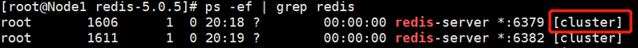
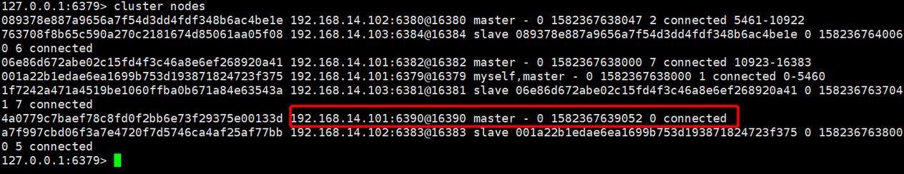

[TOC]

# Cluster集群模式

哨兵模式主要是解决高可用问题,在master节点宕机时,slave节点能够自动切换成为master节点

　　本篇博客我们来介绍Redis的另外一种模式------集群模式.

　　**PS：我这里搭建演示的版本是redis-5.0.5，这个版本对于集群搭建会有很大的简化，比如最常用的redis-trib.rb脚本功能已经集成到redis-cli工具中了，具体下面会详细介绍。**

## 1、为什么需要集群?

​		**①、并发量**

　　通常来说,单台Redis能够执行**10万/秒**的命令,这个并发基本上能够满足我们所有需求了,但有时候比如做离线计算,为了更快的得出结果,有时候我们希望超过这个并发,那这个时候单机就不满足我们需求了,就需要集群了.

　　**②、数据量**

　　通常来说,单台服务器的内存大概在16G-256G之间,前面我们说Redis数据量都是存在内存中的,那如果实际业务要保存在Redis的数据量超过了单台机器的内存,这个时候最简单的方法是增加服务器内存,但是单台服务器内存不可能无限制的增加,纵向扩展不了了,便想到如何进行横向扩展.这时候我们就会想将这些业务数据分散存储在多台Redis服务器中,但是要保证多台Redis服务器能够无障碍的进行内存数据沟通,这也就是Redis集群.

## 2、数据分区方式

对于集群来说,如何将原来单台机器上的数据拆分,然后尽量均匀的分布到多台机器上,这是我们创建集群首先要考虑的一个问题,通常来说,有如下两种数据分区方式.

### 　　**①、顺序分布**

　　比如我们有100W条数据,有3台服务器,我们可以将100W/3的结果分别存储到三台服务器上,如下所示:

 

　　特点：键值业务相关；数据分散，但是容易造成访问倾斜；支持顺序访问；支持批量操作

### 		**②、哈希分布**

　　同样是100W条数据,有3台服务器,通过自定义一个哈希函数,比如节点取余的方法,余数为0的存在第一台服务器,余数为1的存在第二台服务器,余数为2的存储在第三台服务器.如下所示:

　 

　　特点：数据分散度高；键值分布与业务无关；不支持顺序访问；支持批量操作。

## **3、一致性哈希分布**

　　**问题：**对于上面介绍的哈希分布，大家可以想一下，如果向集群中增加节点，或者集群中有节点宕机，这个时候应该怎么处理？

　　**①、增加节点**

 

如上图所示，总共10个数据通过节点取余hash(key)%/3 的方式分布到3个节点，这时候由于访问量变大，要进行扩容，由 3 个节点变为 4 个节点。

　　我们发现，如图所示，数据除了标红的1 2 没有进行迁移，别的数据都要进行变动，达到了80%，如果这时候并发很高，80%的数据都要从下层节点（比如数据库）获取，会给下层节点造成很大的访问压力，这是不能接受的。

　　即使我们进行**翻倍扩容**，从3个节点增加到6个节点，其数据迁移也在50%左右。

　　**②、删除节点**

 

上图其实不管是哪一个节点宕机，其数据迁移量都会超过50%。基本上也是我们所不能接受的。

　　**那么如何使得集群中新增节点或者删除节点时，数据迁移量最少？——一致性哈希算法诞生。**

　　PS：关于一致性哈希算法，我会另外写一篇博客进行详细介绍，这里只是大概介绍一下。

 

　假设有一个哈希环，从0到2的32次方，均匀的分成三份，中间存放三个节点，沿着顺时针旋转，从Node1到Node2之间的数据，存放在Node2节点上；从Node2到Node3之间的数据，存放在Node3节点上，依次类推。

　　假设Node1节点宕机，那么原来Node3到Node1之间的数据这时候改为存放到Node2节点上，Node2到Node3之间数据保持不变，原来Node1到Node2之间的数据还是存放在Node2上，也就是只影响三分之一的数据，节点越多，影响数据越少。

 

　　同理，假设增加一个节点，影响的数据甚至更少。

 

 　当然，实际业务中并不是你节点均匀分布，访问就会很平均，这时候容易造成访问倾斜的问题，这里就会引出虚拟节点的定义。我这里就不做详解了。

## 4、Redis Cluster虚拟槽分区

Redis集群数据分布没有使用一致性哈希分布，而是使用虚拟槽分区概念。

　　Redis内部内置了序号 0-16383  个槽位，每个槽位可以用来存储一个数据集合，将这些槽位按顺序分配到集群中的各个节点。每次新的数据到来，会通过哈希函数 CRC16(key)  算出将要存储的槽位下标，然后通过该下标找到前面分配的Redis节点，最后将数据存储到该节点中。

　　具体情况如下图：（以集群有3个节点为例）

 

 　至于为什么Redis不使用一致性哈希分布，而是虚拟槽分区。因为虚拟槽分区虽然没有一致性哈希那么灵活，但是CRC16(key)%16384 已经分布很均匀了，并且对于后面节点增删操作起来也很方便。

## 5、原生搭建 Redis Cluster

　集群以**三主三从**的模式来搭建。

### ①、服务器列表

 

### ②、配置各个节点参数

```
#配置端口
port ${port}
#以守护进程模式启动
daemonize yes
#pid的存放文件
pidfile /var/run/redis_${port}.pid
#日志文件名
logfile "redis_${port}.log"
#存放备份文件以及日志等文件的目录
dir "/opt/redis/data"  
#rdb备份文件名
dbfilename "dump_${port}.rdb"
#开启集群功能
cluster-enabled yes
#集群配置文件，节点自动维护
cluster-config-file nodes-${port}.conf
#集群能够运行不需要集群中所有节点都是成功的
cluster-require-full-coverage no
```

​		配置完成后，通过 redis-server redis.conf 命令启动这六个节点。

　　启动之后，进程后面会有 cluster 的字样：

 

### ③、建立各个节点通信

 　这里有 6 个节点，我们只需要拉通 1 个节点和另外 5 个节点之间通信，那么每两个节点就能够通信了。命令如下：

```
redis-cli -h -p ${port1} -a ${password} cluster meet ${ip2}  ${port2} 
```

这里的 -a 参数表示该Redis节点有密码，如果没有可以不用加此参数。

　　实例中的 6 个节点，分别进行如下命令：

```
redis-cli -p 6379 -a 123 cluster meet 192.168.14.101 6382
redis-cli -p 6379 -a 123 cluster meet 192.168.14.102 6380
redis-cli -p 6379 -a 123 cluster meet 192.168.14.102 6383
redis-cli -p 6379 -a 123 cluster meet 192.168.14.103 6381
redis-cli -p 6379 -a 123 cluster meet 192.168.14.103 6384
```

执行完毕后，可以查看节点通信信息：

```
redis-cli -p 6379 -a 123 cluster nodes
```


　或者执行如下命令：

```
redis-cli -p 6379 -a 123 cluster info
```

 

### ④、分配槽位

　　由于我们是三主三从的架构，所以只需要对主服务器分配槽位即可。三个节点，分配序号为 0-16383 ，总共16384 个槽位。

```
Node1:0~5460
Node2:5461~10922
Node3:10923~16383
```

　　分配槽位的命令如下：

```
redis-cli -p ${port} -a ${password} cluster addslots {${startSlot}..${endSlot}}
```

　　比如，对于Node1主节点，我们执行命令如下：

```
redis-cli -p 6379 -a 123 cluster addslots {0..5462}
```

​		另外两个节点对于上面的命令更改一下槽位数，然后查看集群信息：　　


　　查看Node1节点信息：

 

### ⑤、主从配置

　　命令如下：

```
redis-cli -p ${port} -a {password} cluster replicate ${nodeId}
```

　　前面的${port} 表示从节点的端口，这里的nodeId表示主节点的nodeId，如下：


 　这时候，集群状态是成功了。

### ⑥、测试

　　经过如上几步操作，集群搭建成功，我们通过如下命令进入客户端：

```
redis-cli -c -p ${port} -a {password}
```

　　==注意：必须要加 -c 参数，否则进行键值对操作时会报如下错误：==

 

## 6、脚本搭建Redis Cluster

上面原生命令安装Redis Cluster 走下来其实挺费劲的，在实际生产环境中，如果集群数量比较大，操作还是容易出错的。

　　不过Redis官方提供了一个安装集群的脚本，在Redis安装目录的src目录下——redis-trib.rb，使用该脚本可以快速搭建Redis Cluster集群。

　　**注意**：redis版本在5之前的集群运行该脚本需要安装ruby环境，而redis5.0之后已经将redis-trib.rb 脚本的功能全部集成到redis-cli之中了，所以如果当前版本是Redis5，那么可以不用安装ruby环境。

　　下面我分别介绍这两种方法。

### ①、Redis5之前使用redis-trib.rb脚本搭建

　　redis-trib.rb脚本使用ruby语言编写，所以想要运行次脚本，我们必须安装Ruby环境。安装命令如下：

```
yum -y install centos-release-scl-rh
yum -y install rh-ruby23  
scl enable rh-ruby23 bash
gem install redis

```

　　安装完成后，我们可以使用 ruby -v 查看版本信息。

Ruby环境安装完成后。运行如下命令：

```
redis-trib.rb create --replicas 1 192.168.14.101:6379 192.168.14.102:6380 192.168.14.103:6381 192.168.14.101:6382 192.168.14.102:6383 192.168.14.103:6384
```

　　关于这个命令的解释下面会一起介绍。

### ②、Redis5版本集群搭建　

　　前面我们就说过，redis5.0之后已经将redis-trib.rb 脚本的功能全部集成到redis-cli中了，所以我们直接使用如下命令即可：

```
redis-cli -a ${password} --cluster create 192.168.14.101:6379 192.168.14.102:6380 192.168.14.103:6381 192.168.14.101:6382 192.168.14.102:6383 192.168.14.103:6384 --cluster-replicas 1
```

　　①、${password} 表示连接Redis的密码，通常整个集群我们要么不设置密码，要么设置成一样的。

　　②、后面的六个ip:port，按照顺序，前面三个是主节点，后面三个是从节点，顺序不能错。

　　③、最后数字 1 表示一个主节点只有一个从节点。和前面的配置相对应。

## 7、集群扩容

这里新增两个端口分别是 6390、6391的节点。其中6391节点是6390节点的从节点。

### ①、配置新增节点文件

　　比如，我们将6379节点的配置文件redis.conf 拷贝两份，然后将里面的配置文件里面的字符串 6379 分别替换成 6390 和 6391。

　　:**%s/6379/6390/g，:%s/6379/6391/g**

　　替换完成之后，分别启动这两个节点。

　　这时候这两个节点都不在集群当中，是两个孤儿节点。

### ②、将新增主节点加入到集群中

　　命令如下：

```
redis-cli -p existing_port -a ${password} --cluster add-node new_host:new_port existing_host:existing_port
```

　　我这里是将新增的主节点 6390 添加到原来的集群中。

```
redis-cli -p 6379 -a 123 --cluster add-node 192.168.14.101:6390 192.168.14.101:6379
```

　　添加完毕后，这时候查看集群状态



 　6390节点已经存在集群中了，但是还没有分配槽位。

### ③、为新增主节点分配槽位

　　分配命令如下：

```
redis-cli -p existing_port -a ${password} --cluster reshard existing_host:existing_port
```

　　后面的existing_host:existing_port表示原来集群中的任意一个节点，这个命令表示将源节点的一部分槽位分配个新增的节点。

　　在分配过程中，会出现如下几个提示：

```
#后面的2000表示分配2000个槽位给新增节点
How many slots do you want to move (from 1 to 16384)? 2000
#表示接受节点的NodeId,填新增节点6390的
What is the receiving node ID? 64a0779c7baef78c8fd0f2bb6e73f29375e00133d
#这里填槽的来源，要么填all，表示所有master节点都拿出一部分槽位分配给新增节点；
#要么填某个原有NodeId，表示这个节点拿出一部分槽位给新增节点
Please enter all the source node IDs.
Type 'all' to use all the nodes as source nodes for the hash slots.
Type 'done' once you entered all the source nodes IDs.
Source node #1: all
```

　　分配成功后，我们查看节点信息：


我们发现已经给该节点分配了槽位。

### ④、将新增的从节点添加到集群中

```
redis-cli -p 6379 -a 123 --cluster add-node 192.168.14.101:6391 192.168.14.101:6379
```

### ⑤、建立新增节点的主从关系

　　命令如下：

```
redis-cli -p ${port} -a {password} cluster replicate ${nodeId}
```

　　前面的${port} 表示从节点的端口，这里的nodeId表示主节点的nodeId。

### ⑥、测试

　　查看节点信息，发现4主4从。


## 8、集群收缩

　　这里我们将上一步添加的主从节点6390和6391从集群中移除。

### ①、迁移待移除节点的槽位

　　移除之前的节点信息：


```
redis-cli -p existing_port -a {Redis登录密码} --cluster reshard --cluster-from {待移除的NodeId} --cluster-to {接受移除节点的NodeId} --cluster-slots {移除的槽位个数} existing_host:existing_port
```

　　比如，我这里要移除主节点 6390 的所有槽位，给6379节点。

```
redis-cli -p 6379 -a 123 --cluster reshard --cluster-from 4a0779c7baef78c8fd0f2bb6e73f29375e00133d --cluster-to 001a22b1edae6ea1699b753d193871824723f375 --cluster-slots 2000 192.168.14.101:6379
```

　　移除完后，查看节点信息，发现6390已经没有槽位了。


###  ②、移除待删除主从节点

　　==**注意：要首先移除从节点，然后再移除主节点，因为如果你先移除主节点，会触发集群的故障转移。**==

　　所以，我们应该先移除 6391 从节点，然后在移除 6390 主节点。移除命令如下：

```
redis-cli -p existing_port -a {Redis登录密码} --cluster del-node host:port {待删除的NodeId}
```

　　删除 6391 从节点：

```
redis-cli -p 6379 -a 123 --cluster del-node 192.168.14.101:6379 3622ec34956b624358722e6f4a2b762574d35bf0
```

　　删除 6390 主节点：

```
redis-cli -p 6379 -a 123 --cluster del-node 192.168.14.101:6379 4a0779c7baef78c8fd0f2bb6e73f29375e00133d
```

