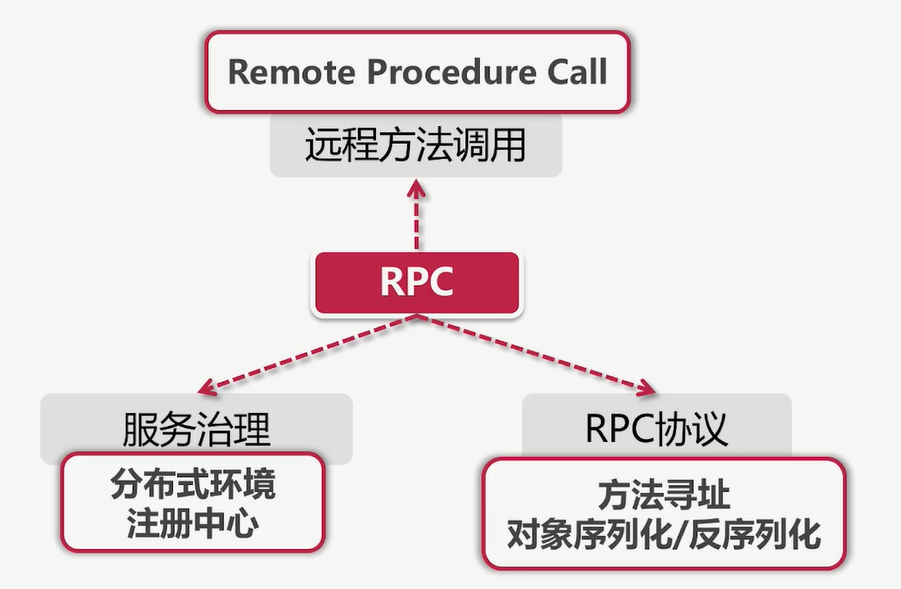
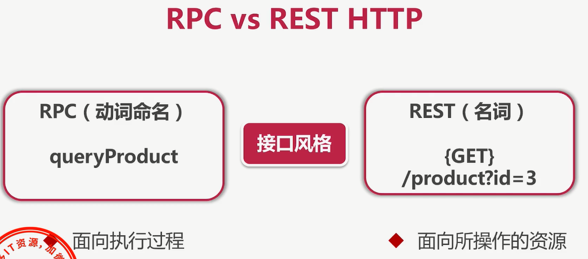
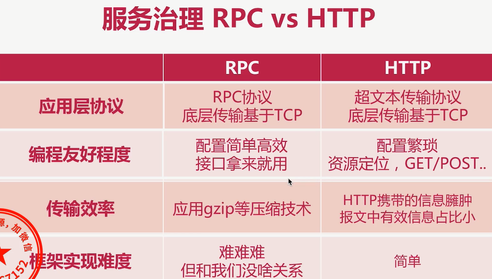
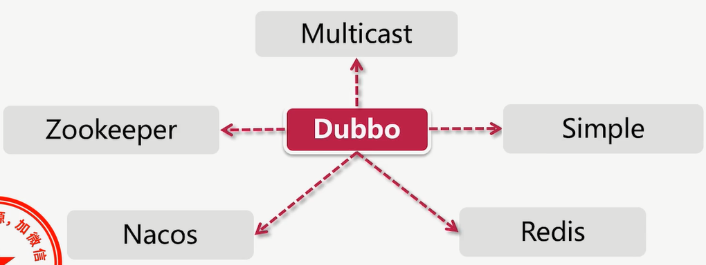
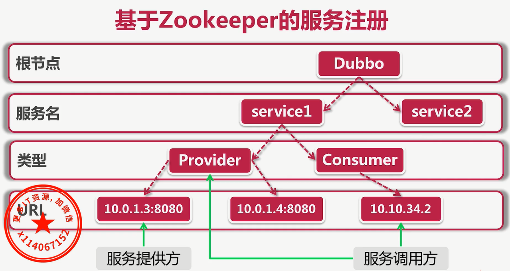
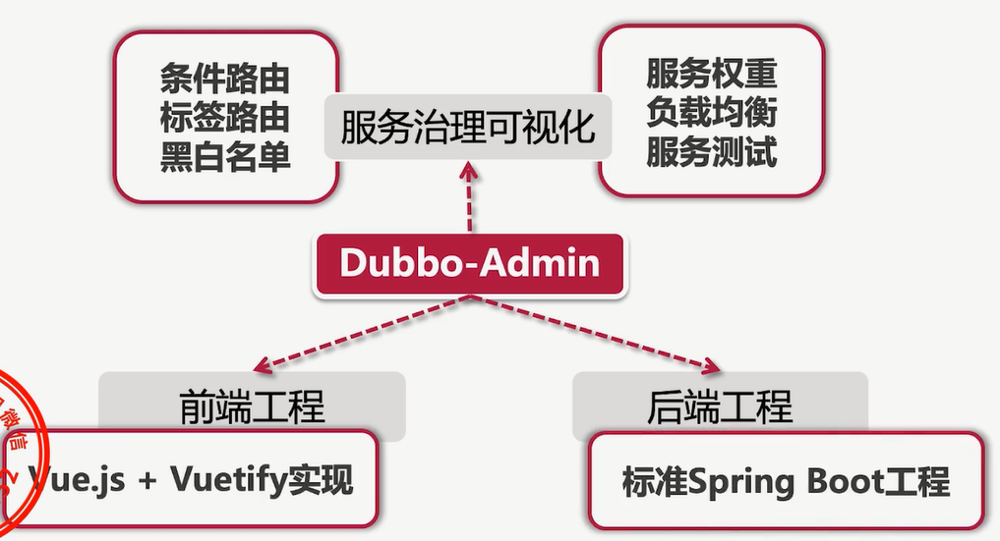
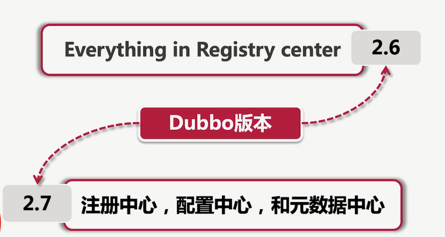
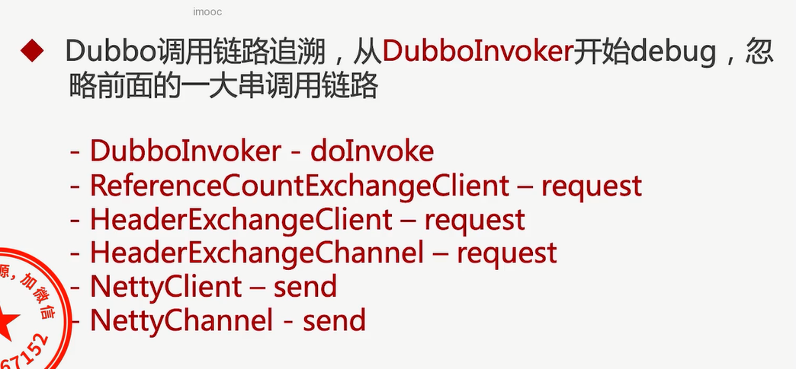

#  Dubbo

## 服务治理-RPC vs HTTPS

### 初识RPC

 

 

 

## Dubbo介绍

### Dubbo的架构设计

### Dubbo核心介绍

## Dubbo的注册中心

 

 

## RPC协议的解析流程

## Dubbo服务容错，负载均衡、

## 基于Dubbo Admin的治理

### 什么是DubboAdmin

 

### 服务治理兼容

 

## 源码阅读消费接受端

 

## Dubboclient请求解析

org.apache.dubbo.rpc.protocol.dubbo.DubboCodec#decodeBody