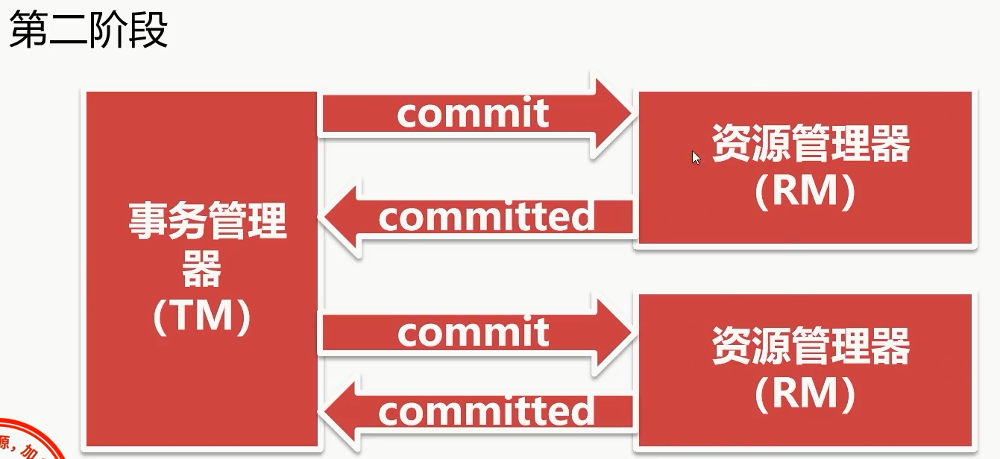

# 概述

- CAP原理
- ACID原理和BASE原理
- 基于XA协议的两阶段提交
- 事务补偿机制
- 基于本地消息表的最终一致性方案
- 基于MQ消息队列的最终一致性方案

# 分布式事务问题

## 传统应用

- 传统应用都是单一数据库事务
- 所有的业务表都在同一数据库内
- 数据库的事务可以很好的得到支持

## 分布式应用

- 分布式系统中，业务拆分成多个数据库
- 多个独立的数据库之间，无法统一事务
- 造成数据不一致的情况
- 比如：一个下单操作，用户使用积分购买商品。用户库扣减积分，订单库生成订单，商品库扣减库存，由于它们不在同一个数据库，不能保证事务的统一

# 解决分布式事务的方式

- 基于XA协议的两阶段提交
- 事务补偿机制
- 基于本地消息表+定时任务的最终一致性方案
- 基于MQ的最终一致性方案

## XA协议的两阶段提交

1. XA是由X/Open组织提出的分布式事务的规范
2. 由一个事务管理器（TM）和多个资源管理器（RM)组成
3. 提交分为两个阶段：prepare和commit
 

 

- 保证数据的强一致性
- commit阶段出现问题，事务出现不一致，需人工处理
- 效率低下，性能与本地事务相差10倍
- MySQL5.7及以上均支持XA协议
- Mysql Connector/J 5.0以上支持XA协议
- Java系统中，数据源采用Atomikos

# 事务补偿机制

1. 什么是事务补偿机制?

2. 针对每个操作,都要注册一个与其对应的补偿(撇销)操作

3. 在执行失败时,调用补偿操作,撇销之前的操作

## 事务补偿机制示例

- A给B转账的例子,A和B在两家不同的银行
- A账户减200元,B账户加200元
- 两个操作要保证原子性,要么全成功、要么全失败
- 由于A和B在两家不同的银行,所以存在分布式事务的问题
- 转账接口需要提供补偿机制
- 如果A在扣减的过程出现问题,直接抛出异常,事务回滚
- B在增加余额的过程中,出现问题,要调用A的补偿接口
- A之前的扣减操作,得到了补偿,进行了撤销
- 保证了A和B的帐是没有问题的

## 事务补偿机制优缺点

优点:逻辑清晰、流程简单

缺点:数据一致性比XA还要差,可能出错的点比较多

Tcc属于应用层的一种补偿方式,程序员需要写大量代码

# 基于本地消息表的最终一致方案

- 采用Base原理，保证事务最终一致
- 一致性方面，允许一段时间内的不一致，但最终会一致
- 在实际的系统当中，要根据具体情况，判断是否采用
- 基于本地消息表的方案中南，将本事务外操作，记录在消息表中
- 其他事务，提供操作接口
- 定时任务轮询本地消息表，将未执行的消息发送给操作接口
- 操作接口处理成功，返回成功的标识，处理失败返回失败标识
- 定时任务接到标识，更新消息的状态
- 定时任务按照一定的周期反复执行
- 对于屡次失败的消息，可以设置最大失败次数
- 超过最大失败次数的消息，不在进行接口调用
- 等待 人工处理

- 优点：避免了分布式事务，实现了最终一致性
- 缺点:  要注意重试时的冥等性操作

# 基于MQ的最终一致方案

- 原理，流程与本地消息表类似
- 不同点：本地消息表改为MQ;定时任务给为MQ的消费者

- 不依赖定时任务，基于MQ更高效，更可靠
- 适合于公司内的系统
- 不同公司之间无法基于MQ,本地消息表更适合

