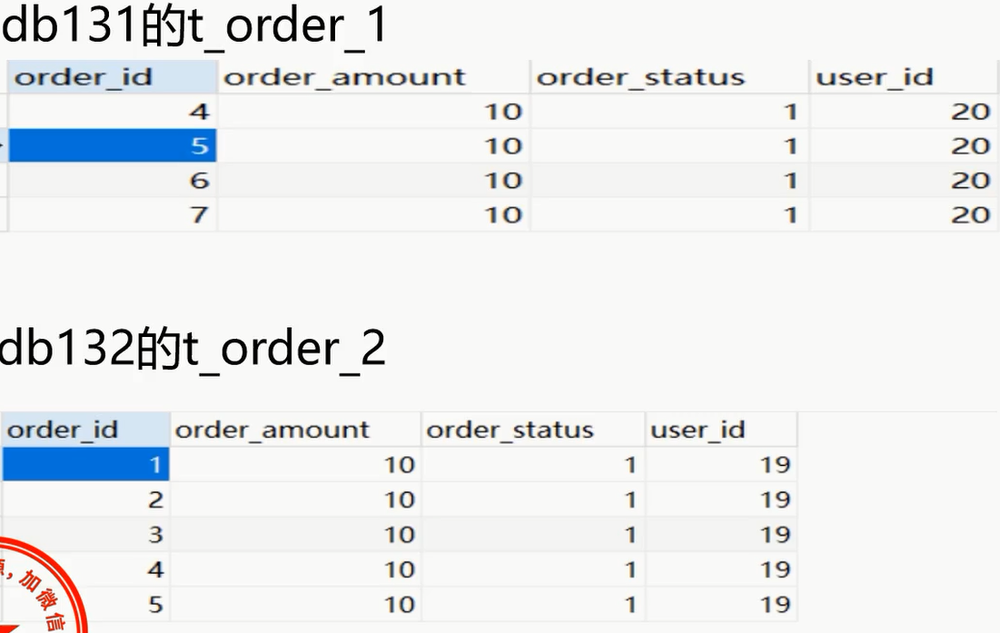
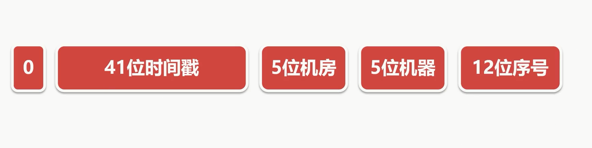

# 概述

- 分库分表的系统中,由于id引发的问题
- 使用UUID作为id实现主键全局唯一性保证
- 通过统一ID序列表,实现全局id
-  雪花算法作为全局id
- 多种方案的比较

# 分库分表引发的id的问题

- 每个表都有唯一标识，通常使用id
- id通常采用自增的方式
- 在分库分表的情况下，每张表的id都从0开始
- 在不同的分片上，id可能重复
- 导致id在全局不唯一，导致业务上出现问题
 
- 两个分片表中存在着相同的order_id
- 导致业务混乱

# UUID

- UUID通用唯一识别码
- 使用UUID,保证每一条记录的id都是不同的
- 缺点：只是单纯的一个id,没有实际意义。长度32位，太长
- mycat不支持UUID的方式
- Sharding-jdb支持UUID的方式

# 雪花算法

- SnowFlake是Twitter提出的分布式ID算法
- 一个64bit的long型的数字
- 引入了时间戳，保持自增

- 基本保持全局唯一，毫秒内并发最大4096个ID
- 时间回调可能会引起ID重复
- Mycat和sharding-jdbc都是支持雪花算法
- Sharding-Jdb可设置最大容忍回调时间

