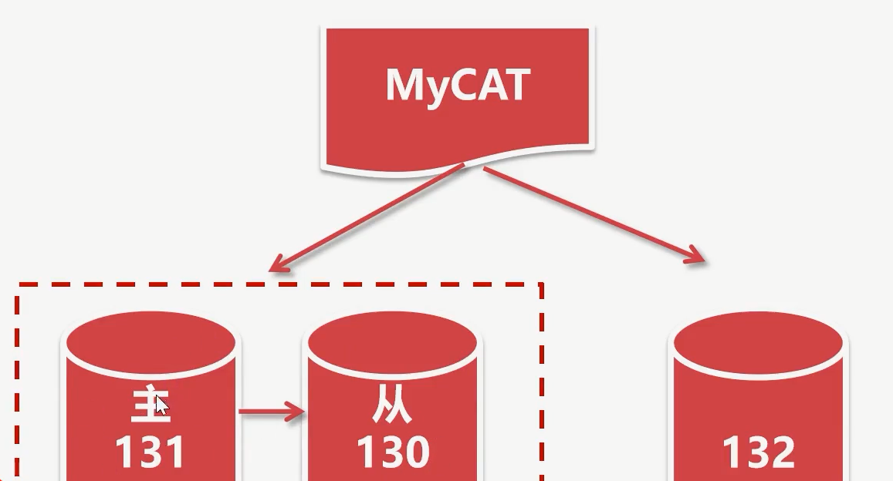
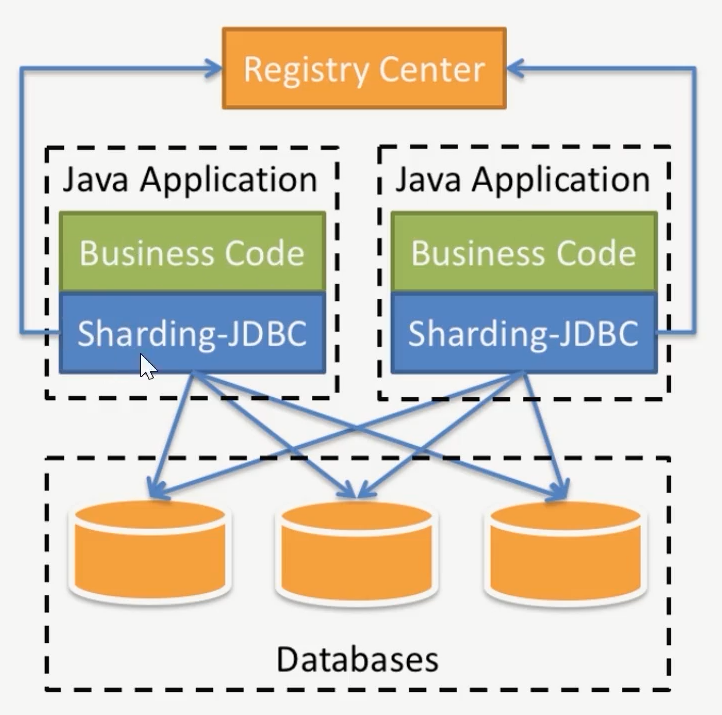

# 现有的数据库结构

 

# Sharding-Jdbc简介

- 是一个开源的分布式关系型数据库的中间件

- 属于Apache孵化器

- 客户端代理模式

- 定位为轻量级的java框架，以jar包提供服务

- 可以理解为增强版的jdbc驱动

- 完全兼容各种ORM框架

- 架构图

 

- 提供4中配置方式
- Java API,Yaml,SpringBoot和Spring命名空间
- 与Mycat的区别
- Mycat是服务端代理，Sharding-Jdbc是客户端代理
- Mycat不支持**同一库内**的水平切分，Sharding-Jdbc支持

