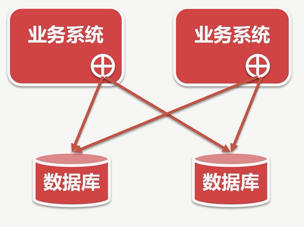
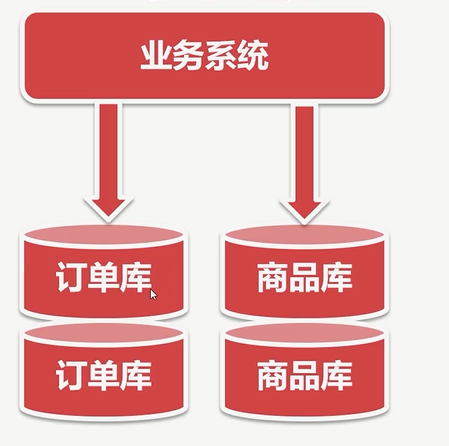

# 本章概述

◆互联网大数据时代,如何解決数据库性能瓶颈
◆读多写少的情況,采用读写分离
◆海量数据的情况,采用数据切分
◆数据切分方式一:垂直切分
◆数据切分方式二:水平切分
◆实现读写分离和数据切分的两种模式
◆模式一:中间层代理(例如: Mycat)

◆模式二:客户端模式(例如Sharding-Jdbc)

# 垂直切分、水平切分

## 垂直切分

◆按照业务去切分
◆每种业务一个数据库
◆不同业务之间,禁止跨库join联查

### 垂直切分-优点

◆拆分后业务清晰,拆分规则明确;
◆系统之间容易扩展和整
◆数据维护简单

### 垂直切分-缺点

◆部分业务表无法join,只能通过接口调用,提升了系统的复杂度
◆跨库事务难以处理;
◆垂直切分后,某些业务数据过于庞大,仍然存在单体性能瓶颈;

## 水平切分

◆将一张表的数据按照某种规则分到不同的数据库中
◆需确定分片的规!
◆使用分片字段查询时,可确定实体库,其他字段查询,查询所有表

### 水平切分-优点

◆解决了单库大数据、高并发的性能瓶颈;
◆拆分规则封装好,对应用端几乎透明,开发人员无需关心拆分细节
◆提高了系统的稳定性和负载能力

### 水平切分-缺点

◆拆分规则很难抽象; 
◆分片事务一致性难以解决;
◆二次扩展时,数据迁移、维护难度大

# Mysql主从配置

## 主库操作

- 主配置log-bin,指定文件的名字
- 主配置 server-id默认为1
- 主创建备份账户并授权replication slave
    create user 'slave'@'%' identified by 'rootroot';
    grant replication slave on  *.* to  'slave'@'%'; 
    flush privileges;
- 主进行锁表
    flush tables with read lock;
- 主找到log-bin的位置
    show master status;查看binlog文件名称和binlog中最近的位置（position）
- 主备份数据
    mysqldump --all -databases --master-data > dbdump.db;
    上面这个命令不行可以试试：mysqldump -h192.168.1.118 -P3306 -uroot -p --all-databases > dbdump.db
- 在**从库**导入主库的dump文件后，主库才能进行解锁 unlock tables;

## 从库操作

- 从配置 server-id与主不能重复
- 从库导入主库导出的dump的数据；
    远程拷贝：scp -r root@192.168.1.118:~/dbdump.db dbdump.db 
    导入dump文件：mysql < dbdump.db -uroot -p 
- 在从库上设置主库的配置 
    mysql > CHANGE MASTER TO
    MASTER_HOST = 'master_host_name',
    MASTER_USER = 'replication_user_name',
    MASTER_PASSWORD = 'replication_password',
    MASTER_LOG_FILE = 'recorded_log_file_name',
    MASTER_LOG_POS  = recorded_log_position;
- 示例：CHANGE MASTER TO
    MASTER_HOST = '192.168.1.118',
    MASTER_USER = 'slave',
    MASTER_PASSWORD = 'rootroot',
    MASTER_LOG_FILE ='binlog.000004',
    MASTER_LOG_POS  = 1032;
- 从库执行start slave；
