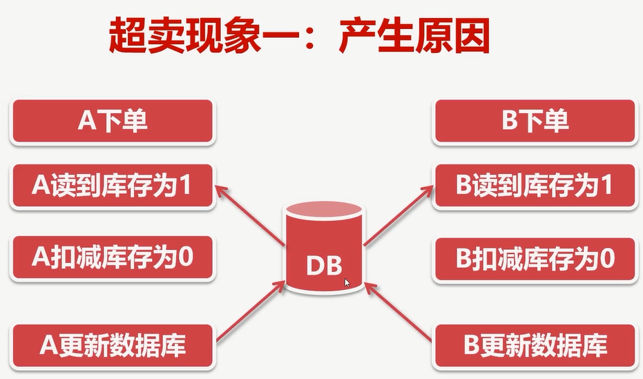
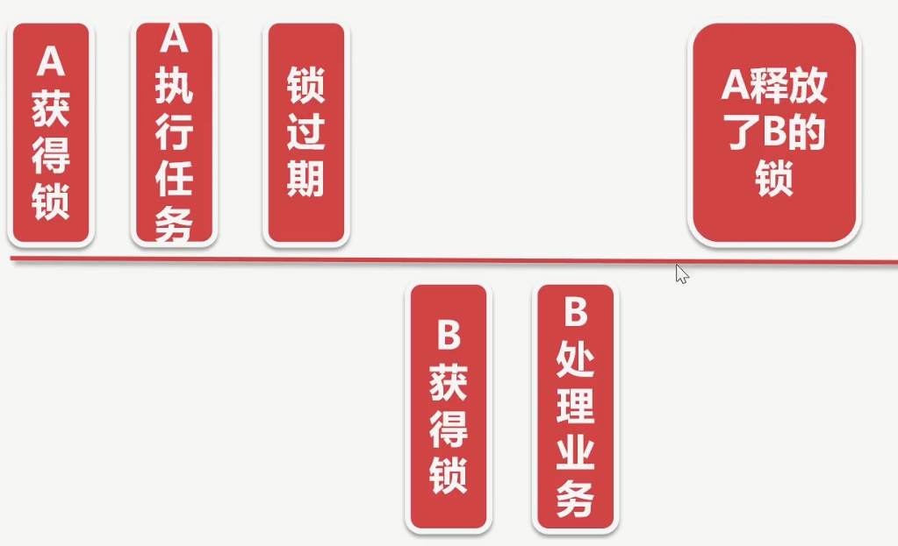
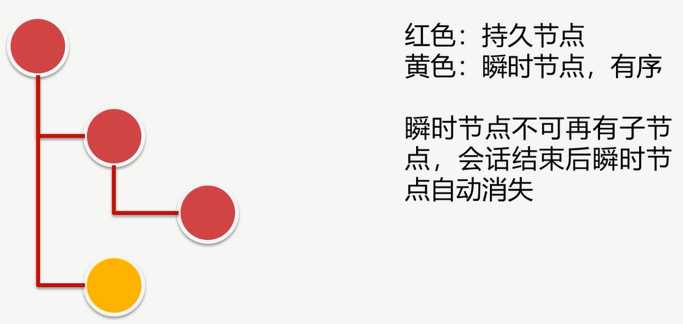
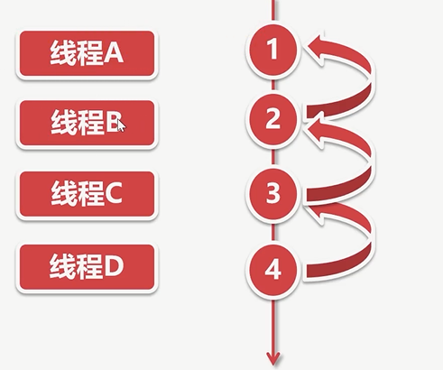
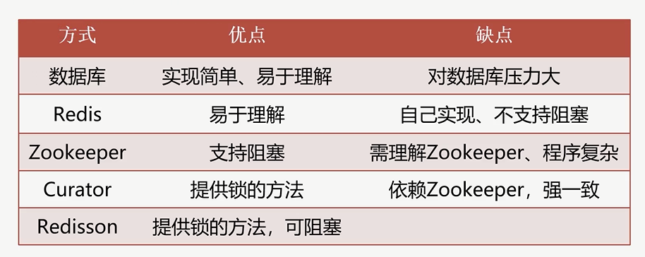

# 超卖的原因

# 超卖现象

## 超卖现象一

### 解决方法

◆扣减库存不在程序中进行,而是通过数据库
◆向数据库传递库存增量,扣减1个库存,增量为-1
◆在数据库 updatei语句计算库存,通过 update行锁解决并发

## 超卖现象二

◆系统中库存变为-1

◆卖家不知所措，询问平台客服

### 产生原因:

◆并发检验库存，造成库存充足的假象
◆update更新库存，导致库存为负数

### 解决方法

◆校验库存、扣减库存统一加锁
◆使之成为原子性的操作
◆并发时，只有获得锁的线程才能校验、扣减库存
◆扣减库存结束后，释放锁
◆确保库存不会扣成负数

### Java中的锁

#### synchronized（最原始的锁）

◆方发锁
◆块锁

#### 基于 Reentrantlocki锁解决超卖问题(并发包中的锁)

### 基于数据库悲观锁的分布式锁
◆优点:简单方便、易于理解、易于操作
◆缺点:并发量大时,对数据库压力较大
◆建议:作为锁的数据库与业务数据库分开

### 基于Redis的Setnx实现分布式锁
#### 实现原理

##### ◆获取锁的Redis命令

◆set resource_name my_random_value NX PX 30000
◆resource_name:资源名称，可根据不同的业务区分不同的key
◆my_random_value:随机值,每个线程的随机值都不同,用于释放锁时的校验
◆NX:key不存在时设置成功,key存在则设置不成功
◆PX:自动失效时间，出现异常情况，锁可以过期失效
◆利用NX的原子性，多个线程并发时，只有一个线程可以设置成功
◆设置成功即获得锁，可以执行后续的业务处理
◆如果出现异常,过了锁的有效期,锁自动释放

##### ◆释放锁采用的Redis的delete命令

◆释放锁时校验之前设置的随机数,相同才能释放
◆释放锁的LUA脚本
if redis.call("get", KEYS[1])== ARGV[1]  then
return redis.call("del" KEYS[1l)
else
return 0
end

◆LUA脚本原理

### 基于 Zookeeper的瞬时节点实现分布式锁

#### Zookeeper的数据结构

#### Zookeeper的观察器

◆可设置观察器的3个方法:getData();getChildren();exists();
◆节点数据发生变化，发送给客户端
◆观察器只能监控一次，再监控需重新设置

#### Zookeeper实现分布式锁的原理

◆利用Zookeeper的瞬时节点有序的特性
◆多线程并发创建瞬时节点时，得到有序的序列
◆序号最小的线程获得锁
◆其他的线程则监听自己序号的前一个序号
◆前一个线程执行完成,删除自己序号的节点
◆下ー个序号的线程得到通知,继续执行
◆ 以此类推
◆创建节点时,已经确定了线程的执行顺序

#### 原理图解

### 基于Redisson实现分布式锁

原理基本上和redis自己实现分布式一样的

#### 看门狗机制

https://zhuanlan.zhihu.com/p/386328633

### 分布式锁的实现方案分析

