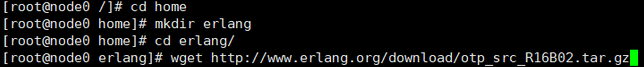
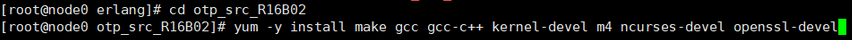
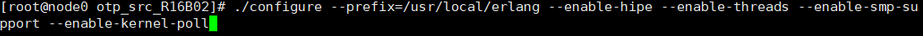
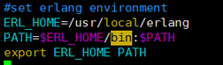
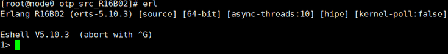
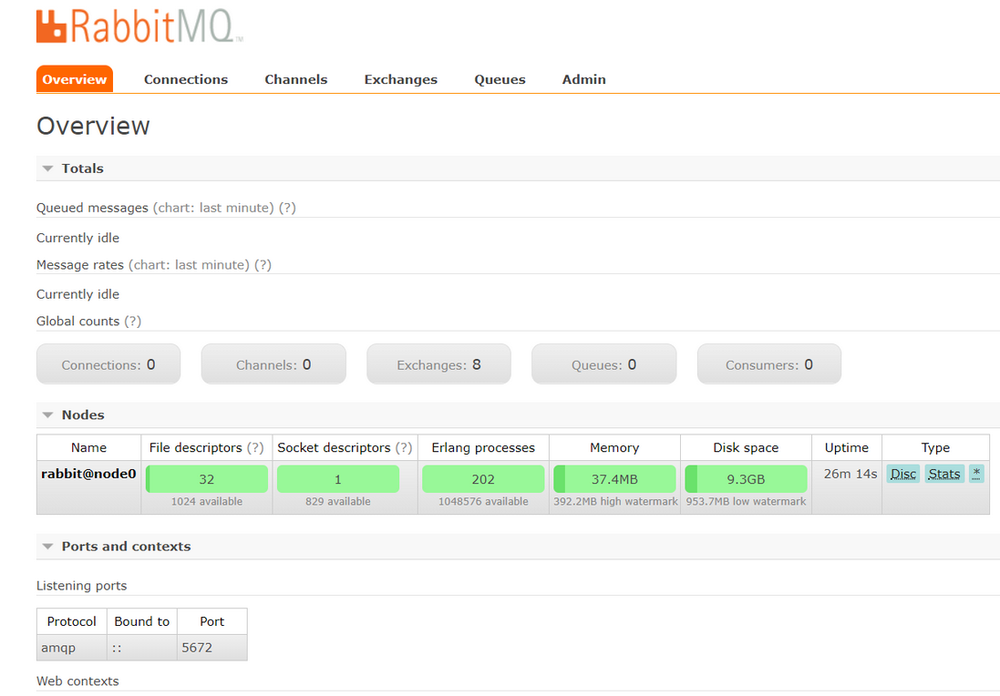

# RabbitMQ的简介和安装

　　那么关于 RabbitMQ 是什么？大家可以首先参考官网：[http://www.rabbitmq.com](http://www.rabbitmq.com/) 。这里我大概的介绍一下：

　　**RabbitMQ 是一个在AMQP协议标准基础上完整的，可服用的企业消息系统。它遵循Mozilla Public License开源协议，采用 Erlang 实现的工业级的消息队列(MQ)服务器。**

　　①、AMQP，即Advanced Message Queuing  Protocol,一个提供统一消息服务的应用层标准高级消息队列协议,是应用层协议的一个开放标准,为面向消息的中间件设计。基于此协议的客户端与消息中间件可传递消息，并不受客户端/中间件不同产品，不同的开发语言等条件的限制。关于 AMQP 的介绍可以参考：https://en.wikipedia.org/wiki/Advanced_Message_Queuing_Protocol，还有官方网站：http://www.amqp.org/confluence/display/AMQP/Advanced+Message+Queuing+Protocol。

　　②、开源。

　　③、使用 Erlang 语言编写，这是一种面向并发的编程语言，目的是创造一种可以应对大规模并发活动的编程语言和运行环境。

　　接下来我们介绍如何在 Linux 系统上安装 RabbitMQ。

## 1、安装 Erlang

就想我们编写Java引用程序需要安装 JDK一样，安装 RabbitMQ ,我们也需要安装 Erlang 。

　　**①、下载 erlang 安装包**

 

将安装包下载到 /home/erlang 目录下。

```
1 wget http://www.erlang.org/download/otp_src_R16B02.tar.gz
```

　　**②、解压**

```
1 tar -zxvf otp_src_R16B02.tar.gz
```

　　**③、编译安装**

　　首先进入解压的文件目录，然后安装如下插件

 

　　接着设置编译目录为 /usr/local/erlang

 

最后执行 make 和 make install 命令即可。

　　全部命令步骤为：

```
1、cd otp_src_R16B02
2、yum -y install make gcc gcc-c++ kernel-devel m4 ncurses-devel openssl-devel
3、./configure --prefix=/usr/local/erlang --enable-hipe --enable-threads --enable-smp-support --enable-kernel-poll
4、make
5、make install
```

​		**④、配置环境变量**

　　通过 vim /etc/profile 命令进入文件，然后敲入如下代码

 

最后通过如下命令使环境变量生效：

```
source /etc/profile
```

​		**⑤、验证**

　　在任意目录下输入 erl 命令，出现如下情况，则 erlang 安装成功：

 

## 2、安装 RabbitMQ

​		**①、下载安装包**

　　创建 /home/rabbitmq 目录，在该目录下执行如下命令：

```
wget http://www.rabbitmq.com/releases/rabbitmq-server/v3.1.5/rabbitmq-server-3.1.5.tar.gz 
```

　　**②、解压**

```
tar -zxvf rabbitmq-server-3.1.5.tar.gz
```

　　**③、编译安装**

```
1 cd rabbitmq-server-3.1.5 
2 yum -y install xmlto 
3 make
4 make install TARGET_DIR=/opt/mq/rabbitmq SBIN_DIR=/opt/mq/rabbitmq/sbin MAN_DIR=/opt/mq/rabbitmq/man
```

　　将rabbitmq编译到/opt/mq/rabbitmq目录。

　　**④、开启 web 插件**

```
1 cd /opt/mq/rabbitmq/sbin 
2 mkdir /etc/rabbitmq/ 
3 ./rabbitmq-plugins enable rabbitmq_management
```

## 3、启动和关闭RabbitMQ

```
1 启动监控管理器：rabbitmq-plugins enable rabbitmq_management
2 关闭监控管理器：rabbitmq-plugins disable rabbitmq_management
3 启动rabbitmq：rabbitmq-service start
4 关闭rabbitmq：rabbitmq-service stop
5 查看所有的队列：rabbitmqctl list_queues
6 清除所有的队列：rabbitmqctl reset
7 关闭应用：rabbitmqctl stop_app
8 启动应用：rabbitmqctl start_app
```

通过第 3 条命令启动rabbitmq 服务，然后在浏览器上输入 

```
ip:15672
```

　　出现如下界面即可。其中 ip 是安装 rabbitmq 的机器ip地址，15672 是rabbitmq的默认端口。

　　ps:如果不能打开如下画面，可能是防火墙没有关闭。centos6 关闭防火墙命令：

```
关闭命令：  service iptables stop 
永久关闭防火墙：chkconfig iptables off
查看防火墙状态：service iptables status
```

 

　　默认用户名和密码都是 guest。我们可以用 guest 登录：

 

