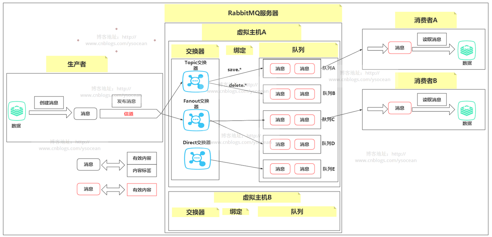
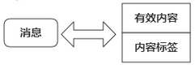
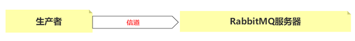
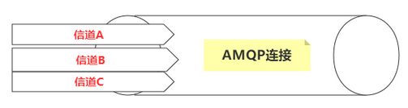
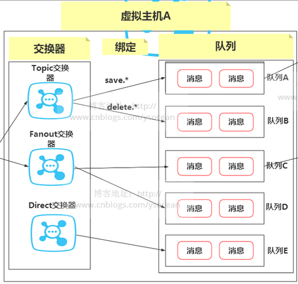

# RabbitMQ消息通信的原理

​		说到消息通信，可能我们首先会想到的是邮箱，QQ，微信，短信等等这些通信方式，这些通信方式都有发送者，接收者，还有一个中间存储离线消息的容器。但是这些通信方式和我们要讲的 RabbitMQ 的通信模型是不一样的，比如和邮件的通信方式相比，邮件服务器基于 POP3/SMTP  协议，通信双方需要明确指定，并且发送的邮件内容有固定的结构。而 RabbitMQ 服务器基于 AMQP  协议，这个协议是不需要明确指定发送方和接收方的，而且发送的消息也没有固定的结构，甚至可以直接存储二进制数据，并且和邮件服务器一样，也能存储离线消息，最关键的是 RabbitMQ 既能够以一对一的方式进行路由，还能够以一对多的方式进行广播。

　　下面这张图是大致展示了 RabbitMQ 消息通信的过程：

## 1、生产者和消费者

​		在 RabbitMQ 的通信过程中，有两个主要的角色：生产者和消费者。类比于邮件通信的发送方和接收方。

　　这里首先我们要明确 RabbtiMQ  服务器是不能够产生数据的，正如同其名字——消息中间件，是一个用来传递消息的中间商。生产者产生创建消息，然后发布到代理服务器（RabbitMQ），而消费者则从代理服务器获取消息（不是直接找生产者要消息），而且在实际应用中，生产者和消费者也是可以角色互相转换的，所以当我们应用程序连接到 RabbitMQ 服务器时，必须要明确我是生产者呢还是消费者。

## 2、消息

​		生产者创建消息，然后发布到 RabbitMQ 服务器中，那么什么是消息？

　　这里的消息分为两部分：**有效内容和内容标签。**

　　①、有效内容：可以是任何内容，一个数组，一个集合，甚至二进制数据都可以。RabbitMQ 不会在意你发什么数据，尽管发就行了。

　　②、内容标签：描述有效内容，是 RabbitMQ 用来决定谁将获得消息。前面说的邮件通信，必须明确指定发送方地址和收件方地址，而基于 AMQP 协议的 RabbitMQ 则是通过生产者发送消息附带的内容标签将消息发送个感兴趣的消费者。

 

　　后面我们会详细解析标签是什么，这里只需要知道生产者会创建消息并设置标签。注意最上面的大图，一般来说生产者创建消息会设置标签，但是传输到消费者那里就没有标签了，除非你在有效内容中说明谁是生产者，一般消费者是不知道谁产生的消息的。

## 3、信道

​		生产者产生了消息，然后发布到 RabbitMQ 服务器，发布之前肯定要先连接上服务器，也就是要在应用程序和rabbitmq 服务器之间建立一条 TCP 连接，一旦连接建立，应用程序就可以创建一条 AMQP 信道。

　　信道是建立在“真实的”TCP 连接内的虚拟连接，AMQP 命令都是通过信道发送出去的，每条信道都会被指派一个唯一的ID（AMQP库会帮你记住ID的），不论是发布消息、订阅队列或者接收消息，这些动作都是通过信道来完成的。

 

可能有人会问，为什么不直接通过 TCP 连接来发送AMQP命令呢？

　　这里原因是效率问题，因为对于操作系统来说，每次建立和销毁 TCP 会话是非常昂贵的开销，而实际系统中，比如电商双十一，每秒钟高峰期成千上万条连接，一般来说操作系统建立TCP连接是有数量限制的，那么这就会遇到瓶颈。

　　引入信道的概念，我们可以在一条 TCP 连接上创建 N多个信道，这样既能发送命令，也能够保证每条信道的私密性，我们可以将其想象为光纤电缆。

 

## 4、交换器和队列

 

交换器和队列都是 RabbitMQ 服务器的一部分，我们知道生产者会将消息发送到 RabbitMQ 服务器，而进入该服务器后，首先进入交换机部分，然后由交换器根据消息附带的内容标签，将消息绑定到相应的队列。我们首先来看什么是队列：

　　①、容纳消息的场所，生产者发送到RabbitMQ服务器的消息会在队列中等待消费者消费。

　　②、队列是 RabbitMQ 服务器中最后的终点（除非消息进入了黑洞，黑洞的概念下面会介绍）。

　　③、队列可以实现负载均衡，我们可以增加一堆消费者，然后让 RabbitMQ 以循环的方式来均匀的分配消息。

　　搞清楚了队列是什么了，那么消息是如何到达队列的呢？没错，就是通过交换器。

　　消息进入RabbitMQ  服务器时，会首先将消息发送到交换器，然后交换器会根据特定的路由算法以及消息的内容标签将消息绑定到相应的队列。在 AMQP  协议中有四种交换器：**direct、fanout、topic和 headers**，每种交换器都实现了不同的路由算法，这也对应 RabbitMQ  工作的几种不同方式，这是重点，后面博客会进行详细介绍

## 5、虚拟主机

​		最上面那张大图，我画了虚拟主机A以及虚拟主机B，说明在 RabbitMQ 服务器中存在着多个虚拟主机，那么虚拟主机到底是什么？

　　首先我们抛出这样一个问题，一个 RabbitMQ 肯定不是只服务一个应用程序，那么多个应用程序同时使用 RabbitMQ 服务器，如何保证彼此之间不会冲突？

　　答案就是使用虚拟主机，虚拟主机其实就是一个迷你版的RabbitMQ  服务器，它拥有自己的交换器和队列，更重要的是虚拟主机拥有自己的权限机制，一个服务器能够创建多个虚拟主机。那么我们在使用RabbitMQ服务器的时候，只需要将一个应用程序对应一个虚拟主机，这种各个实例间逻辑上的分离就能够保证不同的应用程序安全的传递消息。

　　默认的虚拟主机是“/”。