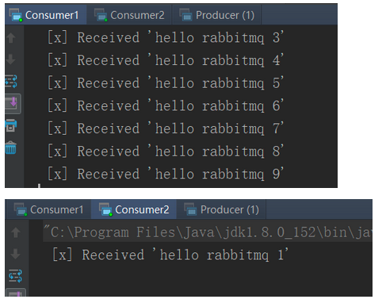
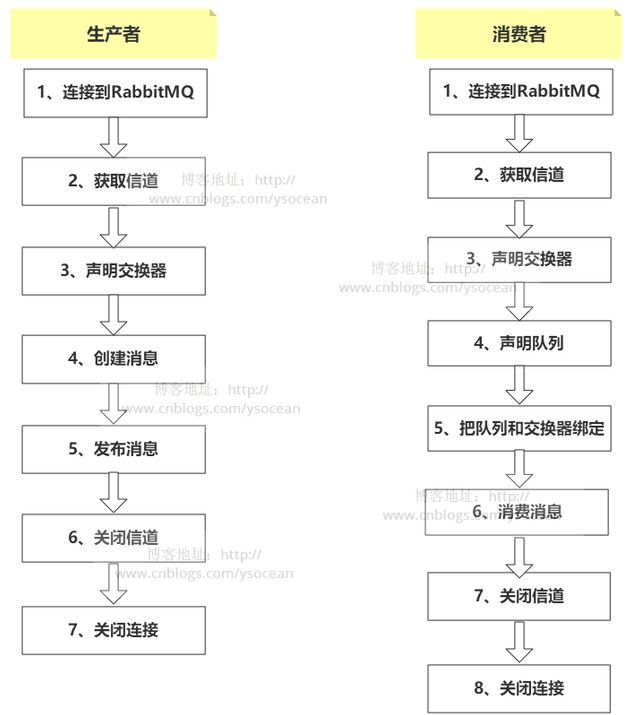

# RabbitMQ的五种队列

## 1、简单队列

 

**一个生产者对应一个消费者！！！**

```
生产者将消息发送到“hello”队列。消费者从该队列接收消息。
```

**①、pom文件**

　　必须导入rabbitmq 依赖包

```
	<dependency>
       <groupId>com.rabbitmq</groupId>
       <artifactId>amqp-client</artifactId>
       <version>3.4.1</version>
    </dependency>
```

**②、工具类**

```

import com.rabbitmq.client.Connection;
import com.rabbitmq.client.ConnectionFactory;

public class ConnectionUtil {

    public static Connection getConnection(String host,int port,String vHost,String userName,String passWord) throws Exception{
        //1、定义连接工厂
        ConnectionFactory factory = new ConnectionFactory();
        //2、设置服务器地址
        factory.setHost(host);
        //3、设置端口
        factory.setPort(port);
        //4、设置虚拟主机、用户名、密码
        factory.setVirtualHost(vHost);
        factory.setUsername(userName);
        factory.setPassword(passWord);
        //5、通过连接工厂获取连接
        Connection connection = factory.newConnection();
        return connection;
    }
}
```

③**、生产者 Producer**

```

import com.rabbitmq.client.Channel;
import com.rabbitmq.client.Connection;
import com.ys.utils.ConnectionUtil;

public class Producer {
    private final static String QUEUE_NAME = "hello";

    public static void main(String[] args) throws Exception{
        //1、获取连接
        Connection connection = ConnectionUtil.getConnection("192.168.146.251",5672,"/","guest","guest");
        //2、声明信道
        Channel channel = connection.createChannel();
        //3、声明(创建)队列
        channel.queueDeclare(QUEUE_NAME, false, false, false, null);
        //4、定义消息内容
        String message = "hello rabbitmq ";
        //5、发布消息
        channel.basicPublish("",QUEUE_NAME,null,message.getBytes());
        System.out.println("[x] Sent'"+message+"'");
        //6、关闭通道
        channel.close();
        //7、关闭连接
        connection.close();
    }
}
```

④**、消费者Consumer**

> 　　注意：这里消费者有自动确认消息和手动确认消息两种模式。

```

import com.rabbitmq.client.Channel;
import com.rabbitmq.client.Connection;
import com.rabbitmq.client.QueueingConsumer;
import com.ys.utils.ConnectionUtil;

public class Consumer {

    private final static String QUEUE_NAME = "hello";

    public static void main(String[] args) throws Exception{
        //1、获取连接
        Connection connection = ConnectionUtil.getConnection("192.168.146.251",5672,"/","guest","guest");
        //2、声明通道
        Channel channel = connection.createChannel();
        //3、声明队列
        channel.queueDeclare(QUEUE_NAME, false, false, false, null);
        //4、定义队列的消费者
        QueueingConsumer queueingConsumer = new QueueingConsumer(channel);
        //5、监听队列
        /**
            true:表示自动确认，只要消息从队列中获取，无论消费者获取到消息后是否成功消费，都会认为消息已经成功消费
            false:表示手动确认，消费者获取消息后，服务器会将该消息标记为不可用状态，等待消费者的反馈，
                   如果消费者一直没有反馈，那么该消息将一直处于不可用状态，并且服务器会认为该消费者已经挂掉，不会再给其
                   发送消息，直到该消费者反馈。
         */

        channel.basicConsume(QUEUE_NAME,true,queueingConsumer);
        //6、获取消息
        while (true){
            QueueingConsumer.Delivery delivery = queueingConsumer.nextDelivery();
            String message = new String(delivery.getBody());
            System.out.println(" [x] Received '" + message + "'");
        }
    }

}
```

## 2、work 模式

 

​		**一个生产者对应多个消费者，但是只能有一个消费者获得消息！！！**

　　**竞争消费者模式。**

**①、生产者**

```

import com.rabbitmq.client.Channel;
import com.rabbitmq.client.Connection;
import com.ys.utils.ConnectionUtil;

public class Producer {
    private final static String QUEUE_NAME = "work_queue";

    public static void main(String[] args) throws Exception{
        //1、获取连接
        Connection connection = ConnectionUtil.getConnection("192.168.146.251",5672,"/","guest","guest");
        //2、声明信道
        Channel channel = connection.createChannel();
        //3、声明(创建)队列
        channel.queueDeclare(QUEUE_NAME, false, false, false, null);
        //4、定义消息内容(发布多条消息)
        for(int i = 0 ; i < 10 ; i++){
            String message = "hello rabbitmq "+i;
            //5、发布消息
            channel.basicPublish("",QUEUE_NAME,null,message.getBytes());
            System.out.println("[x] Sent'"+message+"'");
            //模拟发送消息延时，便于演示多个消费者竞争接受消息
            Thread.sleep(i*10);
        }
        //6、关闭通道
        channel.close();
        //7、关闭连接
        connection.close();
    }
}
```

**②、消费者**

　　这里创建两个消费者

　　消费者1：每接收一条消息后休眠10毫秒

```

import com.rabbitmq.client.Channel;
import com.rabbitmq.client.Connection;
import com.rabbitmq.client.QueueingConsumer;
import com.ys.utils.ConnectionUtil;

public class Consumer1 {

    private final static String QUEUE_NAME = "work_queue";

    public static void main(String[] args) throws Exception{
        //1、获取连接
        Connection connection = ConnectionUtil.getConnection("192.168.146.251",5672,"/","guest","guest");
        //2、声明通道
        Channel channel = connection.createChannel();
        //3、声明队列
        channel.queueDeclare(QUEUE_NAME, false, false, false, null);
        //同一时刻服务器只会发送一条消息给消费者
        //channel.basicQos(1);

        //4、定义队列的消费者
        QueueingConsumer queueingConsumer = new QueueingConsumer(channel);
        //5、监听队列,手动返回完成状态
        channel.basicConsume(QUEUE_NAME,false,queueingConsumer);
        //6、获取消息
        while (true){
            QueueingConsumer.Delivery delivery = queueingConsumer.nextDelivery();
            String message = new String(delivery.getBody());
            System.out.println(" [x] Received '" + message + "'");
            //消费者1接收一条消息后休眠10毫秒
            Thread.sleep(10);
            //返回确认状态
            channel.basicAck(delivery.getEnvelope().getDeliveryTag(),false);
        }
    }

}
```

　　消费者2：每接收一条消息后休眠1000毫秒

```

import com.rabbitmq.client.Channel;
import com.rabbitmq.client.Connection;
import com.rabbitmq.client.QueueingConsumer;
import com.ys.utils.ConnectionUtil;


public class Consumer2 {

    private final static String QUEUE_NAME = "work_queue";

    public static void main(String[] args) throws Exception{
        //1、获取连接
        Connection connection = ConnectionUtil.getConnection("192.168.146.251",5672,"/","guest","guest");
        //2、声明通道
        Channel channel = connection.createChannel();
        //3、声明队列
        channel.queueDeclare(QUEUE_NAME, false, false, false, null);
        //同一时刻服务器只会发送一条消息给消费者
        //channel.basicQos(1);

        //4、定义队列的消费者
        QueueingConsumer queueingConsumer = new QueueingConsumer(channel);
        //5、监听队列，手动返回完成状态
        channel.basicConsume(QUEUE_NAME,false,queueingConsumer);
        //6、获取消息
        while (true){
            QueueingConsumer.Delivery delivery = queueingConsumer.nextDelivery();
            String message = new String(delivery.getBody());
            System.out.println(" [x] Received '" + message + "'");
            //消费者2接收一条消息后休眠1000毫秒
            Thread.sleep(1000);
            //返回确认状态
            channel.basicAck(delivery.getEnvelope().getDeliveryTag(),false);
        }
    }

}
```

**③、测试结果**

 

**④、分析结果**

​		**消费者1和消费者2获取到的消息内容是不同的，也就是说同一个消息只能被一个消费者获取。**

　　**消费者1和消费者2分别获取奇数条消息和偶数条消息，两种获取消息的条数是一样的。**

　　前面我们说这种模式是竞争消费者模式，一条队列被多个消费者监听，这里两个消费者，其中消费者1和消费者2在获取消息后分别休眠了10毫秒和1000毫秒，也就是说两个消费者获取消息的效率是不一样的，但是结果却是两者获得的消息条数是一样的，这根本就不构成竞争关系，那么我们应该怎么办才能让工作效率高的消费者获取消息更多，也就是消费者1获取消息更多呢？

> 　　PS：在增加一个消费者其实获取消息条数也是一样的，消费者1获取0,3,6,9，消费者2获取1,4,7，消费者3获取2,5,8

**⑤、能者多劳**

```
channel.basicQos(1);
```

　　增加如上代码，表示同一时刻服务器只会发送一条消息给消费者。消费者1和消费者2获取消息结果如下：

 

**⑥、应用场景**

　　效率高的消费者消费消息多。可以用来进行负载均衡。

## 3、发布/订阅模式

 

**一个消费者将消息首先发送到交换器，交换器绑定到多个队列，然后被监听该队列的消费者所接收并消费。**

　　ps:X表示交换器，在RabbitMQ中，交换器主要有四种类型:direct、fanout、topic、headers，这里的交换器是 fanout。下面我们会详细介绍这几种交换器。

　　**①、生产者**

```

import com.rabbitmq.client.Channel;
import com.rabbitmq.client.Connection;
import com.ys.utils.ConnectionUtil;

public class Producer {
    private final static String EXCHANGE_NAME = "fanout_exchange";

    public static void main(String[] args) throws Exception {
        //1、获取连接
        Connection connection = ConnectionUtil.getConnection("192.168.146.251", 5672, "/", "guest", "guest");
        //2、声明信道
        Channel channel = connection.createChannel();
        //3、声明交换器
        channel.exchangeDeclare(EXCHANGE_NAME, "fanout");
        //4、创建消息
        String message = "hello rabbitmq";
        //5、发布消息
        channel.basicPublish(EXCHANGE_NAME, "", null, message.getBytes());
        System.out.println("[x] Sent'" + message + "'");
        //6、关闭通道
        channel.close();
        //7、关闭连接
        connection.close();
    }
}
```

​		**②、消费者**

　　消费者1：

```

import com.rabbitmq.client.Channel;
import com.rabbitmq.client.Connection;
import com.rabbitmq.client.QueueingConsumer;
import com.ys.utils.ConnectionUtil;

public class Consumer1 {

    private final static String QUEUE_NAME = "fanout_queue_1";

    private final static String EXCHANGE_NAME = "fanout_exchange";

    public static void main(String[] args) throws Exception{
        //1、获取连接
        Connection connection = ConnectionUtil.getConnection("192.168.146.251",5672,"/","guest","guest");
        //2、声明通道
        Channel channel = connection.createChannel();
        //3、声明队列
        channel.queueDeclare(QUEUE_NAME, false, false, false, null);
        //4、绑定队列到交换机
        channel.queueBind(QUEUE_NAME,EXCHANGE_NAME,"");
        //同一时刻服务器只会发送一条消息给消费者
        channel.basicQos(1);
        //5、定义队列的消费者
        QueueingConsumer queueingConsumer = new QueueingConsumer(channel);
        //6、监听队列,手动返回完成状态
        channel.basicConsume(QUEUE_NAME,false,queueingConsumer);
        //6、获取消息
        while (true){
            QueueingConsumer.Delivery delivery = queueingConsumer.nextDelivery();
            String message = new String(delivery.getBody());
            System.out.println(" 消费者1：" + message + "'");
            //消费者1接收一条消息后休眠10毫秒
            Thread.sleep(10);
            //返回确认状态
            channel.basicAck(delivery.getEnvelope().getDeliveryTag(),false);
        }
    }

}
```

　　消费者2：

```

import com.rabbitmq.client.Channel;
import com.rabbitmq.client.Connection;
import com.rabbitmq.client.QueueingConsumer;
import com.ys.utils.ConnectionUtil;


public class Consumer2 {

    private final static String QUEUE_NAME = "fanout_queue_2";

    private final static String EXCHANGE_NAME = "fanout_exchange";

    public static void main(String[] args) throws Exception{
        //1、获取连接
        Connection connection = ConnectionUtil.getConnection("192.168.146.251",5672,"/","guest","guest");
        //2、声明通道
        Channel channel = connection.createChannel();
        //3、声明队列
        channel.queueDeclare(QUEUE_NAME, false, false, false, null);
        //4、绑定队列到交换机
        channel.queueBind(QUEUE_NAME,EXCHANGE_NAME,"");
        //同一时刻服务器只会发送一条消息给消费者
        channel.basicQos(1);
        //5、定义队列的消费者
        QueueingConsumer queueingConsumer = new QueueingConsumer(channel);
        //6、监听队列,手动返回完成状态
        channel.basicConsume(QUEUE_NAME,false,queueingConsumer);
        //6、获取消息
        while (true){
            QueueingConsumer.Delivery delivery = queueingConsumer.nextDelivery();
            String message = new String(delivery.getBody());
            System.out.println(" 消费者2：" + message + "'");
            //消费者2接收一条消息后休眠10毫秒
            Thread.sleep(1000);
            //返回确认状态
            channel.basicAck(delivery.getEnvelope().getDeliveryTag(),false);
        }
    }
}
```

　　**注意：消费者1和消费者2两者监听的队列名称是不一样的，我们可以通过前台管理系统看到：**

 

　　**③、测试结果**

 

消费1和消费者2都消费了该消息。

　　ps：这是因为消费者1和消费者2都监听了被同一个交换器绑定的队列。如果消息发送到没有队列绑定的交换器时，消息将丢失，因为**交换器没有存储消息的能力，消息只能存储在队列中。**

　**④、应用场景**

　　比如一个商城系统需要在管理员上传商品新的图片时，前台系统必须更新图片，日志系统必须记录相应的日志，那么就可以将两个队列绑定到图片上传交换器上，一个用于前台系统更新图片，另一个用于日志系统记录日志。

## 4、路由模式

 

生产者将消息发送到direct交换器，在绑定队列和交换器的时候有一个路由key，生产者发送的消息会指定一个路由key，那么消息只会发送到相应key相同的队列，接着监听该队列的消费者消费消息。

　　**也就是让消费者有选择性的接收消息。**

　　**①、生产者**

```

import com.rabbitmq.client.Channel;
import com.rabbitmq.client.Connection;
import com.ys.utils.ConnectionUtil;

public class Producer {
    private final static String EXCHANGE_NAME = "direct_exchange";

    public static void main(String[] args) throws Exception {
        //1、获取连接
        Connection connection = ConnectionUtil.getConnection("192.168.146.251", 5672, "/", "guest", "guest");
        //2、声明信道
        Channel channel = connection.createChannel();
        //3、声明交换器，类型为direct
        channel.exchangeDeclare(EXCHANGE_NAME, "direct");
        //4、创建消息
        String message = "hello rabbitmq";
        //5、发布消息
        channel.basicPublish(EXCHANGE_NAME, "update", null, message.getBytes());
        System.out.println("生产者发送" + message + "'");
        //6、关闭通道
        channel.close();
        //7、关闭连接
        connection.close();
    }
}
```

​		**②、消费者**

　　消费者1：

```

import com.rabbitmq.client.Channel;
import com.rabbitmq.client.Connection;
import com.rabbitmq.client.QueueingConsumer;
import com.ys.utils.ConnectionUtil;

public class Consumer1 {

    private final static String QUEUE_NAME = "direct_queue_1";

    private final static String EXCHANGE_NAME = "direct_exchange";

    public static void main(String[] args) throws Exception{
        //1、获取连接
        Connection connection = ConnectionUtil.getConnection("192.168.146.251",5672,"/","guest","guest");
        //2、声明通道
        Channel channel = connection.createChannel();
        //3、声明队列
        channel.queueDeclare(QUEUE_NAME, false, false, false, null);
        //4、绑定队列到交换机，指定路由key为update
        channel.queueBind(QUEUE_NAME,EXCHANGE_NAME,"update");
        channel.queueBind(QUEUE_NAME,EXCHANGE_NAME,"delete");
        channel.queueBind(QUEUE_NAME,EXCHANGE_NAME,"add");
        //同一时刻服务器只会发送一条消息给消费者
        channel.basicQos(1);
        //5、定义队列的消费者
        QueueingConsumer queueingConsumer = new QueueingConsumer(channel);
        //6、监听队列,手动返回完成状态
        channel.basicConsume(QUEUE_NAME,false,queueingConsumer);
        //6、获取消息
        while (true){
            QueueingConsumer.Delivery delivery = queueingConsumer.nextDelivery();
            String message = new String(delivery.getBody());
            System.out.println(" 消费者1：" + message + "'");
            //消费者1接收一条消息后休眠10毫秒
            Thread.sleep(10);
            //返回确认状态
            channel.basicAck(delivery.getEnvelope().getDeliveryTag(),false);
        }
    }

}
```

　　消费者2：

```

import com.rabbitmq.client.Channel;
import com.rabbitmq.client.Connection;
import com.rabbitmq.client.QueueingConsumer;
import com.ys.utils.ConnectionUtil;

public class Consumer2 {

    private final static String QUEUE_NAME = "direct_queue_2";

    private final static String EXCHANGE_NAME = "direct_exchange";

    public static void main(String[] args) throws Exception{
        //1、获取连接
        Connection connection = ConnectionUtil.getConnection("192.168.146.251",5672,"/","guest","guest");
        //2、声明通道
        Channel channel = connection.createChannel();
        //3、声明队列
        channel.queueDeclare(QUEUE_NAME, false, false, false, null);
        //4、绑定队列到交换机，指定路由key为select
        channel.queueBind(QUEUE_NAME,EXCHANGE_NAME,"select");
        //同一时刻服务器只会发送一条消息给消费者
        channel.basicQos(1);
        //5、定义队列的消费者
        QueueingConsumer queueingConsumer = new QueueingConsumer(channel);
        //6、监听队列,手动返回完成状态
        channel.basicConsume(QUEUE_NAME,false,queueingConsumer);
        //6、获取消息
        while (true){
            QueueingConsumer.Delivery delivery = queueingConsumer.nextDelivery();
            String message = new String(delivery.getBody());
            System.out.println(" 消费者1：" + message + "'");
            //消费者2接收一条消息后休眠10毫秒
            Thread.sleep(1000);
            //返回确认状态
            channel.basicAck(delivery.getEnvelope().getDeliveryTag(),false);
        }
    }

}
```

​		**③、测试结果**

　　我们首先看代码，生产者发布消息，指定的路由key为update。消费者1绑定队列和交换机时key分别是update/delete/add；消费者2绑定队列和交换器时key是select。

　　所以我们可以猜测生产者发送的消息，只有消费者1能够接收并消费，而消费者2是不能接收的。

 

　　**④、应用场景**

　　利用消费者能够有选择性的接收消息的特性，比如我们商城系统的后台管理系统对于商品进行修改、删除、新增操作都需要更新前台系统的界面展示，而查询操作确不需要，那么这两个队列分开接收消息就比较好。

## 5、主题模式

 

上面的路由模式是根据路由key进行完整的匹配（完全相等才发送消息），这里的通配符模式通俗的来讲就是模糊匹配。

　　**符号“#”表示匹配一个或多个词，符号“\*”表示匹配一个词。**

　　**①、生产者**

```

import com.rabbitmq.client.Channel;
import com.rabbitmq.client.Connection;
import com.ys.utils.ConnectionUtil;

public class Producer {
    private final static String EXCHANGE_NAME = "topic_exchange";

    public static void main(String[] args) throws Exception {
        //1、获取连接
        Connection connection = ConnectionUtil.getConnection("192.168.146.251", 5672, "/", "guest", "guest");
        //2、声明信道
        Channel channel = connection.createChannel();
        //3、声明交换器，类型为direct
        channel.exchangeDeclare(EXCHANGE_NAME, "topic");
        //4、创建消息
        String message = "hello rabbitmq111";
        //5、发布消息
        channel.basicPublish(EXCHANGE_NAME, "update.Name", null, message.getBytes());
        System.out.println("生产者发送" + message + "'");
        //6、关闭通道
        channel.close();
        //7、关闭连接
        connection.close();
    }
}
```

​	　**②、消费者**

　　消费者1：

```

import com.rabbitmq.client.Channel;
import com.rabbitmq.client.Connection;
import com.rabbitmq.client.QueueingConsumer;
import com.ys.utils.ConnectionUtil;

public class Consumer1 {

    private final static String QUEUE_NAME = "topic_queue_1";

    private final static String EXCHANGE_NAME = "topic_exchange";

    public static void main(String[] args) throws Exception{
        //1、获取连接
        Connection connection = ConnectionUtil.getConnection("192.168.146.251",5672,"/","guest","guest");
        //2、声明通道
        Channel channel = connection.createChannel();
        //3、声明队列
        channel.queueDeclare(QUEUE_NAME, false, false, false, null);
        //4、绑定队列到交换机，指定路由key为update.#
        channel.queueBind(QUEUE_NAME,EXCHANGE_NAME,"update.#");
        //同一时刻服务器只会发送一条消息给消费者
        channel.basicQos(1);
        //5、定义队列的消费者
        QueueingConsumer queueingConsumer = new QueueingConsumer(channel);
        //6、监听队列,手动返回完成状态
        channel.basicConsume(QUEUE_NAME,false,queueingConsumer);
        //6、获取消息
        while (true){
            QueueingConsumer.Delivery delivery = queueingConsumer.nextDelivery();
            String message = new String(delivery.getBody());
            System.out.println(" 消费者1：" + message + "'");
            //消费者1接收一条消息后休眠10毫秒
            Thread.sleep(10);
            //返回确认状态
            channel.basicAck(delivery.getEnvelope().getDeliveryTag(),false);
        }
    }

}
```

　　消费2：

```

import com.rabbitmq.client.Channel;
import com.rabbitmq.client.Connection;
import com.rabbitmq.client.QueueingConsumer;
import com.ys.utils.ConnectionUtil;

public class Consumer2 {

    private final static String QUEUE_NAME = "topic_queue_2";

    private final static String EXCHANGE_NAME = "topic_exchange";

    public static void main(String[] args) throws Exception{
        //1、获取连接
        Connection connection = ConnectionUtil.getConnection("192.168.146.251",5672,"/","guest","guest");
        //2、声明通道
        Channel channel = connection.createChannel();
        //3、声明队列
        channel.queueDeclare(QUEUE_NAME, false, false, false, null);
        //4、绑定队列到交换机，指定路由key为select.#
        channel.queueBind(QUEUE_NAME,EXCHANGE_NAME,"select.#");
        //同一时刻服务器只会发送一条消息给消费者
        channel.basicQos(1);
        //5、定义队列的消费者
        QueueingConsumer queueingConsumer = new QueueingConsumer(channel);
        //6、监听队列,手动返回完成状态
        channel.basicConsume(QUEUE_NAME,false,queueingConsumer);
        //6、获取消息
        while (true){
            QueueingConsumer.Delivery delivery = queueingConsumer.nextDelivery();
            String message = new String(delivery.getBody());
            System.out.println(" 消费者1：" + message + "'");
            //消费者2接收一条消息后休眠10毫秒
            Thread.sleep(1000);
            //返回确认状态
            channel.basicAck(delivery.getEnvelope().getDeliveryTag(),false);
        }
    }

}
```

　　**③、分析结果**

​		生产者发送消息绑定的路由key为update.Name；消费者1监听的队列和交换器绑定路由key为update.#；消费者2监听的队列和交换器绑定路由key为select.#。

　　很显然，消费者1会接收到消息，而消费者2接收不到。

## **6、四种交换器**

​		前面五种队列模式介绍完了，但是实际上只有三种，第一种简单队列，第二种工作模式，剩下的三种都是和交换器绑定的合起来称为一种，这小节我们就来详细介绍交换器。

　　交换器分为四种，分别是：direct、fanout、topic和 headers。

　　前面三种分别对应路由模式、发布订阅模式和通配符模式，headers 交换器允许匹配 AMQP 消息的 header  而非路由键，除此之外，header 交换器和 direct 交换器完全一致，但是性能却差很多，因此基本上不会用到该交换器，这里也不详细介绍。

### **①、direct**

　　如果路由键完全匹配的话，消息才会被投放到相应的队列。

 

### **②、fanout**

　　当发送一条消息到fanout交换器上时，它会把消息投放到所有附加在此交换器上的队列。

 

### **③、topic**

　　设置模糊的绑定方式，“*”操作符将“.”视为分隔符，匹配单个字符；“#”操作符没有分块的概念，它将任意“.”均视为关键字的匹配部分，能够匹配多个字符。

 

## 7、总结

　　关于 RabbitMQ 的五种队列，其实实际使用最多的是最后一种主题模式，通过模糊匹配，使得操作更加自如。那么我们总结一下有交换器参与的队列（最后三种队列）工作方式如下：

 

