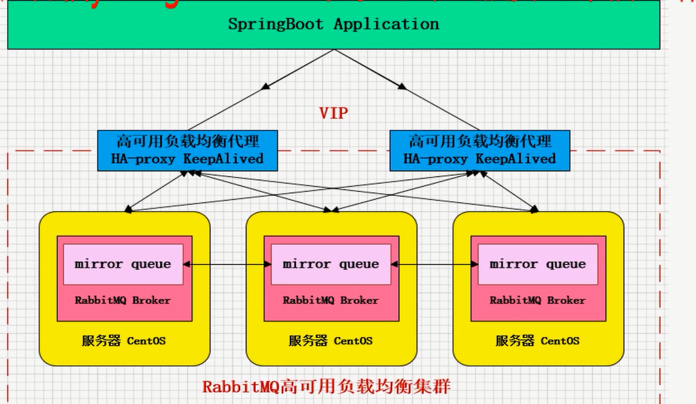

# 分布式消息队列应用场景和思考

 

 

 

## 如何进行技术选型

 

# RabbitMQ

**安装：**
我选择的方式
https://www.cnblogs.com/fengyumeng/p/11133924.html

配置文件
https://www.cnblogs.com/wyt007/p/9073316.html

用户添加
https://www.cnblogs.com/FengGeBlog/p/13905541.html

**添加远程登录用户因为guest是不允许非localhost环境登录的**

rabbitmqctl add_user admin amdin;

rabbitmqctl set_permissions -p / admin ".*" ".*" ".*"

rabbitmqctl set_user_tags admin administrator

执行命名后就能用过远程使用admin用户登录了

**分布式消息队列（MQ)认知提升**

**RabbitMQ实战**

**RabbitMQ可靠性投递基础组件封装**

## RabbitMQ的四中集群架构

### 1.主备模式

​		Warren(兔子窝),一个主/备方案(主节点如果挂了,从节点提供服务,和 Activemq利用 Zookeeper做主/备一样)

 

####  主备模式-HaProxy配置

### 2.远程模式

​	远距离通信和复制，可以实现双活的一种模式，简称Shovel模式。

​	所谓shovel就是我们可以把消息进行不同数据中心的复制工作，可以跨地域让两个mq集群互联

#### shovel架构模型

 

#### shovel集群的拓扑图

 

#### shovel集群的配置步骤

### 3.镜像模式

​		集群模式非常经典的就是mirror镜像模式，保证100%数据不丢失

​		在实际工作中用的最多的，并且实现集群非常的简单，一般互联网大厂都会构建这种镜像集群模式

#### 镜像队列优点

#### RabbitMQ集群架构图

### 4.多活模式

​		这种模式也是先异地数据复制的主流模式，因为shovel模式配置比较复杂，所以一般来说实现异地集群都是使用这种双活或者多活模型来实现的。

​		这种模型需要依赖RabbitMQ的federation插件，可以实现可持续的可靠AMQP数据通信，多活模式实际配置与应用非常简单。
​		RabbitMQ部署架构采用双中心模式（多中心），那么在两套（或者多套）数据中心各部署一套RabbitMQ集群，各中心的RabbitMQ服务除了需要为业务提供正常的消息服务外，中心之间还需要实现部分队列消息共享

#### 多活集群架构图

 

#### 多活模式-Federation插件

 

# RabbitMQ实战

## 目录

**AMQP核心概念**

**急速安装与入门**

**RabbitMQ核心api**

**RabbitMQ高级特性**

**RabbitMQ集群架构实操**

**与spring-boot整合实战-生产端与消费端详解**

**MQ基础组件封装与实战**

## 什么是AMQP高级消息队列协议？

## AMQP协议模型

## AMQP核心概念

**Server**: 又称broker,接受客户端的连接，实现AMQP实体服务

**Connettion: **连接，应用程序与Broker的网络连接

**Channel:** 网络信道，几乎所有的操作都在Channel中进行，Channel是进行消息读写的通道，客户端可以建立多个Channel，每个Channel代表一个会话任务

**Message:**消息,服务器和应用程序之间传送的数据,由 Properties和Body组成。 Properties可以对消息进行修饰,比如消息的优先级、延迟等高级特性;Body则就是消息体内容。

 **Virtual host:**虚拟地址,用于进行逻辑隔离,最上层的消息路由一个Virtual host里面可以有若干个 Exchange和 Queue,同一个 VirtuaHost里面不能有相同名称的 Exchange或 Queue

**Exchange:**交换机,接收消息,根据路由键转发消息到绑定的队列

**Binding:** Exchange和 Queue之间的虚拟连接, binding中可以包含 routing key

**Routing key:-**个路由规则,虛拟机可用它来确定如何路由一个特定消息

**Queue:**也称为 Message Queue,消息队列,保存消息并将它们转发给消费者

## 认识RabbitMQ

​		Rabbitmq是一个开源的消息代理和队列服务器,用来通过普通协议在完全不同的应用之间共享数据, Rabbitmq是使用 Erlang语言来编写的,并且 Rabbitmq是基于AMQP协议的。

## RabbitMQ高性能的原因

 

## RabbitMQ的整体架构图

 

## 冥等性的概念

### 冥等性是什么

 

### MQ消费端-冥等保证

在海量订单产生的业务高峰期,如何避兔消息的重复消费向题?

消费端实现幕等性,就意味着,我们的消息永远不会消费多次,即时我们收到了多条一样的消息

#### 业界主流的幂等性操作:

√唯一ID+指纹码机制,利用数据库主键去重

 √利用 Redis的原子性去实现
 

### RabbitMQ和springboot整合

#### 生产端

 	核心配置

spring.rabbitmq.publisher-confirms=true
spring.rabbitmq.publisher-returns=true
spring.rabbitmg.template mandatory=true

#### 消费端

​	核心配置

spring.rabbitmq.listener.simple.acknowledge-mode = MANUAL
spring.rabbitmq.listener.simple.concurrency = 1
spring.rabbitmq.listener.simple.max-concurrency = 5

#### @RabbitListener注解使用

 

PS:由于类配置写在代码里非常不友好，所以强烈建议大家使用配置文件配置

##  RabbitMQ基础组件封装

### 基础组件封装的关键点

**一线大厂的MQ组件实现思路和架构设计方案**
**基础组件封装设计-迅速消息发送**
**基础组件封装设计-确认消息发送**
**基础组件封装设计-延迟消息发送**

### 基础组件功能点

 

### 可靠性消息投递

