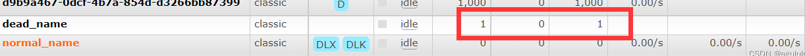

# 死信队列

先从概念解释上搞清楚这个定义，死信，顾名思义就是无法被消费的消息，字面意思可以这样理 解，一般来说，producer 将消息投递到 broker 或者直接到 queue 里了，consumer 从 queue 取出消息进行消费，但某些时候由于特定的原因导致queue中的某些消息无法被消费，这样的消息如果没有后续的处理，就变成了死信，有死信自然就有了死信队列。

**应用场景:**为了保证订单业务的消息数据不丢失，需要使用到 RabbitMQ 的死信队列机制，当消息 消费发生异常时，将消息投入死信队列中.还有比如说: 用户在商城下单成功并点击去支付后在指定时间未支付时自动失效。

## 死信来源

    消息 TTL 过期
    队列达到最大长度(队列满了，无法再添加数据到 mq 中)
    消息被拒绝(basic.reject 或 basic.nack)并且 requeue=false.

## 实战

原理图：

 

### 生产者：

```
public class Producer {
    //普通交换机的名字
    public static final String NORMAL_EXCHANGE="normal_exchange";
 
    public static void main(String[] args) throws Exception {
        Channel channel = RabbitmqUtil.getChannel();
        /**
         * 这个参数主要用来修改消息的
         */
        //1.模拟消息时间过期条件  消息过期时间设置10s
//        AMQP.BasicProperties properties=new AMQP.BasicProperties().builder().expiration("10000").build();
        //发送10条消息
       for (int i = 0; i < 10; i++) {
            String message="info"+i;
           channel.basicPublish(NORMAL_EXCHANGE,"zhangsan",null,message.getBytes("UTF-8"));
        }
 
    }
}
```

### 消费者1：声明普通队列和死信队列 

```
    public class Consumer01 {
        /**
         *   造成消息进入死信队里的原因三点：
         *              消费者拒绝消费
         *              消息时间过期
         *              队列长度已满，消息无法进入
         *
         *   死信队列的消息不是直接由生产者将消息发送进入队列的，而是满足以上三种条件后，
         *   被普通队列将对应的消息传到死信交换机，然后死信交换机又将消息传入死信队列然后消息被消费者消费。
         */
        //普通交换机的名字
        public static final String NORMAL_EXCHANGE="normal_exchange";
        //死信交换机的名字
        public static final String DEAD_EXCHANGE="dead_exchange";
        //普通队列的名字
        public static final String NORMAL_NAME="normal_name";
        //死信队列的名字
        public static final String DEAD_NAME="dead_name";
     
        public static void main(String[] args) throws Exception{
            //获取信道
            Channel channel = RabbitmqUtil.getChannel();
            //声明普通交换机  类型为direct
            channel.exchangeDeclare(NORMAL_EXCHANGE, BuiltinExchangeType.DIRECT);
            //声明死信交换机  类型direct
            channel.exchangeDeclare(DEAD_EXCHANGE,BuiltinExchangeType.DIRECT);
     
            /**
             * 由于死信交换机的消息来源于普通队列当中，所以声明普通队列时，要传入对应的参数
                这个参数主要是用来修改队列的
             * 这两个就相当于将普通队列触发条件后的消息可以转发到死信交换机中
             * var5.put("x-dead-letter-exchange",NORMAL_EXCHANGE);
             *  var5.put("x-dead-letter-routing-key","lisi");
             */
            Map<String, Object> var5=new HashMap<>();
            //正常队列设置要转发的死信交换机  key都是固定的
            var5.put("x-dead-letter-exchange",DEAD_EXCHANGE);
            //正常队列设置死信队列的routingKey
            var5.put("x-dead-letter-routing-key","lisi");
            //1.设置消息过期时间
    //        var5.put("x-message-ttl",10000);
            //2.设置正常队列长度 模拟队列满了的情况
    //        var5.put("x-max-length",6);
            //声明普通队列
            channel.queueDeclare(NORMAL_NAME,false,false,false,var5);
     
            //声明死信队列
            channel.queueDeclare(DEAD_NAME,false,false,false,null);
     
            //普通队列与普通交换机绑定
            channel.queueBind(NORMAL_NAME,NORMAL_EXCHANGE,"zhangsan");
            //死信队列与死信交换机的绑定
            channel.queueBind(DEAD_NAME,DEAD_EXCHANGE,"lisi");
     
     
            System.out.println("消费者等待消息接收.........");
            //消息发送过来回调函数
            DeliverCallback deliverCallback=(consumerTag,message)->{
                String msg=new String(message.getBody(),"UTF-8");
                if(msg.equals("info5")){
                    System.out.println("被消费者1拒绝的消息"+msg);
                    channel.basicReject(message.getEnvelope().getDeliveryTag(),false);
                }else {
                    System.out.println("消费者1消费的普通队列消息是："+msg);
                    channel.basicAck(message.getEnvelope().getDeliveryTag(),false);
                }
     
            };
     
            //消费者消费消息
            channel.basicConsume(NORMAL_NAME,false, deliverCallback, CancelCallback->{});
     
        }
    }
```

### 消费者2：

    public class Consumer02 {
        //死信队列的名字
        public static final String DEAD_NAME="dead_name";
     
        public static void main(String[] args) throws Exception{
            Channel channel = RabbitmqUtil.getChannel();
            System.out.println("消费者等待消息接收.........");
            //消费者消费消息
            //消息发送过来回调函数
            DeliverCallback deliverCallback=(consumerTag, message)->{
                System.out.println("消费者2消费的死信队列消息是："+new String(message.getBody(),"UTF-8"));
            };
     
            //消费者消费消息
            channel.basicConsume(DEAD_NAME,true, deliverCallback, CancelCallback->{});
        }
    }
### Web界面管理图：

队列长度满了，此时消费者1无法消费队列中的消息，但普通对列的长度设置了6，所以生产者发送的消息会有4条会被送入死信队列当中。


消息时间过期，消费者1无法消费导致消息堆积在普通队列当中，然后消息设置了过期时间，时间一到就会被发送到死信队列当中。


消息被拒掉，这里指定哪一条消息被消费者1拒绝接收，消费者1要修改为手动应答，并且设置死信对应的参数，这条被拒绝的消息将会被死信交换机接收，然后发送给死信队列被另外一个消费者消费。



**注意：每次参数的修改，应该从新在Web管理界面将对应的队列或者交换机删除，否则重新启动就会报错。**

# 延迟队列

## 延迟队列概念

延时队列,队列内部是有序的，最重要的特性就体现在它的延时属性上，延时队列中的元素是希望 在指定时间到了以后或之前取出和处理，简单来说，延时队列就是用来存放需要在指定时间被处理的元素的队列。延时队列就是特殊的死信队列。

## 延迟队列的使用场景

    订单在十分钟之内未支付则自动取消。
    新创建的店铺，如果在十天内都没有上传过商品，则自动发送消息提醒。
    用户注册成功后，如果三天内没有登陆则进行短信提醒。
    用户发起退款，如果三天内没有得到处理则通知相关运营人员。

## RabbitMQ中的TTL

TTL 是什么呢？TTL 是 RabbitMQ 中一个消息或者队列的属性，表明一条消息或者该队列中的所有 消息的最大存活时间，单位是毫秒。

换句话说，如果一条消息设置了 TTL 属性或者进入了设置 TTL 属性的队列，那么这 条消息如果在 TTL 设置的时间内没有被消费，则会成为"死信"。如果同时配置了队列的 TTL 和消息的 TTL，那么较小的那个值将会被使用，有两种方式设置 TTL。

### 消息设置TTL

直接在生产者这边设置消息的过期时间TTL

     template.convertAndSend("X","XC",message,msg->{
                msg.getMessageProperties().setExpiration(ttime);
                return msg;

 在创建队列的时候设置消息的过期时间，作为普通队列参数存在。

     //声明当前队列消息的TTL
            args.put("x-message-ttl", 10000);

 二者区别：

如果设置了队列的 TTL 属性，那么一旦消息过期，就会被队列丢弃(如果配置了死信队列被丢到死信队 列中)，而第二种方式，消息即使过期，也不一定会被马上丢弃，因为消息是否过期是在即将投递到消费者之前判定的，如果当前队列有严重的消息积压情况，则已过期的消息也许还能存活较长时间；另外，还需 要注意的一点是，如果不设置 TTL，表示消息永远不会过期，如果将 TTL 设置为 0，则表示除非此时可以 直接投递该消息到消费者，否则该消息将会被丢弃

## 延迟队列实战 

结合Springboot，先前的交换机和队列都是在对应的消费者中创建，整合springboot后，将加油IOC容器管理。

 

配置类TtlQueueConfig：声明普通交换机、死信交换机以及队列等

QA、QB队列是设定在队列中设置的延迟时间，如果每增加一个新的时间需求，就要新增一个队列，这样会徒增很多队列，并且一旦时间过期，消息会被丢失（设置死信就放入死信）。QC在生产者设置的延时时间，时间过期不会马上死亡，MQ只会检查第一个消息是否过去，也就是说第2个、第3个如果过期会被阻塞在队列当中。

    @Configuration
    public class TtlQueueConfig {
        //普通交换机的名字
        public static final String X_EXCHANGE="X";
        //死信交换机的名字
        public static final String Y_DEAD_EXCHANGE="Y";
        //普通队列的名字
        public static final String QUEUE_A="QA";
        public static final String QUEUE_B="QB";
        //死信队列的名字
        public static final String DEAD_QUEUE_B="QD";
        //普通队列的名字
        public static final String QUEUE_C="QC";
       //声明普通交换机
        @Bean("xEXCHANGE")
        public Exchange xEXCHANGE(){
           return new DirectExchange(X_EXCHANGE);
        }
        //声明死信交换机
        @Bean("yEXCHANGE")
        public Exchange yEXCHANGE(){
            return new DirectExchange(Y_DEAD_EXCHANGE);
        }
        //声明普通对列A
        @Bean("queueA")
        public Queue queueA(){
            Map<String, Object> args = new HashMap<>(3);
            //声明当前队列绑定的死信交换机
            args.put("x-dead-letter-exchange",Y_DEAD_EXCHANGE);
            //声明当前队列的死信路由
            args.put("x-dead-letter-routing-key", "YD");
            //声明当前队列消息的TTL
            args.put("x-message-ttl", 10000);
            return QueueBuilder.durable(QUEUE_A).withArguments(args).build();
        }
        //声明普通对列B
        @Bean("queueB")
        public Queue queueB(){
            Map<String, Object> args = new HashMap<>(3);
            //声明当前队列绑定的死信交换机
            args.put("x-dead-letter-exchange",Y_DEAD_EXCHANGE);
            //声明当前队列的死信路由
            args.put("x-dead-letter-routing-key", "YD");
            //声明当前队列消息的TTL
            args.put("x-message-ttl", 40000);
            return QueueBuilder.durable(QUEUE_B).withArguments(args).build();
        }
        //声明队列C
        @Bean("queueC")
        public Queue queueC(){
            Map<String, Object> args = new HashMap<>(3);
            //声明当前队列绑定的死信交换机
            args.put("x-dead-letter-exchange",Y_DEAD_EXCHANGE);
            //声明当前队列的死信路由
            args.put("x-dead-letter-routing-key", "YD");
            return QueueBuilder.durable(QUEUE_C).withArguments(args).build();
        }
        //声明死信队列 QD
        @Bean("queueD")
        public Queue queueD(){
            return new Queue(DEAD_QUEUE_B);
        }
        //声明绑定
        @Bean
        public Binding queueaAindingX(@Qualifier("queueA") Queue queue, @Qualifier("xEXCHANGE") DirectExchange xEXCHANGE){
            return BindingBuilder.bind(queue).to(xEXCHANGE).with("XA");
        }
        @Bean
        public Binding queueaBindingX(@Qualifier("queueB") Queue queue, @Qualifier("xEXCHANGE") DirectExchange xEXCHANGE){
            return BindingBuilder.bind(queue).to(xEXCHANGE).with("XB");
        }
        //队列C与死信交换机绑定
        @Bean
        public  Binding queueCBingX(@Qualifier("queueC") Queue queue,@Qualifier("xEXCHANGE")DirectExchange CExchange){
            return BindingBuilder.bind(queue).to(CExchange).with("XC");
        }
        @Bean
        public Binding deadLetterBindingQD(@Qualifier("queueD") Queue queue, @Qualifier("yEXCHANGE") DirectExchange directExchange){
            return BindingBuilder.bind(queue).to(directExchange).with("YD");
        }
    }

生产者：这里的延迟队列会有问题，当第一个消息的延时过长，会导致后面的延时消息短的无法被马上处理，只能等到第一个消息处理完以后才能被处理。要解决这样的问题，需要延迟交换机，在交换机那里做延迟，然后放到队列中排队处理。

    @Slf4j
    @RestController
    @RequestMapping("/ttl")
    public class SendMessageController {
        //routingKEy
        public static final String  DELAY_KEY="delay_key";
        //交换机的名字
        public static final String  DELAY_EXCHANGE="delay_exchange";
        @Autowired
        private RabbitTemplate template;
     
        @GetMapping("sendMsg/{message}")
        public void sendMsg(@PathVariable String message){
            log.info("当前时间：{},发送一条消息给两个TTL队列：{}",new Date(),message);
            template.convertAndSend("X","XA","消息来自ttl为10S的队列:"+message);
            template.convertAndSend("X","XB","消息来自ttl为40S的队列:"+message);
        }
     
        /**
         * 由于在队列中消息是排队的如果第一条消息延时过长，他后面的延时时间短的就无法提前被处理
         *
         * 解决这个问题，就需要采用基于插件的延迟队列模式，这里是将交换机设置成为了延迟
         *
         */
        //这里模拟生产者直接发送延时消息，而不是在队列中设置延时
        @GetMapping("sendMsg/{message}/{ttime}")
        public void sendMsg(@PathVariable String message,@PathVariable String ttime){
            template.convertAndSend("X","XC",message,msg->{
                msg.getMessageProperties().setExpiration(ttime);
                return msg;
            });
            log.info("当前时间：{},发送一条时长{}毫秒 TTL 信息给队列 C:{}", new Date(),ttime, message);
        }
     
    }

消费者：

    @Slf4j
    @Component
    public class DeadQueueConsumer {
     
        //注解监听
        @RabbitListener(queues = "QD")
         public void receiveQaD(Message message, Channel channel) throws Exception{
            String msg = new String(message.getBody());
            log.info("当前时间：{},收到死信队列信息{}", new Date().toString(), msg);
         }
    }

插件实现延迟队列：

先要下载插件：rabbitmq_delayed_message_exchange

官网下载：Community Plugins — RabbitMQ

然后解压放置到 RabbitMQ 的插件目录。 进入 RabbitMQ 的安装目录下的 plgins 目录，执行下面命令让该插件生效，然后重启 RabbitMQ

/usr/lib/rabbitmq/lib/rabbitmq_server-3.8.8/plugins

rabbitmq-plugins enable rabbitmq_delayed_message_exchange

 

 插件延迟队列实现图：

 

 配置类：

    @Configuration
    public class DelayExchangeConfig {
        //交换机的名字
        public static final String  DELAY_EXCHANGE="delay_exchange";
        //队列的名字
        public static final String  QUEUE_NAME="delay_queue";
        //routingKEy
        public static final String  DELAY_KEY="delay_key";
     
        //声明队列
        @Bean
        public Queue delayQueue(){
            return new Queue(QUEUE_NAME);
        }
        //声明交换机,自定义交换机-------延迟交换机
        @Bean
        public CustomExchange delayExchange(){
            Map<String, Object> args = new HashMap<>();
            //自定义交换机的类型
            args.put("x-delayed-type", "direct");
            return new CustomExchange(DELAY_EXCHANGE,"x-delayed-message",true,false,
                    args);
        }
        //绑定
        @Bean
        public Binding bindingDelayedQueue(@Qualifier("delayQueue") Queue queue,
                                           @Qualifier("delayExchange") CustomExchange
                                                   delayedExchange) {
     
            return BindingBuilder.bind(queue).to(delayedExchange).with(DELAY_KEY).noargs();
        }
    }

 模拟延迟交换机生产者：

        /**
         * 模拟延迟交换机的作用，基于插件的
         * @param message
         * @param ttime
         */
        @GetMapping("sendDelayMsg/{message}/{ttime}")
        public void sendMsg(@PathVariable String message,@PathVariable Integer ttime){
            template.convertAndSend(DELAY_EXCHANGE,DELAY_KEY,message,msg->{
                msg.getMessageProperties().setDelay(ttime);
                return msg;
            });
            log.info("当前时间：{},发送一条时长{}毫秒 信息给队列 delay_queue:{}", new Date(),ttime, message);
        }

消费者：

    @Slf4j
    @Component
    public class DelayExchangeConsumer {
        @RabbitListener(queues=DelayExchangeConfig.QUEUE_NAME)
        public void receiveQaD(Message message) {
            String msg = new String(message.getBody());
            log.info("当前时间：{},收到延时队列信息{}", new Date().toString(), msg);
        }
    }

延迟交换机结果：先发送延时长的消息，再发送延时短的消息，可以看到消息短的并没有被阻塞在哪里，提前被处理


# 总结

死信概念：由于某些原因导致队列中的消息没有被消费，无后续处理就是死信。死信队列专门处理死信消息的队列。

死信队列触发的三个条件：消息过期、消息被拒、队列长度已满

延迟队列就是特殊的死信队列。希望队列中的消息在指定的时间后被消费。整合springboot以及延迟队列的基于插件使用 。

延时队列在需要延时处理的场景下非常有用，使用 RabbitMQ 来实现延时队列可以很好的利用 RabbitMQ 的特性，如：消息可靠发送、消息可靠投递、死信队列来保障消息至少被消费一次以及未被正 确处理的消息不会被丢弃。另外，通过 RabbitMQ 集群的特性，可以很好的解决单点故障问题，不会因为 单个节点挂掉导致延时队列不可用或者消息丢失。