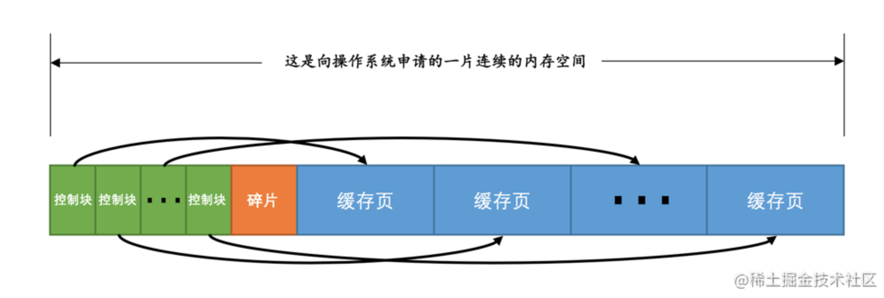
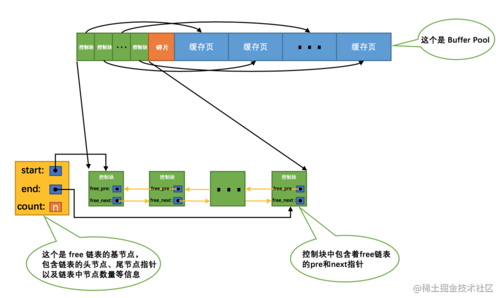
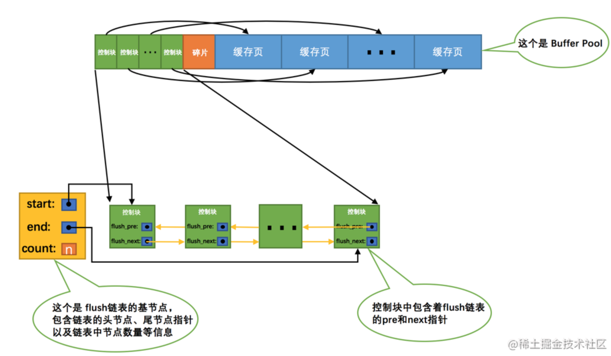
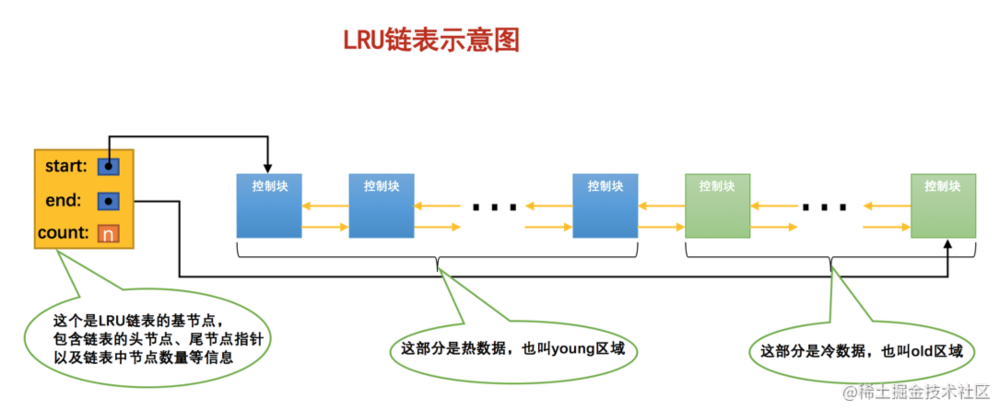

# InnoDB 的 Buffer Pool

## 缓存的重要性

通过前边的唠叨我们知道，对于使用`InnoDB`作为存储引擎的表来说，不管是用于存储用户数据的索引（包括聚簇索引和二级索引），还是各种系统数据，都是以`页`的形式存放在`表空间`中的，而所谓的`表空间`只不过是`InnoDB`对文件系统上一个或几个实际文件的抽象，也就是说我们的数据说到底还是存储在磁盘上的。但是各位也都知道，磁盘的速度慢的跟乌龟一样，怎么能配得上“快如风，疾如电”的`CPU`呢？所以`InnoDB`存储引擎在处理客户端的请求时，当需要访问某个页的数据时，就会把完整的页的数据全部加载到内存中，也就是说即使我们只需要访问一个页的一条记录，那也需要先把整个页的数据加载到内存中。将整个页加载到内存中后就可以进行读写访问了，在进行完读写访问之后并不着急把该页对应的内存空间释放掉，而是将其`缓存`起来，这样将来有请求再次访问该页面时，就可以省去磁盘`IO`的开销了。

## InnoDB的Buffer Pool

### 啥是个Buffer Pool

设计`InnoDB`的大叔为了缓存磁盘中的页，在`MySQL`服务器启动的时候就向操作系统申请了一片连续的内存，他们给这片内存起了个名，叫做`Buffer Pool`（中文名是`缓冲池`）。那它有多大呢？这个其实看我们机器的配置，如果你是土豪，你有`512G`内存，你分配个几百G作为`Buffer Pool`也可以啊，当然你要是没那么有钱，设置小点也行呀～ 默认情况下`Buffer Pool`只有`128M`大小。当然如果你嫌弃这个`128M`太大或者太小，可以在启动服务器的时候配置`innodb_buffer_pool_size`参数的值，它表示`Buffer Pool`的大小，就像这样：

```ini
[server]
innodb_buffer_pool_size = 268435456
```

其中，`268435456`的单位是字节，也就是我指定`Buffer Pool`的大小为`256M`。需要注意的是，`Buffer Pool`也不能太小，最小值为`5M`(当小于该值时会自动设置成`5M`)。

### Buffer Pool内部组成

`Buffer Pool`中默认的缓存页大小和在磁盘上默认的页大小是一样的，都是`16KB`。为了更好的管理这些在`Buffer Pool`中的缓存页，设计`InnoDB`的大叔为每一个缓存页都创建了一些所谓的`控制信息`，这些控制信息包括该页所属的表空间编号、页号、缓存页在`Buffer Pool`中的地址、链表节点信息、一些锁信息以及`LSN`信息（锁和`LSN`我们之后会具体唠叨，现在可以先忽略），当然还有一些别的控制信息，我们这就不全唠叨一遍了，挑重要的说嘛～

每个缓存页对应的控制信息占用的内存大小是相同的，我们就把每个页对应的控制信息占用的一块内存称为一个`控制块`吧，控制块和缓存页是一一对应的，它们都被存放到 Buffer Pool 中，其中控制块被存放到 Buffer Pool 的前边，缓存页被存放到 Buffer Pool 后边，所以整个`Buffer Pool`对应的内存空间看起来就是这样的：




咦？控制块和缓存页之间的那个`碎片`是个什么玩意儿？你想想啊，每一个控制块都对应一个缓存页，那在分配足够多的控制块和缓存页后，可能剩余的那点儿空间不够一对控制块和缓存页的大小，自然就用不到喽，这个用不到的那点儿内存空间就被称为`碎片`了。当然，如果你把`Buffer Pool`的大小设置的刚刚好的话，也可能不会产生`碎片`～

> 小贴士： 每个控制块大约占用缓存页大小的5%，在MySQL5.7.21这个版本中，每个控制块占用的大小是808字节。而我们设置的innodb_buffer_pool_size并不包含这部分控制块占用的内存空间大小，也就是说InnoDB在为Buffer Pool向操作系统申请连续的内存空间时，这片连续的内存空间一般会比innodb_buffer_pool_size的值大5%左右

### free链表的管理

当我们最初启动`MySQL`服务器的时候，需要完成对`Buffer Pool`的初始化过程，就是先向操作系统申请`Buffer Pool`的内存空间，然后把它划分成若干对控制块和缓存页。但是此时并没有真实的磁盘页被缓存到`Buffer Pool`中（因为还没有用到），之后随着程序的运行，会不断的有磁盘上的页被缓存到`Buffer Pool`中。那么问题来了，从磁盘上读取一个页到`Buffer Pool`中的时候该放到哪个缓存页的位置呢？或者说怎么区分`Buffer Pool`中哪些缓存页是空闲的，哪些已经被使用了呢？我们最好在某个地方记录一下Buffer Pool中哪些缓存页是可用的，这个时候缓存页对应的`控制块`就派上大用场了，我们可以把所有空闲的缓存页对应的控制块作为一个节点放到一个链表中，这个链表也可以被称作`free链表`（或者说空闲链表）。刚刚完成初始化的`Buffer Pool`中所有的缓存页都是空闲的，所以每一个缓存页对应的控制块都会被加入到`free链表`中，假设该`Buffer Pool`中可容纳的缓存页数量为`n`，那增加了`free链表`的效果图就是这样的：



从图中可以看出，我们为了管理好这个`free链表`，特意为这个链表定义了一个`基节点`，里边儿包含着链表的头节点地址，尾节点地址，以及当前链表中节点的数量等信息。这里需要注意的是，<font color=red>**链表的基节点占用的内存空间并不包含在为`Buffer Pool`申请的一大片连续内存空间之内，而是单独申请的一块内存空间**</font>。

> 小贴士： 链表基节点占用的内存空间并不大，在MySQL5.7.21这个版本里，每个基节点只占用40字节大小。后边我们即将介绍许多不同的链表，它们的基节点和free链表的基节点的内存分配方式是一样一样的，都是单独申请的一块40字节大小的内存空间，并不包含在为Buffer Pool申请的一大片连续内存空间之内。

有了这个`free链表`之后事儿就好办了，每当需要从磁盘中加载一个页到`Buffer Pool`中时，就从`free链表`中取一个空闲的缓存页，并且把该缓存页对应的`控制块`的信息填上（就是该页所在的表空间、页号之类的信息），然后把该缓存页对应的`free链表`节点从链表中移除，表示该缓存页已经被使用了～

### 缓存页的哈希处理

我们前边说过，当我们需要访问某个页中的数据时，就会把该页从磁盘加载到`Buffer Pool`中，如果该页已经在`Buffer Pool`中的话直接使用就可以了。那么问题也就来了，我们怎么知道该页在不在`Buffer Pool`中呢？难不成需要依次遍历`Buffer Pool`中各个缓存页么？一个`Buffer Pool`中的缓存页这么多都遍历完岂不是要累死？

再回头想想，我们其实是根据`表空间号 + 页号`来定位一个页的，也就相当于`表空间号 + 页号`是一个`key`，`缓存页`就是对应的`value`，怎么通过一个`key`来快速找着一个`value`呢？哈哈，那肯定是哈希表喽～

所以我们可以用`表空间号 + 页号`作为`key`，`缓存页`作为`value`创建一个哈希表，在需要访问某个页的数据时，先从哈希表中根据`表空间号 + 页号`看看有没有对应的缓存页，如果有，直接使用该缓存页就好，如果没有，那就从`free链表`中选一个空闲的缓存页，然后把磁盘中对应的页加载到该缓存页的位置。

### flush链表的管理

如果我们修改了`Buffer Pool`中某个缓存页的数据，那它就和磁盘上的页不一致了，这样的缓存页也被称为`脏页`（英文名：`dirty page`）。当然，最简单的做法就是每发生一次修改就立即同步到磁盘上对应的页上，但是频繁的往磁盘中写数据会严重的影响程序的性能（毕竟磁盘慢的像乌龟一样）。所以每次修改缓存页后，我们并不着急立即把修改同步到磁盘上，而是在未来的某个时间点进行同步，至于这个同步的时间点我们后边会作说明说明的，现在先不用管哈～

但是如果不立即同步到磁盘的话，那之后再同步的时候我们怎么知道`Buffer Pool`中哪些页是`脏页`，哪些页从来没被修改过呢？总不能把所有的缓存页都同步到磁盘上吧，假如`Buffer Pool`被设置的很大，比方说`300G`，那一次性同步这么多数据岂不是要慢死！所以，我们不得不再创建一个存储脏页的链表，凡是修改过的缓存页对应的控制块都会作为一个节点加入到一个链表中，因为这个链表节点对应的缓存页都是需要被刷新到磁盘上的，所以也叫`flush链表`。链表的构造和`free链表`差不多，假设某个时间点`Buffer Pool`中的脏页数量为`n`，那么对应的`flush链表`就长这样：



### LRU链表的管理

#### 缓存不够的窘境

`Buffer Pool`对应的内存大小毕竟是有限的，如果需要缓存的页占用的内存大小超过了`Buffer Pool`大小，也就是`free链表`中已经没有多余的空闲缓存页的时候岂不是很尴尬，发生了这样的事儿该咋办？当然是把某些旧的缓存页从`Buffer Pool`中移除，然后再把新的页放进来喽～ 那么问题来了，移除哪些缓存页呢？

为了回答这个问题，我们还需要回到我们设立`Buffer Pool`的初衷，我们就是想减少和磁盘的`IO`交互，最好每次在访问某个页的时候它都已经被缓存到`Buffer Pool`中了。假设我们一共访问了`n`次页，那么被访问的页已经在缓存中的次数除以`n`就是所谓的`缓存命中率`，我们的期望就是让`缓存命中率`越高越好～ 从这个角度出发，回想一下我们的微信聊天列表，排在前边的都是最近很频繁使用的，排在后边的自然就是最近很少使用的，假如列表能容纳下的联系人有限，你是会把最近很频繁使用的留下还是最近很少使用的留下呢？废话，当然是留下最近很频繁使用的了～

#### 简单的LRU（Least Recently Used）链表

管理`Buffer Pool`的缓存页其实也是这个道理，当`Buffer Pool`中不再有空闲的缓存页时，就需要淘汰掉部分最近很少使用的缓存页。不过，我们怎么知道哪些缓存页最近频繁使用，哪些最近很少使用呢？呵呵，神奇的链表再一次派上了用场，我们可以再创建一个链表，由于这个链表是为了`按照最近最少使用`的原则去淘汰缓存页的，所以这个链表可以被称为`LRU链表`（LRU的英文全称：Least Recently Used）。当我们需要访问某个页时，可以这样处理`LRU链表`：

- 如果该页不在`Buffer Pool`中，在把该页从磁盘加载到`Buffer Pool`中的缓存页时，就把该缓存页对应的`控制块`作为节点塞到链表的头部。
- 如果该页已经缓存在`Buffer Pool`中，则直接把该页对应的`控制块`移动到`LRU链表`的头部。

也就是说：只要我们使用到某个缓存页，就把该缓存页调整到`LRU链表`的头部，这样`LRU链表`尾部就是最近最少使用的缓存页喽～ 所以当`Buffer Pool`中的空闲缓存页使用完时，到`LRU链表`的尾部找些缓存页淘汰就OK啦，真简单，啧啧...

#### 划分区域的LRU链表

高兴的太早了，上边的这个简单的`LRU链表`用了没多长时间就发现问题了，因为存在这两种比较尴尬的情况：

- 情况一：`InnoDB`提供了一个看起来比较贴心的服务——`预读`（英文名：`read ahead`）。所谓`预读`，就是`InnoDB`认为执行当前的请求可能之后会读取某些页面，就预先把它们加载到`Buffer Pool`中。根据触发方式的不同，`预读`又可以细分为下边两种：

  - 线性预读

    设计`InnoDB`的大叔提供了一个系统变量`innodb_read_ahead_threshold`，如果顺序访问了某个区（`extent`）的页面超过这个系统变量的值，就会触发一次`异步`读取下一个区中全部的页面到`Buffer Pool`的请求，注意`异步`读取意味着从磁盘中加载这些被预读的页面并不会影响到当前工作线程的正常执行。这个`innodb_read_ahead_threshold`系统变量的值默认是`56`，我们可以在服务器启动时通过启动参数或者服务器运行过程中直接调整该系统变量的值，不过它是一个全局变量，注意使用`SET GLOBAL`命令来修改哦。

  - 随机预读

    如果`Buffer Pool`中已经缓存了某个区的13个连续的页面，不论这些页面是不是顺序读取的，都会触发一次`异步`读取本区中所有其的页面到`Buffer Pool`的请求。设计`InnoDB`的大叔同时提供了`innodb_random_read_ahead`系统变量，它的默认值为`OFF`，也就意味着`InnoDB`并不会默认开启随机预读的功能，如果我们想开启该功能，可以通过修改启动参数或者直接使用`SET GLOBAL`命令把该变量的值设置为`ON`。

  `预读`本来是个好事儿，如果预读到`Buffer Pool`中的页成功的被使用到，那就可以极大的提高语句执行的效率。可是如果用不到呢？这些预读的页都会放到`LRU`链表的头部，但是如果此时`Buffer Pool`的容量不太大而且很多预读的页面都没有用到的话，这就会导致处在`LRU链表`尾部的一些缓存页会很快的被淘汰掉，也就是所谓的`劣币驱逐良币`，会大大降低缓存命中率。

- 情况二：有的小伙伴可能会写一些需要扫描全表的查询语句（比如没有建立合适的索引或者压根儿没有WHERE子句的查询）。

  扫描全表意味着什么？意味着将访问到该表所在的所有页！假设这个表中记录非常多的话，那该表会占用特别多的`页`，当需要访问这些页时，会把它们统统都加载到`Buffer Pool`中，这也就意味着吧唧一下，`Buffer Pool`中的所有页都被换了一次血，其他查询语句在执行时又得执行一次从磁盘加载到`Buffer Pool`的操作。而这种全表扫描的语句执行的频率也不高，每次执行都要把`Buffer Pool`中的缓存页换一次血，这严重的影响到其他查询对 `Buffer Pool`的使用，从而大大降低了缓存命中率。

总结一下上边说的可能降低`Buffer Pool`的两种情况：

- 加载到`Buffer Pool`中的页不一定被用到。
- 如果非常多的使用频率偏低的页被同时加载到`Buffer Pool`时，可能会把那些使用频率非常高的页从`Buffer Pool`中淘汰掉。

因为有这两种情况的存在，所以设计`InnoDB`的大叔把这个`LRU链表`按照一定比例分成两截，分别是：

- 一部分存储使用频率非常高的缓存页，所以这一部分链表也叫做`热数据`，或者称`young区域`。
- 另一部分存储使用频率不是很高的缓存页，所以这一部分链表也叫做`冷数据`，或者称`old区域`。

为了方便大家理解，我们把示意图做了简化，各位领会精神就好：



大家要特别注意一个事儿：我们是按照某个比例将LRU链表分成两半的，不是某些节点固定是young区域的，某些节点固定是old区域的，随着程序的运行，某个节点所属的区域也可能发生变化。那这个划分成两截的比例怎么确定呢？对于`InnoDB`存储引擎来说，我们可以通过查看系统变量`innodb_old_blocks_pct`的值来确定`old`区域在`LRU链表`中所占的比例，比方说这样：

```sql
mysql> SHOW VARIABLES LIKE 'innodb_old_blocks_pct';
+-----------------------+-------+
| Variable_name         | Value |
+-----------------------+-------+
| innodb_old_blocks_pct | 37    |
+-----------------------+-------+
1 row in set (0.01 sec)
```

从结果可以看出来，默认情况下，`old`区域在`LRU链表`中所占的比例是`37%`，也就是说`old`区域大约占`LRU链表`的`3/8`。这个比例我们是可以设置的，我们可以在启动时修改`innodb_old_blocks_pct`参数来控制`old`区域在`LRU链表`中所占的比例，比方说这样修改配置文件：

```ini
[server]
innodb_old_blocks_pct = 40
```

这样我们在启动服务器后，`old`区域占`LRU链表`的比例就是`40%`。当然，如果在服务器运行期间，我们也可以修改这个系统变量的值，不过需要注意的是，这个系统变量属于`全局变量`，一经修改，会对所有客户端生效，所以我们只能这样修改：

```ini
SET GLOBAL innodb_old_blocks_pct = 40;
```

有了这个被划分成`young`和`old`区域的`LRU`链表之后，设计`InnoDB`的大叔就可以针对我们上边提到的两种可能降低缓存命中率的情况进行优化了：

- 针对预读的页面可能不进行后续访问情况的优化

  设计`InnoDB`的大叔规定，当磁盘上的某个页面在初次加载到Buffer Pool中的某个缓存页时，该缓存页对应的控制块会被放到old区域的头部。这样针对预读到`Buffer Pool`却不进行后续访问的页面就会被逐渐从`old`区域逐出，而不会影响`young`区域中被使用比较频繁的缓存页。

- 针对全表扫描时，短时间内访问大量使用频率非常低的页面情况的优化

  在进行全表扫描时，虽然首次被加载到`Buffer Pool`的页被放到了`old`区域的头部，但是后续会被马上访问到，每次进行访问的时候又会把该页放到`young`区域的头部，这样仍然会把那些使用频率比较高的页面给顶下去。有同学会想：可不可以在第一次访问该页面时不将其从`old`区域移动到`young`区域的头部，后续访问时再将其移动到`young`区域的头部。回答是：行不通！因为设计`InnoDB`的大叔规定每次去页面中读取一条记录时，都算是访问一次页面，而一个页面中可能会包含很多条记录，也就是说读取完某个页面的记录就相当于访问了这个页面好多次。

  咋办？全表扫描有一个特点，那就是它的执行频率非常低，谁也不会没事儿老在那写全表扫描的语句玩，而且在执行全表扫描的过程中，即使某个页面中有很多条记录，也就是去多次访问这个页面所花费的时间也是非常少的。所以我们只需要规定，在对某个处在`old`区域的缓存页进行第一次访问时就在它对应的控制块中记录下来这个访问时间，如果后续的访问时间与第一次访问的时间在某个时间间隔内，那么该页面就不会被从old区域移动到young区域的头部，否则将它移动到young区域的头部。上述的这个间隔时间是由系统变量`innodb_old_blocks_time`控制的，你看：

```sql
mysql> SHOW VARIABLES LIKE 'innodb_old_blocks_time';
+------------------------+-------+
| Variable_name          | Value |
+------------------------+-------+
| innodb_old_blocks_time | 1000  |
+------------------------+-------+
1 row in set (0.01 sec)
```

这个`innodb_old_blocks_time`的默认值是`1000`，它的单位是毫秒，也就意味着对于从磁盘上被加载到`LRU`链表的`old`区域的某个页来说，如果第一次和最后一次访问该页面的时间间隔小于`1s`（很明显在一次全表扫描的过程中，多次访问一个页面中的时间不会超过`1s`），那么该页是不会被加入到`young`区域的～ 当然，像`innodb_old_blocks_pct`一样，我们也可以在服务器启动或运行时设置`innodb_old_blocks_time`的值，这里就不赘述了，你自己试试吧～ 这里需要注意的是，如果我们把`innodb_old_blocks_time`的值设置为`0`，那么每次我们访问一个页面时就会把该页面放到`young`区域的头部。

#### 更进一步优化LRU链表

`LRU链表`这就说完了么？没有，早着呢～ 对于`young`区域的缓存页来说，我们每次访问一个缓存页就要把它移动到`LRU链表`的头部，这样开销是不是太大啦，毕竟在`young`区域的缓存页都是热点数据，也就是可能被经常访问的，这样频繁的对`LRU链表`进行节点移动操作是不是不太好啊？是的，为了解决这个问题其实我们还可以提出一些优化策略，比如只有被访问的缓存页位于`young`区域的`1/4`的后边，才会被移动到`LRU链表`头部，这样就可以降低调整`LRU链表`的频率，从而提升性能（也就是说如果某个缓存页对应的节点在`young`区域的`1/4`中，再次访问该缓存页时也不会将其移动到`LRU`链表头部）。

> 小贴士： 我们之前介绍随机预读的时候曾说，如果Buffer  Pool中有某个区的13个连续页面就会触发随机预读，这其实是不严谨的（不幸的是MySQL文档就是这么说的[摊手]），其实还要求这13个页面是非常热的页面，所谓的非常热，指的是这些页面在整个young区域的头1/4处。

还有没有什么别的针对`LRU链表`的优化措施呢？当然有啊，你要是好好学，写篇论文，写本书都不是问题，可是这毕竟是一个介绍`MySQL`基础知识的文章，再说多了篇幅就受不了了，也影响大家的阅读体验，所以适可而止，想了解更多的优化知识，自己去看源码或者更多关于`LRU`链表的知识喽～ 但是不论怎么优化，千万别忘了我们的初心：尽量高效的提高 ***Buffer Pool*** 的缓存命中率。

### 其他的一些链表

为了更好的管理`Buffer Pool`中的缓存页，除了我们上边提到的一些措施，设计`InnoDB`的大叔们还引进了其他的一些`链表`，比如`unzip LRU链表`用于管理解压页，`zip clean链表`用于管理没有被解压的压缩页，`zip free数组`中每一个元素都代表一个链表，它们组成所谓的`伙伴系统`来为压缩页提供内存空间等等，反正是为了更好的管理这个`Buffer Pool`引入了各种链表或其他数据结构，具体的使用方式就不啰嗦了，大家有兴趣深究的再去找些更深的书或者直接看源代码吧。

### 刷新脏页到磁盘

后台有专门的线程每隔一段时间负责把脏页刷新到磁盘，这样可以不影响用户线程处理正常的请求。主要有两种刷新路径：

- 从`LRU链表`的冷数据中刷新一部分页面到磁盘。

  后台线程会定时从`LRU链表`尾部开始扫描一些页面，扫描的页面数量可以通过系统变量`innodb_lru_scan_depth`来指定，如果从里边儿发现脏页，会把它们刷新到磁盘。这种刷新页面的方式被称之为`BUF_FLUSH_LRU`。

- 从`flush链表`中刷新一部分页面到磁盘。

  后台线程也会定时从`flush链表`中刷新一部分页面到磁盘，刷新的速率取决于当时系统是不是很繁忙。这种刷新页面的方式被称之为`BUF_FLUSH_LIST`。

有时候后台线程刷新脏页的进度比较慢，导致用户线程在准备加载一个磁盘页到`Buffer Pool`时没有可用的缓存页，这时就会尝试看看`LRU链表`尾部有没有可以直接释放掉的未修改页面，如果没有的话会不得不将`LRU链表`尾部的一个脏页同步刷新到磁盘（和磁盘交互是很慢的，这会降低处理用户请求的速度）。这种刷新单个页面到磁盘中的刷新方式被称之为`BUF_FLUSH_SINGLE_PAGE`。

当然，有时候系统特别繁忙时，也可能出现用户线程批量的从`flush链表`中刷新脏页的情况，很显然在处理用户请求过程中去刷新脏页是一种严重降低处理速度的行为（毕竟磁盘的速度慢的要死），这属于一种迫不得已的情况，不过这得放在后边唠叨`redo`日志的`checkpoint`时说了。

### 

