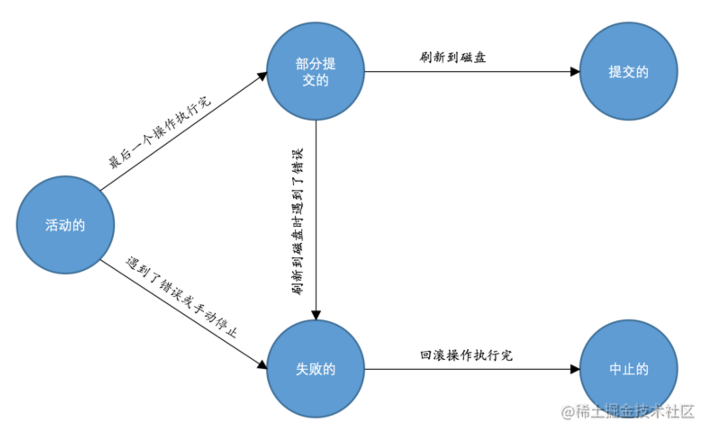

# 事务的特性

### 原子性（Atomicity）

现实世界中转账操作是一个不可分割的操作，也就是说要么压根儿就没转，要么转账成功，不能存在中间的状态，也就是转了一半的这种情况。设计数据库的大叔们把这种要么全做，要么全不做的规则称之为`原子性`。

### 隔离性（Isolation）

现实世界中的两次状态转换应该是互不影响的

### 一致性（Consistency）

### 持久性（Durability）

当现实世界的一个状态转换完成后，这个转换的结果将永久的保留，这个规则被设计数据库的大叔们称为`持久性`。

## 事务的概念

为了方便大家记住我们上边唠叨的现实世界状态转换过程中需要遵守的4个特性，我们把`原子性`（`Atomicity`）、`隔离性`（`Isolation`）、`一致性`（`Consistency`）和`持久性`（`Durability`）这四个词对应的英文单词首字母提取出来就是`A`、`I`、`C`、`D`，稍微变换一下顺序可以组成一个完整的英文单词：`ACID`。想必大家都是学过初高中英语的，`ACID`是英文`酸`的意思，以后我们提到`ACID`这个词儿，大家就应该想到原子性、一致性、隔离性、持久性这几个规则。另外，设计数据库的大叔为了方便起见，把需要保证`原子性`、`隔离性`、`一致性`和`持久性`的一个或多个数据库操作称之为一个`事务`（英文名是：`transaction`）。

我们现在知道`事务`是一个抽象的概念，它其实对应着一个或多个数据库操作，设计数据库的大叔根据这些操作所执行的不同阶段把`事务`大致上划分成了这么几个状态：

- 活动的（active）

  事务对应的数据库操作正在执行过程中时，我们就说该事务处在`活动的`状态。

- 部分提交的（partially committed）

  当事务中的最后一个操作执行完成，但由于操作都在内存中执行，所造成的影响并没有刷新到磁盘时，我们就说该事务处在`部分提交的`状态。

- 失败的（failed）

  当事务处在`活动的`或者`部分提交的`状态时，可能遇到了某些错误（数据库自身的错误、操作系统错误或者直接断电等）而无法继续执行，或者人为的停止当前事务的执行，我们就说该事务处在`失败的`状态。

- 中止的（aborted）

  如果事务执行了半截而变为`失败的`状态，比如我们前边唠叨的狗哥向猫爷转账的事务，当狗哥账户的钱被扣除，但是猫爷账户的钱没有增加时遇到了错误，从而当前事务处在了`失败的`状态，那么就需要把已经修改的狗哥账户余额调整为未转账之前的金额，换句话说，就是要撤销失败事务对当前数据库造成的影响。书面一点的话，我们把这个撤销的过程称之为`回滚`。当`回滚`操作执行完毕时，也就是数据库恢复到了执行事务之前的状态，我们就说该事务处在了`中止的`状态。

- 提交的（committed）

  当一个处在`部分提交的`状态的事务将修改过的数据都同步到磁盘上之后，我们就可以说该事务处在了`提交的`状态。

随着事务对应的数据库操作执行到不同阶段，事务的状态也在不断变化，一个基本的状态转换图如下所示：

- 


从图中大家也可以看出了，只有当事务处于提交的或者中止的状态时，一个事务的生命周期才算是结束了。对于已经提交的事务来说，该事务对数据库所做的修改将永久生效，对于处于中止状态的事务，该事务对数据库所做的所有修改都会被回滚到没执行该事务之前的状态。

## MySQL中事务的语法

我们说`事务`的本质其实只是一系列数据库操作，只不过这些数据库操作符合`ACID`特性而已，那么`MySQL`中如何将某些操作放到一个事务里去执行的呢？我们下边就来重点唠叨唠叨。

### 开启事务

我们可以使用下边两种语句之一来开启一个事务：

- `BEGIN [WORK];`

  `BEGIN`语句代表开启一个事务，后边的单词`WORK`可有可无。开启事务后，就可以继续写若干条语句，这些语句都属于刚刚开启的这个事务。

  ```shell
  mysql> BEGIN;
  Query OK, 0 rows affected (0.00 sec)
  
  mysql> 加入事务的语句...
  ```

- `START TRANSACTION;`

  `START TRANSACTION`语句和`BEGIN`语句有着相同的功效，都标志着开启一个事务，比如这样：

  ```shell
  mysql> START TRANSACTION;
  Query OK, 0 rows affected (0.00 sec)
  
  mysql> 加入事务的语句...
  ```

  不过比`BEGIN`语句牛逼一点儿的是，可以在`START TRANSACTION`语句后边跟随几个`修饰符`，就是它们几个：

  - `READ ONLY`：标识当前事务是一个只读事务，也就是属于该事务的数据库操作只能读取数据，而不能修改数据。

    > 小贴士：其实只读事务中只是不允许修改那些其他事务也能访问到的表中的数据，对于临时表来说（我们使用CREATE TMEPORARY TABLE创建的表），由于它们只能在当前会话中可见，所以只读事务其实也是可以对临时表进行增、删、改操作的。

  - `READ WRITE`：标识当前事务是一个读写事务，也就是属于该事务的数据库操作既可以读取数据，也可以修改数据。

  - `WITH CONSISTENT SNAPSHOT`：启动一致性读（先不用关心啥是个一致性读，后边的章节才会唠叨）。

  比如我们想开启一个只读事务的话，直接把`READ ONLY`这个修饰符加在`START TRANSACTION`语句后边就好，比如这样：

  ```sql
  START TRANSACTION READ ONLY;
  ```

如果我们想在`START TRANSACTION`后边跟随多个`修饰符`的话，可以使用逗号将`修饰符`分开，比如开启一个只读事务和一致性读，就可以这样写：

```sql
START TRANSACTION READ ONLY, WITH CONSISTENT SNAPSHOT;
```

或者开启一个读写事务和一致性读，就可以这样写：

```sql
START TRANSACTION READ WRITE, WITH CONSISTENT SNAPSHOT
```

不过这里需要大家注意的一点是，`READ ONLY`和`READ WRITE`是用来设置所谓的事务`访问模式`的，就是以只读还是读写的方式来访问数据库中的数据，一个事务的访问模式不能同时既设置为`只读`的也设置为`读写`的，所以我们不能同时把`READ ONLY`和`READ WRITE`放到`START TRANSACTION`语句后边。另外，如果我们不显式指定事务的访问模式，那么该事务的访问模式就是`读写`模式。

### 提交事务

开启事务之后就可以继续写需要放到该事务中的语句了，当最后一条语句写完了之后，我们就可以提交该事务了，提交的语句也很简单：

```css
COMMIT [WORK]
```

`COMMIT`语句就代表提交一个事务，后边的`WORK`可有可无。比如我们上边说狗哥给猫爷转10元钱其实对应`MySQL`中的两条语句，我们就可以把这两条语句放到一个事务中，完整的过程就是这样：

```sql
mysql> BEGIN;
Query OK, 0 rows affected (0.00 sec)

mysql> UPDATE account SET balance = balance - 10 WHERE id = 1;
Query OK, 1 row affected (0.02 sec)
Rows matched: 1  Changed: 1  Warnings: 0

mysql> UPDATE account SET balance = balance + 10 WHERE id = 2;
Query OK, 1 row affected (0.00 sec)
Rows matched: 1  Changed: 1  Warnings: 0

mysql> COMMIT;
Query OK, 0 rows affected (0.00 sec)
```

### 手动中止事务

如果我们写了几条语句之后发现上边的某条语句写错了，我们可以手动的使用下边这个语句来将数据库恢复到事务执行之前的样子：

```css
ROLLBACK [WORK]
```

`ROLLBACK`语句就代表中止并回滚一个事务，后边的`WORK`可有可无类似的。比如我们在写狗哥给猫爷转账10元钱对应的`MySQL`语句时，先给狗哥扣了10元，然后一时大意只给猫爷账户上增加了1元，此时就可以使用`ROLLBACK`语句进行回滚，完整的过程就是这样：

```sql
mysql> BEGIN;
Query OK, 0 rows affected (0.00 sec)

mysql> UPDATE account SET balance = balance - 10 WHERE id = 1;
Query OK, 1 row affected (0.00 sec)
Rows matched: 1  Changed: 1  Warnings: 0

mysql> UPDATE account SET balance = balance + 1 WHERE id = 2;
Query OK, 1 row affected (0.00 sec)
Rows matched: 1  Changed: 1  Warnings: 0

mysql> ROLLBACK;
Query OK, 0 rows affected (0.00 sec)
```

这里需要强调一下，`ROLLBACK`语句是我们程序员手动的去回滚事务时才去使用的，如果事务在执行过程中遇到了某些错误而无法继续执行的话，事务自身会自动的回滚。

### 支持事务的存储引擎

`MySQL`中并不是所有存储引擎都支持事务的功能，目前只有`InnoDB`和`NDB`存储引擎支持（NDB存储引擎不是我们的重点），如果某个事务中包含了修改使用不支持事务的存储引擎的表，那么对该使用不支持事务的存储引擎的表所做的修改将无法进行回滚。

### 自动提交

`MySQL`中有一个系统变量`autocommit`：

```sql
mysql> SHOW VARIABLES LIKE 'autocommit';
+---------------+-------+
| Variable_name | Value |
+---------------+-------+
| autocommit    | ON    |
+---------------+-------+
1 row in set (0.01 sec)
```

可以看到它的默认值为`ON`，也就是说默认情况下，如果我们不显式的使用`START TRANSACTION`或者`BEGIN`语句开启一个事务，那么每一条语句都算是一个独立的事务，这种特性称之为事务的`自动提交`

当然，如果我们想关闭这种`自动提交`的功能，可以使用下边两种方法之一：

- 显式的的使用`START TRANSACTION`或者`BEGIN`语句开启一个事务。

  这样在本次事务提交或者回滚前会暂时关闭掉自动提交的功能。

- 把系统变量`autocommit`的值设置为`OFF`，就像这样：

  ```ini
  SET autocommit = OFF;
  ```

  这样的话，我们写入的多条语句就算是属于同一个事务了，直到我们显式的写出`COMMIT`语句来把这个事务提交掉，或者显式的写出`ROLLBACK`语句来把这个事务回滚掉。

### 隐式提交

当我们使用`START TRANSACTION`或者`BEGIN`语句开启了一个事务，或者把系统变量`autocommit`的值设置为`OFF`时，事务就不会进行`自动提交`，但是如果我们输入了某些语句之后就会`悄悄的`提交掉，就像我们输入了`COMMIT`语句了一样，这种因为某些特殊的语句而导致事务提交的情况称为`隐式提交`，这些会导致事务隐式提交的语句包括：

- 定义或修改数据库对象的数据定义语言（Data definition language，缩写为：`DDL`）。

  所谓的数据库对象，指的就是`数据库`、`表`、`视图`、`存储过程`等等这些东西。当我们使用`CREATE`、`ALTER`、`DROP`等语句去修改这些所谓的数据库对象时，就会隐式的提交前边语句所属于的事务，就像这样：

  ```ini
  BEGIN;
  
  SELECT ... # 事务中的一条语句
  UPDATE ... # 事务中的一条语句
  ... # 事务中的其它语句
  
  CREATE TABLE ... # 此语句会隐式的提交前边语句所属于的事务
  ```

- 隐式使用或修改`mysql`数据库中的表

  当我们使用`ALTER USER`、`CREATE USER`、`DROP USER`、`GRANT`、`RENAME USER`、`REVOKE`、`SET PASSWORD`等语句时也会隐式的提交前边语句所属于的事务。

- 事务控制或关于锁定的语句

  当我们在一个事务还没提交或者回滚时就又使用`START TRANSACTION`或者`BEGIN`语句开启了另一个事务时，会隐式的提交上一个事务，比如这样：

  ```ini
  BEGIN;
  
  SELECT ... # 事务中的一条语句
  UPDATE ... # 事务中的一条语句
  ... # 事务中的其它语句
  
  BEGIN; # 此语句会隐式的提交前边语句所属于的事务
  ```

  或者当前的`autocommit`系统变量的值为`OFF`，我们手动把它调为`ON`时，也会隐式的提交前边语句所属的事务。

  或者使用`LOCK TABLES`、`UNLOCK TABLES`等关于锁定的语句也会隐式的提交前边语句所属的事务。

- 加载数据的语句

比如我们使用`LOAD DATA`语句来批量往数据库中导入数据时，也会隐式的提交前边语句所属的事务。

- 关于`MySQL`复制的一些语句

使用`START SLAVE`、`STOP SLAVE`、`RESET SLAVE`、`CHANGE MASTER TO`等语句时也会隐式的提交前边语句所属的事务。

- 其它的一些语句

使用`ANALYZE TABLE`、`CACHE INDEX`、`CHECK TABLE`、`FLUSH`、 `LOAD INDEX INTO CACHE`、`OPTIMIZE TABLE`、`REPAIR TABLE`、`RESET`等语句也会隐式的提交前边语句所属的事务

### 保存点

如果你开启了一个事务，并且已经敲了很多语句，忽然发现上一条语句有点问题，你只好使用`ROLLBACK`语句来让数据库状态恢复到事务执行之前的样子，然后一切从头再来，总有一种一夜回到解放前的感觉。所以设计数据库的大叔们提出了一个`保存点`（英文：`savepoint`）的概念，就是在事务对应的数据库语句中打几个点，我们在调用`ROLLBACK`语句时可以指定会滚到哪个点，而不是回到最初的原点。定义保存点的语法如下：

```ini
SAVEPOINT 保存点名称;
```

当我们想回滚到某个保存点时，可以使用下边这个语句（下边语句中的单词`WORK`和`SAVEPOINT`是可有可无的）：

```css
ROLLBACK [WORK] TO [SAVEPOINT] 保存点名称;
```

不过如果`ROLLBACK`语句后边不跟随保存点名称的话，会直接回滚到事务执行之前的状态。

如果我们想删除某个保存点，可以使用这个语句：

```sql
RELEASE SAVEPOINT 保存点名称;
```

下边还是以狗哥向猫爷转账10元的例子展示一下`保存点`的用法，在执行完扣除狗哥账户的钱`10`元的语句之后打一个`保存点`：

```sql
mysql> SELECT * FROM account;
+----+--------+---------+
| id | name   | balance |
+----+--------+---------+
|  1 | 狗哥   |      11 |
|  2 | 猫爷   |       2 |
+----+--------+---------+
2 rows in set (0.00 sec)

mysql> BEGIN;
Query OK, 0 rows affected (0.00 sec)

mysql> UPDATE account SET balance = balance - 10 WHERE id = 1;
Query OK, 1 row affected (0.01 sec)
Rows matched: 1  Changed: 1  Warnings: 0

mysql> SAVEPOINT s1;    # 一个保存点
Query OK, 0 rows affected (0.00 sec)

mysql> SELECT * FROM account;
+----+--------+---------+
| id | name   | balance |
+----+--------+---------+
|  1 | 狗哥   |       1 |
|  2 | 猫爷   |       2 |
+----+--------+---------+
2 rows in set (0.00 sec)

mysql> UPDATE account SET balance = balance + 1 WHERE id = 2; # 更新错了
Query OK, 1 row affected (0.00 sec)
Rows matched: 1  Changed: 1  Warnings: 0

mysql> ROLLBACK TO s1;  # 回滚到保存点s1处
Query OK, 0 rows affected (0.00 sec)

mysql> SELECT * FROM account;
+----+--------+---------+
| id | name   | balance |
+----+--------+---------+
|  1 | 狗哥   |       1 |
|  2 | 猫爷   |       2 |
+----+--------+---------+
2 rows in set (0.00 sec)
```