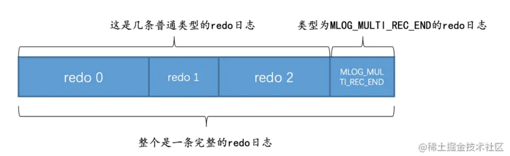
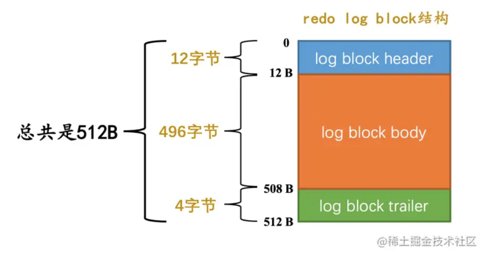
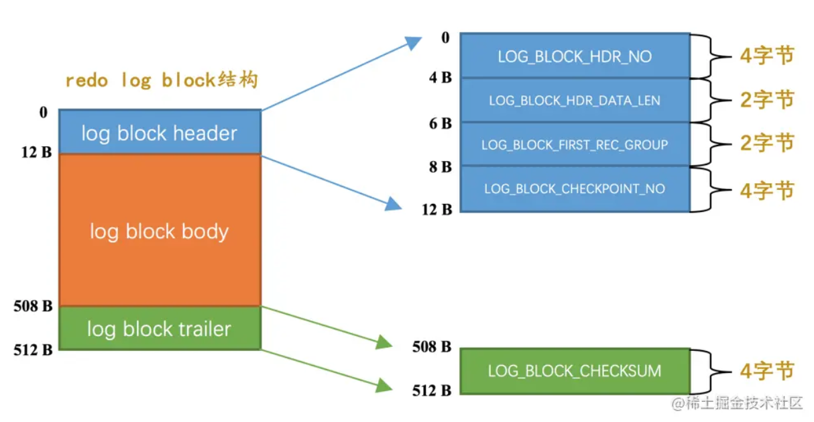
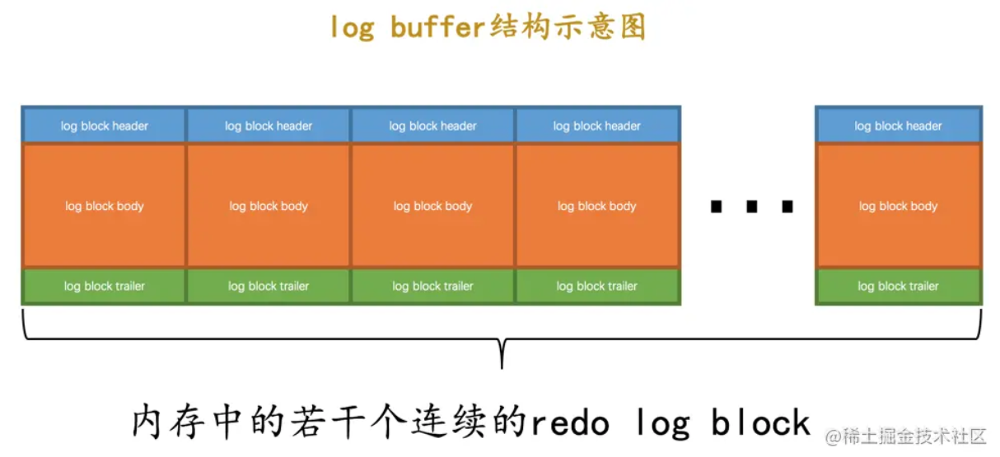
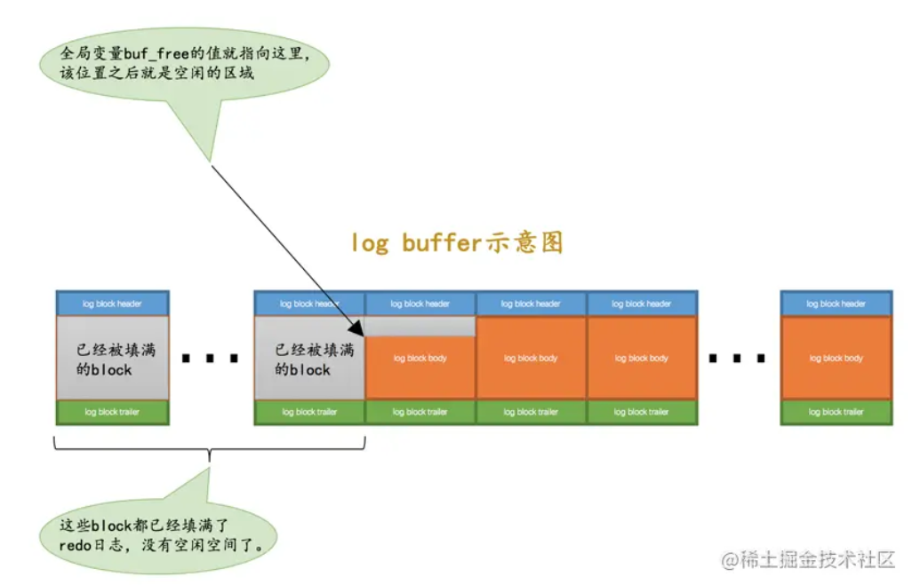
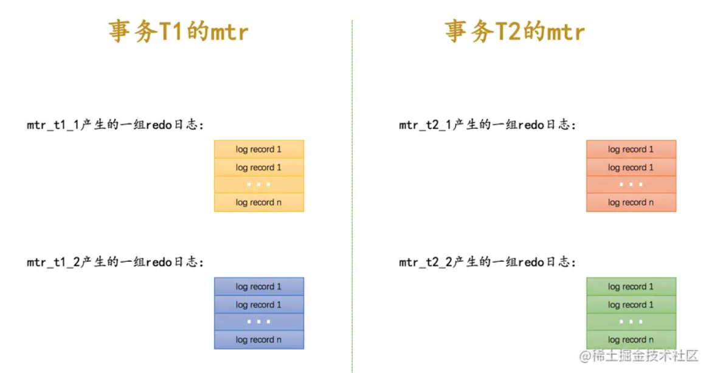
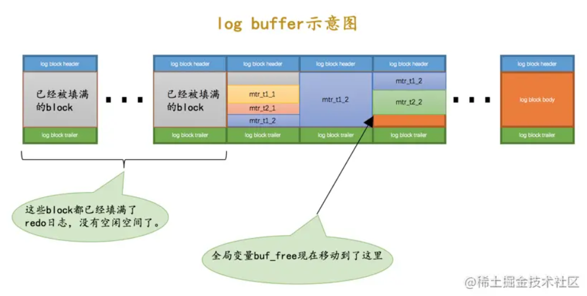

## redo日志是个啥

我们知道`InnoDB`存储引擎是以页为单位来管理存储空间的，我们进行的增删改查操作其实本质上都是在访问页面（包括读页面、写页面、创建新页面等操作）。我们前边唠叨`Buffer Pool`的时候说过，在真正访问页面之前，需要把在磁盘上的页缓存到内存中的`Buffer Pool`之后才可以访问。但是在唠叨事务的时候又强调过一个称之为`持久性`的特性，就是说对于一个已经提交的事务，在事务提交后即使系统发生了崩溃，这个事务对数据库中所做的更改也不能丢失。但是如果我们只在内存的`Buffer Pool`中修改了页面，假设在事务提交后突然发生了某个故障，导致内存中的数据都失效了，那么这个已经提交了的事务对数据库中所做的更改也就跟着丢失了，这是我们所不能忍受的（想想ATM机已经提示狗哥转账成功，但之后由于服务器出现故障，重启之后猫爷发现自己没收到钱，猫爷就被砍死了）。那么如何保证这个`持久性`呢？一个很简单的做法就是在事务提交完成之前把该事务所修改的所有页面都刷新到磁盘，但是这个简单粗暴的做法有些问题：

- 刷新一个完整的数据页太浪费了

  有时候我们仅仅修改了某个页面中的一个字节，但是我们知道在`InnoDB`中是以页为单位来进行磁盘IO的，也就是说我们在该事务提交时不得不将一个完整的页面从内存中刷新到磁盘，我们又知道一个页面默认是16KB大小，只修改一个字节就要刷新16KB的数据到磁盘上显然是太浪费了。

- 随机IO刷起来比较慢

  一个事务可能包含很多语句，即使是一条语句也可能修改许多页面，倒霉催的是该事务修改的这些页面可能并不相邻，这就意味着在将某个事务修改的`Buffer Pool`中的页面刷新到磁盘时，需要进行很多的随机IO，随机IO比顺序IO要慢，尤其对于传统的机械硬盘来说。

咋办呢？再次回到我们的初心：我们只是想让已经提交了的事务对数据库中数据所做的修改永久生效，即使后来系统崩溃，在重启后也能把这种修改恢复出来。所以我们其实没有必要在每次事务提交时就把该事务在内存中修改过的全部页面刷新到磁盘，只需要把修改了哪些东西记录一下就好，比方说某个事务将系统表空间中的第100号页面中偏移量为1000处的那个字节的值`1`改成`2`我们只需要记录一下：

> 将第0号表空间的100号页面的偏移量为1000处的值更新为`2`。

这样我们在**事务提交时**，把上述内容**刷新到磁盘中**，即使之后系统崩溃了，重启之后只要按照上述内容所记录的步骤重新更新一下数据页，那么该事务对数据库中所做的修改又可以被恢复出来，也就意味着满足`持久性`的要求。因为在**系统崩溃重启时需要按照上述内容所记录的步骤重新更新数据页**，所以上述内容也被称之为`重做日志`，英文名为`redo log`，我们也可以土洋结合，称之为`redo日志`。与在事务提交时将所有修改过的内存中的页面刷新到磁盘中相比，只将该事务执行过程中产生的`redo`日志刷新到磁盘的好处如下：

- `redo`日志占用的空间非常小

  存储表空间ID、页号、偏移量以及需要更新的值所需的存储空间是很小的，关于`redo`日志的格式我们稍后会详细唠叨，现在只要知道一条`redo`日志占用的空间不是很大就好了。

- `redo`日志是顺序写入磁盘的

  在执行事务的过程中，每执行一条语句，就可能产生若干条`redo`日志，这些日志是按照产生的顺序写入磁盘的，也就是使用顺序IO。

## redo日志格式

通过上边的内容我们知道，`redo`日志本质上只是记录了一下事务对数据库做了哪些修改。 设计`InnoDB`的大叔们针对事务对数据库的不同修改场景定义了多种类型的`redo`日志，但是绝大部分类型的`redo`日志都有下边这种通用的结构：

各个部分的详细释义如下：

- `type`：该条`redo`日志的类型。

  在`MySQL 5.7.21`这个版本中，设计`InnoDB`的大叔一共为`redo`日志设计了53种不同的类型，稍后会详细介绍不同类型的`redo`日志。

- `space ID`：表空间ID。

- `page number`：页号。

- `data`：该条`redo`日志的具体内容。

### redo日志小结

`redo`日志格式的内容庞大复杂，但是如果你不是为了写一个解析`redo`日志的工具或者自己开发一套`redo`日志系统的话，那就没必要把`InnoDB`中的各种类型的`redo`日志格式都研究的透透的，没那个必要。**redo日志的主要功能**：redo日志会把事务在执行过程中对数据库所做的所有修改都记录下来，在之后系统崩溃重启后可以把事务所做的任何修改都恢复出来。

## Mini-Transaction

### 以组的形式写入redo日志

设计`InnoDB`的大叔们认为向某个索引对应的`B+`树中插入一条记录的这个过程必须是原子的，不能说插了一半之后就停止了。比方说在悲观插入过程中，新的页面已经分配好了，数据也复制过去了，新的记录也插入到页面中了，可是没有向内节点中插入一条`目录项记录`，这个插入过程就是不完整的，这样会形成一棵不正确的`B+`树。我们知道`redo`日志是为了在系统崩溃重启时恢复崩溃前的状态，如果在悲观插入的过程中只记录了一部分`redo`日志，那么在系统崩溃重启时会将索引对应的`B+`树恢复成一种不正确的状态，这是设计`InnoDB`的大叔们所不能忍受的。所以他们规定在执行这些需要保证原子性的操作时必须以`组`的形式来记录的`redo`日志，在进行系统崩溃重启恢复时，针对某个组中的`redo`日志，要么把全部的日志都恢复掉，要么一条也不恢复。怎么做到的呢？这得分情况讨论：

- 有的需要保证原子性的操作会生成多条`redo`日志，比如向某个索引对应的`B+`树中进行一次悲观插入就需要生成许多条`redo`日志。

    如何把这些`redo`日志划分到一个组里边儿呢？设计`InnoDB`的大叔做了一个很简单的小把戏，就是在该组中的最后一条`redo`日志后边加上一条特殊类型的`redo`日志，该类型名称为`MLOG_MULTI_REC_END`，`type`字段对应的十进制数字为`31`，该类型的`redo`日志结构很简单，只有一个`type`字段：

 

​    

    所以某个需要保证原子性的操作产生的一系列`redo`日志必须要以一个类型为`MLOG_MULTI_REC_END`结尾，就像这样：
 

​    

    这样在系统崩溃重启进行恢复时，只有当解析到类型为`MLOG_MULTI_REC_END`的`redo`日志，才认为解析到了一组完整的`redo`日志，才会进行恢复。否则的话直接放弃前边解析到的`redo`日志。

- 有的需要保证原子性的操作只生成一条`redo`日志，比如更新`Max Row ID`属性的操作就只会生成一条`redo`日志。

    其实在一条日志后边跟一个类型为`MLOG_MULTI_REC_END`的`redo`日志也是可以的，不过设计`InnoDB`的大叔比较勤俭节约，他们不想浪费一个比特位。别忘了虽然`redo`日志的类型比较多，但撑死了也就是几十种，是小于`127`这个数字的，也就是说我们用7个比特位就足以包括所有的`redo`日志类型，而`type`字段其实是占用1个字节的，也就是说我们可以省出来一个比特位用来表示该需要保证原子性的操作只产生单一的一条`redo`日志，示意图如下：

 

​    

    如果`type`字段的第一个比特位为`1`，代表该需要保证原子性的操作只产生了单一的一条`redo`日志，否则表示该需要保证原子性的操作产生了一系列的`redo`日志

### Mini-Transaction的概念

设计`MySQL`的大叔把对底层页面中的一次原子访问的过程称之为一个`Mini-Transaction`，简称`mtr`，比如上边所说的修改一次`Max Row ID`的值算是一个`Mini-Transaction`，向某个索引对应的`B+`树中插入一条记录的过程也算是一个`Mini-Transaction`。通过上边的叙述我们也知道，一个所谓的`mtr`可以包含一组`redo`日志，在进行崩溃恢复时这一组`redo`日志作为一个不可分割的整体。

一个事务可以包含若干条语句，每一条语句其实是由若干个`mtr`组成，每一个`mtr`又可以包含若干条`redo`日志，画个图表示它们的关系就是这样：

 

## redo日志的写入过程

### redo log block

设计`InnoDB`的大叔为了更好的进行系统崩溃恢复，他们把通过`mtr`生成的`redo`日志都放在了大小为`512字节`的`页`中。为了和我们前边提到的表空间中的页做区别，我们这里把用来存储`redo`日志的页称为`block`（你心里清楚页和block的意思其实差不多就行了）。一个`redo log block`的示意图如下：

真正的`redo`日志都是存储到占用`496`字节大小的`log block body`中，图中的`log block header`和`log block trailer`存储的是一些管理信息。我们来看看这些所谓的`管理信息`都是啥：

### redo日志缓冲区

设计`InnoDB`的大叔为了解决磁盘速度过慢的问题而引入了`Buffer Pool`。同理，写入`redo`日志时也不能直接直接写到磁盘上，实际上在服务器启动时就向操作系统申请了一大片称之为`redo log buffer`的连续内存空间，翻译成中文就是`redo日志缓冲区`，我们也可以简称为`log buffer`。这片内存空间被划分成若干个连续的`redo log block`，就像这样：

我们可以通过启动参数`innodb_log_buffer_size`来指定`log buffer`的大小，在`MySQL 5.7.21`这个版本中，该启动参数的默认值为`16MB`

### redo日志写入log buffer

向`log buffer`中写入`redo`日志的过程是顺序的，也就是先往前边的block中写，当该block的空闲空间用完之后再往下一个block中写。当我们想往`log buffer`中写入`redo`日志时，第一个遇到的问题就是应该写在哪个`block`的哪个偏移量处，所以设计`InnoDB`的大叔特意提供了一个称之为`buf_free`的全局变量，该变量指明后续写入的`redo`日志应该写入到`log buffer`中的哪个位置，如图所示：

我们前边说过一个`mtr`执行过程中可能产生若干条`redo`日志，这些`redo`日志是一个不可分割的组，所以其实并不是每生成一条`redo`日志，就将其插入到`log buffer`中，而是每个`mtr`运行过程中产生的日志先暂时存到一个地方，当该`mtr`结束的时候，将过程中产生的一组`redo`日志再全部复制到`log buffer`中。我们现在假设有两个名为`T1`、`T2`的事务，每个事务都包含2个`mtr`，我们给这几个`mtr`命名一下：

- 事务`T1`的两个`mtr`分别称为`mtr_T1_1`和`mtr_T1_2`。
- 事务`T2`的两个`mtr`分别称为`mtr_T2_1`和`mtr_T2_2`。

每个`mtr`都会产生一组`redo`日志，用示意图来描述一下这些`mtr`产生的日志情况：

不同的事务可能是并发执行的，所以`T1`、`T2`之间的`mtr`可能是交替执行的。每当一个`mtr`执行完成时，伴随该`mtr`生成的一组`redo`日志就需要被复制到`log buffer`中，也就是说不同事务的`mtr`可能是交替写入`log buffer`的，我们画个示意图（为了美观，我们把一个`mtr`中产生的所有的`redo`日志当作一个整体来画）：

从示意图中我们可以看出来，不同的`mtr`产生的一组`redo`日志占用的存储空间可能不一样，有的`mtr`产生的`redo`日志量很少，比如`mtr_t1_1`、`mtr_t2_1`就被放到同一个block中存储，有的`mtr`产生的`redo`日志量非常大，比如`mtr_t1_2`产生的`redo`日志甚至占用了3个block来存储。

> 小贴士： 对照着上图，自己分析一下每个block的LOG_BLOCK_HDR_DATA_LEN、LOG_BLOCK_FIRST_REC_GROUP属性值都是什么哈～

