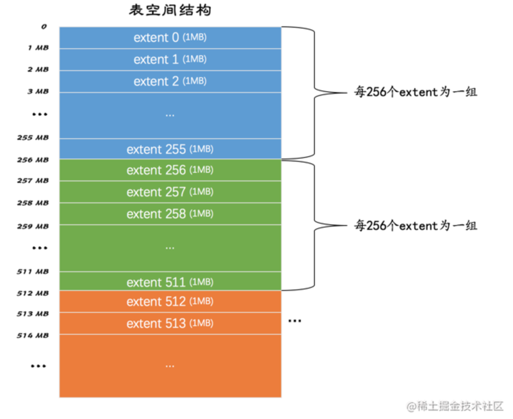

### 页面类型

再一次强调，InnoDB是以页为单位管理存储空间的，我们的聚簇索引（也就是完整的表数据）和其他的二级索引都是以`B+`树的形式保存到表空间的，而`B+`树的节点就是数据页。我们前边说过，这个数据页的类型名其实是：`FIL_PAGE_INDEX`，除了这种存放索引数据的页面类型之外，InnoDB也为了不同的目的设计了若干种不同类型的页面，为了唤醒大家的记忆，我们再一次把各种常用的页面类型提出来：

| 类型名称                  | 十六进制 | 描述                             |
| ------------------------- | -------- | -------------------------------- |
| `FIL_PAGE_TYPE_ALLOCATED` | 0x0000   | 最新分配，还没使用               |
| `FIL_PAGE_UNDO_LOG`       | 0x0002   | Undo日志页                       |
| `FIL_PAGE_INODE`          | 0x0003   | 段信息节点                       |
| `FIL_PAGE_IBUF_FREE_LIST` | 0x0004   | Insert Buffer空闲列表            |
| `FIL_PAGE_IBUF_BITMAP`    | 0x0005   | Insert Buffer位图                |
| `FIL_PAGE_TYPE_SYS`       | 0x0006   | 系统页                           |
| `FIL_PAGE_TYPE_TRX_SYS`   | 0x0007   | 事务系统数据                     |
| `FIL_PAGE_TYPE_FSP_HDR`   | 0x0008   | 表空间头部信息                   |
| `FIL_PAGE_TYPE_XDES`      | 0x0009   | 扩展描述页                       |
| `FIL_PAGE_TYPE_BLOB`      | 0x000A   | BLOB页                           |
| `FIL_PAGE_INDEX`          | 0x45BF   | 索引页，也就是我们所说的`数据页` |

因为页面类型前边都有个`FIL_PAGE`或者`FIL_PAGE_TYPE`的前缀，为简便起见我们后边唠叨页面类型的时候就把这些前缀省略掉了，比方说`FIL_PAGE_TYPE_ALLOCATED`类型称为`ALLOCATED`类型，`FIL_PAGE_INDEX`类型称为`INDEX`类型。

### 页面通用部分

我们前边说过数据页，也就是`INDEX`类型的页由7个部分组成，其中的两个部分是所有类型的页面都通用的。当然我不能寄希望于你把我说的话都记住，所以在这里重新强调一遍，任何类型的页面都有下边这种通用的结构：

 

从上图中可以看出，任何类型的页都会包含这两个部分：

- `File Header`：记录页面的一些通用信息
- `File Trailer`：校验页是否完整，保证从内存到磁盘刷新时内容的一致性。

对于`File Trailer`我们不再做过多强调，全部忘记了的话可以到将数据页的那一章回顾一下。我们这里再强调一遍`File Header`的各个组成部分：

| 名称                               | 占用空间大小 | 描述                                                         |
| ---------------------------------- | ------------ | ------------------------------------------------------------ |
| `FIL_PAGE_SPACE_OR_CHKSUM`         | `4`字节      | 页的校验和（checksum值）                                     |
| `FIL_PAGE_OFFSET`                  | `4`字节      | 页号                                                         |
| `FIL_PAGE_PREV`                    | `4`字节      | 上一个页的页号                                               |
| `FIL_PAGE_NEXT`                    | `4`字节      | 下一个页的页号                                               |
| `FIL_PAGE_LSN`                     | `8`字节      | 页面被最后修改时对应的日志序列位置（英文名是：Log Sequence Number） |
| `FIL_PAGE_TYPE`                    | `2`字节      | 该页的类型                                                   |
| `FIL_PAGE_FILE_FLUSH_LSN`          | `8`字节      | 仅在系统表空间的一个页中定义，代表文件至少被刷新到了对应的LSN值 |
| `FIL_PAGE_ARCH_LOG_NO_OR_SPACE_ID` | `4`字节      | 页属于哪个表空间                                             |

现在除了名称里边儿带有`LSN`的两个字段大家可能看不懂以外，其他的字段肯定都是倍儿熟了，不过我们仍要强调这么几点：

- 表空间中的每一个页都对应着一个页号，也就是`FIL_PAGE_OFFSET`，这个页号由4个字节组成，也就是32个比特位，所以一个表空间最多可以拥有2³²个页，如果按照页的默认大小16KB来算，一个表空间最多支持64TB的数据。表空间的第一个页的页号为0，之后的页号分别是1，2，3...依此类推
- 某些类型的页可以组成链表，链表中的页可以不按照物理顺序存储，而是根据`FIL_PAGE_PREV`和`FIL_PAGE_NEXT`来存储上一个页和下一个页的页号。需要注意的是，这两个字段主要是为了`INDEX`类型的页，也就是我们之前一直说的数据页建立`B+`树后，为每层节点建立双向链表用的，一般类型的页是不使用这两个字段的。
- 每个页的类型由`FIL_PAGE_TYPE`表示，比如像数据页的该字段的值就是`0x45BF`，我们后边会介绍各种不同类型的页，不同类型的页在该字段上的值是不同的。

## 独立表空间结构

我们知道`InnoDB`支持许多种类型的表空间，本章重点关注独立表空间和系统表空间的结构。它们的结构比较相似，但是由于系统表空间中额外包含了一些关于整个系统的信息，所以我们先挑简单一点的独立表空间来唠叨，稍后再说系统表空间的结构。

### 区（extent）的概念

表空间中的页实在是太多了，为了更好的管理这些页面，设计`InnoDB`的大叔们提出了`区`（英文名：`extent`）的概念。对于16KB的页来说，连续的64个页就是一个`区`，也就是说一个区默认占用1MB空间大小。不论是系统表空间还是独立表空间，都可以看成是由若干个区组成的，每256个区被划分成一组。画个图表示就是这样：

 

其中`extent 0` ~ `extent 255`这256个区算是第一个组，`extent 256` ~ `extent 511`这256个区算是第二个组，`extent 512` ~ `extent 767`这256个区算是第三个组（上图中并未画全第三个组全部的区，请自行脑补），依此类推可以划分更多的组。这些组的头几个页面的类型都是类似的，就像这样：


从上图中我们能得到如下信息：

- 第一个组最开始的3个页面的类型是固定的，也就是说`extent 0`这个区最开始的3个页面的类型是固定的，分别是：
  - `FSP_HDR`类型：这个类型的页面是用来登记整个表空间的一些整体属性以及本组所有的`区`，也就是`extent 0` ~ `extent 255`这256个区的属性，稍后详细唠叨。需要注意的一点是，整个表空间只有一个`FSP_HDR`类型的页面。
  - `IBUF_BITMAP`类型：这个类型的页面是存储本组所有的区的所有页面关于`INSERT BUFFER`的信息。当然，你现在不用知道啥是个`INSERT BUFFER`，后边会详细说到你吐。
  - `INODE`类型：这个类型的页面存储了许多称为`INODE`的数据结构，还是那句话，现在你不需要知道啥是个`INODE`，后边儿会说到你吐。
- 其余各组最开始的2个页面的类型是固定的，也就是说`extent 256`、`extent 512`这些区最开始的2个页面的类型是固定的，分别是：
  - `XDES`类型：全称是`extent descriptor`，用来登记本组256个区的属性，也就是说对于在`extent 256`区中的该类型页面存储的就是`extent 256` ~ `extent 511`这些区的属性，对于在`extent 512`区中的该类型页面存储的就是`extent 512` ~ `extent 767`这些区的属性。上边介绍的`FSP_HDR`类型的页面其实和`XDES`类型的页面的作用类似，只不过`FSP_HDR`类型的页面还会额外存储一些表空间的属性。
  - `IBUF_BITMAP`类型：上边介绍过了。

好了，宏观的结构介绍完了，里边儿的名词大家也不用记清楚，只要大致记得：表空间被划分为许多连续的`区`，每个区默认由64个页组成，每256个区划分为一组，每个组的最开始的几个页面类型是固定的就好了。

### 段（segment）的概念

为啥好端端的提出一个`区`（`extent`）的概念呢？我们以前分析问题的套路都是这样的：表中的记录存储到页里边儿，然后页作为节点组成`B+`树，这个`B+`树就是索引，然后吧啦吧啦一堆聚簇索引和二级索引的区别。这套路也没啥不妥的呀～

是的，如果我们表中数据量很少的话，比如说你的表中只有几十条、几百条数据的话，的确用不到`区`的概念，因为简单的几个页就能把对应的数据存储起来，但是你架不住表里的记录越来越多呀。

？？啥？？表里的记录多了又怎样？`B+`树的每一层中的页都会形成一个双向链表呀，`File Header`中的`FIL_PAGE_PREV`和`FIL_PAGE_NEXT`字段不就是为了形成双向链表设置的么？

是的是的，您说的都对，从理论上说，不引入`区`的概念只使用`页`的概念对存储引擎的运行并没啥影响，但是我们来考虑一下下边这个场景：

- 我们每向表中插入一条记录，本质上就是向该表的聚簇索引以及所有二级索引代表的`B+`树的节点中插入数据。而`B+`树的每一层中的页都会形成一个双向链表，如果是以`页`为单位来分配存储空间的话，双向链表相邻的两个页之间的物理位置可能离得非常远。我们介绍`B+`树索引的适用场景的时候特别提到范围查询只需要定位到最左边的记录和最右边的记录，然后沿着双向链表一直扫描就可以了，而如果链表中相邻的两个页物理位置离得非常远，就是所谓的`随机I/O`。再一次强调，磁盘的速度和内存的速度差了好几个数量级，`随机I/O`是非常慢的，所以我们应该尽量让链表中相邻的页的物理位置也相邻，这样进行范围查询的时候才可以使用所谓的`顺序I/O`。

所以，所以，所以才引入了`区`（`extent`）的概念，一个区就是在物理位置上连续的64个页。在表中数据量大的时候，为某个索引分配空间的时候就不再按照页为单位分配了，而是按照`区`为单位分配，甚至在表中的数据十分非常特别多的时候，可以一次性分配多个连续的区。**虽然可能造成一点点空间的浪费（数据不足填充满整个区），但是从性能角度看，可以消除很多的随机`I/O`**，功大于过嘛！

事情到这里就结束了么？太天真了，我们提到的范围查询，其实是对`B+`树叶子节点中的记录进行顺序扫描，而如果不区分叶子节点和非叶子节点，统统把节点代表的页面放到申请到的区中的话，进行范围扫描的效果就大打折扣了。所以设计`InnoDB`的大叔们对`B+`树的叶子节点和非叶子节点进行了区别对待，也就是说<font color=Red>叶子节点有自己独有的`区`，非叶子节点也有自己独有的`区`。存放叶子节点的区的集合就算是一个`段`（`segment`），存放非叶子节点的区的集合也算是一个`段`。也就是说一个索引会生成2个段，一个叶子节点段，一个非叶子节点段。 </font>

默认情况下一个使用`InnoDB`存储引擎的表只有一个聚簇索引，一个索引会生成2个段，而段是以区为单位申请存储空间的，一个区默认占用1M存储空间，所以默认情况下一个只存了几条记录的小表也需要2M的存储空间么？以后每次添加一个索引都要多申请2M的存储空间么？这对于存储记录比较少的表简直是天大的浪费。设计`InnoDB`的大叔们都挺节俭的，当然也考虑到了这种情况。这个问题的症结在于到现在为止我们介绍的区都是非常`纯粹`的，也就是一个区被整个分配给某一个段，或者说区中的所有页面都是为了存储同一个段的数据而存在的，即使段的数据填不满区中所有的页面，那余下的页面也不能挪作他用。现在为了考虑以完整的区为单位分配给某个段对于数据量较小的表太浪费存储空间的这种情况，设计`InnoDB`的大叔们提出了一个碎片（fragment）区的概念，也就是在一个碎片区中，并不是所有的页都是为了存储同一个段的数据而存在的，而是碎片区中的页可以用于不同的目的，比如有些页用于段A，有些页用于段B，有些页甚至哪个段都不属于。碎片区直属于表空间，并不属于任何一个段。所以此后为某个段分配存储空间的策略是这样的：

- 在刚开始向表中插入数据的时候，段是从某个碎片区以单个页面为单位来分配存储空间的。
- 当某个段已经占用了32个碎片区页面之后，就会以完整的区为单位来分配存储空间。

所以现在**段不能仅定义为是某些区的集合，更精确的应该是某些零散的页面以及一些完整的区的集合。除了索引的叶子节点段和非叶子节点段之外，`InnoDB`中还有为存储一些特殊的数据而定义的段，比如回滚段，**当然我们现在并不关心别的类型的段，现在只需要知道段是一些零散的页面以及一些完整的区的集合就好了。

### 区的分类

通过上边一通唠叨，大家知道了表空间的是由若干个区组成的，这些区大体上可以分为4种类型：

- 空闲的区：现在还没有用到这个区中的任何页面。
- 有剩余空间的碎片区：表示碎片区中还有可用的页面。
- 没有剩余空间的碎片区：表示碎片区中的所有页面都被使用，没有空闲页面。
- 附属于某个段的区。每一个索引都可以分为叶子节点段和非叶子节点段，除此之外InnoDB还会另外定义一些特殊作用的段，在这些段中的数据量很大时将使用区来作为基本的分配单位。

这4种类型的区也可以被称为区的4种状态（`State`），设计`InnoDB`的大叔们为这4种状态的区定义了特定的名词儿：

| 状态名      | 含义                 |
| ----------- | -------------------- |
| `FREE`      | 空闲的区             |
| `FREE_FRAG` | 有剩余空间的碎片区   |
| `FULL_FRAG` | 没有剩余空间的碎片区 |
| `FSEG`      | 附属于某个段的区     |

需要再次强调一遍的是，处于`FREE`、`FREE_FRAG`以及`FULL_FRAG`这三种状态的区都是独立的，算是直属于表空间；而处于`FSEG`状态的区是附属于某个段的。

为了方便管理这些区，设计`InnoDB`的大叔设计了一个称为`XDES Entry`的结构（全称就是Extent Descriptor Entry），每一个区都对应着一个`XDES Entry`结构，这个结构记录了对应的区的一些属性。我们先看图来对这个结构有个大致的了解：


从图中我们可以看出，`XDES Entry`是一个40个字节的结构，大致分为4个部分，各个部分的释义如下：

- `Segment ID`（8字节）

  每一个段都有一个唯一的编号，用ID表示，此处的`Segment ID`字段表示就是该区所在的段。当然前提是该区已经被分配给某个段了，不然的话该字段的值没啥意义。

- `List Node`（12字节）

  这个部分可以将若干个`XDES Entry`结构串联成一个链表，大家看一下这个`List Node`的结构：

  

  如果我们想定位表空间内的某一个位置的话，只需指定页号以及该位置在指定页号中的页内偏移量即可。所以：

  - `Pre Node Page Number`和`Pre Node Offset`的组合就是指向前一个`XDES Entry`的指针
  - `Next Node Page Number`和`Next Node Offset`的组合就是指向后一个`XDES Entry`的指针。

  把一些`XDES Entry`结构连成一个链表有啥用？稍安勿躁，我们稍后唠叨`XDES Entry`结构组成的链表问题。

- `State`（4字节）

  这个字段表明区的状态。可选的值就是我们前边说过的那4个，分别是：`FREE`、`FREE_FRAG`、`FULL_FRAG`和`FSEG`。具体释义就不多唠叨了，前边说的够仔细了。

- `Page State Bitmap`（16字节）

  这个部分共占用16个字节，也就是128个比特位。我们说一个区默认有64个页，这128个比特位被划分为64个部分，每个部分2个比特位，对应区中的一个页。比如`Page State Bitmap`部分的第1和第2个比特位对应着区中的第1个页面，第3和第4个比特位对应着区中的第2个页面，依此类推，`Page State Bitmap`部分的第127和128个比特位对应着区中的第64个页面。这两个比特位的第一个位表示对应的页是否是空闲的，第二个比特位还没有用。

#### XDES Entry链表

到现在为止，我们已经提出了五花八门的概念，什么区、段、碎片区、附属于段的区、`XDES Entry`结构吧啦吧啦的概念，走远了千万别忘了自己为什么出发，我们把事情搞这么麻烦的初心仅仅是想提高向表插入数据的效率又不至于数据量少的表浪费空间。现在我们知道向表中插入数据本质上就是向表中各个索引的叶子节点段、非叶子节点段插入数据，也知道了不同的区有不同的状态，再回到最初的起点，捋一捋向某个段中插入数据的过程：

- 当段中数据较少的时候，首先会查看表空间中是否有状态为`FREE_FRAG`的区，也就是找还有空闲空间的碎片区，如果找到了，那么从该区中取一些零散的页把数据插进去；否则到表空间下申请一个状态为`FREE`的区，也就是空闲的区，把该区的状态变为`FREE_FRAG`，然后从该新申请的区中取一些零散的页把数据插进去。之后不同的段使用零散页的时候都会从该区中取，直到该区中没有空闲空间，然后该区的状态就变成了`FULL_FRAG`。

  现在的问题是你怎么知道表空间里的哪些区是`FREE`的，哪些区的状态是`FREE_FRAG`的，哪些区是`FULL_FRAG`的？要知道表空间的大小是可以不断增大的，当增长到GB级别的时候，区的数量也就上千了，我们总不能每次都遍历这些区对应的`XDES Entry`结构吧？这时候就是`XDES Entry`中的`List Node`部分发挥奇效的时候了，我们可以通过`List Node`中的指针，做这么三件事：

  - 把状态为`FREE`的区对应的`XDES Entry`结构通过`List Node`来连接成一个链表，这个链表我们就称之为`FREE`链表。
  - 把状态为`FREE_FRAG`的区对应的`XDES Entry`结构通过`List Node`来连接成一个链表，这个链表我们就称之为`FREE_FRAG`链表。
  - 把状态为`FULL_FRAG`的区对应的`XDES Entry`结构通过`List Node`来连接成一个链表，这个链表我们就称之为`FULL_FRAG`链表。

  这样每当我们想找一个`FREE_FRAG`状态的区时，就直接把`FREE_FRAG`链表的头节点拿出来，从这个节点中取一些零散的页来插入数据，当这个节点对应的区用完时，就修改一下这个节点的`State`字段的值，然后从`FREE_FRAG`链表中移到`FULL_FRAG`链表中。同理，如果`FREE_FRAG`链表中一个节点都没有，那么就直接从`FREE`链表中取一个节点移动到`FREE_FRAG`链表的状态，并修改该节点的`STATE`字段值为`FREE_FRAG`，然后从这个节点对应的区中获取零散的页就好了。

- 当段中数据已经占满了32个零散的页后，就直接申请完整的区来插入数据了。

  还是那个问题，我们怎么知道哪些区属于哪个段的呢？再遍历各个`XDES Entry`结构？遍历是不可能遍历的，这辈子都不可能遍历的，有链表还遍历个毛线啊。所以我们把状态为`FSEG`的区对应的`XDES Entry`结构都加入到一个链表喽？傻呀，不同的段哪能共用一个区呢？你想把索引a的叶子节点段和索引b的叶子节点段都存储到一个区中么？显然我们想要每个段都有它独立的链表，所以可以根据段号（也就是`Segment ID`）来建立链表，有多少个段就建多少个链表？好像也有点问题，因为一个段中可以有好多个区，有的区是完全空闲的，有的区还有一些页面可以用，有的区已经没有空闲页面可以用了，所以我们有必要继续细分，设计`InnoDB`的大叔们为每个段中的区对应的`XDES Entry`结构建立了三个链表：

  - `FREE`链表：同一个段中，所有页面都是空闲的区对应的`XDES Entry`结构会被加入到这个链表。注意和直属于表空间的`FREE`链表区别开了，此处的`FREE`链表是附属于某个段的。
  - `NOT_FULL`链表：同一个段中，仍有空闲空间的区对应的`XDES Entry`结构会被加入到这个链表。
  - `FULL`链表：同一个段中，已经没有空闲空间的区对应的`XDES Entry`结构会被加入到这个链表。

  再次强调一遍，每一个索引都对应两个段，每个段都会维护上述的3个链表，比如下边这个表：

  ```
  CREATE TABLE t (
      c1 INT NOT NULL AUTO_INCREMENT,
      c2 VARCHAR(100),
      c3 VARCHAR(100),
      PRIMARY KEY (c1),
      KEY idx_c2 (c2)
  )ENGINE=InnoDB;
  ```

  这个表`t`共有两个索引，一个聚簇索引，一个二级索引`idx_c2`，所以这个表共有4个段，每个段都会维护上述3个链表，总共是12个链表，加上我们上边说过的直属于表空间的3个链表，整个独立表空间共需要维护15个链表。所以段在数据量比较大时插入数据的话，会先获取`NOT_FULL`链表的头节点，直接把数据插入这个头节点对应的区中即可，如果该区的空间已经被用完，就把该节点移到`FULL`链表中。

#### 链表基节点

上边光是介绍了一堆链表，可我们怎么找到这些链表呢，或者说怎么找到某个链表的头节点或者尾节点在表空间中的位置呢？设计`InnoDB`的大叔当然考虑了这个问题，他们设计了一个叫`List Base Node`的结构，翻译成中文就是链表的基节点。这个结构中包含了链表的头节点和尾节点的指针以及这个链表中包含了多少节点的信息，我们画图看一下这个结构的示意图：

 

我们上边介绍的每个链表都对应这么一个`List Base Node`结构，其中：

- `List Length`表明该链表一共有多少节点，
- `First Node Page Number`和`First Node Offset`表明该链表的头节点在表空间中的位置。
- `Last Node Page Number`和`Last Node Offset`表明该链表的尾节点在表空间中的位置。

一般我们把某个**链表对应的`List Base Node`结构放置在表空间中固定的位置**，这样想找定位某个链表就变得so easy啦。

#### 链表小结

综上所述，表空间是由若干个区组成的

- 每个区都对应一个`XDES Entry`的结构，直属于表空间的区对应的`XDES Entry`结构可以分成`FREE`、`FREE_FRAG`和`FULL_FRAG`这3个链表；每个段可以附属若干个区，

- 每个段中的区对应的`XDES Entry`结构可以分成`FREE`、`NOT_FULL`和`FULL`这3个链表。

- 每个链表都对应一个`List Base Node`的结构，这个结构里记录了链表的头、尾节点的位置以及该链表中包含的节点数。正是因为这些链表的存在，管理这些区才变成了一件so easy的事情。

### 段的结构

我们前边说过，段其实不对应表空间中某一个连续的物理区域，而是一个逻辑上的概念，由若干个零散的页面以及一些完整的区组成。像每个区都有对应的`XDES Entry`来记录这个区中的属性一样，设计`InnoDB`的大叔为每个段都定义了一个`INODE Entry`结构来记录一下段中的属性。大家看一下示意图：


它的各个部分释义如下：

- `Segment ID`

  就是指这个`INODE Entry`结构对应的段的编号（ID）。

- `NOT_FULL_N_USED`

  这个字段指的是在`NOT_FULL`链表中已经使用了多少个页面。

- 3个`List Base Node`

  分别为段的`FREE`链表、`NOT_FULL`链表、`FULL`链表定义了`List Base Node`，这样我们想查找某个段的某个链表的头节点和尾节点的时候，就可以直接到这个部分找到对应链表的`List Base Node`。so easy!

- `Magic Number`：

  这个值是用来标记这个`INODE Entry`是否已经被初始化了（初始化的意思就是把各个字段的值都填进去了）。如果这个数字是值的`97937874`，表明该`INODE Entry`已经初始化，否则没有被初始化。（不用纠结这个值有啥特殊含义，人家规定的）。

- `Fragment Array Entry`

  我们前边强调过无数次段是一些零散页面和一些完整的区的集合，每个`Fragment Array Entry`结构都对应着一个零散的页面，这个结构一共4个字节，表示一个零散页面的页号。

结合着这个`INODE Entry`结构，大家可能对段是一些零散页面和一些完整的区的集合的理解再次深刻一些

### 各类型页面详细情况

到现在为止我们已经大概清楚了<font color=Red>**表空间、段、区、XDES Entry、INODE Entry、各种以`XDES Entry`为节点的链表**</font>的基本概念了，可是总有一种飞在天上不踏实的感觉，每个区对应的`XDES Entry`结构到底存储在表空间的什么地方？直属于表空间的`FREE`、`FREE_FRAG`、`FULL_FRAG`链表的基节点到底存储在表空间的什么地方？每个段对应的`INODE Entry`结构到底存在表空间的什么地方？我们前边介绍了每256个连续的区算是一个组，想解决刚才提出来的这些个疑问还得从每个组开头的一些类型相同的页面说起，接下来我们一个页面一个页面的分析，真相马上就要浮出水面了。

#### `FSP_HDR`类型

首先看第一个组的第一个页面，当然也是表空间的第一个页面，页号为`0`。这个页面的类型是`FSP_HDR`，它存储了表空间的一些整体属性以及第一个组内256个区的对应的`XDES Entry`结构，直接看这个类型的页面的示意图：


### Segment Header 结构的运用

我们知道一个索引会产生两个段，分别是叶子节点段和非叶子节点段，而每个段都会对应一个`INODE Entry`结构，那我们怎么知道某个段对应哪个`INODE Entry`结构呢？所以得找个地方记下来这个对应关系。希望你还记得我们在唠叨数据页，也就是`INDEX`类型的页时有一个`Page Header`部分，当然我不能指望你记住，所以把`Page Header`部分再抄一遍给你看：

**Page Header部分**（为突出重点，省略了好多属性）

| 名称                | 占用空间大小 | 描述                                       |
| ------------------- | ------------ | ------------------------------------------ |
| ...                 | ...          | ...                                        |
| `PAGE_BTR_SEG_LEAF` | `10`字节     | B+树叶子段的头部信息，仅在B+树的根页定义   |
| `PAGE_BTR_SEG_TOP`  | `10`字节     | B+树非叶子段的头部信息，仅在B+树的根页定义 |

其中的`PAGE_BTR_SEG_LEAF`和`PAGE_BTR_SEG_TOP`都占用10个字节，它们其实对应一个叫`Segment Header`的结构，该结构图示如下：


各个部分的具体释义如下：

| 名称                              | 占用字节数 | 描述                              |
| --------------------------------- | ---------- | --------------------------------- |
| `Space ID of the INODE Entry `    | `4`        | INODE Entry结构所在的表空间ID     |
| `Page Number of the INODE Entry ` | `4`        | INODE Entry结构所在的页面页号     |
| `Byte Offset of the INODE Ent`    | `2`        | INODE Entry结构在该页面中的偏移量 |

这样子就很清晰了，`PAGE_BTR_SEG_LEAF`记录着叶子节点段对应的`INODE Entry`结构的地址是哪个表空间的哪个页面的哪个偏移量，`PAGE_BTR_SEG_TOP`记录着非叶子节点段对应的`INODE Entry`结构的地址是哪个表空间的哪个页面的哪个偏移量。这样子索引和其对应的段的关系就建立起来了。不过需要注意的一点是，因为一个索引只对应两个段，所以只需要在索引的根页面中记录这两个结构即可。

### 真实表空间对应的文件大小

等会儿等会儿，上边的这些概念已经压的快喘不过气了。不过独立表空间有那么大么？我到数据目录里看了，一个新建的表对应的`.ibd`文件只占用了96K，才6个页面大小，上边的内容该不是扯犊子吧？

哈，一开始表空间占用的空间自然是很小，因为表里边都没有数据嘛！不过别忘了这些`.ibd`文件是自扩展的，随着表中数据的增多，表空间对应的文件也逐渐增大。

## 系统表空间

了解完了独立表空间的基本结构，系统表空间的结构也就好理解多了，系统表空间的结构和独立表空间基本类似，只不过由于整个MySQL进程只有一个系统表空间，在系统表空间中会额外记录一些有关整个系统信息的页面，所以会比独立表空间多出一些记录这些信息的页面。因为这个系统表空间最牛逼，相当于是表空间之首，所以它的`表空间 ID`（Space ID）是`0`。

#### InnoDB数据字典

我们平时使用`INSERT`语句向表中插入的那些记录称之为用户数据，MySQL只是作为一个软件来为我们来保管这些数据，提供方便的增删改查接口而已。但是每当我们向一个表中插入一条记录的时候，MySQL先要校验一下插入语句对应的表存不存在，插入的列和表中的列是否符合，如果语法没有问题的话，还需要知道该表的聚簇索引和所有二级索引对应的根页面是哪个表空间的哪个页面，然后把记录插入对应索引的`B+`树中。所以说，MySQL除了保存着我们插入的用户数据之外，还需要保存许多额外的信息，比方说：

- 某个表属于哪个表空间，表里边有多少列
- 表对应的每一个列的类型是什么
- 该表有多少索引，每个索引对应哪几个字段，该索引对应的根页面在哪个表空间的哪个页面
- 该表有哪些外键，外键对应哪个表的哪些列
- 某个表空间对应文件系统上文件路径是什么
- balabala ... 还有好多，不一一列举了

上述这些数据并不是我们使用`INSERT`语句插入的用户数据，实际上是为了更好的管理我们这些用户数据而不得已引入的一些额外数据，这些数据也称为`元数据`。InnoDB存储引擎特意定义了一些列的内部系统表（internal system table）来记录这些这些`元数据`：

| 表名               | 描述                                                       |
| ------------------ | ---------------------------------------------------------- |
| `SYS_TABLES`       | 整个InnoDB存储引擎中所有的表的信息                         |
| `SYS_COLUMNS`      | 整个InnoDB存储引擎中所有的列的信息                         |
| `SYS_INDEXES`      | 整个InnoDB存储引擎中所有的索引的信息                       |
| `SYS_FIELDS`       | 整个InnoDB存储引擎中所有的索引对应的列的信息               |
| `SYS_FOREIGN`      | 整个InnoDB存储引擎中所有的外键的信息                       |
| `SYS_FOREIGN_COLS` | 整个InnoDB存储引擎中所有的外键对应列的信息                 |
| `SYS_TABLESPACES`  | 整个InnoDB存储引擎中所有的表空间信息                       |
| `SYS_DATAFILES`    | 整个InnoDB存储引擎中所有的表空间对应文件系统的文件路径信息 |
| `SYS_VIRTUAL`      | 整个InnoDB存储引擎中所有的虚拟生成列的信息                 |

这些系统表也被称为`数据字典`，它们都是以`B+`树的形式保存在系统表空间的某些页面中，其中**`SYS_TABLES`、`SYS_COLUMNS`、`SYS_INDEXES`、`SYS_FIELDS`这四个表尤其重要，称之为基本系统表（basic system tables）**

##### Data Dictionary Header页面

只要有了上述4个基本系统表，也就意味着可以获取其他系统表以及用户定义的表的所有元数据。比方说我们想看看`SYS_TABLESPACES`这个系统表里存储了哪些表空间以及表空间对应的属性，那就可以：

- 到`SYS_TABLES`表中根据表名定位到具体的记录，就可以获取到`SYS_TABLESPACES`表的`TABLE_ID`
- 使用这个`TABLE_ID`到`SYS_COLUMNS`表中就可以获取到属于该表的所有列的信息。
- 使用这个`TABLE_ID`还可以到`SYS_INDEXES`表中获取所有的索引的信息，索引的信息中包括对应的`INDEX_ID`，还记录着该索引对应的`B+`数根页面是哪个表空间的哪个页面。
- 使用`INDEX_ID`就可以到`SYS_FIELDS`表中获取所有索引列的信息

##### information_schema系统数据库

需要注意一点的是，用户是不能直接访问`InnoDB`的这些内部系统表的，除非你直接去解析系统表空间对应文件系统上的文件。不过设计InnoDB的大叔考虑到查看这些表的内容可能有助于大家分析问题，所以在系统数据库`information_schema`中提供了一些以`innodb_sys`开头的表：

```
mysql> USE information_schema;
Database changed

mysql> SHOW TABLES LIKE 'innodb_sys%';
+--------------------------------------------+
| Tables_in_information_schema (innodb_sys%) |
+--------------------------------------------+
| INNODB_SYS_DATAFILES                       |
| INNODB_SYS_VIRTUAL                         |
| INNODB_SYS_INDEXES                         |
| INNODB_SYS_TABLES                          |
| INNODB_SYS_FIELDS                          |
| INNODB_SYS_TABLESPACES                     |
| INNODB_SYS_FOREIGN_COLS                    |
| INNODB_SYS_COLUMNS                         |
| INNODB_SYS_FOREIGN                         |
| INNODB_SYS_TABLESTATS                      |
+--------------------------------------------+
10 rows in set (0.00 sec)
```

在`information_schema`数据库中的这些以`INNODB_SYS`开头的表并不是真正的内部系统表（内部系统表就是我们上边唠叨的以`SYS`开头的那些表），而是在存储引擎启动时读取这些以`SYS`开头的系统表，然后填充到这些以`INNODB_SYS`开头的表中。以`INNODB_SYS`开头的表和以`SYS`开头的表中的字段并不完全一样，但供大家参考已经足矣。这些表太多了，我就不唠叨了，大家自个儿动手试着查一查这些表中的数据吧哈