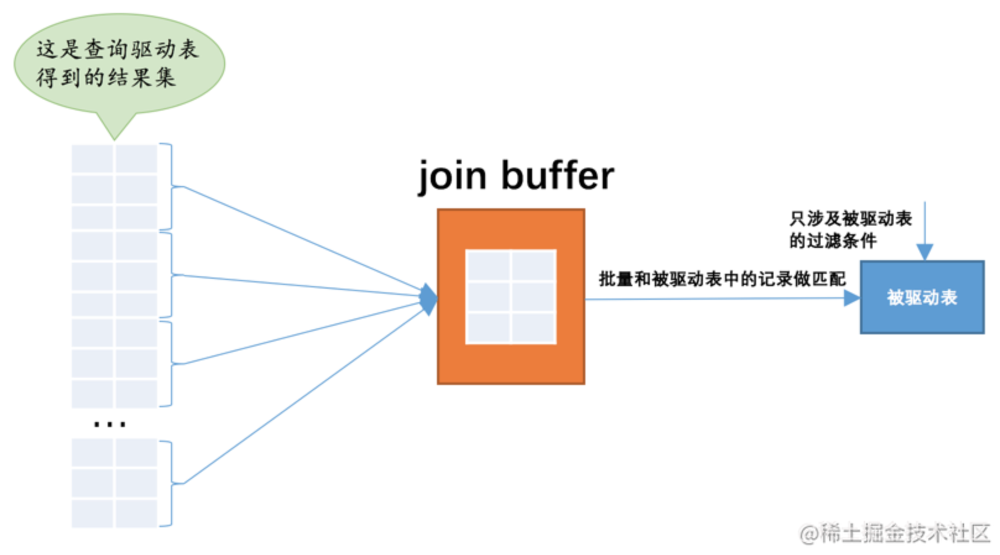

搞数据库一个避不开的概念就是`Join`，翻译成中文就是`连接`。相信很多小伙伴在初学连接的时候有些一脸懵逼，理解了连接的语义之后又可能不明白各个表中的记录到底是怎么连起来的，以至于在使用的时候常常陷入下边两种误区：

- 误区一：业务至上，管他三七二十一，再复杂的查询也用在一个连接语句中搞定。
- 误区二：敬而远之，上次 DBA 那给报过来的慢查询就是因为使用了连接导致的，以后再也不敢用了。

### 连接的本质

`连接`的本质就是把各个连接表中的记录都取出来依次匹配的组合加入结果集并返回给用户

连接查询的结果集中包含一个表中的每一条记录与另一个表中的每一条记录相互匹配的组合，像这样的结果集就可以称之为`笛卡尔积`

### 驱动表

首先确定第一个需要查询的表，这个表称之为`驱动表`，怎样在单表中执行查询语句（就是说从const、ref、ref_or_null、range、index、all这些执行方法中选取代价最小的去执行查询）。

### 被动表

针对从驱动表（t1)产生的结果集中的每一条记录，分别需要到`t2`表中查找匹配的记录，所谓`匹配的记录`，指的是符合过滤条件的记录。因为是根据`t1`表中的记录去找`t2`表中的记录，所以`t2`表也可以被称之为`被驱动表`

### 内连接和外连接

- 对于`内连接`的两个表，驱动表中的记录在被驱动表中找不到匹配的记录，该记录不会加入到最后的结果集，我们上边提到的连接都是所谓的`内连接`。

- 对于`外连接`的两个表，驱动表中的记录即使在被驱动表中没有匹配的记录，也仍然需要加入到结果集。

  在`MySQL`中，根据选取驱动表的不同，外连接仍然可以细分为2种：

  - 左外连接

    选取左侧的表为驱动表。

  - 右外连接

    选取右侧的表为驱动表。

## 连接的原理

上边贼啰嗦的介绍都只是为了唤醒大家对`连接`、`内连接`、`外连接`这些概念的记忆，这些基本概念是为了真正进入本章主题做的铺垫。真正的重点是MySQL采用了什么样的算法来进行表与表之间的连接，了解了这个之后，大家才能明白为啥有的连接查询运行的快如闪电，有的却慢如蜗牛。

### 嵌套循环连接（Nested-Loop Join）

我们前边说过，对于两表连接来说，驱动表只会被访问一遍，但被驱动表却要被访问到好多遍，具体访问几遍取决于对驱动表执行单表查询后的结果集中的记录条数。对于内连接来说，选取哪个表为驱动表都没关系，而外连接的驱动表是固定的，也就是说左（外）连接的驱动表就是左边的那个表，右（外）连接的驱动表就是右边的那个表。我们上边已经大致介绍过`t1`表和`t2`表执行内连接查询的大致过程，我们温习一下：

- 步骤1：选取驱动表，使用与驱动表相关的过滤条件，选取代价最低的单表访问方法来执行对驱动表的单表查询。
- 步骤2：对上一步骤中查询驱动表得到的结果集中每一条记录，都分别到被驱动表中查找匹配的记录。

### 基于块的嵌套循环连接（Block Nested-Loop Join）

扫描一个表的过程其实是先把这个表从磁盘上加载到内存中，然后从内存中比较匹配条件是否满足。现实生活中的表可不像`t1`、`t2`这种只有3条记录，成千上万条记录都是少的，几百万、几千万甚至几亿条记录的表到处都是。内存里可能并不能完全存放的下表中所有的记录，所以在扫描表前边记录的时候后边的记录可能还在磁盘上，等扫描到后边记录的时候可能内存不足，所以需要把前边的记录从内存中释放掉。我们前边又说过，采用`嵌套循环连接`算法的两表连接过程中，被驱动表可是要被访问好多次的，如果这个被驱动表中的数据特别多而且不能使用索引进行访问，那就相当于要从磁盘上读好几次这个表，这个`I/O`代价就非常大了，所以我们得想办法：尽量减少访问被驱动表的次数。

当被驱动表中的数据非常多时，每次访问被驱动表，被驱动表的记录会被加载到内存中，在内存中的每一条记录只会和驱动表结果集的一条记录做匹配，之后就会被从内存中清除掉。然后再从驱动表结果集中拿出另一条记录，再一次把被驱动表的记录加载到内存中一遍，周而复始，驱动表结果集中有多少条记录，就得把被驱动表从磁盘上加载到内存中多少次。所以我们可不可以在把被驱动表的记录加载到内存的时候，一次性和多条驱动表中的记录做匹配，这样就可以大大减少重复从磁盘上加载被驱动表的代价了。所以设计`MySQL`的大叔提出了一个`join buffer`的概念，`join buffer`就是执行连接查询前申请的一块固定大小的内存，先把若干条驱动表结果集中的记录装在这个`join buffer`中，然后开始扫描被驱动表，每一条被驱动表的记录一次性和`join buffer`中的多条驱动表记录做匹配，因为匹配的过程都是在内存中完成的，所以这样可以显著减少被驱动表的`I/O`代价。使用`join buffer`的过程如下图所示：

最好的情况是`join buffer`足够大，能容纳驱动表结果集中的所有记录，这样只需要访问一次被驱动表就可以完成连接操作了。设计`MySQL`的大叔把这种加入了`join buffer`的嵌套循环连接算法称之为`基于块的嵌套连接`（Block Nested-Loop Join）算法。

这个`join buffer`的大小是可以通过启动参数或者系统变量`join_buffer_size`进行配置，默认大小为`262144字节`（也就是`256KB`），最小可以设置为`128字节`。当然，对于优化被驱动表的查询来说，最好是为被驱动表加上效率高的索引，如果实在不能使用索引，并且自己的机器的内存也比较大可以尝试调大`join_buffer_size`的值来对连接查询进行优化。

另外需要注意的是，驱动表的记录并不是所有列都会被放到`join buffer`中，只有查询列表中的列和过滤条件中的列才会被放到`join buffer`中，所以再次提醒我们，**最好不要把`*`作为查询列表，只需要把我们关心的列放到查询列表就好了，这样还可以在`join buffer`中放置更多的记录呢哈。**

