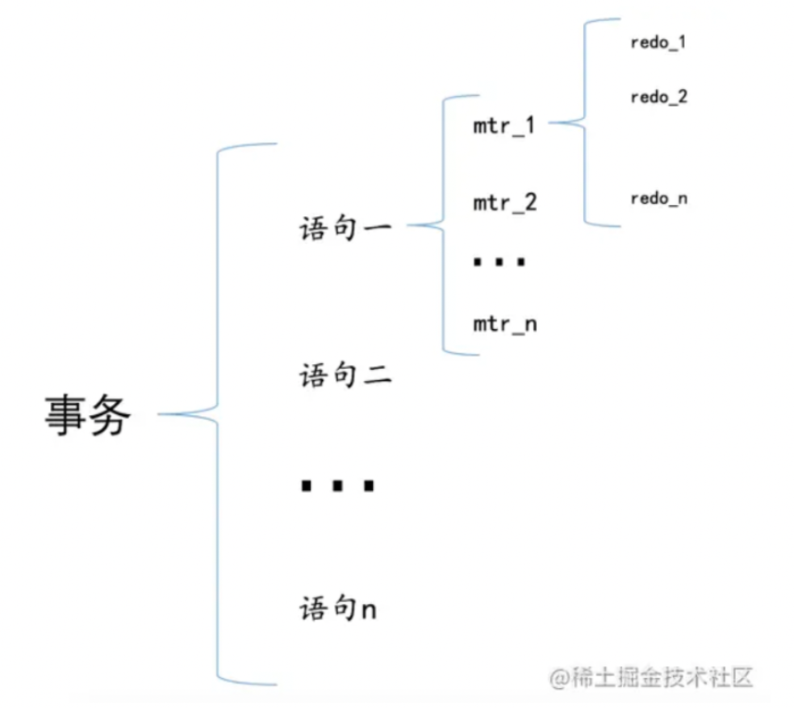

# 15.InnoDB Buffer Pool

1.磁盘太慢，用内存作为缓存很有必要。
2.Buffer Pool本质上是InnoDB向操作系统申请的一段连续的内存空间，可以通过innodb_buffer_pool_size来调整它的大小。
3.Buffer Pool向操作系统申请的连续内存由控制块和缓存页组成，每个控制块和缓存页都是一一对应的，在填充足够多的控制块和缓存页的组合后，Buffer Pool剩余的空间可能产生不够填充一组控制块和缓存页，这部分空间不能被使用，也被称为碎片。
4.InnoDB使用了许多链表来管理Buffer Pool。(free链表，flush链表，LRU链表）
5.free链表中每一个节点都代表一个空闲的缓存页，在将磁盘中的页加载到Buffer Pool时，会从free链表中寻找空闲的缓存页。
6.为了快速定位某个页是否被加载到Buffer Pool，使用表空间号 + 页号作为key，缓存页作为value，建立哈希表。
7.在Buffer Pool中被修改的页称为脏页，脏页并不是立即刷新，而是被加入到flush链表中，待之后的某个时刻同步到磁盘上。
8.LRU链表分为young和old两个区域，可以通过innodb_old_blocks_pct来调节old区域所占的比例。首次从磁盘上加载到Buffer Pool的页会被放到old区域的头部，在innodb_old_blocks_time间隔时间内访问该页不会把它移动到young区域头部。在Buffer Pool没有可用的空闲缓存页时，会首先淘汰掉old区域的一些页。
9.我们可以通过指定innodb_buffer_pool_instances来控制Buffer Pool实例的个数，每个Buffer Pool实例中都有各自独立的链表，互不干扰。
10.自MySQL 5.7.5版本之后，可以在服务器运行过程中调整Buffer Pool大小。每个Buffer Pool实例由若干个chunk组成，每个chunk的大小可以在服务器启动时通过启动参数调整。
11.可以用下边的命令查看Buffer Pool的状态信息：
SHOW ENGINE INNODB STATUS\G

# 16.InnoDB事务

为了方便大家记住我们上边唠叨的现实世界状态转换过程中需要遵守的4个特性，我们把原子性（Atomicity）、隔离性（Isolation）、一致性（Consistency）和持久性（Durability）这四个词对应的英文单词首字母提取出来就是A、I、C、D，稍微变换一下顺序可以组成一个完整的英文单词：ACID。想必大家都是学过初高中英语的，ACID是英文酸的意思，以后我们提到ACID这个词儿，大家就应该想到原子性、一致性、隔离性、持久性这几个规则。另外，设计数据库的大叔为了方便起见，把需要保证原子性、隔离性、一致性和持久性的一个或多个数据库操作称之为一个事务（英文名是：transaction）。

# 17.redolog

redo日志是个啥
我们只是想让已经提交了的事务对数据库中数据所做的修改永久生效，即使后来系统崩溃，在重启后也能把这种修改恢复出来。所以我们其实没有必要在每次事务提交时就把该事务在内存中修改过的全部页面刷新到磁盘，只需要把修改了哪些东西记录一下就好，比方说某个事务将系统表空间中的第100号页面中偏移量为1000处的那个字节的值1改成2我们只需要记录一下：
将第0号表空间的100号页面的偏移量为1000处的值更新为2。
这样我们在事务提交时，把上述内容刷新到磁盘中，即使之后系统崩溃了，重启之后只要按照上述内容所记录的步骤重新更新一下数据页，那么该事务对数据库中所做的修改又可以被恢复出来，也就意味着满足持久性的要求。因为在系统崩溃重启时需要按照上述内容所记录的步骤重新更新数据页，所以上述内容也被称之为重做日志，英文名为redo log，我们也可以土洋结合，称之为redo日志。与在事务提交时将所有修改过的内存中的页面刷新到磁盘中相比，只将该事务执行过程中产生的redo日志刷新到磁盘的好处如下：
redo日志占用的空间非常小
redo日志是顺序写入磁盘的
redo日志格式
通用的格式各个部分的详细释义如下：
type：该条redo日志的类型。在MySQL 5.7.21这个版本中，设计InnoDB的大叔一共为redo日志设计了53种不同的类型，稍后会详细介绍不同类型的redo日志。
space ID：表空间ID。
page number：页号。
data：该条redo日志的具体内容。
offset: 记录一下在某个页面的某个偏移量处修改了几个字节的值-偏移量；当某个事务向某个包含row_id隐藏列的表插入一条记录，并且为该记录分配的row_id值为256的倍数时，就会向系统表空间页号为7的页面的相应偏移量处写入8个字节的值。但是我们要知道，这个写入实际上是在Buffer Pool中完成的，我们需要为这个页面的修改记录一条redo日志
len:MLOG_WRITE_STRING类型的redo日志表示写入一串数据，但是因为不能确定写入的具体数据占用多少字节，所以需要在日志结构中添加一个len字段：
redo日志类型
redo日志格式小结
redo日志会把事务在执行过程中对数据库所做的所有修改都记录下来，在之后系统崩溃重启后可以把事务所做的任何修改都恢复出来。
Mini-Transaction
设计MySQL的大叔把对底层页面中的一次原子访问的过程称之为一个Mini-Transaction，简称mtr，比如上边所说的修改一次Max Row ID的值算是一个Mini-Transaction，向某个索引对应的B+树中插入一条记录的过程也算是一个Mini-Transaction。通过上边的叙述我们也知道，一个所谓的mtr可以包含一组redo日志，在进行崩溃恢复时这一组redo日志作为一个不可分割的整体。
一个事务可以包含若干条语句，每一条语句其实是由若干个mtr组成，每一个mtr又可以包含若干条redo日志，画个图表示它们的关系就是这样：

 

redo log block
设计InnoDB的大叔为了更好的进行系统崩溃恢复，他们把通过mtr生成的redo日志都放在了大小为512字节的页中。为了和我们前边提到的表空间中的页做区别，我们这里把用来存储redo日志的页称为block（你心里清楚页和block的意思其实差不多就行了）
redo日志缓冲区
设计InnoDB的大叔为了解决磁盘速度过慢的问题而引入了Buffer Pool。同理，写入redo日志时也不能直接直接写到磁盘上，实际上在服务器启动时就向操作系统申请了一大片称之为redo log buffer的连续内存空间，翻译成中文就是redo日志缓冲区，我们也可以简称为log buffer。
redo日志写入log buffer
向log buffer中写入redo日志的过程是顺序的，也就是先往前边的block中写，当该block的空闲空间用完之后再往下一个block中写。当我们想往log buffer中写入redo日志时，第一个遇到的问题就是应该写在哪个block的哪个偏移量处，所以设计InnoDB的大叔特意提供了一个称之为buf_free的全局变量，该变量指明后续写入的redo日志应该写入到log buffer中的哪个位置 
redo日志刷盘时机
log buffer空间不足时
log buffer的大小是有限的（通过系统变量innodb_log_buffer_size指定），如果不停的往这个有限大小的log buffer里塞入日志，很快它就会被填满。设计InnoDB的大叔认为如果当前写入log buffer的redo日志量已经占满了log buffer总容量的大约一半左右，就需要把这些日志刷新到磁盘上。
事务提交时
我们前边说过之所以使用redo日志主要是因为它占用的空间少，还是顺序写，在事务提交时可以不把修改过的Buffer Pool页面刷新到磁盘，但是为了保证持久性，必须要把修改这些页面对应的redo日志刷新到磁盘。
将某个脏页刷新到磁盘前，会保证先将该脏页对应的 redo 日志刷新到磁盘中（再一次 强调，redo  日志是顺序刷新的，所以在将某个脏页对应的 redo 日志从 redo log buffer 刷新到磁盘时，也会保证将在其之前产生的 redo  日志也刷新到磁盘）。
后台线程不停的刷刷刷
后台有一个线程，大约每秒都会刷新一次log buffer中的redo日志到磁盘。
正常关闭服务器时
做所谓的checkpoint时（我们现在没介绍过checkpoint的概念，稍后会仔细唠叨，稍安勿躁）
其他的一些情况...
redo日志文件组
MySQL的数据目录（使用SHOW VARIABLES LIKE 'datadir'查看）下默认有两个名为ib_logfile0和ib_logfile1的文件，log buffer中的日志默认情况下就是刷新到这两个磁盘文件中。
Log Sequence Number
自系统开始运行，就不断的在修改页面，也就意味着会不断的生成redo日志。redo日志的量在不断的递增，就像人的年龄一样，自打出生起就不断递增，永远不可能缩减了。设计InnoDB的大叔为记录已经写入的redo日志量，设计了一个称之为Log Sequence Number的全局变量，翻译过来就是：日志序列号，简称lsn。不过不像人一出生的年龄是0岁，设计InnoDB的大叔规定初始的lsn值为8704（也就是一条redo日志也没写入时，lsn的值为8704）。每一组由mtr生成的redo日志都有一个唯一的LSN值与其对应，LSN值越小，说明redo日志产生的越早。
flushed_to_disk_lsn
redo日志是首先写到log buffer中，之后才会被刷新到磁盘上的redo日志文件。所以设计InnoDB的大叔提出了一个称之为buf_next_to_write的全局变量，标记当前log buffer中已经有哪些日志被刷新到磁盘中了
checkpoint
	有一个很不幸的事实就是我们的redo日志文件组容量是有限的，我们不得不选择循环使用redo日志文件组中的文件，但是这会造成最后写的redo日志与最开始写的redo日志追尾，这时应该想到：redo日志只是为了系统崩溃后恢复脏页用的，如果对应的脏页已经刷新到了磁盘，也就是说即使现在系统崩溃，那么在重启后也用不着使用redo日志恢复该页面了，所以该redo日志也就没有存在的必要了，那么它占用的磁盘空间就可以被后续的redo日志所重用。也就是说：判断某些redo日志占用的磁盘空间是否可以覆盖的依据就是它对应的脏页是否已经刷新到磁盘里。
设计InnoDB的大叔提出了一个全局变量checkpoint_lsn来代表当前系统中可以被覆盖的redo日志总量是多少，这个变量初始值也是8704。
批量从flush链表中刷出脏页
我们在介绍Buffer Pool的时候说过，一般情况下都是后台的线程在对LRU链表和flush链表进行刷脏操作，这主要因为刷脏操作比较慢，不想影响用户线程处理请求。但是如果当前系统修改页面的操作十分频繁，这样就导致写日志操作十分频繁，系统lsn值增长过快。如果后台的刷脏操作不能将脏页刷出，那么系统无法及时做checkpoint，可能就需要用户线程同步的从flush链表中把那些最早修改的脏页（oldest_modification最小的脏页）刷新到磁盘，这样这些脏页对应的redo日志就没用了，然后就可以去做checkpoint了。
查看系统中的各种LSN值
我们可以使用SHOW ENGINE INNODB STATUS命令查看当前InnoDB存储引擎中的各种LSN值的情况
innodb_flush_log_at_trx_commit
对事务的持久性要求不是那么强烈的话，可以选择修改一个称为innodb_flush_log_at_trx_commit的系统变量的值，该变量有3个可选的值：0,1,2
0：当该系统变量值为0时，表示在事务提交时不立即向磁盘中同步redo日志，这个任务是交给后台线程做的。
这样很明显会加快请求处理速度，但是如果事务提交后服务器挂了，后台线程没有及时将redo日志刷新到磁盘，那么该事务对页面的修改会丢失。
1：当该系统变量值为1时，表示在事务提交时需要将redo日志同步到磁盘，可以保证事务的持久性。1也是innodb_flush_log_at_trx_commit的默认值。
2：当该系统变量值为2时，表示在事务提交时需要将redo日志写到操作系统的缓冲区中，但并不需要保证将日志真正的刷新到磁盘。
这种情况下如果数据库挂了，操作系统没挂的话，事务的持久性还是可以保证的，但是操作系统也挂了的话，那就不能保证持久性了。
崩溃恢复
确定恢复的起点:
对于checkpoint_lsn之后的redo日志，它们对应的脏页可能没被刷盘，也可能被刷盘了，我们不能确定，所以需要从checkpoint_lsn开始读取redo日志来恢复页面。
确定恢复的终点:
普通block的log block header部分有一个称之为LOG_BLOCK_HDR_DATA_LEN的属性，该属性值记录了当前block里使用了多少字节的空间。对于被填满的block来说，该值永远为512。如果该属性的值不为512，那么就是它了，它就是此次崩溃恢复中需要扫描的最后一个block。
怎么恢复
使用哈希表：
根据redo日志的space ID和page number属性计算出散列值，把space ID和page number相同的redo日志放到哈希表的同一个槽里,所以可以一次性将一个页面修复好（避免了很多读取页面的随机IO）
跳过已经刷新到磁盘的页面
那在恢复时怎么知道某个redo日志对应的脏页是否在崩溃发生时已经刷新到磁盘了呢？这还得从页面的结构说起，我们前边说过每个页面都有一个称之为File Header的部分，在File Header里有一个称之为FIL_PAGE_LSN的属性，该属性记载了最近一次修改页面时对应的lsn值（其实就是页面控制块中的newest_modification值）。如果在做了某次checkpoint之后有脏页被刷新到磁盘中，那么该页对应的FIL_PAGE_LSN代表的lsn值肯定大于checkpoint_lsn的值，凡是符合这种情况的页面就不需要重复执行lsn值小于FIL_PAGE_LSN的redo日志了，所以更进一步提升了崩溃恢复的速度。

# 18.undoLog

事务回滚的需求
我们说过事务需要保证原子性，也就是事务中的操作要么全部完成，要么什么也不做。但是偏偏有时候事务执行到一半会出现一些情况，比如：
情况一：事务执行过程中可能遇到各种错误，比如服务器本身的错误，操作系统错误，甚至是突然断电导致的错误。
情况二：程序员可以在事务执行过程中手动输入ROLLBACK语句结束当前的事务的执行。
这两种情况都会导致事务执行到一半就结束，但是事务执行过程中可能已经修改了很多东西，为了保证事务的原子性，我们需要把东西改回原先的样子，这个过程就称之为回滚。而为了为了回滚而记录的内容称之为撤销日志，英文名为undo log。
事务id
给事务分配id的时机
如果某个事务执行过程中对某个表执行了增、删、改操作，那么InnoDB存储引擎就会给它分配一个独一无二的事务id，分配方式如下：
对于只读事务来说，只有在它第一次对某个用户创建的临时表执行增、删、改操作时才会为这个事务分配一个事务id，否则的话是不分配事务id的。
小贴士： 我们前边说过对某个查询语句执行EXPLAIN分析它的查询计划时，有时候在Extra列会看到Using temporary的提示，这个表明在执行该查询语句时会用到内部临时表。这个所谓的内部临时表和我们手动用CREATE TEMPORARY TABLE创建的用户临时表并不一样，在事务回滚时并不需要把执行SELECT语句过程中用到的内部临时表也回滚，在执行SELECT语句用到内部临时表时并不会为它分配事务id。
对于读写事务来说，只有在它第一次对某个表（包括用户创建的临时表）执行增、删、改操作时才会为这个事务分配一个事务id，否则的话也是不分配事务id的。
有的时候虽然我们开启了一个读写事务，但是在这个事务中全是查询语句，并没有执行增、删、改的语句，那也就意味着这个事务并不会被分配一个事务id。
事务id是怎么生成的
事务id本质上就是一个数字，它的分配策略和我们前边提到的对隐藏列row_id（当用户没有为表创建主键和UNIQUE键时InnoDB自动创建的列）的分配策略大抵相同，具体策略需查看
trx_id隐藏列
InnoDB记录行格式的时候重点强调过：聚簇索引的记录除了会保存完整的用户数据以外，而且还会自动添加名为trx_id、roll_pointer的隐藏列。其中的trx_id列其实还蛮好理解的，就是某个对这个聚簇索引记录做改动的语句所在的事务对应的事务id
undo日志的格式
undo日志是被记录到类型为FIL_PAGE_UNDO_LOG（对应的十六进制是0x0002，忘记了页面类型是个啥的同学需要回过头再看看前边的章节）的页面中。这些页面可以从系统表空间中分配，也可以从一种专门存放undo日志的表空间，也就是所谓的undo tablespace中分配。
INSERT操作对应的undo日志
当我们向表中插入一条记录时会有乐观插入和悲观插入的区分，但是不管怎么插入，最终导致的结果就是这条记录被放到了一个数据页中。如果希望回滚这个插入操作，那么把这条记录删除就好了，也就是说在写对应的undo日志时，主要是把这条记录的主键信息记上。所以设计InnoDB的大叔设计了一个类型为TRX_UNDO_INSERT_REC的undo日志。
roll_pointer隐藏列的含义
oll_pointer的真实面纱了，这个占用7个字节的字段其实一点都不神秘，本质上就是一个指向记录对应的undo日志的一个指针。记录被存储到了类型为FIL_PAGE_INDEX的页面中（就是我们前边一直所说的数据页），undo日志被存放到了类型为FIL_PAGE_UNDO_LOG的页面中。
DELETE操作对应的undo日志
我们知道插入到页面中的记录会根据记录头信息中的next_record属性组成一个单向链表，我们把这个链表称之为正常记录链表；我们在前边唠叨数据页结构的时候说过，被删除的记录其实也会根据记录头信息中的next_record属性组成一个链表，只不过这个链表中的记录占用的存储空间可以被重新利用，所以也称这个链表为垃圾链表。Page Header部分有一个称之为PAGE_FREE的属性，它指向由被删除记录组成的垃圾链表中的头节点。
使用DELETE语句把正常记录链表中的最后一条记录给删除掉，其实这个删除的过程需要经历两个阶段：
阶段一：仅仅将记录的delete_mask标识位设置为1，其他的不做修改（其实会修改记录的trx_id、roll_pointer这些隐藏列的值）。设计InnoDB的大叔把这个阶段称之为delete mark。此时正常记录链表中的最后一条记录的delete_mask值被设置为1，但是并没有被加入到垃圾链表。也就是此时记录处于一个中间状态。在删除语句所在的事务提交之前，被删除的记录一直都处于这种所谓的中间状态。
阶段二：当该删除语句所在的事务提交之后，会有专门的线程后来真正的把记录删除掉。所谓真正的删除就是把该记录从正常记录链表中移除，并且加入到垃圾链表中，然后还要调整一些页面的其他信息，比如页面中的用户记录数量PAGE_N_RECS、上次插入记录的位置PAGE_LAST_INSERT、垃圾链表头节点的指针PAGE_FREE、页面中可重用的字节数量PAGE_GARBAGE、还有页目录的一些信息等等。设计InnoDB的大叔把这个阶段称之为purge。
删除的undo log类型为TRX_UNDO_DEL_MARK_REC的undo日志中的属性，特别注意一下这几点：
在对一条记录进行delete mark操作前，需要把该记录的旧的trx_id和roll_pointer隐藏列的值都给记到对应的undo日志中来，就是我们图中显示的old trx_id和old roll_pointer属性。这样有一个好处，那就是可以通过undo日志的old roll_pointer找到记录在修改之前对应的undo日志。
与类型为TRX_UNDO_INSERT_REC的undo日志不同，类型为TRX_UNDO_DEL_MARK_REC的undo日志还多了一个索引列各列信息的内容，也就是说如果某个列被包含在某个索引中，那么它的相关信息就应该被记录到这个索引列各列信息部分，所谓的相关信息包括该列在记录中的位置（用pos表示），该列占用的存储空间大小（用len表示），该列实际值（用value表示）。
UPDATE操作对应的undo日志
在执行UPDATE语句时，InnoDB对更新主键和不更新主键这两种情况有截然不同的处理方案。
不更新主键的情况
在不更新主键的情况下，又可以细分为被更新的列占用的存储空间不发生变化和发生变化的情况。针对UPDATE不更新主键的情况（包括上边所说的就地更新和先删除旧记录再插入新记录），设计InnoDB的大叔们设计了一种类型为TRX_UNDO_UPD_EXIST_REC的undo日志
就地更新（in-place update）
更新记录时，对于被更新的每个列来说，如果更新后的列和更新前的列占用的存储空间都一样大，那么就可以进行就地更新，也就是直接在原记录的基础上修改对应列的值。再次强调一边，是每个列在更新前后占用的存储空间一样大，有任何一个被更新的列更新前比更新后占用的存储空间大，或者更新前比更新后占用的存储空间小都不能进行就地更新。
先删除掉旧记录，再插入新记录
在不更新主键的情况下，如果有任何一个被更新的列更新前和更新后占用的存储空间大小不一致，那么就需要先把这条旧的记录从聚簇索引页面中删除掉，然后再根据更新后列的值创建一条新的记录插入到页面中。
请注意一下，我们这里所说的删除并不是delete mark操作，而是真正的删除掉，也就是把这条记录从正常记录链表中移除并加入到垃圾链表中，并且修改页面中相应的统计信息（比如PAGE_FREE、PAGE_GARBAGE等这些信息）。不过这里做真正删除操作的线程并不是在唠叨DELETE语句中做purge操作时使用的另外专门的线程，而是由用户线程同步执行真正的删除操作，真正删除之后紧接着就要根据各个列更新后的值创建的新记录插入。
更新主键的情况
在聚簇索引中，记录是按照主键值的大小连成了一个单向链表的，如果我们更新了某条记录的主键值，意味着这条记录在聚簇索引中的位置将会发生改变，比如你将记录的主键值从1更新为10000，如果还有非常多的记录的主键值分布在1 ~ 10000之间的话，那么这两条记录在聚簇索引中就有可能离得非常远，甚至中间隔了好多个页面。针对UPDATE语句中更新了记录主键值的这种情况，InnoDB在聚簇索引中分了两步处理：
将旧记录进行delete mark操作
高能注意：这里是delete mark操作！这里是delete mark操作！这里是delete mark操作！也就是说在UPDATE语句所在的事务提交前，对旧记录只做一个delete mark操作，在事务提交后才由专门的线程做purge操作，把它加入到垃圾链表中。这里一定要和我们上边所说的在不更新记录主键值时，先真正删除旧记录，再插入新记录的方式区分开！
根据更新后各列的值创建一条新记录，并将其插入到聚簇索引中（需重新定位插入的位置）。
由于更新后的记录主键值发生了改变，所以需要重新从聚簇索引中定位这条记录所在的位置，然后把它插进去。
针对UPDATE语句更新记录主键值的这种情况，在对该记录进行delete mark操作前，会记录一条类型为TRX_UNDO_DEL_MARK_REC的undo日志；之后插入新记录时，会记录一条类型为TRX_UNDO_INSERT_REC的undo日志，也就是说每对一条记录的主键值做改动时，会记录2条undo日志。
通用链表结构
在写入undo日志的过程中会使用到多个链表，很多链表都有同样的节点结构
整个List Node占用12个字节的存储空间。
整个List Base Node占用16个字节的存储空间。
FIL_PAGE_UNDO_LOG页面
我们前边唠叨表空间的时候说过，表空间其实是由许许多多的页面构成的，页面默认大小为16KB。这些页面有不同的类型，比如类型为FIL_PAGE_INDEX的页面用于存储聚簇索引以及二级索引，类型为FIL_PAGE_TYPE_FSP_HDR的页面用于存储表空间头部信息的，还有其他各种类型的页面，其中有一种称之为FIL_PAGE_UNDO_LOG类型的页面是专门用来存储undo日志的。
“类型为FIL_PAGE_UNDO_LOG的页”这种说法太绕口，以后我们就简称为Undo页面了哈。File Header和File Trailer是各种页面都有的通用结构，我们前边唠叨过很多遍了，这里就不赘述了（忘记了的可以到讲述数据页结构或者表空间的章节中查看）。Undo Page Header是Undo页面所特有的。
Undo页面链表
单个事务中的Undo页面链表
因为一个事务可能包含多个语句，而且一个语句可能对若干条记录进行改动，而对每条记录进行改动前，都需要记录1条或2条的undo日志，所以在一个事务执行过程中可能产生很多undo日志，这些日志可能一个页面放不下，需要放到多个页面中，这些页面就通过我们上边介绍的TRX_UNDO_PAGE_NODE属性连成了链表
我们特意把链表中的第一个Undo页面给标了出来，称它为first undo page，其余的Undo页面称之为normal undo page，这是因为在first undo page中除了记录Undo Page Header之外，还会记录其他的一些管理信息。
在一个事务执行过程中，可能混着执行INSERT、DELETE、UPDATE语句，也就意味着会产生不同类型的undo日志。但是我们前边又强调过，同一个Undo页面要么只存储TRX_UNDO_INSERT大类的undo日志，要么只存储TRX_UNDO_UPDATE大类的undo日志，反正不能混着存，所以在一个事务执行过程中就可能需要2个Undo页面的链表，一个称之为insert undo链表，另一个称之为update undo链表。另外，设计InnoDB的大叔规定对普通表和临时表的记录改动时产生的undo日志要分别记录（我们稍后阐释为啥这么做），所以在一个事务中最多有4个以Undo页面为节点组成的链表。
当然，并不是在事务一开始就会为这个事务分配这4个链表，总结一句就是：按需分配，啥时候需要啥时候再分配，不需要就不分配。
多个事务中的Undo页面链表
为了尽可能提高undo日志的写入效率，不同事务执行过程中产生的undo日志需要被写入到不同的Undo页面链表中。
undo日志具体写入过程
段（Segment）的概念
如果你有认真看过表空间那一章的话，对这个段的概念应该印象深刻，我们当时花了非常大的篇幅来唠叨这个概念。简单讲，这个段是一个逻辑上的概念，本质上是由若干个零散页面和若干个完整的区组成的。比如一个B+树索引被划分成两个段，一个叶子节点段，一个非叶子节点段，这样叶子节点就可以被尽可能的存到一起，非叶子节点被尽可能的存到一起。每一个段对应一个INODE Entry结构，这个INODE Entry结构描述了这个段的各种信息，比如段的ID，段内的各种链表基节点，零散页面的页号有哪些等信息。
Undo Log Segment Header
设计InnoDB的大叔规定，每一个Undo页面链表都对应着一个段，称之为Undo Log Segment。	
也就是说链表中的页面都是从这个段里边申请的，所以他们在Undo页面链表的第一个页面，也就是上边提到的first undo page中设计了一个称之为Undo Log Segment Header的部分，这个部分中包含了该链表对应的段的segment header信息以及其他的一些关于这个段的信息。Undo链表的第一个页面比普通页面多了个Undo Log Segment Header。
Undo Log Header
一个事务在向Undo页面中写入undo日志时的方式是十分简单暴力的，就是直接往里怼，写完一条紧接着写另一条，各条undo日志之间是亲密无间的。写完一个Undo页面后，再从段里申请一个新页面，然后把这个页面插入到Undo页面链表中，继续往这个新申请的页面中写。设计InnoDB的大叔认为同一个事务向一个Undo页面链表中写入的undo日志算是一个组，比方说我们上边介绍的trx 1由于会分配3个Undo页面链表，也就会写入3个组的undo日志；trx 2由于会分配2个Undo页面链表，也就会写入2个组的undo日志。在每写入一组undo日志时，都会在这组undo日志前先记录一下关于这个组的一些属性，设计InnoDB的大叔把存储这些属性的地方称之为Undo Log Header。所以Undo页面链表的第一个页面在真正写入undo日志前，其实都会被填充Undo Page Header、Undo Log Segment Header、Undo Log Header这3个部分。
小结
对于没有被重用的Undo页面链表来说，链表的第一个页面，也就是first undo page在真正写入undo日志前，会填充Undo Page Header、Undo Log Segment Header、Undo Log Header这3个部分，之后才开始正式写入undo日志。对于其他的页面来说，也就是normal undo page在真正写入undo日志前，只会填充Undo Page Header。链表的List Base Node存放到first undo page的Undo Log Segment Header部分，List Node信息存放到每一个Undo页面的undo Page Header部分。
重用Undo页面
我们前边说为了能提高并发执行的多个事务写入undo日志的性能，设计InnoDB的大叔决定为每个事务单独分配相应的Undo页面链表（最多可能单独分配4个链表）。但是这样也造成了一些问题，比如其实大部分事务执行过程中可能只修改了一条或几条记录，针对某个Undo页面链表只产生了非常少的undo日志，这些undo日志可能只占用一丢丢存储空间，每开启一个事务就新创建一个Undo页面链表（虽然这个链表中只有一个页面）来存储这么一丢丢undo日志岂不是太浪费了么？的确是挺浪费，于是设计InnoDB的大叔本着勤俭节约的优良传统，决定在事务提交后在某些情况下重用该事务的Undo页面链表。一个Undo页面链表是否可以被重用的条件很简单：
该链表中只包含一个Undo页面。

该Undo页面已经使用的空间小于整个页面空间的3/4。
insert undo链表
update undo链表
在一个事务提交后，它的update undo链表中的undo日志也不能立即删除掉（这些日志用于MVCC，我们后边会说的）。所以如果之后的事务想重用update undo链表时，就不能覆盖之前事务写入的undo日志。
回滚段
回滚段的概念
我们现在知道一个事务在执行过程中最多可以分配4个Undo页面链表，在同一时刻不同事务拥有的Undo页面链表是不一样的，所以在同一时刻系统里其实可以有许许多多个Undo页面链表存在。为了更好的管理这些链表，设计InnoDB的大叔又设计了一个称之为Rollback Segment Header的页面，在这个页面中存放了各个Undo页面链表的frist undo page的页号，他们把这些页号称之为undo slot。我们可以这样理解，每个Undo页面链表都相当于是一个班，这个链表的first undo page就相当于这个班的班长，找到了这个班的班长，就可以找到班里的其他同学（其他同学相当于normal undo page）。有时候学校需要向这些班级传达一下精神，就需要把班长都召集在会议室，这个Rollback Segment Header就相当于是一个会议室。
设计InnoDB的大叔规定，每一个Rollback Segment Header页面都对应着一个段，这个段就称为Rollback Segment，翻译过来就是回滚段。与我们之前介绍的各种段不同的是，这个Rollback Segment里其实只有一个页面。
从回滚段中申请Undo页面链表
初始情况下，由于未向任何事务分配任何Undo页面链表，所以对于一个Rollback Segment Header页面来说，它的各个undo slot都被设置成了一个特殊的值：FIL_NULL（对应的十六进制就是0xFFFFFFFF），表示该undo slot不指向任何页面。
如果是FIL_NULL，那么在表空间中新创建一个段（也就是Undo Log Segment），然后从段里申请一个页面作为Undo页面链表的first undo page，然后把该undo slot的值设置为刚刚申请的这个页面的页号，这样也就意味着这个undo slot被分配给了这个事务。
如果不是FIL_NULL，说明该undo slot已经指向了一个undo链表，也就是说这个undo slot已经被别的事务占用了，那就跳到下一个undo slot，判断该undo slot的值是不是FIL_NULL，重复上边的步骤。
一个Rollback Segment Header页面中包含1024个undo slot，如果这1024个undo slot的值都不为FIL_NULL，这就意味着这1024个undo slot都已经名花有主（被分配给了某个事务），此时由于新事务无法再获得新的Undo页面链表，就会回滚这个事务并且给用户报错：
Too many active concurrent transactions

当一个事务提交时，它所占用的undo slot有两种命运：
如果该undo slot指向的Undo页面链表符合被重用的条件
该undo slot就处于被缓存的状态，设计InnoDB的大叔规定这时该Undo页面链表的TRX_UNDO_STATE属性（该属性在first undo page的Undo Log Segment Header部分）会被设置为TRX_UNDO_CACHED。
如果该undo slot指向的Undo页面链表不符合被重用的条件，那么针对该undo slot对应的Undo页面链表类型不同，也会有不同的处理：
多个回滚段
我们说一个事务执行过程中最多分配4个Undo页面链表，而一个回滚段里只有1024个undo slot，很显然undo slot的数量有点少啊。
话说在InnoDB的早期发展阶段的确只有一个回滚段，但是设计InnoDB的大叔后来意识到了这个问题，咋解决这问题呢？会议室不够，多盖几个会议室不就得了。所以设计InnoDB的大叔一口气定义了128个回滚段，也就相当于有了128 × 1024 = 131072个undo slot。假设一个读写事务执行过程中只分配1个Undo页面链表，那么就可以同时支持131072个读写事务并发执行。每个回滚段都对应着一个Rollback Segment Header页面，有128个回滚段，自然就要有128个Rollback Segment Header页面，这些页面的地址总得找个地方存一下吧！于是设计InnoDB的大叔在系统表空间的第5号页面的某个区域包含了128个8字节大小的格子。
回滚段的分类
我们把这128个回滚段给编一下号，最开始的回滚段称之为第0号回滚段，之后依次递增，最后一个回滚段就称之为第127号回滚段。这128个回滚段可以被分成两大类：
第0号、第33～127号回滚段属于一类。其中第0号回滚段必须在系统表空间中（就是说第0号回滚段对应的Rollback Segment Header页面必须在系统表空间中），第33～127号回滚段既可以在系统表空间中，也可以在自己配置的undo表空间中，关于怎么配置我们稍后再说。
如果一个事务在执行过程中由于对普通表的记录做了改动需要分配Undo页面链表时，必须从这一类的段中分配相应的undo slot。
第1～32号回滚段属于一类。这些回滚段必须在临时表空间（对应着数据目录中的ibtmp1文件）中。
如果一个事务在执行过程中由于对临时表的记录做了改动需要分配Undo页面链表时，必须从这一类的段中分配相应的undo slot。
为事务分配Undo页面链表详细过程
事务在执行过程中对普通表的记录首次做改动之前，首先会到系统表空间的第5号页面中分配一个回滚段（其实就是获取一个Rollback Segment Header页面的地址）。一旦某个回滚段被分配给了这个事务，那么之后该事务中再对普通表的记录做改动时，就不会重复分配了。
使用传说中的round-robin（循环使用）方式来分配回滚段。比如当前事务分配了第0号回滚段，那么下一个事务就要分配第33号回滚段，下下个事务就要分配第34号回滚段，简单一点的说就是这些回滚段被轮着分配给不同的事务（就是这么简单粗暴，没啥好说的）。
在分配到回滚段后，首先看一下这个回滚段的两个cached链表有没有已经缓存了的undo slot，比如如果事务做的是INSERT操作，就去回滚段对应的insert undo cached链表中看看有没有缓存的undo slot；如果事务做的是DELETE操作，就去回滚段对应的update undo cached链表中看看有没有缓存的undo slot。如果有缓存的undo slot，那么就把这个缓存的undo slot分配给该事务。
如果没有缓存的undo slot可供分配，那么就要到Rollback Segment Header页面中找一个可用的undo slot分配给当前事务。
从Rollback Segment Header页面中分配可用的undo slot的方式我们上边也说过了，就是从第0个undo slot开始，如果该undo slot的值为FIL_NULL，意味着这个undo slot是空闲的，就把这个undo slot分配给当前事务，否则查看第1个undo slot是否满足条件，依次类推，直到最后一个undo slot。如果这1024个undo slot都没有值为FIL_NULL的情况，就直接报错喽（一般不会出现这种情况）
找到可用的undo slot后，如果该undo slot是从cached链表中获取的，那么它对应的Undo Log Segment已经分配了，否则的话需要重新分配一个Undo Log Segment，然后从该Undo Log Segment中申请一个页面作为Undo页面链表的first undo page。
然后事务就可以把undo日志写入到上边申请的Undo页面链表了！
对临时表的记录做改动的步骤和上述的一样
回滚段相关配置
配置回滚段数量
我们前边说系统中一共有128个回滚段，其实这只是默认值，我们可以通过启动参数innodb_rollback_segments来配置回滚段的数量，可配置的范围是1~128。但是这个参数并不会影响针对临时表的回滚段数量，针对临时表的回滚段数量一直是32，也就是说：
如果我们把innodb_rollback_segments的值设置为1，那么只会有1个针对普通表的可用回滚段，但是仍然有32个针对临时表的可用回滚段。
如果我们把innodb_rollback_segments的值设置为2～33之间的数，效果和将其设置为1是一样的。
如果我们把innodb_rollback_segments设置为大于33的数，那么针对普通表的可用回滚段数量就是该值减去32。
配置undo表空间
默认情况下，针对普通表设立的回滚段（第0号以及第33~127号回滚段）都是被分配到系统表空间的。其中的第第0号回滚段是一直在系统表空间的，但是第33~127号回滚段可以通过配置放到自定义的undo表空间中。但是这种配置只能在系统初始化（创建数据目录时）的时候使用，一旦初始化完成，之后就不能再次更改了。我们看一下相关启动参数：
通过innodb_undo_directory指定undo表空间所在的目录，如果没有指定该参数，则默认undo表空间所在的目录就是数据目录。
通过innodb_undo_tablespaces定义undo表空间的数量。该参数的默认值为0，表明不创建任何undo表空间。
第33~127号回滚段可以平均分布到不同的undo表空间中。
比如我们在系统初始化时指定的innodb_rollback_segments为35，innodb_undo_tablespaces为2，这样就会将第33、34号回滚段分别分布到一个undo表空间中。
设立undo表空间的一个好处就是在undo表空间中的文件大到一定程度时，可以自动的将该undo表空间截断（truncate）成一个小文件。而系统表空间的大小只能不断的增大，却不能截断。