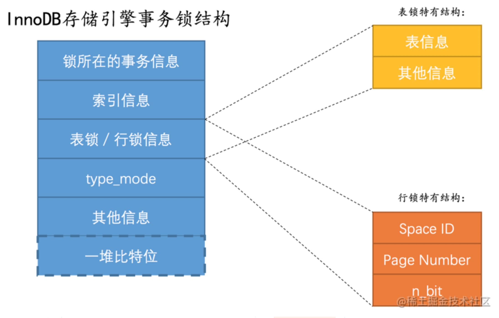

# 19.事务的隔离级别

事务并发执行遇到的问题
脏写（Dirty Write）：如果一个事务修改了另一个未提交事务修改过的数据，那就意味着发生了脏写
脏读（Dirty Read）：如果一个事务读到了另一个未提交事务修改过的数据，那就意味着发生了脏读
不可重复读（Non-Repeatable Read）：如果一个事务只能读到另一个已经提交的事务修改过的数据，并且其他事务每对该数据进行一次修改并提交后，该事务都能查询得到最新值，那就意味着发生了不可重复读
幻读（Phantom）：如果一个事务先根据某些条件查询出一些记录，之后另一个事务又向表中插入了符合这些条件的记录，原先的事务再次按照该条件查询时，能把另一个事务插入的记录也读出来，那就意味着发生了幻读
问题按照严重性来排一下序：脏写 > 脏读 > 不可重复读 > 幻读

SQL标准中的四种隔离级别
设立一些隔离级别，隔离级别越低，越严重的问题就越可能发生。有一帮人（并不是设计MySQL的大叔们）制定了一个所谓的SQL标准，在标准中设立了4个隔离级别：
READ UNCOMMITTED：未提交读。
READ COMMITTED：已提交读。
REPEATABLE READ：可重复读。
SERIALIZABLE：可串行化。
SQL标准中规定，针对不同的隔离级别，并发事务可以发生不同严重程度的问题，具体情况如下：
隔离级别 脏读 不可重复读 幻读
READ UNCOMMITTED Possible Possible Possible
READ COMMITTED Not Possible Possible Possible
REPEATABLE READ Not Possible Not Possible Possible
SERIALIZABLE Not Possible Not Possible Not Possible
如何设置事务的隔离级别
SET [GLOBAL|SESSION] TRANSACTION ISOLATION LEVEL level;

使用GLOBAL关键字（在全局范围影响）：
使用SESSION关键字（在会话范围影响）：
上述两个关键字都不用（只对执行语句后的下一个事务产生影响）：
想要查看当前会话默认的隔离级别可以通过查看系统变量transaction_isolation的值来确定

# 20.MVCC

MVCC原理
版本链
对于使用InnoDB存储引擎的表来说，它的聚簇索引记录中都包含两个必要的隐藏列
trx_id：每次一个事务对某条聚簇索引记录进行改动时，都会把该事务的事务id赋值给trx_id隐藏列。
roll_pointer：每次对某条聚簇索引记录进行改动时，都会把旧的版本写入到undo日志中，然后这个隐藏列就相当于一个指针，可以通过它来找到该记录修改前的信息。
每次一条记录进行改动，都会记录一条undo日志，每条undo日志也都有一个roll_pointer属性，可以将这些undo日志都连起来，串成一个链表。
对该记录每次更新后，都会将旧值放到一条undo日志中，就算是该记录的一个旧版本，随着更新次数的增多，所有的版本都会被roll_pointer属性连接成一个链表，我们把这个链表称之为版本链，版本链的头节点就是当前记录最新的值。另外，每个版本中还包含生成该版本时对应的事务id。
ReadView
数据旧版本对当前事务是否可见的核心问题就是：需要判断一下版本链中的哪个版本是当前事务可见的。为此，设计InnoDB的大叔提出了一个ReadView的概念，这个ReadView中主要包含4个比较重要的内容：
m_ids：表示在生成ReadView时当前系统中活跃的读写事务的事务id列表。
min_trx_id：表示在生成ReadView时当前系统中活跃的读写事务中最小的事务id，也就是m_ids中的最小值。
max_trx_id：表示生成ReadView时系统中应该分配给下一个事务的id值。
小贴士：
注意max_trx_id并不是m_ids中的最大值，事务id是递增分配的。比方说现在有id为1，2，3这三个事务，之后id为3的事务提交了。那么一个新的读事务在生成ReadView时，m_ids就包括1和2，min_trx_id的值就是1，max_trx_id的值就是4。

creator_trx_id：表示生成该ReadView的事务的事务id。
READ COMMITTED —— 每次读取数据前都生成一个ReadView
REPEATABLE READ —— 在第一次读取数据时生成一个ReadView
MVCC小结
从上边的描述中我们可以看出来，所谓的MVCC指的就是在使用READ COMMITTD、REPEATABLE READ这两种隔离级别的事务在执行普通的SELECT操作时访问记录的版本链的过程，这样子可以使不同事务的读-写、写-读操作并发执行，从而提升系统性能
关于purge（清除）
大家有没有发现两件事儿：
我们说insert undo在事务提交之后就可以被释放掉了，而update undo由于还需要支持MVCC，不能立即删除掉。
为了支持MVCC，对于delete mark操作来说，仅仅是在记录上打一个删除标记，并没有真正将它删除掉。
随着系统的运行，在确定系统中包含最早产生的那个ReadView的事务不会再访问某些update undo日志以及被打了删除标记的记录后，有一个后台运行的purge线程会把它们真正的删除掉。

# 21.InnoDB的锁

解决并发事务带来问题的两种基本方式
读-读情况：即并发事务相继读取相同的记录。
写-写情况：即并发事务相继对相同的记录做出改动。
我们前边说过，在这种情况下会发生脏写的问题，任何一种隔离级别都不允许这种问题的发生。所以在多个未提交事务相继对一条记录做改动时，需要让它们排队执行，这个排队的过程其实是通过锁来实现的。这个所谓的锁其实是一个内存中的结构
锁结构：里有很多信息，不过为了简化理解，我们现在只把两个比较重要的属性拿了出来：
trx信息：代表这个锁结构是哪个事务生成的。
is_waiting：代表当前事务是否在等待。
读-写或写-读情况：也就是一个事务进行读取操作，另一个进行改动操作。我们前边说过，这种情况下可能发生脏读、不可重复读、幻读的问题。
怎么解决脏读、不可重复读、幻读这些问题呢？其实有两种可选的解决方案：
方案一：读操作利用多版本并发控制（MVCC），写操作进行加锁。
所谓的MVCC我们在前一章有过详细的描述，就是通过生成一个ReadView，然后通过ReadView找到符合条件的记录版本（历史版本是由undo日志构建的），其实就像是在生成ReadView的那个时刻做了一次时间静止（就像用相机拍了一个快照），查询语句只能读到在生成ReadView之前已提交事务所做的更改，在生成ReadView之前未提交的事务或者之后才开启的事务所做的更改是看不到的。而写操作肯定针对的是最新版本的记录，读记录的历史版本和改动记录的最新版本本身并不冲突，也就是采用MVCC时，读-写操作并不冲突。
方案二：读、写操作都采用加锁的方式。
如果我们的一些业务场景不允许读取记录的旧版本，而是每次都必须去读取记录的最新版本，比方在银行存款的事务中，你需要先把账户的余额读出来，然后将其加上本次存款的数额，最后再	写到数据库中。在将账户余额读取出来后，就不想让别的事务再访问该余额，直到本次存款事务执行完成，其他事务才可以访问账户的余额。这样在读取记录的时候也就需要对其进行加锁操作，这样也就意味着读操作和写操作也像写-写操作那样排队执行。
很明显，采用MVCC方式的话，读-写操作彼此并不冲突，性能更高，采用加锁方式的话，读-写操作彼此需要排队执行，影响性能。一般情况下我们当然愿意采用MVCC来解决读-写操作并发执行的问题，但是业务在某些特殊情况下，要求必须采用加锁的方式执行，那也是没有办法的事。
一致性读（Consistent Reads）
事务利用MVCC进行的读取操作称之为一致性读，或者一致性无锁读，有的地方也称之为快照读。所有普通的SELECT语句（plain SELECT）在READ COMMITTED、REPEATABLE READ隔离级别下都算是一致性读。一致性读并不会对表中的任何记录做加锁操作，其他事务可以自由的对表中的记录做改动。
锁定读（Locking Reads）
共享锁和独占锁
并发事务的读-读情况并不会引起什么问题，不过对于写-写、读-写或写-读这些情况可能会引起一些问题，需要使用MVCC或者加锁的方式来解决它们。在使用加锁的方式解决问题时，由于既要允许读-读情况不受影响，又要使写-写、读-写或写-读情况中的操作相互阻塞，所以设计MySQL的大叔给锁分了个类：
共享锁，英文名：Shared Locks，简称S锁。在事务要读取一条记录时，需要先获取该记录的S锁。
独占锁，也常称排他锁，英文名：Exclusive Locks，简称X锁。在事务要改动一条记录时，需要先获取该记录的X锁。
锁定读的语句
对读取的记录加S锁：
SELECT ... LOCK IN SHARE MODE;

对读取的记录加X锁：
SELECT ... FOR UPDATE;

写操作
平常所用到的写操作无非是DELETE、UPDATE、INSERT这三种：
DELETE：我们也可以把这个定位待删除记录在B+树中位置的过程看成是一个获取X锁的锁定读。
UPDATE：在对一条记录做UPDATE操作时分为三种情况：
如果未修改该记录的键值并且被更新的列占用的存储空间在修改前后未发生变化，则先在B+树中定位到这条记录的位置，然后再获取一下记录的X锁，最后在原记录的位置进行修改操作。其实我们也可以把这个定位待修改记录在B+树中位置的过程看成是一个获取X锁的锁定读。
如果未修改该记录的键值并且至少有一个被更新的列占用的存储空间在修改前后发生变化，则先在B+树中定位到这条记录的位置，然后获取一下记录的X锁，将该记录彻底删除掉（就是把记录彻底移入垃圾链表），最后再插入一条新记录。这个定位待修改记录在B+树中位置的过程看成是一个获取X锁的锁定读，新插入的记录由INSERT操作提供的隐式锁进行保护。
如果修改了该记录的键值，则相当于在原记录上做DELETE操作之后再来一次INSERT操作，加锁操作就需要按照DELETE和INSERT的规则进行了。
INSERT：一般情况下，新插入一条记录的操作并不加锁，设计InnoDB的大叔通过一种称之为隐式锁
多粒度锁
我们前边提到的锁都是针对记录的，也可以被称之为行级锁或者行锁，对一条记录加锁影响的也只是这条记录而已，我们就说这个锁的粒度比较细；其实一个事务也可以在表级别进行加锁，自然就被称之为表级锁或者表锁，对一个表加锁影响整个表中的记录，我们就说这个锁的粒度比较粗。给表加的锁也可以分为共享锁（S锁）和独占锁（X锁）：
给表加S锁：如果一个事务给表加了S锁，那么：
别的事务可以继续获得该表的S锁
别的事务可以继续获得该表中的某些记录的S锁
别的事务不可以继续获得该表的X锁
别的事务不可以继续获得该表中的某些记录的X锁
给表加X锁：如果一个事务给表加了X锁（意味着该事务要独占这个表），那么：
别的事务不可以继续获得该表的S锁
别的事务不可以继续获得该表中的某些记录的S锁
别的事务不可以继续获得该表的X锁
别的事务不可以继续获得该表中的某些记录的X锁
意向锁（英文名：Intention Locks）：
意向共享锁，英文名：Intention Shared Lock，简称IS锁。当事务准备在某条记录上加S锁时，需要先在表级别加一个IS锁。
意向独占锁，英文名：Intention Exclusive Lock，简称IX锁。当事务准备在某条记录上加X锁时，需要先在表级别加一个IX锁。
总结一下：IS、IX锁是表级锁，它们的提出仅仅为了在之后加表级别的S锁和X锁时可以快速判断表中的记录是否被上锁，以避免用遍历的方式来查看表中有没有上锁的记录，也就是说其实IS锁和IX锁是兼容的，IX锁和IX锁是兼容的。我们画个表来看一下表级别的各种锁的兼容性：
兼容性 X IX S IS
X 不兼容 不兼容 不兼容 不兼容
IX 不兼容 兼容 不兼容 兼容
S 不兼容 不兼容 兼容 兼容
IS 不兼容 兼容 兼容 兼容
InnoDB中的表级锁
表级别的S锁、X锁
在对某个表执行SELECT、INSERT、DELETE、UPDATE语句时，InnoDB存储引擎是不会为这个表添加表级别的S锁或者X锁的。
表级别的IS锁、IX锁
当我们在对使用InnoDB存储引擎的表的某些记录加S锁之前，那就需要先在表级别加一个IS锁，当我们在对使用InnoDB存储引擎的表的某些记录加X锁之前，那就需要先在表级别加一个IX锁。IS锁和IX锁的使命只是为了后续在加表级别的S锁和X锁时判断表中是否有已经被加锁的记录，以避免用遍历的方式来查看表中有没有上锁的记录。
表级别的AUTO-INC锁
在使用MySQL过程中，我们可以为表的某个列添加AUTO_INCREMENT属性，之后在插入记录时，可以不指定该列的值，系统会自动为它赋上递增的值。系统实现这种自动给AUTO_INCREMENT修饰的列递增赋值的原理主要是两个：
采用AUTO-INC锁，也就是在执行插入语句时就在表级别加一个AUTO-INC锁，然后为每条待插入记录的AUTO_INCREMENT修饰的列分配递增的值，在该语句执行结束后，再把AUTO-INC锁释放掉。这样一个事务在持有AUTO-INC锁的过程中，其他事务的插入语句都要被阻塞，可以保证一个语句中分配的递增值是连续的。
采用一个轻量级的锁，在为插入语句生成AUTO_INCREMENT修饰的列的值时获取一下这个轻量级锁，然后生成本次插入语句需要用到的AUTO_INCREMENT列的值之后，就把该轻量级锁释放掉，并不需要等到整个插入语句执行完才释放锁。
InnoDB中的行级锁
Record Locks：
我们前边提到的记录锁就是这种类型，也就是仅仅把一条记录锁上，我决定给这种类型的锁起一个比较不正经的名字：正经记录锁（请允许我皮一下，我实在不知道该叫个啥名好）。官方的类型名称为：LOCK_REC_NOT_GAP
Gap Locks：
我们说MySQL在REPEATABLE READ隔离级别下是可以解决幻读问题的，解决方案有两种，可以使用MVCC方案解决，也可以采用加锁方案解决。但是在使用加锁方案解决时有个大问题，就是事务在第一次执行读取操作时，那些幻影记录尚不存在，我们无法给这些幻影记录加上正经记录锁。
Next-Key Locks：
有时候我们既想锁住某条记录，又想阻止其他事务在该记录前边的间隙插入新记录，所以设计InnoDB的大叔们就提出了一种称之为Next-Key Locks的锁，官方的类型名称为：LOCK_ORDINARY，我们也可以简称为next-key锁。next-key锁的本质就是一个正经记录锁和一个gap锁的合体，它既能保护该条记录，又能阻止别的事务将新记录插入被保护记录前边的间隙。
Insert Intention Locks：
我们说一个事务在插入一条记录时需要判断一下插入位置是不是被别的事务加了所谓的gap锁（next-key锁也包含gap锁，后边就不强调了），如果有的话，插入操作需要等待，直到拥有gap锁的那个事务提交。但是设计InnoDB的大叔规定事务在等待的时候也需要在内存中生成一个锁结构，表明有事务想在某个间隙中插入新记录，但是现在在等待。设计InnoDB的大叔就把这种类型的锁命名为Insert Intention Locks，官方的类型名称为：LOCK_INSERT_INTENTION，我们也可以称为插入意向锁。
隐式锁
一个事务对新插入的记录可以不显式的加锁（生成一个锁结构），但是由于事务id这个牛逼的东东的存在，相当于加了一个隐式锁。别的事务在对这条记录加S锁或者X锁时，由于隐式锁的存在，会先帮助当前事务生成一个锁结构，然后自己再生成一个锁结构后进入等待状态。
InnoDB锁的内存结构
我们前边说对一条记录加锁的本质就是在内存中创建一个锁结构与之关联，那么是不是一个事务对多条记录加锁，就要创建多个锁结构呢？比方说事务T1要执行下边这个语句：
# 事务T1
SELECT * FROM hero LOCK IN SHARE MODE;

很显然这条语句需要为hero表中的所有记录进行加锁，那是不是需要为每条记录都生成一个锁结构呢？其实理论上创建多个锁结构没问题，反而更容易理解，但是谁知道你在一个事务里想对多少记录加锁呢，如果一个事务要获取10000条记录的锁，要生成10000个这样的结构也太亏了吧！所以设计InnoDB的大叔本着勤俭节约的传统美德，决定在对不同记录加锁时，如果符合下边这些条件：
在同一个事务中进行加锁操作
被加锁的记录在同一个页面中
加锁的类型是一样的
等待状态是一样的
那么这些记录的锁就可以被放到一个锁结构中。

 