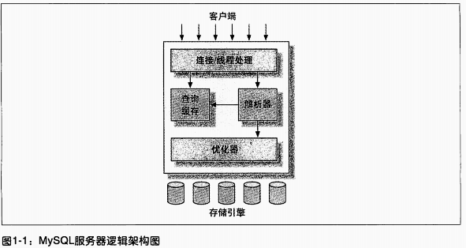
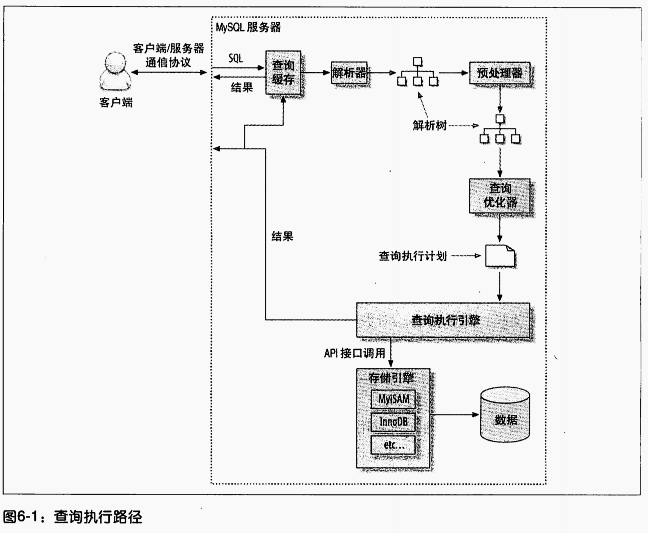

[TOC]


# 高性能MySQL第三版阅读

# 1.MySQL架构和主要的特性

## 架构

 

最上层的服务并不是MySQL所独有的，大多数基于网络的客户端/服务器的工具或者
服务都有类似的架构。比如连接处理、授权认证、安全等等。
第二层架构是MySQL比较有意思的部分。大多数MySQL的核心服务功能都在这一-层，
包括查询解析、分析、优化、缓存以及所有的内置函数(例如，日期、时间、数学和加
密函数)，所有跨存储引擎的功能都在这- -层实现:存储过程、触发器、视图等。
第三层包含了存储引擎。存储引擎负责MySQL中数据的存储和提取。和GNU/Linux下
的各种文件系统一样，每个存储引擎都有它的优势和劣势。服务器通过API与存储引擎
进行通信。这些接口屏蔽了不同存储引擎之间的差异，使得这些差异对上层的查询过程
透明。存储引擎API包含几十个底层函数，用于执行诸如“开始一个事务”或者“根据
主键提取一行记录”等操作。但存储引擎不会去解析SQL，不同存储引擎之间也不会
相互通信，而只是简单地响应上层服务器的请求。

## 主要特性

### 并发控制

- 读写锁
- 锁粒度
  - 表锁
  - 行级锁

### 事务

- 事务的特性
  - 原子性
  - 一致性
  - 隔离性
  - 持久性

- 事务的隔离级别

  - Read uncommitted(未提交读)
  - Read committed(提交读)
  - Repeatable read(可重复读，MySQL默认的隔离级别)
  - Serializable(可串行化)

- 死锁

- 事务日志（redo log)

- MySQL中的事务

  - 自动提交
  - 隐式和显示提交

- 多并发版本控制(MVCC)

  MVCC只在REPEATABLE READ 和READ COMMITTED 两个隔离级别下工作。其他两个隔离
  级别都和MVCC不兼容4，因为READ UNCOMMITTED总是读取最新的数据行，而不是符合
  当前事务版本的数据行。而SERIALIZABLE则会对所有读取的行都加锁。

### MySQL的主要存储引擎

- InnoDB(黑盒，mvcc，索引，高并发控制，事务，热备份)
- MyISAM

# 2.创建高性能索引

## 2.1索引基础

### 2.1.1索引类型

#### B-Tree索引(建立在B-Tree结构上，从技术上来说是B+Tree索引)

- 使用B-Tree索引的查询类型：
  - 全职匹配
  - 匹配最左前缀
  - 匹配列前缀
  - 匹配范围值
  - 精确匹配某一列并范围匹配另一个列
  - 只访问索引的查询
- B-Tree的限制
  - 如果不是按照索引的最左列开始查找，则无法使用索引
  - 不能跳过索引中的列
  - 如果查询中有某个列的范围查询，则其右边所有列都无法使用索引优化查找

#### 哈希索引

哈希索引基于哈希表实现，只有精确匹配索引所有列的查询才有效

在MySQL中，只有Memory引擎显式支持哈希索引。这也是Memory引擎表的默认索
引类型，Memory引擎同时也支持B-Tree索引。值得一提的是，Memory引擎是支持非
唯一哈希索引的，这在数据库世界里面是比较与众不同的。如果多个列的哈希值相同，
索引会以**链表**的方式存放多个记录指针到同-一个哈希条目中。

#### 空间数据索引

MyISAM表支持空间索引，可以用做地理数据存储。

#### 全文索引

全文索引是一种特殊的索引，它查找的是文本中的关键词，而不是直接比较索引中的值。

## 2.2索引的优点和缺点

### 2.2.1优点

1. 索引大大减少了服务器需要扫描的数据量

2. 索引可以帮助服务器避免排序和临时表

3. 索引可以将随机I/O变为顺序I/O

   > “三星系统”(three-star system) 
   >
   > - 索引将相关的记录放到一起则获得一星;
   >
   > - 如果索引中的数据顺序和查找中的排列顺序一致则获得二星;
   >
   > - 如果索引中的列包含了查询中需要的全部列则获得三星。
   >
   > 

- ### 2.2.2缺点

## 2.3高性能索引策略

**正确地创建和使用索引是实现高性能查询的基础。**

### 2.3.1独立的列

”独立的列“是只索引列不能是表达式的一部分，也不能是函数的参数

```
select column_id from user where column_id+1=24;
这个查询无法使用column_id列的索引。
select ... where TO_DAYS(CURRENT_DATE)-TO_DAYS(date_col)<=10;
这个是一个常见的使用函数值的错误。
```

### 2.3.2前缀索引和索引选择性

通常可以索引开始的部分字符，这样可以大大节约索引空间，从而提高索引效率。但这样也会降低索引的选择性。索引的选择性是指，不重复的索引值(也称为基数，cardinality) 和数据表的记录总数(#T) 的比值，范围从1/#T到1之间。索引的选择性越高则查询效率越高，因为选择性高的索引可以让MySQL在查找时过滤掉更多的行。**唯一索引**的选择性是1, 这是最好的索引选择性，性能也是最好的。

一般情况下某个列前缀的选择性也是足够高的，足以满足查询性能。对于BLOB、TEXT或者很长的VARCHAR类型的列，必须使用前缀索引，因为MySQL不允许索引这些列的完整长度。

诀窍在于要选择足够长的前缀以保证较高的选择性，同时又不能太长(以便节约空间)。前缀应该足够长，以使得前缀索引的选择性接近于索引整个列。换句话说，前缀的“ 基数”应该接近于完整列的“基数”。

为了决定前缀的合适长度，需要找到最常见的值的列表，然后和最常见的前缀列表进行比较。找到前缀的合适长度后，建立前缀索引

```
alter table city_demo add key (city(7));
基于city列的前七个字符建立索引
```

### 2.3.3多列索引

很多人对多列索引的理解不够。一个常见的错误就是，为每个列创建独立的索引，或者按照错误的顺序创建多列索引。

### 2.3.4选择合适的索引列顺序

对于如何选择索引的列顺序有一个经验法则:将选择性最高的列放到索引最前列。这个建议有用吗?在某些场景可能有帮助，但通常不如避免随机I0和排序那么重要，考虑问题需要更全面(场景不同则选择不同，没有一个放之四海皆准的法则。这里只是说明，这个经验法则可能没有你想象的重要)。

尽管关于选择性和基数的经验法则值得去研究和分析，但--定要记住别忘了WHERE子句中的排序、分组和范围条件等其他因素，这些因素可能对查询的性能造成非常大的影响。

### 2.3.5聚簇索引

#### 聚簇索引的优点

1. 可以把相关数据保存在一起
2. 数据访问更快。聚簇索引将索引和数据保存在同一个B+tree中
3. 使用覆盖索引扫描的查询可以直接使用页节点中的主键值

#### 聚簇索引的缺点

1. 聚簇数据最大限度地提高了I/O密集型应用的性能，但如果数据全部都放在内存中,则访问的顺序就没那么重要了，聚簇索引也就没什么优势了。
2. 插入速度严重依赖于插入顺序。按照主键的顺序插人是加载数据到InnoDB表中速度最快的方式。但如果不是按照主键顺序加载数据，那么在加载完成后最好使用OPTIMIZE TABLE 命令重新组织一下表。
3. 更新聚簇索引列的代价很高，因为会强制InnoDB将每个被更新的行移动到新的位置。
4. 基于聚簇索引的表在插入新行，或者主键被更新导致需要移动行的时候，可能面临“页分裂(page split)”的问题。当行的主键值要求必须将这一行插入到某个已满的页中时，存储引擎会将该页分裂成两个页面来容纳该行，这就是一次页分裂操作。页分裂会导致表占用更多的磁盘空间。
5. 聚簇索引可能导致全表扫描变慢，尤其是行比较稀疏，或者由于页分裂导致数据存储不连续的时候。
6. 二级索引(非聚簇索引)可能比想象的要更大，因为在二级索引的叶子节点包含了引用行的主键列。
7. 二级索引访问需要两次索引查找（会表查询），而不是一次。

#### 在InnoDB表中按住键顺序插入行

- 自增主键auto_Increment

  因为主键的值是顺序的，所以InnoDB把每一条记录都存储在上一条记录的后面。当达到页的最大填充因子时(InnoDB默认的最大填充因子是页大小的15/16，留出部分空间用于以后修改)，下一条记录就会写人新的页中。一旦数据按照这种顺序的方式加载，主键页就会近似于被顺序的记录填满，这也正是所期望的结果(然而，二级索引页可能是不一样的)。

- 顺序的主键什么时候会造成更坏的结果?
  对于高并发工作负载，在InnoDB中按主键顺序插入可能会造成明显的争用。主键的上界会成为“热点”。因为所有的插入都发生在这里，所以并发插入可能导致**间隙锁竞争**。另一个热点可能是AUTO_ INCREMENT 锁机制;如果遇到这个问题，则可能需要考虑重新设计表或者应用，或者更改innodb_autoinc_lock_mode 配置。如果你的服务器版本还不支持innodb_autoinc_lock_mode参数，可以升级到新版本的InnoDB，可能对这种场景会工作得更好。

  [MySQL innodb_autoinc_lock_mode设置](https://blog.csdn.net/corleone_4ever/article/details/106700787)

- 使用UUID作为主键

  因为新行的主键值不一定比之前插入的大，所以InnoDB无法简单地总是把新行插入到索引的最后，而是需要为新的行寻找合适的位置一通常是已有数据的中间位置一并且分配空间。这会增加很多的额外工作，并导致数据分布不够优化。

  - 下面是总结的一些缺点:
    写入的目标页可能已经刷到磁盘上并从缓存中移除，或者是还没有被加载到缓存中，InnoDB在插人之前不得不先找到并从磁盘读取目标页到内存中。这将导致大量的随机I/O。
  - 因为写人是乱序的，InnoDB不得不频繁地做页分裂操作，以便为新的行分配空间。页分裂会导致移动大量数据，一次插人最少需要修改三个页而不是一个页。
  - 由于频繁的页分裂，页会变得稀疏并被不规则地填充，所以最终数据会有碎片。在把这些随机值载入到聚簇索引以后，也许需要做一次0PTIMIZE TABLE 来重建表并优化页的填充。

### 2.3.6覆盖索引

  如果索引的叶子节点中已经包含要查询的数据，那么还有什么必要再回表查询呢?如果-一个索引包含(或者说覆盖)所有需要查询的字段的值，我们就称之为“覆盖索引”
  	覆盖索引是非常有用的工具，能够极大地提高性能。考虑一下如果查询只需要扫描索引而无须回表，会带来多少好处:

-   索引条目通常远小于数据行大小，所以如果只需要读取索引，那MySQL就会极大地减少数据访问量。这对缓存的负载非常重要，因为这种情况下响应时间大部分花费在数据拷贝上。覆盖索引对于I/0密集型的应用也有帮助，因为索引比数据更小，更容易全部放入内存中(这对于MyISAM尤其正确，因为MyISAM能压缩索引以变得更小)。
- 因为索引是按照列值顺序存储的(至少在单个页内是如此)，所以对于I/O密集型的范围查询会比随机从磁盘读取每一行数据的I/O要少得多。对于某些存储引擎，例如MyISAM,甚至可以通过OPTIMIZE命令使得索引完全顺序排列，这让简单的范围查询能使用完全顺序的索引访问。
- 一些存储引擎如MyISAM在内存中只缓存索引，数据则依赖于操作系统来缓存，因此要访问数据需要一次系统调用。这可能会导致严重的性能问题，尤其是那些系统调用占了数据访问中的最大开销的场景。
- 由于InnoDB的聚簇索引，覆盖索引对InnoDB表特别有用。InnoDB 的二级索引在叶子节点中保存了行的主键值，所以如果二级主键能够覆盖查询，则可以避免对主键索引的二次查询。
- 在所有这些场景中，在索引中满足查询的成本一般比查询行要小得多。
  不是所有类型的索引都可以成为覆盖索引。覆盖索引必须要存储索引列的值，而哈希索引、空间索引和全文索引等都不存储索引列的值，所以MySQL只能使用B-Tree索引做覆盖索引。另外，不同的存储引擎实现覆盖索引的方式也不同，而且不是所有的引擎都
  支持覆盖索引(在写作本书时，Memory存储引擎就不支持覆盖索引)。
- 当发起一个被索引覆盖的查询(也叫做索引覆盖查询)时，在EXPLAIN的Extra列可以看到“Using index"的信息。

> 索引条件下推：
>
> 索引下推是**MySQL5.6**新添加的特性，用于优化数据的查询。
>
> 在MySQL5.6之前，通过使用非主键索引进行查询的时候，存储引擎通过索引查询数据，然后将结果返回给MySQL server层，**在server层判断是否符合条件**。
>
> 在MySQL5.6及以上版本，可以使用索引下推的特性。当存在索引的列做为判断条件时，MySQL server将这一部分判断条件传递给存储引擎，然后存储引擎会筛选出**符合MySQL server传递条件的索引项**，即在存储引擎层根据索引条件**过滤**掉不符合条件的索引项，然后回表查询得到结果，将结果返回给MySQL server。
>
> 可以看到，**有了索引下推的优化，在满足一定的条件下，存储引擎层会在回表查询之前对数据进行过滤，可以减少存储引擎回表查询的次数**。

###   2.3.7使用索引扫描来做排序

MySQL有两种方式生成有序的结果：通过排序操作；或者按照索引顺序扫描，如果Explain出来的type列的值为“idnex",则说明MySQL使用了索引扫描来做排序。只有当索引的列顺序和order by自居的顺序完全一直的，并且所有列的排序方向都一样是，MySQL才能够使用索引来对结构做排序。

###   2.3.8压缩(前缀压缩)索引

MYISAM使用前缀压缩来减少索引的大小,从而让更多的索引可以放入内存中,这在某些情况下能极大地提高性能。默认只压缩字符串,但通过参数设置也可以对整数做压缩。

这个索引可以不做过多关注。

###   2.3.9沉余和重复索引

MYSQL允许在相同列上创建多个索引,无论是有意的还是无意的。 MYSQL需要单独维护重复的索引,并且优化器在优化查询的时候也需要逐个地进行考虑,这会影响性能。

重复索引是指在相同的列上按照相同的顺序创建的相同类型的索引。应该避免这样创建重复索引,发现以后也应该立即移除。

沉余索引和重复索引有点不同。冗余索引通常发生在为表添加新索引的时候。例如,有人可能会增加一个新的索引(AB)而不是扩展已有的索引(A)。还有一种情况是将一个索引扩展为(A,ID),其中ID是主键对于 Innodb来说主键列已经包含在二级索引中了,所以这也是冗余的。

###  2.3.10不会使用到的索引

除了沉余索引和重复索引，可能还有一下服务器永远不会用的索引。这样的索引完全是累赘，可以考虑删除。

### 2.3.11索引和锁

InnoDB只有在访问行的时候才会对其加锁,而索引能够减少 Innodb访问的行数,从而减少锁的数量。但这只有当 Innodb在存储引擎层能够过滤掉所有不需要的行时才有效。如果索引无法过滤掉无效的行,那么在 Innodb检索到数据并返回给服务器层以后MYSQL服务器才能应用MERE子句。这时已经无法避免锁定行了: Innodb已经锁住了这些行,到适当的时候才释放。在 MYSQL5.1和更新的版本中, Innodb可以在服务器端过滤掉行后就释放锁,但是在早期的 MYSQL版本中, Innodb只有在事务提交后才能释放锁.

> 关注:现有的MySQL5.6以及之后的版本拥有索引条件下推的特性，这样可以是InnoDB引擎锁住更少的行

## 2.4索引案例学习

- 支持多种过滤条件
- 避免多个范围条件
- 优化排序

## 2.5维护索引和表

- 找到并修复损坏的表

- 更新索引的统计信息

- 减少索引和数据的碎片

  - B-Tree索引可能会碎片化，这会降低查询的效率。碎片化的索引可能会以很差或者无序的方式存储在磁盘上。根据设计，B-Tree 需要随机磁盘访问才能定位到叶子页，所以随机访问是不可避免的。然而，如果叶子页在物理分布上是顺序且紧密的，那么查询的性能就会更好。否则，对于范围查询、索引覆盖扫描等操作来说，速度可能会降低很多倍;对于索引覆盖扫描这
    一点更加明显。

  - 表的数据存储也可能碎片化。然而，数据存储的碎片化比索引更加复杂。有三种类型的数据碎片。

    - 行碎片(Row fragmentation)
      这种碎片指的是数据行被存储为多个地方的多个片段中。即使查询只从索引中访问一-行记录，行碎片也会导致性能下降。
      
    - 行间碎片(Intra-row fragmentation)
      行间碎片是指逻辑上顺序的页，或者行在磁盘上不是顺序存储的。行间碎片对诸如全表扫描和聚簇索引扫描之类的操作有很大的影响，因为这些操作原本能够从磁盘上顺序存储的数据中获益。
      
    - 剩余空间碎片(Free space fragmentation)
      剩余空间碎片是指数据页中有大量的空余空间。这会导致服务器读取大量不需要的数据，从而造成浪费。
  
      对于MyISAM表，这三类碎片化都可能发生。但InnoDB不会出现短小的行碎片; InnoDB会移动短小的行并重写到一个片段中 
    - 可以通过执行OPTIMIZETABLE或者导出再导人的方式来重新整理数据。这对多数存储引擎都是有效的。对于一些存储引擎如MyISAM，可以通过排序算法重建索引的方式来消除碎片。
    
    - 最新版本InnoDB新增了“在线”添加和删除索引的功能，可以通过先删除，然后再重新创建索引的方式来消除索引 的碎片化。
    
    - 对于那些不支持OPTIMIZE TABLE 的存储引擎，可以通过一个不做任何操作(no-op) 的ALTER TABLE操作来重建表。只需要将表的存储引擎修改为当前的引擎即可；

# 3.查询性能优化

## 3.1为什么查询速度会慢

在尝试编写快速的查询之前，需要清楚一点，真正重要是响应时间。如果把查询看作是一个任务，那么它由一系列子任务组成，每个子任务都会消耗-定的时间。如果要优化查询，实际上要优化其子任务，要么消除其中一些子任务，要么减少子任务的执行次数，要么让子任务运行得更快。

通常来说，查询的生命周期大致可以按照顺序来看;从客户端，到服务器，然后在服务器上进行解析，生成执行计划，执行，并返回结果给客户端。其中“执行”可以认为是整个生命周期中最重要的阶段，这其中包括了大量为了检索数据到存储引擎的调用以及调用后的数据处理，包括排序、分组等。

在完成这些任务的时候，查询需要在不同的地方花费时间，包括网络，CPU计算，生成统计信息和执行计划、锁等待(互斥等待)等操作，尤其是向底层存储弓|擎检索数据的调用操作,这些调用需要在内存操作、CPU操作和内存不足时导致的I/O操作上消耗时间。根据存储引擎不同，可能还会产生大量的上下文切换以及系统调用。

在每一个消耗大量时间的查询案例中，我们都能看到--些不必要的额外操作、某些操作被额外地重复了很多次、某些操作执行得太慢等。优化查询的目的就是减少和消除这些操作所花费的时间。

再次申明一点,对于一个查询的全部生命周期，上面列的并不完整。这里我们只是想说明: **了解查询的生命周期、清楚查询的时间消耗情况对于优化查询有很大的意义。**

## 3.2慢查询基础:优化数据访问

查询性能低下最基本的原因是访问的数据太多。某些查询可能不可避免地需要筛选大量数据，但这并不常见。大部分性能低下的查询都可以通过减少访问的数据量的方式进行优化。对于低效的查询，我们发现通过下面两个步骤来分析总是很有效:

1. 确认应用程序是否在检索大量超过需要的数据。这通常意味着访问了太多的行，但
   有时候也可能是访问了太多的列。

2. 确认MySQL服务器层是否在分析大量超过需要的数据行。

### 3.2.1是否向数据库请求了不需要的数据

   有些查询会请求超过实际需要的数据，然后这些多余的数据会被应用程序丟弃。这会给MySQL服务器带来额外的负担，并增加网络开销，另外也会消耗应用服务器的cpu和内存资源。

一些典型的案例：

- 查询不需要的记录
- 多表关联时返回全部的列
- 总是取出全部列
- 重复查询相同的数据

### 3.2.2MySQL是否在扫描额外的记录

在确定查询只返回需要的数据以后，接下来应该看看查询为了返回结果是否扫描了过多的数据。对于MySQL，最简单的衡量查询开销的三个指标如下:

1. 响应时间

2. 扫描的行数

3. 返回的行数

没有哪个指标能够完美地衡量查询的开销，但它们大致反映了MySQL在内部执行查询时需要访问多少数据，并可以大概推算出查询运行的时间。这三个指标都会记录到MySQL的慢日志中，所以检查慢日志记录是找出扫描行数过多的查询的好办法。

- 响应时间

  响应时间是两个部分之和:服务时间和排队时间。服务时间是指数据库处理这个查询 真正花了多长时间。排队时间是指服务器因为等待某些资源而没有真正执行查询的时间一可能是等I/O操作完成，也可能是等待行锁，等等。遗憾的是，我们无法把响应时间细分到上面这些部分，除非有什么办法能够逐个测量上面这些消耗，不过很难做到。一般最常见和重要的等待是I/O和锁等待，但是实际情况更加复杂。

  所以在不同类型的应用压力下，响应时间并没有什么一致的规律或者公式。诸如存储引 擎的锁(表锁、 行锁)、高并发资源竞争、硬件响应等诸多因素都会影响响应时间。所以，响应时间既可能是一个问题的结果也可能是一个问题的原因，不同案例情况不同， 能够使用第3章的“单个查询问题还是服务器问题”一节介绍的技术来确定到底是因还是果。

- 扫描的行数和返回的行数

  分析查询时，查看该查询扫描的行数是非常有帮助的。这在一定程度上能够说明该查询找到需要的数据的效率高不高。
  对于找出那些“糟糕”的查询，这个指标可能还不够完美，因为并不是所有的行的访问代价都是相同的。较短的行的访问速度更快，内存中的行也比磁盘中的行的访问速度要快得多。

  理想情况下扫描的行数和返回的行数应该是相同的。但实际情况中这种“美事”并不多。例如在做一个关联查询时，服务器必须要扫描多行才能生成结果集中的一行。扫描的行数对返回的行数的比率通常很小，一般在1:1和10:1之间，不过有时候这个值也可能非常非常大。

- 扫描的行数和访问类型
  在评估查询开销的时候，需要考虑一下从表中找到某一行数据的成本。MySQL有好几种访问方式可以查找并返回一行结果。有些访问方式可能需要扫描很多行才能返回一行结果，也有些访问方式可能无须扫描就能返回结果。在EXPLAIN语句中的type列反应了访问类型。访问类型有很多种，从全表扫描到索引扫描、范围扫描、唯一索引查询、常数引用等。这里列的这些，速度是从慢到快，扫描的
  行数也是从小到大。你不需要记住这些访问类型，但需要**明白扫描表、扫描索引、范围访问和单值访问**的概念。

  如果查询没有办法找到合适的访问类型，那么解决的最好办法通常就是增加一一个合适的索引，这也正是我们前一章讨论过的问题。现在应该明白为什么索引对于查询优化如此重要了。索引让MySQL以最高效、扫描行数最少的方式找到需要的记录。

- 如果发现查询需要扫描大量的数据但只返回少数的行，那么通常可以尝试下面的技巧去优化它:
  - 使用索引覆盖扫描，把所有需要用的列都放到索引中，这样存储引擎无须回表获取对应行就可以返回结果了(在前面的章节中我们已经讨论过了)。
  -  改变库表结构。例如使用单独的汇总表(这是我们在第4章中讨论的办法)
  - 重写这个复杂的查询，让MySQL优化器能够以更优化的方式执行这个查询(这是本章后续需要讨论的问题)。

## 3.3重构查询的方式

在优化有问题的查询时，目标应该是找到一个更优的方法获得实际需要的结果，而不一定总是需要从MySQL获取一模一样的结果集。有时候，可以将查询转换一种写法让其返回一样的结果,但是性能更好。但也可以通过修改应用代码，用另一种方式完成查询，
最终达到一样的目的。这一节我们将介绍如何通过这种方式来重构查询，并展示何时需要使用这样的技巧。

### 3.3.1一个复杂查询还是多个简单查询

设计查询的时候一个需要考虑的重要问题是，是否需要将一个复杂的查询分成多个简单的查询。在传统实现中，总是强调需要数据库层完成尽可能多的工作，这样做的逻辑在于以前总是认为网络通信、查询解析和优化是一件代价很高的事情。

但是这样的想法对MySQL并不适用，MySQL从设计上让连接和断开连接都很轻量级，再返回一个小的查询结果方面是很高效。

MySQL内部每秒能够扫描内存中上百万行数据，相比之下，MySQL响应数据给客户端就慢得多了。在其他条件都相同的时候,使用尽可能少的查询当然是更好的。但是有时候，将一个大查询分解为多个小查询是很有必要的。别害怕这样做，好好衡量一下这样做是不是会减少工作量。

### 3.3.2切分查询

有时候对于一个大查询我们需要“ 分而治之”，将大查询切分成小查询，每个查询功能完全一样，只完成一小部分，每次只返回一小部分查询结果。

删除旧的数据就是一个很好的例子。定期地清除大量数据时，如果用一个大的语句一次性完成的话，则可能需要一次锁住很多数据、占满整个事务日志、耗尽系统资源、阻塞很多小的但重要的查询。将一个大的DELETE语句切分成多个较小的查询可以尽可能小地影响MySQL性能，同时还可以减少MySQL复制的延迟。

### 3.3.3分解关联查询

很多高性能的应用都会对关联查询进行分解。简单地，可以对每一个表进行一次单表查询，然后将结果在应用程序中进行关联。例如，下面这个查询:

```
mysql> SELECT * FROM tag
J0IN tag_ post ON tag_ post .tag_ id=tag.id
J0IN post ON tag. post . post_ _id=post.id
WHERE tag.tag*'mysq1';
```

可以分解成下面这些查询来代替:

```
mysql> SELECT * FROM tag WHERE tag= 'mysq1' ;
mysql> SELECT * FROM tag. post WHERE tag. id=1234;
mysql> SELECT * FROM post WHERE post.id in (123,456,567 ,9098,8904);
```

到底为什么要这样做?乍一看，这样做并没有什么好处，原本一条查询，这里却变成多条查询，返回的结果又是一模一样的。 事实上，用分解关联查询的方式重构查询有如下的优势:

- 让缓存的效率更高。许多应用程序可以方便地缓存单表查询对应的结果对象。例如，上面查询中的tag已经被缓存了，那么应用就可以跳过第-一个查询。再例如，应用中已经缓存了ID为123、567. 9098的内容，那么第三个查询的IN()中就可以少几个ID。另外，对MySQL的查询缓存来说生6，如果关联中的某个表发生了变化，那么就无法使用查询缓存了，而拆分后，如果某个表很少改变，那么基于该表的查询就可以重复利用查询缓存结果了。
- 将查询分解后，执行单个查询可以减少锁的竞争。
- 在应用层做关联，可以更容易对数据库进行拆分，更容易做到高性能和可扩展。
- 查询本身效率也可能会有所提升。这个例子中，使用IN()代替关联查询，可以让MySQL按照ID顺序进行查询，这可能比随机的关联要更高效。我们后续将详细介绍这点。
- 可以减少冗余记录的查询。在应用层做关联查询，意味着对于某条记录应用只需要查询一次,而在数据库中做关联查询,则可能需要重复地访问一-部分数据。从这点看，这样的重构还可能会减少网络和内存的消耗。更进一步，这样做相当于在应用中实现了哈希关联，而不是使用MySQL的嵌套循环关联。某些场景哈希关联的效率要高很多(本章后续我们将讨论这点)。

## 3.4查询执行的基础

当希望MySQL能够以更高的性能运行查询时，最好的办法就是弄清楚MySQL是如何优化和执行查询的。一旦理解这一点， 很多查询优化工作实际上就是遵循一些原则让优化器能够按照预想的合理的方式运行。
换句话说，是时候回头看看我们前面讨论的内容了: MySQL执行一个查询的过程。根据图6-1，我们可以看到当向MySQL发送一个请求的时候，MySQL到底做了些什么:

 

1. 客户端发送一条查询给服务器。
2. 服务器先检查查询缓存，如果命中了缓存，则立刻返回存储在缓存中的结果。否则进入下一阶段。
3. 服务器端进行SQL解析、预处理，再由优化器生成对应的执行计划。
4. MySQL 根据优化器生成的执行计划，调用存储引擎的API来执行查询。
5. 将结果返回给客户端。
   上面的每一步都比想象的复杂，我们在后续章节中将继续讨论。我们会看到在每一个阶段查询处于何种状态。查询优化器是其中特别复杂也特别难理解的部分。还有很多的例外情况，例如，当查询使用绑定变量后，执行路径会有所不同，我们将在下一章讨论这点。

### 3.4.1MySQL客户端/服务器通信协议

一般来说，不需要去理解MySQL通信协议的内部实现细节，只需要大致理解通信协议是如何工作的。MySQL客户端和服务器之间的通信协议是“半双工”的，这意味着，在任何一个时刻，要么是由服务器向客户端发送数据，要么是由客户端向服务器发送数据，这两个动作不能同时发生。所以，我们无法也无须将一个消息切成小块独立来发送。

这种协议让MySQL通信简单快速，但是也从很多地方限制了MySQL。一个明显的限制是，这意味着没法进行流量控制。一旦一端开始发生消息，另一端要接收完整个消息才能响应它。这就像来回抛球的游戏:在任何时刻，只有一个人能控制球，而且只有控制球的人才能将球抛回去(发送消息)。所以数据包的大小就相当的重要。

换一种方式解释这种行为:当客户端从服务器取数据时，看起来是- -个拉数据的过程，但实际上是MySQL在向客户端推送数据的过程。客户端不断地接收从服务器推送的数据，客户端也没法让服务器停下来。客户端像是“从消防水管喝水”(这是一个术语)。

多数连接MySQL的库函数都可以获得全部结果集并缓存到内存里，还可以逐行获取需要的数据。默认一般是获得全部结果集并缓存到内存中。MySQL通常需要等所有的数据都已经发送给客户端才能释放这条查询所占用的资源，所以接收全部结果并缓存通常可以减少服务器的压力，让查询能够早点结束、早点释放相应的资源。

> 注:如果查询太大， 服务端会拒绝接收更多的数据并抛出相应错误。

- 查询的状态

  对于一个MySQL连接，或者说一个线程，任何时刻都有一个状态，该状态表示了MySQL当前正在做什么。有很多种方式能查看当前的状态，最简单的是使用SHOW FULL PROCESSLIST命令(该命令返回结果中的Command列就表示当前的状态)。在一个查询的
  生命周期中，状态会变化很多次。MySQL官方手册中对这些状态值的含义有最权威的
  解释，下面将这些状态列出来，并做一个简单的解释。

  - Sleep
    线程正在等待客户端发送新的请求。
  - Query
    线程正在执行查询或者正在将结果发送给客户端。
  - Locked
    在MySQL服务器层，该线程正在等待表锁。在存储引擎级别实现的锁，例如InnoDB的行锁，并不会体现在线程状态中。对于MyISAM来说这是一个比较典型的状态，但在其他没有行锁的引擎中也经常会出现。
  - Analyzing and statistics
    线程正在收集存储引擎的统计信息，并生成查询的执行计划。
  - Copying to tmp table [on disk]
    线程正在执行查询，并且将其结果集都复制到-一个临时表中，这种状态一般要么是在做GROUP BY 操作，要么是文件排序操作，或者是UNION操作。如果这个状态后面还有“on disk”标记，那表示MySQL正在将-一个 内存临时表放到磁盘上。
  - Sorting result
    线程正在对结果集进行排序。
  - Sending data
    这表示多种情况:线程可能在多个状态之间传送数据，或者在生成结果集，或者在向客户端返回数据。

### 3.4.2查询缓存

在解析一个查询语句之前，如果查询缓存是打开的，那么MySQL会优先检查这个查询是否命中查询缓存中的数据。这个检查是通过一个对大小写敏感的哈希查找实现的。查询和缓存中的查询即使只有一个字节不同，那也不会匹配缓存结果生"，这种情况下查询就会进入下一阶段的处理。

### 3.4.3查询优化处理

查询的生命周期的下一步是将一个sql转换成一个执行计划，MySQL再一招这个执行计划和存储引擎进行交互。

- 语法解析器和预处理

- 查询优化器

  - 静态优化

    静态优化可以直接怼解析树进行分析，并完成优化。静态优化在第一次完成后就一直有效，即使使用不同的参数重复执行查询也不会发生变化。可以认为这是一种编译时优化。

  - 动态优化

    MySQL对查询的静态优化只需要做一次，但对查询的动态优化则在每次执行时都需要重新评估。有时候甚至在查询的执行过程中也会重新优化。下面是MySQL能处理的优化类型：

    - 重新定义关联表的顺序:
      数据表的关联并不总是按照在查询中指定的顺序进行。决定关联的顺序是优化器很重要的一部分功能，本章后面将深入介绍这一点。
    
      ```
      注12:例如，在关联操作中，范围检查的执行计划会针对每一行重新评估索引。可以通过EXPLAIN执行计划中的Extra列是否有"rangecheckedforeachrecord”来确认这一点。该执行计划还会增加select_ _full_ range_ join这个服务器变量的值。
      ```
      
    - 将外连接转化成内连接
        并不是所有的OUTER J0IN 语句都必须以外连接的方式执行。诸多因素，例如WHERE条件、库表结构都可能会让外连接等价于-一个内连接。MySQL能够识别这点并重写查询，让其可以调整关联顺序。
      
    -  使用等价变换规则
        MySQL可以使用一些等价变换来简化并规范表达式。它可以合并和减少- -些比较，还可以移除- - 些恒成立和一些恒不成立的判断。例如，(5=5 AND a>5) 将被改写为a>5。类似的，如果有(a<b AND b=c) AND a=5 则会改写为b>5 AND b=c AND a=5。
      
    - 优化COUNT()、MIN() 和MAX()
        索引和列是否可为空通常可以帮助MySQL优化这类表达式。例如，要找到某- -列的最小值，只需要查询对应B- Tree索引最左端的记录，MySQL可以直接获取索引的第一行记录。在优化器生成执行计划的时候就可以利用这一点， 在B-Tree索引中，优化器会将这个表达式作为一个常数对待。类似的,如果要查找一一个最大值，也只需读取B-Tree索引的最后一条记录。如果MySQL使用了这种类型的优化，那么在EXPLAIN中就可以看到“ Select tables optimized away”。从字面意思可以看出，它表示优化器已经从执行计划中移除了该表，并以一个常数取而代之。类似的，没有任何WHERE条件的COUNT(*)查询通常也可以使用存储引擎提供的一些优化(例如，MyISAM维护了一个变量来存放数据表的行数)。
      
    -  预估并转化为常数表达式
      
    - 覆盖索引扫描
        当索引中的列包含所有查询中需要使用的列的时候，MySQL 就可以使用索引返回需要的数据，而无须查询对应的数据行
      
    - 子查询优化
        MySQL在某些情况下可以将子查询转换-种效率更高的形式，从而减少多个查询多次对数据进行访问。
      
    - 提前终止查询
        在发现已经满足查询需求的时候，MySQL总是能够立刻终止查询。一个典型的例子就是当使用了LIMIT子句的时候。除此之外，MySQL还有几类情况也会提前终止查询，例如发现了一个不成立的条件，这时MySQL可以立刻返回一个空结果。
      
    - 等值传播
      
      ```
      比如：explain select * from user where id=-1;这个sql在查询优化阶段就已经终止了。
      ```
      
    - 如果两个列的值通过等式关联，那么MySQL能够吧其中一个列的where条件传递到另一列上。
      
    - 列表in()的比较
      
      在很多数据库系统中，IN()完全等同于多个OR条件的子句，因为这两者是完全等价的。在MySQL中这点是不成立的，MySQL将IN()列表中的数据先进行排序，然后通过二分查找的方式来确定列表中的值是否满足条件，这是一一个O(log n)复杂度的操作，等价地转换成OR查询的复杂度为O(n)，对于IN()列表中有大量取值的时候，MySQL的处理速度将会更快。
  
- 数据和索引的统计信息

  MySQL架构由多个层次组成。在服务器层有查询优化器，却没有保存数据和索引的统计信息。统计信息有存储引擎实现，不同的存储引擎可能会存储不同的统计信息。

  因为服务器层没有任何统计信息，所以MySQL查询优化器在生成查询的执行计划时,需要向存储引擎获取相应的统计信息。存储引擎则提供给优化器对应的统计信息，包括:每个表或者索引有多少个页面、每个表的每个索引的基数是多少、数据行和索引长度、索引的分布信息等。优化器根据这些信息来选择一个最优的执行计划。

- MySQL如何执行关联查询

- 执行计划

- 关联查询优化器

  MySQL优化器最重要的一部分就是关联查询优化，它决定了多个表关联时的顺序。通常多表关联的时候，可以有多种不同的关联顺序来获得相同的执行结果。关联查询优化器则通过评估不同顺序时的成本来选择一个代价最小的关联顺序

- 排序优化

#### 3.4.4查询执行引擎

### 3.4.5返回结果给客户端

查询执行的最后一个阶段是将结果返回给客户端。即使查询不需要返回结果集给客户端，MySQL仍然会返回这个查询的一些信息，如该查询影响到的行数。

如果查询可以被缓存，那么MySQL在这个阶段也会将结果存放到查询缓存中。MySQL将结果集返回客户端是一个增量、逐步返回的过程。例如，我们回头看看前面的关联操作，一旦服务器处理完最后一个关联表，开始生成第一条结果时，MySQL就可以开始向客户端逐步返回结果集了。

这样处理有两个好处:服务器端无须存储太多的结果，也就不会因为要返回太多结果而消耗太多内存。另外，这样的处理也让MySQL客户端第一时间获得返回的结果22。

结果集中的每一行都会以一个满足MySQL客户端/服务器通信协议的封包发送，再通过TCP协议进行传输，在TCP传输的过程中，可能对MySQL的封包进行缓存然后批量传输。

## 3.5 MySQL查询优化器的局限性

MySQL的万能“嵌套循环”并不是对每种查询都是最优的。不过还好，MySQL查询优化器只对少部分查询不适用，而且我们往往可以通过改写查询让MySQL高效地完成工作。还有一个好消息，MySQL 5.6版本正式发布后，会消除很多MySQL原本的限制，让更多的查询能够以尽可能高的效率完成。

1. 关联子查询
2. union的限制
3. 索引合并优化
4. 等值传递
5. 并行执行
6. 哈希关联
7. 松散索引扫描
8. 最大值和最小值优化
9. 在同一个表上查询和更新

## 3.6查询优化器的提示（hint）

## 3.7 优化特定类型的查询

### 3.7.1 优化count()查询

### 3.7.2 优化关联查询

### 3.7.3 优化子查询

### 3.7.4 优化group by和distinct

### 3.7.5 优化limit分页

### 3.7.6 优化sql_calc_found_rows

### 3.7.7 优化union查询

### 3.7.8 静态查询分析

### 3.7.9 使用用户自定义变量

